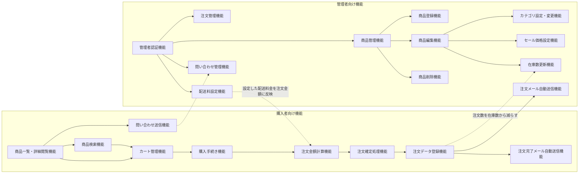
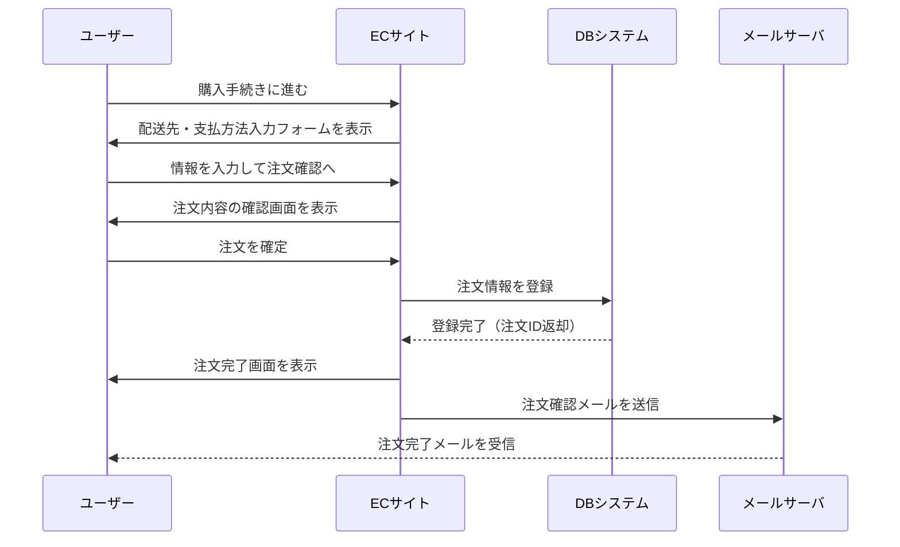
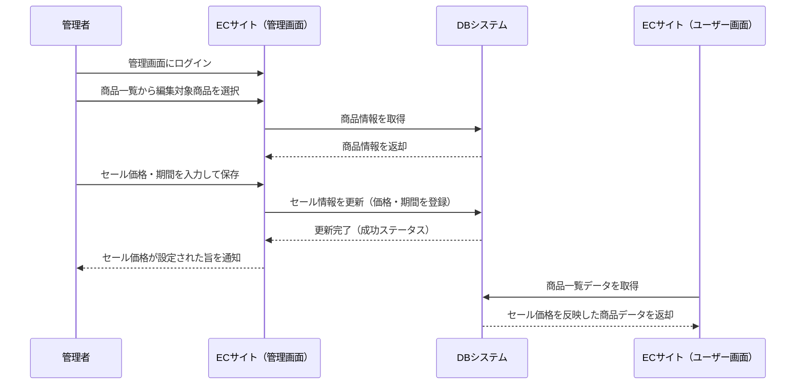

## 3. 機能設計

### 3.1 機能一覧
#### 3.1.1 商品閲覧・購入機能（購入者向け）

- 商品一覧・カテゴリ別の商品閲覧機能
- 商品詳細ページの表示（写真、価格、説明、素材等）
- 商品をカートに追加／削除／数量変更する機能
- 現在カートに入っている商品の一覧、数量、小計、合計金額を表示し、数量変更や削除を可能にする
- 注文確定処理（カート内容の購入確定。なお、"在庫数=<0"の場合、注文を受け付けない）
- 注文完了後に確認メールを自動送信

#### 3.1.2 商品検索機能 
- 単語検索（検索対象は「商品名」とする）

#### 3.1.3 配送料金設定・計算機能

- 送料設定機能（管理者：購入金額、地域によって配送料を設定できる。初期値としては、全国一律500円とする。）
- 配送方法の表示・選択機能

#### 3.1.4 商品管理機能（管理者向け）

- 商品登録・編集機能（商品名・価格・説明・画像など）
- 商品削除機能
- 商品の在庫数管理（在庫数の更新）
- 商品のカテゴリ設定・変更
- セール価格設定機能（期間限定価格）
- 商品情報の一括登録・編集（CSVインポート）
- 商品情報の一括取得（CSVエクスポート）

#### 3.1.5 注文管理機能（管理者向け）

- 注文一覧表示
- 注文内容詳細の確認
- 発送ステータスの更新（出荷済など）
- 注文データのCSVエクスポート機能

#### 3.1.6 サイト運営機能（管理者向け）

- 管理画面ログイン機能（ID・パスワード認証）
- サイト基本情報登録・編集（会社概要、特商法表記、プライバシーポリシーなど）
- お問い合わせ受付フォーム（購入者からの問い合わせ受付）

### 3.2 機能構成図

### 3.3 主要機能フロー

#### 商品注文フロー

#### セール情報設定フロー

