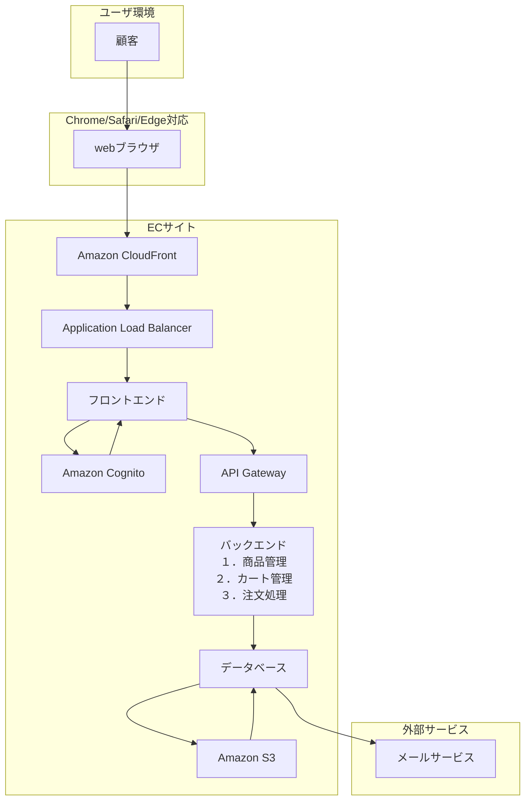

# ②株式会社〇〇様

```mermaid
graph TD

A --> B
B --> C
C --> D
D --> F
F --> G
G --> F
F --> H
H --> I
I --> J
J --> K
K --> J
J --> L

subgraph ユーザ環境
  A[顧客]
end

subgraph Chrome/Safari/Edge対応
  B[webブラウザ]
end

subgraph ECサイト
  C[Amazon CloudFront]
  D[Application Load Balancer]
  F[フロントエンド]
  G[Amazon Cognito]
  H[API Gateway]
  I[バックエンド
  １．商品管理
  ２．カート管理
  ３．注文処理]
  J[データベース]
  K[Amazon S3]
end

subgraph 外部サービス
L[メールサービス]
end
```