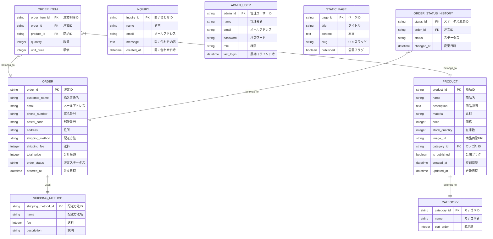

```mermaid
erDiagram
    PRODUCT {
        string product_id PK "商品ID"
        string name "商品名"
        text description "商品説明"
        string material "素材"
        integer price "価格"
        integer stock_quantity "在庫数"
        string image_url "商品画像URL"
        string category_id FK "カテゴリID"
        boolean is_published "公開フラグ"
        datetime created_at "登録日時"
        datetime updated_at "更新日時"
    }

    CATEGORY {
        string category_id PK "カテゴリID"
        string name "カテゴリ名"
        integer sort_order "表示順"
    }

    ORDER {
        string order_id PK "注文ID"
        string customer_name "購入者氏名"
        string email "メールアドレス"
        string phone_number "電話番号"
        string postal_code "郵便番号"
        string address "住所"
        string shipping_method "配送方法"
        integer shipping_fee "送料"
        integer total_price "合計金額"
        string order_status "注文ステータス"
        datetime ordered_at "注文日時"
    }

    ORDER_ITEM {
        string order_item_id PK "注文明細ID"
        string order_id FK "注文ID"
        string product_id FK "商品ID"
        integer quantity "数量"
        integer unit_price "単価"
    }

    INQUIRY {
        string inquiry_id PK "問い合わせID"
        string name "名前"
        string email "メールアドレス"
        text message "問い合わせ内容"
        datetime created_at "問い合わせ日時"
    }

    ADMIN_USER {
        string admin_id PK "管理ユーザーID"
        string name "管理者名"
        string email "メールアドレス"
        string password "パスワード"
        string role "権限"
        datetime last_login "最終ログイン日時"
    }

    STATIC_PAGE {
        string page_id PK "ページID"
        string title "タイトル"
        text content "本文"
        string slug "URLスラッグ"
        boolean published "公開フラグ"
    }

    SHIPPING_METHOD {
        string shipping_method_id PK "配送方法ID"
        string name "配送方法名"
        integer fee "送料"
        string description "説明"
    }

    ORDER_STATUS_HISTORY {
        string status_id PK "ステータス履歴ID"
        string order_id FK "注文ID"
        string status "ステータス"
        datetime changed_at "変更日時"
    }

    %% リレーション
    PRODUCT ||--|| CATEGORY : "belongs_to"
    ORDER_ITEM }|--|| ORDER : "belongs_to"
    ORDER_ITEM }|--|| PRODUCT : "belongs_to"
    ORDER ||--|| SHIPPING_METHOD : "uses"
    ORDER_STATUS_HISTORY }|--|| ORDER : "belongs_to"
```