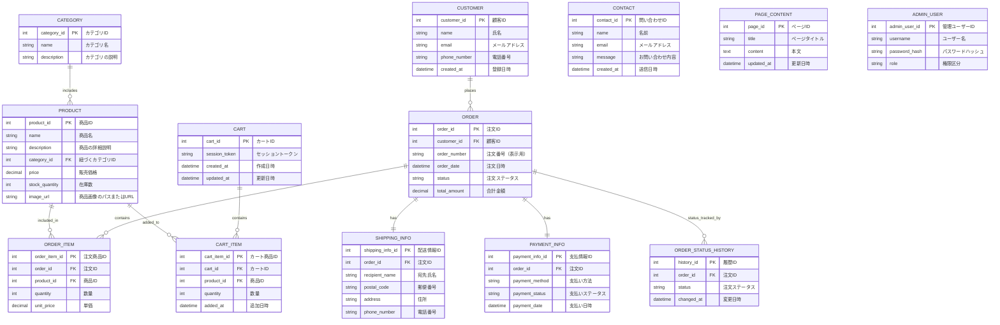

```mermaid
erDiagram
    PRODUCT {
        int product_id PK "商品ID"
        string name "商品名"
        string description "商品の詳細説明"
        int category_id FK "紐づくカテゴリID"
        decimal price "販売価格"
        int stock_quantity "在庫数"
        string image_url "商品画像のパスまたはURL"
    }

    CATEGORY {
        int category_id PK "カテゴリID"
        string name "カテゴリ名"
        string description "カテゴリの説明"
    }

    CUSTOMER {
        int customer_id PK "顧客ID"
        string name "氏名"
        string email "メールアドレス"
        string phone_number "電話番号"
        datetime created_at "登録日時"
    }

    ORDER {
        int order_id PK "注文ID"
        int customer_id FK "顧客ID"
        string order_number "注文番号（表示用）"
        datetime order_date "注文日時"
        string status "注文ステータス"
        decimal total_amount "合計金額"
    }

    ORDER_ITEM {
        int order_item_id PK "注文商品ID"
        int order_id FK "注文ID"
        int product_id FK "商品ID"
        int quantity "数量"
        decimal unit_price "単価"
    }

    SHIPPING_INFO {
        int shipping_info_id PK "配送情報ID"
        int order_id FK "注文ID"
        string recipient_name "宛先氏名"
        string postal_code "郵便番号"
        string address "住所"
        string phone_number "電話番号"
    }

    PAYMENT_INFO {
        int payment_info_id PK "支払情報ID"
        int order_id FK "注文ID"
        string payment_method "支払い方法"
        string payment_status "支払いステータス"
        datetime payment_date "支払い日時"
    }

    ORDER_STATUS_HISTORY {
        int history_id PK "履歴ID"
        int order_id FK "注文ID"
        string status "注文ステータス"
        datetime changed_at "変更日時"
    }

    CART {
        int cart_id PK "カートID"
        string session_token "セッショントークン"
        datetime created_at "作成日時"
        datetime updated_at "更新日時"
    }

    CART_ITEM {
        int cart_item_id PK "カート商品ID"
        int cart_id FK "カートID"
        int product_id FK "商品ID"
        int quantity "数量"
        datetime added_at "追加日時"
    }

    CONTACT {
        int contact_id PK "問い合わせID"
        string name "名前"
        string email "メールアドレス"
        string message "お問い合わせ内容"
        datetime created_at "送信日時"
    }

    PAGE_CONTENT {
        int page_id PK "ページID"
        string title "ページタイトル"
        text content "本文"
        datetime updated_at "更新日時"
    }

    ADMIN_USER {
        int admin_user_id PK "管理ユーザーID"
        string username "ユーザー名"
        string password_hash "パスワードハッシュ"
        string role "権限区分"
    }

    CATEGORY ||--o{ PRODUCT : includes
    PRODUCT ||--o{ ORDER_ITEM : included_in
    ORDER ||--o{ ORDER_ITEM : contains
    ORDER ||--|| SHIPPING_INFO : has
    ORDER ||--|| PAYMENT_INFO : has
    ORDER ||--o{ ORDER_STATUS_HISTORY : status_tracked_by
    CUSTOMER ||--o{ ORDER : places
    PRODUCT ||--o{ CART_ITEM : added_to
    CART ||--o{ CART_ITEM : contains
```