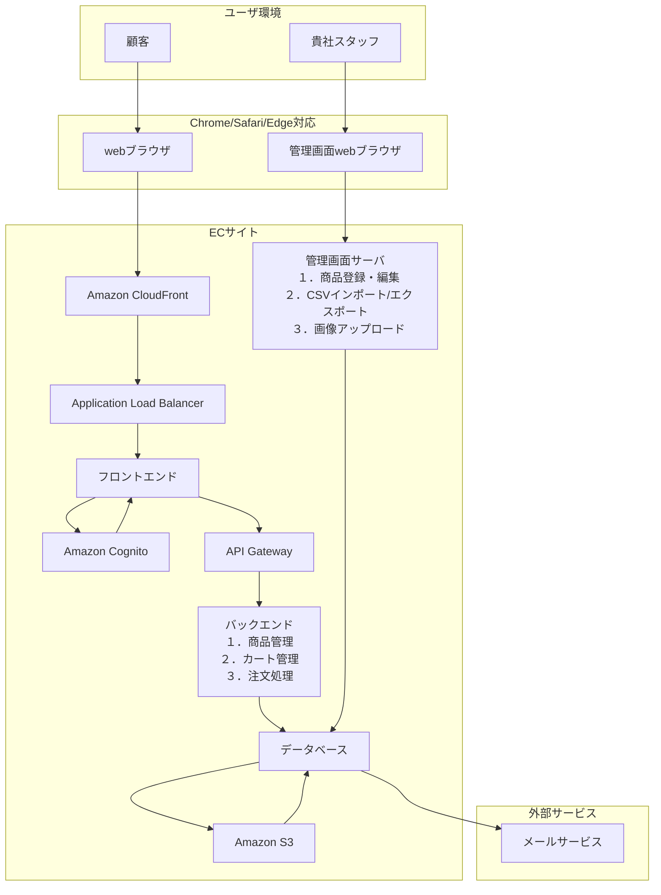

# 統合版

```mermaid
graph TD

A --> C
B --> D
C --> E
E --> F
F --> G
G --> H
H --> G
G --> I
I --> J
J --> K
K --> L
L --> K
K --> N
D --> M
M --> K

subgraph ユーザ環境
  A[顧客]
  B[貴社スタッフ]
end

subgraph Chrome/Safari/Edge対応
  C[webブラウザ]
  D[管理画面webブラウザ]
end

subgraph ECサイト
  E[Amazon CloudFront]
  F[Application Load Balancer]
  G[フロントエンド]
  H[Amazon Cognito]
  I[API Gateway]
  J[バックエンド
  １．商品管理
  ２．カート管理
  ３．注文処理]
  K[データベース]
  L[Amazon S3]
  M[管理画面サーバ
  １．商品登録・編集
  ２．CSVインポート/エクスポート
  ３．画像アップロード]
end

subgraph 外部サービス
N[メールサービス]
end
```