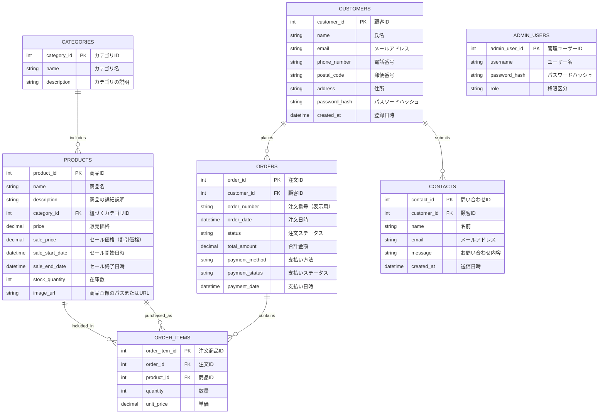

## 5. データ設計

本節では、システムにおける主なエンティティ間の関係と、主要なデータの流れの概要を示す。

### 5.1. 概念データモデル（ER図）

---

### 5.2. 主要テーブル概要

---

#### 5.2.1. PRODUCTS（商品）テーブル

**概要**  
ECサイトで販売される商品の基本情報を管理し、セール価格やセール期間も保持します。

**属性**

| 項目名            | 型           | 説明                      |
|-------------------|--------------|---------------------------|
| product_id        | int (PK)     | 商品ID                   |
| name              | string       | 商品名                   |
| description       | string       | 詳細説明                 |
| category_id       | int (FK)     | 紐づくカテゴリID         |
| price             | decimal      | 通常販売価格             |
| sale_price        | decimal      | セール価格（割引価格）   |
| sale_start_date   | datetime     | セール開始日時           |
| sale_end_date     | datetime     | セール終了日時           |
| stock_quantity    | int          | 在庫数                   |
| image_url         | string       | 商品画像のURLまたはパス |

**注意点**

- `sale_price` は通常価格以下にすることが推奨されます。
- セールの有効期間は `sale_start_date <= 現在 <= sale_end_date` で判定。
- 在庫・価格には負の値を許容しないよう制御します。

---

#### 5.2.2. CATEGORIES（カテゴリ）テーブル

**概要**  
商品のカテゴリ情報を保持します。

**属性**

| 項目名      | 型       | 説明            |
|-------------|----------|-----------------|
| category_id | int (PK) | カテゴリID     |
| name        | string   | カテゴリ名     |
| description | string   | カテゴリの説明 |

---

#### 5.2.3. CUSTOMERS（顧客）テーブル

**概要**  
会員登録された顧客情報を管理します。

**属性**

| 項目名        | 型       | 説明               |
|---------------|----------|--------------------|
| customer_id   | int (PK) | 顧客ID             |
| name          | string   | 氏名               |
| email         | string   | メールアドレス     |
| phone_number  | string   | 電話番号           |
| postal_code   | string   | 郵便番号           |
| address       | string   | 住所               |
| password_hash | string   | パスワードのハッシュ |
| created_at    | datetime | 登録日時           |

---

#### 5.2.4. ORDERS（注文）テーブル

**概要**  
顧客からの注文情報を保持します。

**属性**

| 項目名         | 型       | 説明                    |
|----------------|----------|-------------------------|
| order_id       | int (PK) | 注文ID                 |
| customer_id    | int (FK) | 紐づく顧客ID           |
| order_number   | string   | 注文番号（表示用）     |
| order_date     | datetime | 注文日時               |
| status         | string   | 注文ステータス         |
| total_amount   | decimal  | 合計金額               |
| payment_method | string   | 支払い方法             |
| payment_status | string   | 支払いステータス       |
| payment_date   | datetime | 支払日時               |

---

#### 5.2.5. ORDER_ITEMS（注文商品）テーブル

**概要**  
注文ごとの商品明細を保持します。

**属性**

| 項目名       | 型       | 説明             |
|--------------|----------|------------------|
| order_item_id| int (PK) | 注文商品ID      |
| order_id     | int (FK) | 紐づく注文ID    |
| product_id   | int (FK) | 商品ID           |
| quantity     | int      | 数量             |
| unit_price   | decimal  | 注文時点の単価   |

---

#### 5.2.6. CONTACTS（お問い合わせ）テーブル

**概要**  
顧客または一般利用者からのお問い合わせを管理します。

**属性**

| 項目名      | 型       | 説明             |
|-------------|----------|------------------|
| contact_id  | int (PK) | 問い合わせID    |
| customer_id | int (FK) | 紐づく顧客ID（任意） |
| name        | string   | 名前             |
| email       | string   | メールアドレス   |
| message     | string   | 問い合わせ内容   |
| created_at  | datetime | 送信日時         |

---

#### 5.2.7. ADMIN_USERS（管理者）テーブル

**概要**  
管理システムにアクセスできる管理者情報を保持します。

**属性**

| 項目名        | 型       | 説明                  |
|---------------|----------|-----------------------|
| admin_user_id | int (PK) | 管理ユーザーID       |
| username      | string   | ログイン用ユーザー名 |
| password_hash | string   | パスワードハッシュ    |
| role          | string   | 権限（例：master）   |

---

### 5.3. データフロー概要

---

#### 5.3.1. 商品一覧表示処理のデータフロー

1. **画面 (商品一覧ページ)**  
   ユーザーがカテゴリや検索条件を指定して商品一覧を表示要求。

2. **アプリケーション (バックエンド)**  
   `PRODUCTS` テーブルと `CATEGORIES` テーブルを結合し、セール価格が現在有効であればそちらを適用して商品情報を取得。

3. **データベース (DB)**  
   条件に合致する商品一覧を取得（セール価格の適用は現在日時が `sale_start_date` ～ `sale_end_date` の範囲内かで判定）。

4. **アプリケーション (バックエンド)**  
   通常価格とセール価格を比較し、表示用に整形。

5. **画面 (商品一覧ページ)**  
   商品一覧を表示（セール価格がある商品は強調表示）。

---

#### 5.3.2. 商品詳細表示処理のデータフロー

1. **画面 (商品詳細ページ)**  
   ユーザーが商品を選択し、詳細情報の表示要求を送信。

2. **アプリケーション (バックエンド)**  
   `PRODUCTS` テーブルから該当商品を取得し、セール価格が有効であれば適用。

3. **データベース (DB)**  
   商品情報を1件取得。

4. **アプリケーション (バックエンド)**  
   通常価格・セール価格のどちらを表示するか決定。

5. **画面 (商品詳細ページ)**  
   商品詳細を表示（セール価格が有効な場合は割引表示）。

---

#### 5.3.3. 注文処理のデータフロー

1. **画面 (購入手続きページ)**  
   ユーザーが配送情報を入力し、購入確定ボタンを押下。

2. **アプリケーション (バックエンド)**  
   顧客情報とカート内商品を受け取り、現在価格（セール含む）で金額を確定。

3. **アプリケーション (バックエンド)**  
   `ORDERS` テーブルに注文情報を登録し、`ORDER_ITEMS` テーブルに明細を記録。

4. **データベース (DB)**  
   各テーブルに注文データを挿入。

5. **アプリケーション (バックエンド)**  
   注文完了メールを送信。

6. **画面 (購入完了ページ)**  
   注文番号などの完了情報を表示。

---

#### 5.3.4. お問い合わせ処理のデータフロー

1. **画面 (お問い合わせフォーム)**  
   名前・メール・問い合わせ内容を入力し送信。

2. **アプリケーション (バックエンド)**  
   入力値のバリデーションを実施。

3. **データベース (DB)**  
   `CONTACTS` テーブルに問い合わせ内容を保存。

4. **画面 (確認ページ)**  
   送信完了メッセージを表示。

---

#### 5.3.5. 管理者ログイン処理のデータフロー

1. **画面 (管理者ログイン画面)**  
   管理者がユーザー名・パスワードを入力。

2. **アプリケーション (バックエンド)**  
   入力された情報を `ADMIN_USERS` と照合し、認証を実行。

3. **データベース (DB)**  
   一致するユーザーを検索し、パスワードハッシュを検証。

4. **アプリケーション (バックエンド)**  
   成功時にセッショントークンを返却。

5. **画面 (管理画面)**  
   認証成功時はダッシュボードに遷移、失敗時はエラーメッセージを表示。

---

### 5.4. 備考

- 商品のセール価格（`sale_price`）は、`PRODUCTS` テーブル内で管理されています。
- セールの有効期間は `sale_start_date <= 現在時刻 <= sale_end_date` により判定します。
- セール価格が有効な場合、一覧・詳細・注文時にすべての価格表示・金額計算に反映されます。
- `CART` 関連の情報（セッション管理やカート内商品）は、データベースではなく、サーバーサイドセッションまたはクライアント側ストレージ（Cookie/LocalStorage等）で管理することを前提としています。
- 静的コンテンツ（利用規約・会社情報等）はDBでなくHTML管理とし、データベース設計からは除外しています。
- `ORDER_STATUS_HISTORY` のようなステータス履歴管理は、必要に応じて今後のスコープで追加検討可能です。

