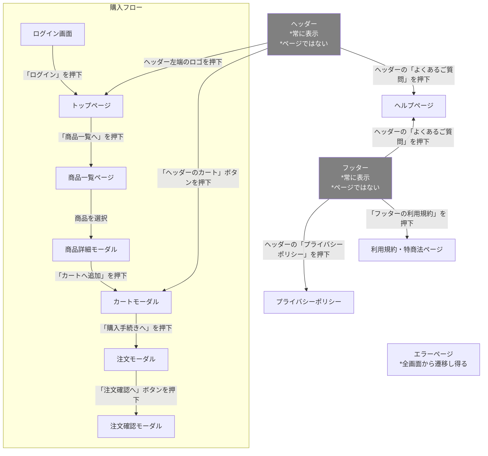

```mermaid
graph TD

subgraph 購入フロー

%% ログイン画面からの遷移
F14[ログイン画面] -->| 「ログイン」を押下| F01[トップページ]

%% トップページからの遷移
F01[トップページ] -->|「商品一覧へ」を押下| F02[商品一覧ページ]

%% 商品一覧から詳細へ
F02 -->|商品を選択| F03[商品詳細モーダル]

%% 商品詳細からカートへ
F03 --> |「カートへ追加」を押下|F04[カートモーダル]

%% カートから購入へ
F04 -->|「購入手続きへ」を押下| F05[注文モーダル]

%% 注文確認画面
F05 -->|「注文確認へ」ボタンを押下| F06[注文確認モーダル]

end

%% ヘッダー（常に表示）
F13[ヘッダー
*常に表示
*ページではない] -->|ヘッダー左端のロゴを押下| F01
F13 --> |「ヘッダーのカート」ボタンを押下|F04
F13 -->|ヘッダーの「よくあるご質問」を押下| F11[ヘルプページ]
classDef gray fill:gray,color:white;
class F13 gray;

%% フッター（常に表示）
F15[フッター
*常に表示
*ページではない] --> |「フッターの利用規約」を押下|F08[利用規約・特商法ページ]
F15 -->|ヘッダーの「プライバシーポリシー」を押下| F09[プライバシーポリシー]
F15 -->|ヘッダーの「よくあるご質問」を押下| F11[ヘルプページ]
classDef gray fill:gray,color:white;
class F15 gray;

%% エラーページ（どこからでも遷移し得る）
F09 ~~~ F10[エラーページ
*全画面から遷移し得る]
F08 ~~~ F10
F11 ~~~ F10

%% 位置調整
F08 ~~~ F09
F11 ~~~ F15
```