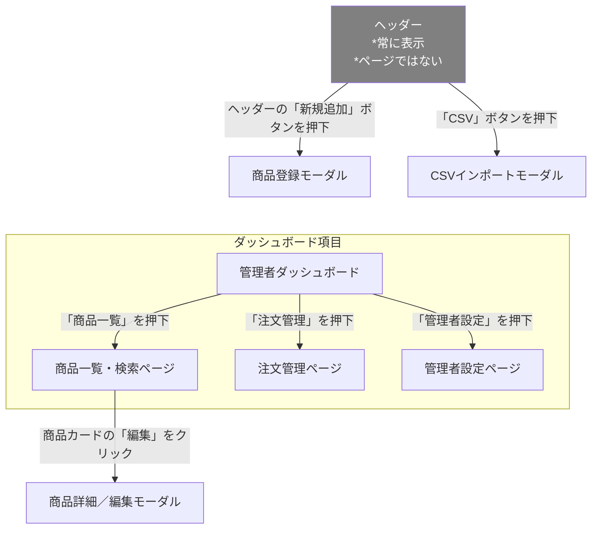

```mermaid
graph TD

subgraph ダッシュボード項目
%% ダッシュボードからの遷移
A02[管理者ダッシュボード] -->|「商品一覧」を押下| A03[商品一覧・検索ページ]
A02 -->|「注文管理」を押下| A06[注文管理ページ]
A02 -->|「管理者設定」を押下| A12[管理者設定ページ]

end

%% 商品関連
A03 -->|商品カードの「編集」をクリック| A04[商品詳細／編集モーダル]

%% ヘッダー（常に表示）
F13[ヘッダー
*常に表示
*ページではない] -->|ヘッダーの「新規追加」ボタンを押下|F14[商品登録モーダル]
F13 -->|「CSV」ボタンを押下| A10[CSVインポートモーダル]
classDef gray fill:gray,color:white;
class F13 gray;

%% 位置調整
F14 ~~~ A02

```