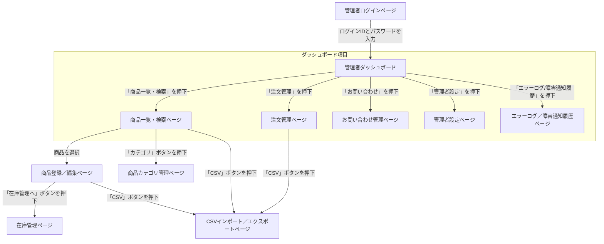

```mermaid
graph TD

%% ログイン
A01[管理者ログインページ] -->|ログインIDとパスワードを入力| A02[管理者ダッシュボード]

subgraph ダッシュボード項目
%% ダッシュボードからの遷移
A02 -->|「商品一覧・検索」を押下| A03[商品一覧・検索ページ]
A02 -->|「注文管理」を押下| A06[注文管理ページ]
A02 -->|「お問い合わせ」を押下| A11[お問い合わせ管理ページ]
A02 -->|「管理者設定」を押下| A12[管理者設定ページ]

%%% 管理者設定など
A02 -->|「エラーログ/障害通知履歴」を押下| A13[エラーログ／障害通知履歴ページ]
end

%% 商品関連
A03 -->|商品を選択| A04[商品登録／編集ページ]
A04 -->|「在庫管理へ」ボタンを押下| A07[在庫管理ページ]
A03 -->|「カテゴリ」ボタンを押下| A05[商品カテゴリ管理ページ]
A03 -->|「CSV」ボタンを押下| A10[CSVインポート／エクスポートページ]

%% 注文管理
A06 -->|「CSV」ボタンを押下| A10

%% CSV関連（商品/注文から遷移可能）
A04 -->|「CSV」ボタンを押下| A10
```