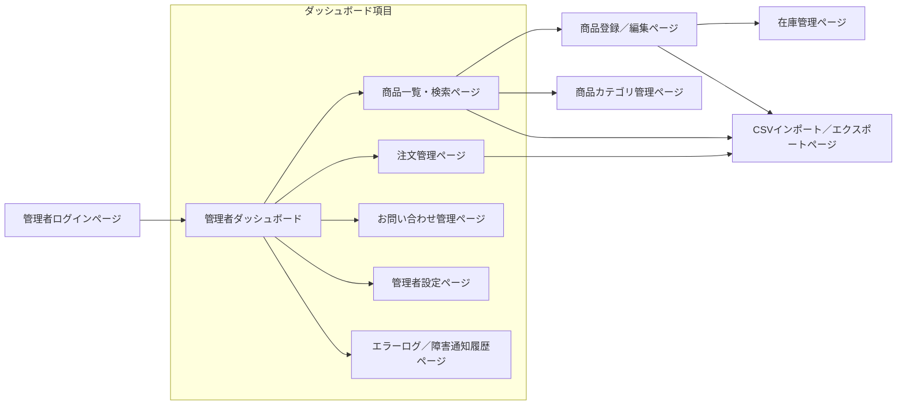

```mermaid
graph LR

%% ログイン
A01[管理者ログインページ] --> A02[管理者ダッシュボード]

subgraph ダッシュボード項目
%% ダッシュボードからの遷移
A02 --> A03[商品一覧・検索ページ]
A02 --> A06[注文管理ページ]
A02 --> A11[お問い合わせ管理ページ]
A02 --> A12[管理者設定ページ]

%%% 管理者設定など
A02 --> A13[エラーログ／障害通知履歴ページ]
end

%% 商品関連
A03 --> A04[商品登録／編集ページ]
A04 --> A07[在庫管理ページ]
A03 --> A05[商品カテゴリ管理ページ]
A03 --> A10[CSVインポート／エクスポートページ]

%% 注文管理
A06 --> A10

%% CSV関連（商品/注文から遷移可能）
A04 --> A10
```