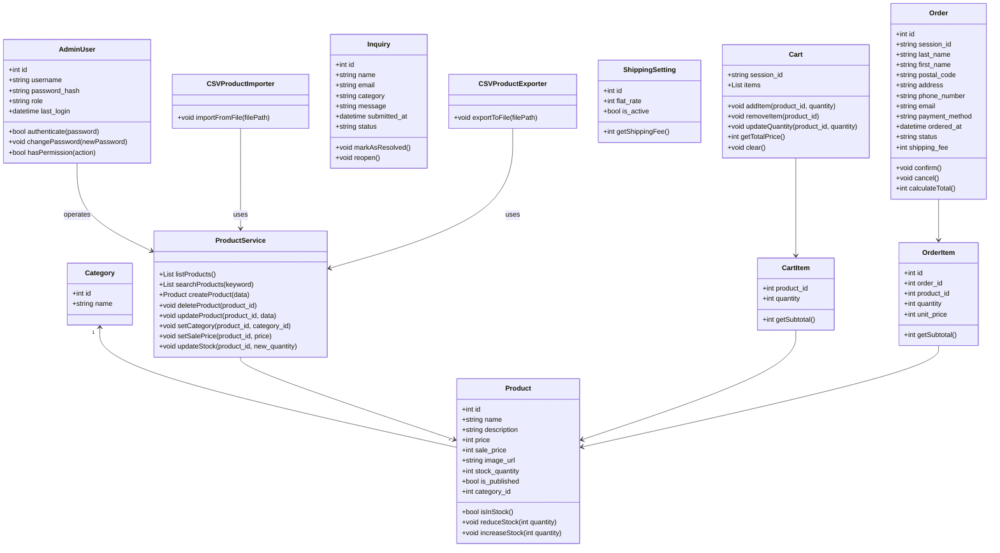

```mermaid

classDiagram

%% 商品関連
class Product {
  +int id
  +string name
  +string description
  +int price
  +int sale_price
  +string image_url
  +int stock_quantity
  +bool is_published
  +int category_id

  +bool isInStock()
  +void reduceStock(int quantity)
  +void increaseStock(int quantity)
}

class Category {
  +int id
  +string name
}

Category "1" <-- "*" Product

%% 商品管理サービス
class ProductService {
  +List<Product> listProducts()
  +List<Product> searchProducts(keyword)
  +Product createProduct(data)
  +void deleteProduct(product_id)
  +void updateProduct(product_id, data)
  +void setCategory(product_id, category_id)
  +void setSalePrice(product_id, price)
  +void updateStock(product_id, new_quantity)
}

ProductService --> Product

%% カート
class Cart {
  +string session_id
  +List<CartItem> items

  +void addItem(product_id, quantity)
  +void removeItem(product_id)
  +void updateQuantity(product_id, quantity)
  +int getTotalPrice()
  +void clear()
}

class CartItem {
  +int product_id
  +int quantity

  +int getSubtotal()
}

Cart --> CartItem
CartItem --> Product

%% 注文
class Order {
  +int id
  +string session_id
  +string last_name
  +string first_name
  +string postal_code
  +string address
  +string phone_number
  +string email
  +string payment_method
  +datetime ordered_at
  +string status
  +int shipping_fee

  +void confirm()
  +void cancel()
  +int calculateTotal()
}

class OrderItem {
  +int id
  +int order_id
  +int product_id
  +int quantity
  +int unit_price

  +int getSubtotal()
}

Order --> OrderItem
OrderItem --> Product

%% 問い合わせ
class Inquiry {
  +int id
  +string name
  +string email
  +string category
  +string message
  +datetime submitted_at
  +string status

  +void markAsResolved()
  +void reopen()
}

%% 管理者
class AdminUser {
  +int id
  +string username
  +string password_hash
  +string role
  +datetime last_login

  +bool authenticate(password)
  +void changePassword(newPassword)
  +bool hasPermission(action)
}

AdminUser --> ProductService : operates

%% 配送料設定
class ShippingSetting {
  +int id
  +int flat_rate
  +bool is_active

  +int getShippingFee()
}

%% CSV関連
class CSVProductImporter {
  +void importFromFile(filePath)
}

class CSVProductExporter {
  +void exportToFile(filePath)
}

CSVProductImporter --> ProductService : uses
CSVProductExporter --> ProductService : uses

```