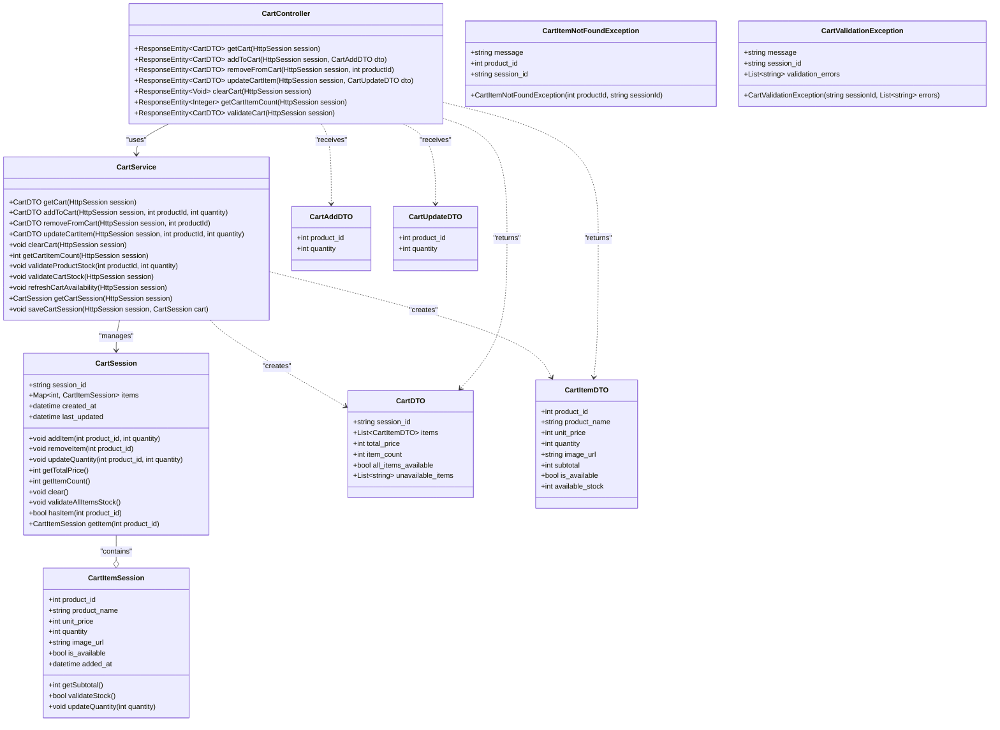

## カート機能

### カート機能のクラス図

```mermaid
classDiagram
    %% カート機能のクラス群
    %% セッション管理のためRepositoryは不要
    
    %% 1. セッション管理クラス（Entity代替）
    class CartSession {
        +string session_id
        +Map~int, CartItemSession~ items
        +datetime created_at
        +datetime last_updated
        
        +void addItem(int product_id, int quantity)
        +void removeItem(int product_id)
        +void updateQuantity(int product_id, int quantity)
        +int getTotalPrice()
        +int getItemCount()
        +void clear()
        +void validateAllItemsStock()
        +bool hasItem(int product_id)
        +CartItemSession getItem(int product_id)
    }
    
    class CartItemSession {
        +int product_id
        +string product_name
        +int unit_price
        +int quantity
        +string image_url
        +bool is_available
        +datetime added_at
        
        +int getSubtotal()
        +bool validateStock()
        +void updateQuantity(int quantity)
    }
    
    %% 2. Repositoryインタフェース（セッション管理のため不要）
    %% カート情報はHttpSessionで管理するためRepositoryは不要
    
    %% 3. Serviceクラス
    class CartService {
        +CartDTO getCart(HttpSession session)
        +CartDTO addToCart(HttpSession session, int productId, int quantity)
        +CartDTO removeFromCart(HttpSession session, int productId)
        +CartDTO updateCartItem(HttpSession session, int productId, int quantity)
        +void clearCart(HttpSession session)
        +int getCartItemCount(HttpSession session)
        +void validateProductStock(int productId, int quantity)
        +void validateCartStock(HttpSession session)
        +void refreshCartAvailability(HttpSession session)
        +CartSession getCartSession(HttpSession session)
        +void saveCartSession(HttpSession session, CartSession cart)
    }
    
    %% 4. Controllerクラス
    class CartController {
        +ResponseEntity~CartDTO~ getCart(HttpSession session)
        +ResponseEntity~CartDTO~ addToCart(HttpSession session, CartAddDTO dto)
        +ResponseEntity~CartDTO~ removeFromCart(HttpSession session, int productId)
        +ResponseEntity~CartDTO~ updateCartItem(HttpSession session, CartUpdateDTO dto)
        +ResponseEntity~Void~ clearCart(HttpSession session)
        +ResponseEntity~Integer~ getCartItemCount(HttpSession session)
        +ResponseEntity~CartDTO~ validateCart(HttpSession session)
    }
    
    %% 5. DTOクラス
    class CartDTO {
        +string session_id
        +List~CartItemDTO~ items
        +int total_price
        +int item_count
        +bool all_items_available
        +List~string~ unavailable_items
    }
    
    class CartItemDTO {
        +int product_id
        +string product_name
        +int unit_price
        +int quantity
        +string image_url
        +int subtotal
        +bool is_available
        +int available_stock
    }
    
    class CartAddDTO {
        +int product_id
        +int quantity
    }
    
    class CartUpdateDTO {
        +int product_id
        +int quantity
    }
    
    %% 例外クラス
    class CartItemNotFoundException {
        +string message
        +int product_id
        +string session_id
        +CartItemNotFoundException(int productId, string sessionId)
    }
    
    class CartValidationException {
        +string message
        +string session_id
        +List~string~ validation_errors
        +CartValidationException(string sessionId, List~string~ errors)
    }
    
    %% 関係
    CartSession --o CartItemSession : "contains"
    CartService --> CartSession : "manages"
    CartController --> CartService : "uses"
    CartService ..> CartDTO : "creates"
    CartService ..> CartItemDTO : "creates"
    CartController ..> CartAddDTO : "receives"
    CartController ..> CartUpdateDTO : "receives"
    CartController ..> CartDTO : "returns"
    CartController ..> CartItemDTO : "returns"
```