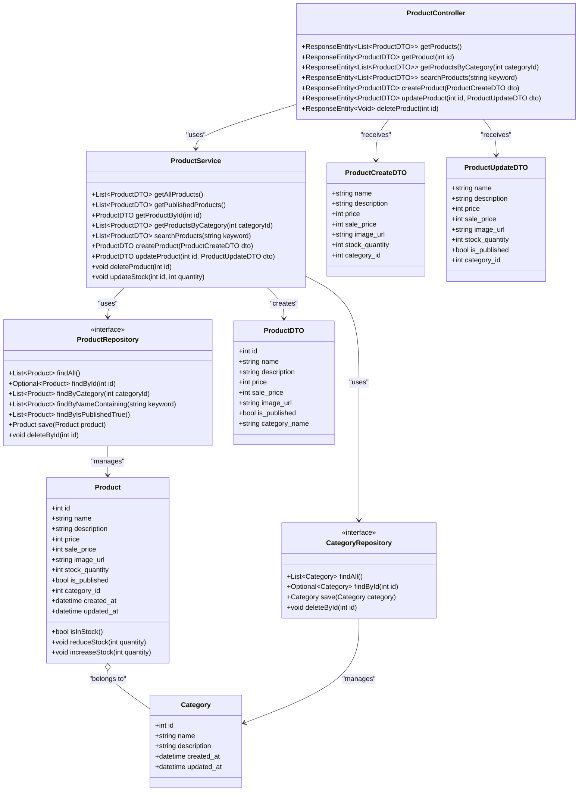
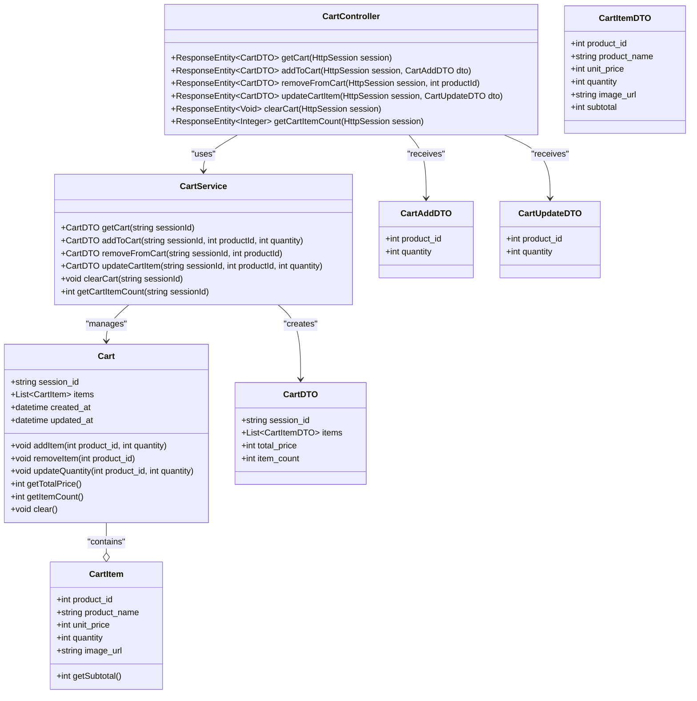
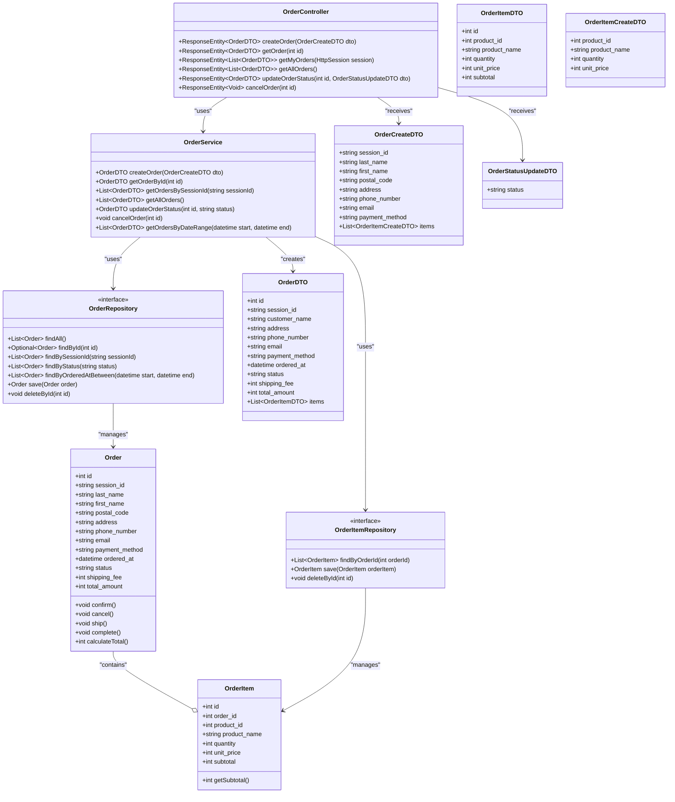
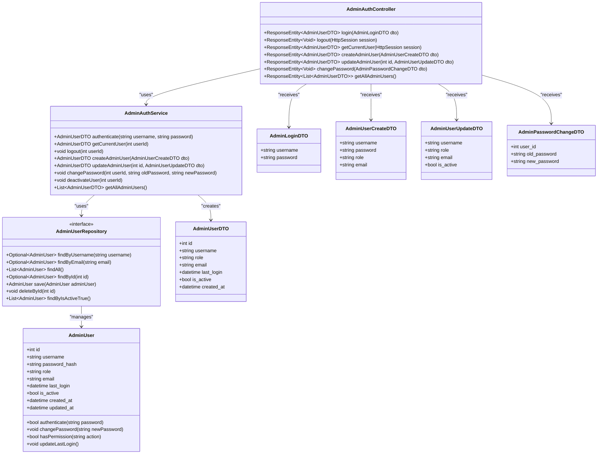
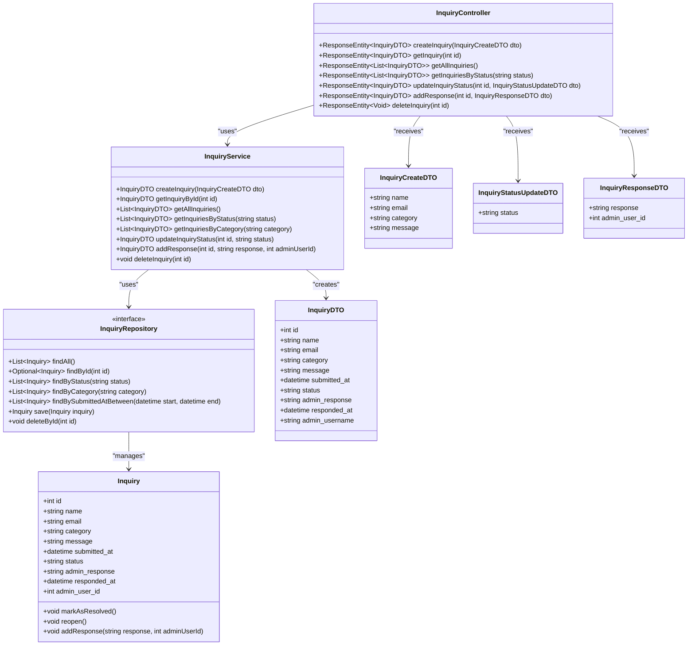

# 商品機能


# カート機能



# 注文機能


# 管理者認証機能


# 問い合わせ機能


# 配送設定機能
```mermaid

classDiagram
    %% 配送設定機能
    class ShippingSetting {
        +int id
        +int flat_rate
        +int free_shipping_threshold
        +bool is_active
        +datetime created_at
        +datetime updated_at
        
        +int calculateShippingFee(int orderAmount)
        +bool isFreeShipping(int orderAmount)
    }
    
    class ShippingSettingRepository {
        <<interface>>
        +Optional~ShippingSetting~ findByIsActiveTrue()
        +List~ShippingSetting~ findAll()
        +Optional~ShippingSetting~ findById(int id)
        +ShippingSetting save(ShippingSetting shippingSetting)
        +void deleteById(int id)
    }
    
    class ShippingService {
        +ShippingSettingDTO getCurrentShippingSetting()
        +ShippingSettingDTO updateShippingSetting(ShippingSettingUpdateDTO dto)
        +int calculateShippingFee(int orderAmount)
        +ShippingSettingDTO createShippingSetting(ShippingSettingCreateDTO dto)
        +List~ShippingSettingDTO~ getAllShippingSettings()
        +void activateShippingSetting(int id)
    }
    
    class ShippingController {
        +ResponseEntity~ShippingSettingDTO~ getCurrentSetting()
        +ResponseEntity~ShippingSettingDTO~ updateSetting(ShippingSettingUpdateDTO dto)
        +ResponseEntity~Integer~ calculateShippingFee(int orderAmount)
        +ResponseEntity~ShippingSettingDTO~ createSetting(ShippingSettingCreateDTO dto)
        +ResponseEntity~List~ShippingSettingDTO~~ getAllSettings()
        +ResponseEntity~Void~ activateSetting(int id)
    }
    
    class ShippingSettingDTO {
        +int id
        +int flat_rate
        +int free_shipping_threshold
        +bool is_active
        +datetime created_at
        +datetime updated_at
    }
    
    class ShippingSettingCreateDTO {
        +int flat_rate
        +int free_shipping_threshold
    }
    
    class ShippingSettingUpdateDTO {
        +int flat_rate
        +int free_shipping_threshold
        +bool is_active
    }
    
    %% 関係
    ShippingSettingRepository --> ShippingSetting : "manages"
    ShippingService --> ShippingSettingRepository : "uses"
    ShippingController --> ShippingService : "uses"
    ShippingService --> ShippingSettingDTO : "creates"
    ShippingController --> ShippingSettingCreateDTO : "receives"
    ShippingController --> ShippingSettingUpdateDTO : "receives"

    ```