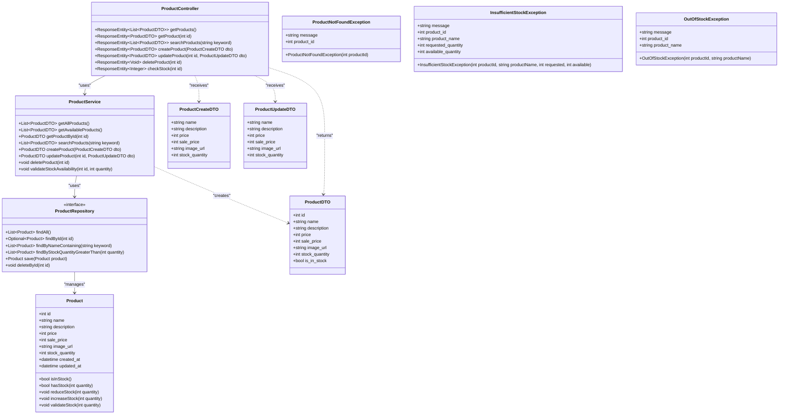
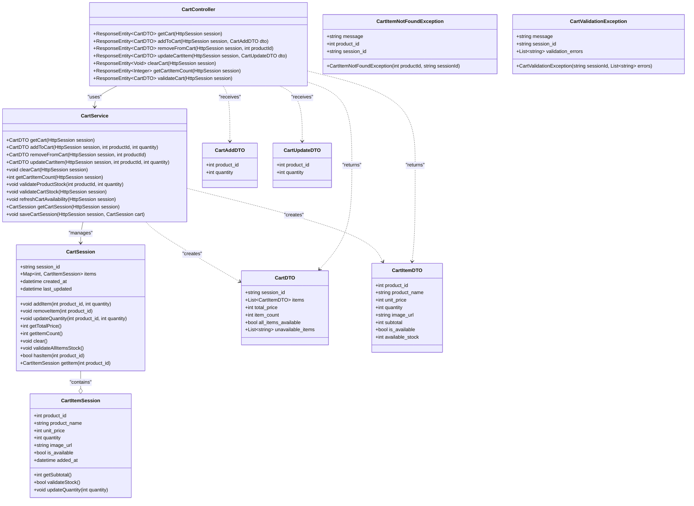
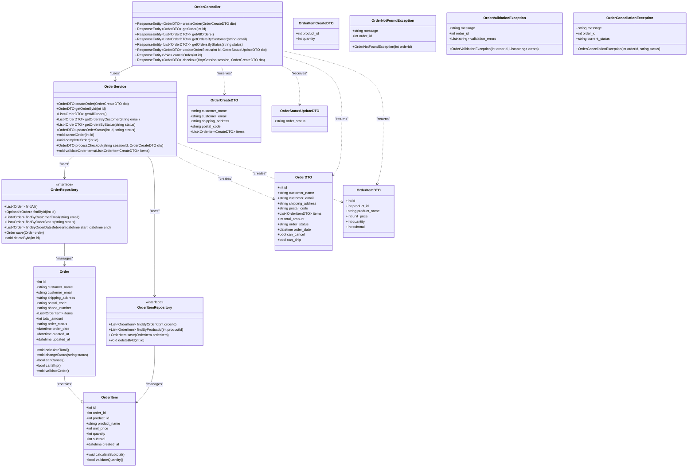
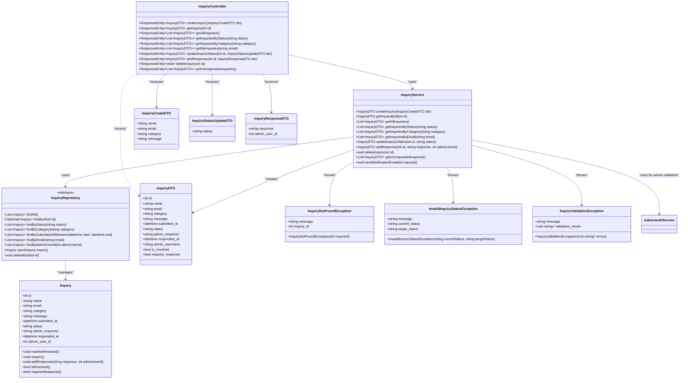

# ECサイト修正版クラス図（Ver.3）

## 商品機能

### 商品機能のクラス図

```mermaid
classDiagram
    %% 商品機能のクラス群（カテゴリー機能削除版）
    
    %% 1. Entityクラス
    class Product {
        +int id
        +string name
        +string description
        +int price
        +int sale_price
        +string image_url
        +int stock_quantity
        +datetime created_at
        +datetime updated_at
        
        +bool isInStock()
        +bool hasStock(int quantity)
        +void reduceStock(int quantity)
        +void increaseStock(int quantity)
        +void validateStock(int quantity)
    }
    
    %% 2. Repositoryインタフェース
    class ProductRepository {
        <<interface>>
        +List~Product~ findAll()
        +Optional~Product~ findById(int id)
        +List~Product~ findByNameContaining(string keyword)
        +List~Product~ findByStockQuantityGreaterThan(int quantity)
        +Product save(Product product)
        +void deleteById(int id)
    }
    
    %% 3. Serviceクラス
    class ProductService {
        +List~ProductDTO~ getAllProducts()
        +List~ProductDTO~ getAvailableProducts()
        +ProductDTO getProductById(int id)
        +List~ProductDTO~ searchProducts(string keyword)
        +ProductDTO createProduct(ProductCreateDTO dto)
        +ProductDTO updateProduct(int id, ProductUpdateDTO dto)
        +void deleteProduct(int id)
        +void validateStockAvailability(int id, int quantity)
    }
    
    %% 4. Controllerクラス
    class ProductController {
        +ResponseEntity~List~ProductDTO~~ getProducts()
        +ResponseEntity~ProductDTO~ getProduct(int id)
        +ResponseEntity~List~ProductDTO~~ searchProducts(string keyword)
        +ResponseEntity~ProductDTO~ createProduct(ProductCreateDTO dto)
        +ResponseEntity~ProductDTO~ updateProduct(int id, ProductUpdateDTO dto)
        +ResponseEntity~Void~ deleteProduct(int id)
        +ResponseEntity~Integer~ checkStock(int id)
    }
    
    %% 5. DTOクラス
    class ProductDTO {
        +int id
        +string name
        +string description
        +int price
        +int sale_price
        +string image_url
        +int stock_quantity
        +bool is_in_stock
    }
    
    class ProductCreateDTO {
        +string name
        +string description
        +int price
        +int sale_price
        +string image_url
        +int stock_quantity
    }
    
    class ProductUpdateDTO {
        +string name
        +string description
        +int price
        +int sale_price
        +string image_url
        +int stock_quantity
    }
    
    %% 例外クラス
    class ProductNotFoundException {
        +string message
        +int product_id
        +ProductNotFoundException(int productId)
    }
    
    class InsufficientStockException {
        +string message
        +int product_id
        +string product_name
        +int requested_quantity
        +int available_quantity
        +InsufficientStockException(int productId, string productName, int requested, int available)
    }
    
    class OutOfStockException {
        +string message
        +int product_id
        +string product_name
        +OutOfStockException(int productId, string productName)
    }
    
    %% 関係
    ProductRepository --> Product : "manages"
    ProductService --> ProductRepository : "uses"
    ProductController --> ProductService : "uses"
    ProductService ..> ProductDTO : "creates"
    ProductController ..> ProductCreateDTO : "receives"
    ProductController ..> ProductUpdateDTO : "receives"
    ProductController ..> ProductDTO : "returns"
```

## カート機能

### カート機能のクラス図

```mermaid
classDiagram
    %% カート機能のクラス群
    %% セッション管理のためRepositoryは不要
    
    %% 1. セッション管理クラス（Entity代替）
    class CartSession {
        +string session_id
        +Map~int, CartItemSession~ items
        +datetime created_at
        +datetime last_updated
        
        +void addItem(int product_id, int quantity)
        +void removeItem(int product_id)
        +void updateQuantity(int product_id, int quantity)
        +int getTotalPrice()
        +int getItemCount()
        +void clear()
        +void validateAllItemsStock()
        +bool hasItem(int product_id)
        +CartItemSession getItem(int product_id)
    }
    
    class CartItemSession {
        +int product_id
        +string product_name
        +int unit_price
        +int quantity
        +string image_url
        +bool is_available
        +datetime added_at
        
        +int getSubtotal()
        +bool validateStock()
        +void updateQuantity(int quantity)
    }
    
    %% 2. Repositoryインタフェース（セッション管理のため不要）
    %% カート情報はHttpSessionで管理するためRepositoryは不要
    
    %% 3. Serviceクラス
    class CartService {
        +CartDTO getCart(HttpSession session)
        +CartDTO addToCart(HttpSession session, int productId, int quantity)
        +CartDTO removeFromCart(HttpSession session, int productId)
        +CartDTO updateCartItem(HttpSession session, int productId, int quantity)
        +void clearCart(HttpSession session)
        +int getCartItemCount(HttpSession session)
        +void validateProductStock(int productId, int quantity)
        +void validateCartStock(HttpSession session)
        +void refreshCartAvailability(HttpSession session)
        +CartSession getCartSession(HttpSession session)
        +void saveCartSession(HttpSession session, CartSession cart)
    }
    
    %% 4. Controllerクラス
    class CartController {
        +ResponseEntity~CartDTO~ getCart(HttpSession session)
        +ResponseEntity~CartDTO~ addToCart(HttpSession session, CartAddDTO dto)
        +ResponseEntity~CartDTO~ removeFromCart(HttpSession session, int productId)
        +ResponseEntity~CartDTO~ updateCartItem(HttpSession session, CartUpdateDTO dto)
        +ResponseEntity~Void~ clearCart(HttpSession session)
        +ResponseEntity~Integer~ getCartItemCount(HttpSession session)
        +ResponseEntity~CartDTO~ validateCart(HttpSession session)
    }
    
    %% 5. DTOクラス
    class CartDTO {
        +string session_id
        +List~CartItemDTO~ items
        +int total_price
        +int item_count
        +bool all_items_available
        +List~string~ unavailable_items
    }
    
    class CartItemDTO {
        +int product_id
        +string product_name
        +int unit_price
        +int quantity
        +string image_url
        +int subtotal
        +bool is_available
        +int available_stock
    }
    
    class CartAddDTO {
        +int product_id
        +int quantity
    }
    
    class CartUpdateDTO {
        +int product_id
        +int quantity
    }
    
    %% 例外クラス
    class CartItemNotFoundException {
        +string message
        +int product_id
        +string session_id
        +CartItemNotFoundException(int productId, string sessionId)
    }
    
    class CartValidationException {
        +string message
        +string session_id
        +List~string~ validation_errors
        +CartValidationException(string sessionId, List~string~ errors)
    }
    
    %% 関係
    CartSession --o CartItemSession : "contains"
    CartService --> CartSession : "manages"
    CartController --> CartService : "uses"
    CartService ..> CartDTO : "creates"
    CartService ..> CartItemDTO : "creates"
    CartController ..> CartAddDTO : "receives"
    CartController ..> CartUpdateDTO : "receives"
    CartController ..> CartDTO : "returns"
    CartController ..> CartItemDTO : "returns"
```

## 注文・購入機能

### 注文・購入機能のクラス図（配送機能削除版）

```mermaid
classDiagram
    %% 注文・購入機能のクラス群（配送機能削除版）
    
    %% 1. Entityクラス
    class Order {
        +int id
        +string customer_name
        +string customer_email
        +string shipping_address
        +string postal_code
        +string phone_number
        +List~OrderItem~ items
        +int total_amount
        +string order_status
        +datetime order_date
        +datetime created_at
        +datetime updated_at
        
        +void calculateTotal()
        +void changeStatus(string status)
        +bool canCancel()
        +bool canShip()
        +void validateOrder()
    }
    
    class OrderItem {
        +int id
        +int order_id
        +int product_id
        +string product_name
        +int unit_price
        +int quantity
        +int subtotal
        +datetime created_at
        
        +void calculateSubtotal()
        +bool validateQuantity()
    }
    
    %% 2. Repositoryインタフェース
    class OrderRepository {
        <<interface>>
        +List~Order~ findAll()
        +Optional~Order~ findById(int id)
        +List~Order~ findByCustomerEmail(string email)
        +List~Order~ findByOrderStatus(string status)
        +List~Order~ findByOrderDateBetween(datetime start, datetime end)
        +Order save(Order order)
        +void deleteById(int id)
    }
    
    class OrderItemRepository {
        <<interface>>
        +List~OrderItem~ findByOrderId(int orderId)
        +List~OrderItem~ findByProductId(int productId)
        +OrderItem save(OrderItem orderItem)
        +void deleteById(int id)
    }
    
    %% 3. Serviceクラス
    class OrderService {
        +OrderDTO createOrder(OrderCreateDTO dto)
        +OrderDTO getOrderById(int id)
        +List~OrderDTO~ getAllOrders()
        +List~OrderDTO~ getOrdersByCustomer(string email)
        +List~OrderDTO~ getOrdersByStatus(string status)
        +OrderDTO updateOrderStatus(int id, string status)
        +void cancelOrder(int id)
        +void completeOrder(int id)
        +OrderDTO processCheckout(string sessionId, OrderCreateDTO dto)
        +void validateOrderItems(List~OrderItemCreateDTO~ items)
    }
    
    %% 4. Controllerクラス
    class OrderController {
        +ResponseEntity~OrderDTO~ createOrder(OrderCreateDTO dto)
        +ResponseEntity~OrderDTO~ getOrder(int id)
        +ResponseEntity~List~OrderDTO~~ getAllOrders()
        +ResponseEntity~List~OrderDTO~~ getOrdersByCustomer(string email)
        +ResponseEntity~List~OrderDTO~~ getOrdersByStatus(string status)
        +ResponseEntity~OrderDTO~ updateOrderStatus(int id, OrderStatusUpdateDTO dto)
        +ResponseEntity~Void~ cancelOrder(int id)
        +ResponseEntity~OrderDTO~ checkout(HttpSession session, OrderCreateDTO dto)
    }
    
    %% 5. DTOクラス
    class OrderDTO {
        +int id
        +string customer_name
        +string customer_email
        +string shipping_address
        +string postal_code
        +List~OrderItemDTO~ items
        +int total_amount
        +string order_status
        +datetime order_date
        +bool can_cancel
        +bool can_ship
    }
    
    class OrderCreateDTO {
        +string customer_name
        +string customer_email
        +string shipping_address
        +string postal_code
        +List~OrderItemCreateDTO~ items
    }
    
    class OrderItemDTO {
        +int id
        +int product_id
        +string product_name
        +int unit_price
        +int quantity
        +int subtotal
    }
    
    class OrderItemCreateDTO {
        +int product_id
        +int quantity
    }
    
    class OrderStatusUpdateDTO {
        +string order_status
    }
    
    %% 例外クラス
    class OrderNotFoundException {
        +string message
        +int order_id
        +OrderNotFoundException(int orderId)
    }
    
    class OrderValidationException {
        +string message
        +int order_id
        +List~string~ validation_errors
        +OrderValidationException(int orderId, List~string~ errors)
    }
    
    class OrderCancellationException {
        +string message
        +int order_id
        +string current_status
        +OrderCancellationException(int orderId, string status)
    }
    
    %% 関係
    Order --o OrderItem : "contains"
    OrderRepository --> Order : "manages"
    OrderItemRepository --> OrderItem : "manages"
    OrderService --> OrderRepository : "uses"
    OrderService --> OrderItemRepository : "uses"
    OrderController --> OrderService : "uses"
    OrderService ..> OrderDTO : "creates"
    OrderService ..> OrderItemDTO : "creates"
    OrderController ..> OrderCreateDTO : "receives"
    OrderController ..> OrderStatusUpdateDTO : "receives"
    OrderController ..> OrderDTO : "returns"
    OrderController ..> OrderItemDTO : "returns"
```

## 管理者認証機能

### 管理者認証機能のクラス図

```mermaid
classDiagram
    %% 管理者認証機能のクラス群
    
    %% 1. Entityクラス
    class Admin {
        +int id
        +string username
        +string password
        +string email
        +string role
        +bool is_active
        +datetime last_login
        +datetime created_at
        +datetime updated_at
        
        +bool isActive()
        +void activate()
        +void deactivate()
        +void updateLastLogin()
        +bool hasRole(string role)
        +void changePassword(string newPassword)
    }
    
    class AdminSession {
        +string session_id
        +int admin_id
        +string admin_username
        +string role
        +datetime login_time
        +datetime expires_at
        +bool is_active
        
        +bool isExpired()
        +void extend()
        +void invalidate()
        +bool hasPermission(string permission)
    }
    
    %% 2. Repositoryインタフェース
    class AdminRepository {
        <<interface>>
        +List~Admin~ findAll()
        +Optional~Admin~ findById(int id)
        +Optional~Admin~ findByUsername(string username)
        +Optional~Admin~ findByEmail(string email)
        +List~Admin~ findByIsActiveTrue()
        +List~Admin~ findByRole(string role)
        +Admin save(Admin admin)
        +void deleteById(int id)
    }
    
    class AdminSessionRepository {
        <<interface>>
        +Optional~AdminSession~ findBySessionId(string sessionId)
        +List~AdminSession~ findByAdminId(int adminId)
        +List~AdminSession~ findByIsActiveTrue()
        +AdminSession save(AdminSession session)
        +void deleteById(string sessionId)
        +void deleteByAdminId(int adminId)
    }
    
    %% 3. Serviceクラス
    class AdminAuthService {
        +AdminSessionDTO login(AdminLoginDTO dto)
        +void logout(string sessionId)
        +AdminSessionDTO validateSession(string sessionId)
        +AdminSessionDTO refreshSession(string sessionId)
        +AdminDTO getCurrentAdmin(string sessionId)
        +bool hasPermission(string sessionId, string permission)
        +void changePassword(string sessionId, AdminPasswordChangeDTO dto)
        +void invalidateAllSessions(int adminId)
    }
    
    class AdminService {
        +List~AdminDTO~ getAllAdmins()
        +AdminDTO getAdminById(int id)
        +AdminDTO createAdmin(AdminCreateDTO dto)
        +AdminDTO updateAdmin(int id, AdminUpdateDTO dto)
        +void deleteAdmin(int id)
        +void activateAdmin(int id)
        +void deactivateAdmin(int id)
        +void resetPassword(int id, string newPassword)
    }
    
    %% 4. Controllerクラス
    class AdminAuthController {
        +ResponseEntity~AdminSessionDTO~ login(AdminLoginDTO dto)
        +ResponseEntity~Void~ logout(HttpSession session)
        +ResponseEntity~AdminSessionDTO~ validateSession(HttpSession session)
        +ResponseEntity~AdminDTO~ getCurrentAdmin(HttpSession session)
        +ResponseEntity~Void~ changePassword(HttpSession session, AdminPasswordChangeDTO dto)
        +ResponseEntity~Void~ invalidateAllSessions(HttpSession session)
    }
    
    class AdminController {
        +ResponseEntity~List~AdminDTO~~ getAllAdmins()
        +ResponseEntity~AdminDTO~ getAdmin(int id)
        +ResponseEntity~AdminDTO~ createAdmin(AdminCreateDTO dto)
        +ResponseEntity~AdminDTO~ updateAdmin(int id, AdminUpdateDTO dto)
        +ResponseEntity~Void~ deleteAdmin(int id)
        +ResponseEntity~Void~ activateAdmin(int id)
        +ResponseEntity~Void~ deactivateAdmin(int id)
        +ResponseEntity~Void~ resetPassword(int id, AdminPasswordResetDTO dto)
    }
    
    %% 5. DTOクラス
    class AdminDTO {
        +int id
        +string username
        +string email
        +string role
        +bool is_active
        +datetime last_login
        +datetime created_at
        +datetime updated_at
    }
    
    class AdminCreateDTO {
        +string username
        +string password
        +string email
        +string role
    }
    
    class AdminUpdateDTO {
        +string username
        +string email
        +string role
        +bool is_active
    }
    
    class AdminLoginDTO {
        +string username
        +string password
    }
    
    class AdminSessionDTO {
        +string session_id
        +int admin_id
        +string admin_username
        +string role
        +datetime login_time
        +datetime expires_at
        +bool is_active
    }
    
    class AdminPasswordChangeDTO {
        +string current_password
        +string new_password
    }
    
    class AdminPasswordResetDTO {
        +string new_password
    }
    
    %% 例外クラス
    class AdminNotFoundException {
        +string message
        +int admin_id
        +AdminNotFoundException(int adminId)
    }
    
    class AdminAuthenticationException {
        +string message
        +string username
        +AdminAuthenticationException(string username)
    }
    
    class AdminSessionExpiredException {
        +string message
        +string session_id
        +AdminSessionExpiredException(string sessionId)
    }
    
    class AdminPermissionDeniedException {
        +string message
        +string session_id
        +string required_permission
        +AdminPermissionDeniedException(string sessionId, string permission)
    }
    
    %% 関係
    Admin --o AdminSession : "has sessions"
    AdminRepository --> Admin : "manages"
    AdminSessionRepository --> AdminSession : "manages"
    AdminAuthService --> AdminRepository : "uses"
    AdminAuthService --> AdminSessionRepository : "uses"
    AdminService --> AdminRepository : "uses"
    AdminAuthController --> AdminAuthService : "uses"
    AdminController --> AdminService : "uses"
    AdminAuthService ..> AdminSessionDTO : "creates"
    AdminService ..> AdminDTO : "creates"
    AdminAuthController ..> AdminLoginDTO : "receives"
    AdminAuthController ..> AdminPasswordChangeDTO : "receives"
    AdminController ..> AdminCreateDTO : "receives"
    AdminController ..> AdminUpdateDTO : "receives"
    AdminController ..> AdminPasswordResetDTO : "receives"
    AdminAuthController ..> AdminSessionDTO : "returns"
    AdminAuthController ..> AdminDTO : "returns"
    AdminController ..> AdminDTO : "returns"
```

## 問い合わせ機能

### 問い合わせ機能のクラス図

```mermaid
classDiagram
    %% 問い合わせ機能のクラス群
    
    %% 1. Entityクラス
    class Inquiry {
        +int id
        +string name
        +string email
        +string category
        +string message
        +datetime submitted_at
        +string status
        +string admin_response
        +datetime responded_at
        +int admin_user_id
        
        +void markAsResolved()
        +void reopen()
        +void addResponse(string response, int adminUserId)
        +bool isResolved()
        +bool requiresResponse()
    }
    
    %% 2. Repositoryインタフェース
    class InquiryRepository {
        <<interface>>
        +List~Inquiry~ findAll()
        +Optional~Inquiry~ findById(int id)
        +List~Inquiry~ findByStatus(string status)
        +List~Inquiry~ findByCategory(string category)
        +List~Inquiry~ findBySubmittedAtBetween(datetime start, datetime end)
        +List~Inquiry~ findByEmail(string email)
        +List~Inquiry~ findByAdminUserId(int adminUserId)
        +Inquiry save(Inquiry inquiry)
        +void deleteById(int id)
    }
    
    %% 3. Serviceクラス
    class InquiryService {
        +InquiryDTO createInquiry(InquiryCreateDTO dto)
        +InquiryDTO getInquiryById(int id)
        +List~InquiryDTO~ getAllInquiries()
        +List~InquiryDTO~ getInquiriesByStatus(string status)
        +List~InquiryDTO~ getInquiriesByCategory(string category)
        +List~InquiryDTO~ getInquiriesByEmail(string email)
        +InquiryDTO updateInquiryStatus(int id, string status)
        +InquiryDTO addResponse(int id, string response, int adminUserId)
        +void deleteInquiry(int id)
        +List~InquiryDTO~ getUnrespondedInquiries()
        +void sendNotificationEmail(int inquiryId)
    }
    
    %% 4. Controllerクラス
    class InquiryController {
        +ResponseEntity~InquiryDTO~ createInquiry(InquiryCreateDTO dto)
        +ResponseEntity~InquiryDTO~ getInquiry(int id)
        +ResponseEntity~List~InquiryDTO~~ getAllInquiries()
        +ResponseEntity~List~InquiryDTO~~ getInquiriesByStatus(string status)
        +ResponseEntity~List~InquiryDTO~~ getInquiriesByCategory(string category)
        +ResponseEntity~List~InquiryDTO~~ getMyInquiries(string email)
        +ResponseEntity~InquiryDTO~ updateInquiryStatus(int id, InquiryStatusUpdateDTO dto)
        +ResponseEntity~InquiryDTO~ addResponse(int id, InquiryResponseDTO dto)
        +ResponseEntity~Void~ deleteInquiry(int id)
        +ResponseEntity~List~InquiryDTO~~ getUnrespondedInquiries()
    }
    
    %% 5. DTOクラス
    class InquiryDTO {
        +int id
        +string name
        +string email
        +string category
        +string message
        +datetime submitted_at
        +string status
        +string admin_response
        +datetime responded_at
        +string admin_username
        +bool is_resolved
        +bool requires_response
    }
    
    class InquiryCreateDTO {
        +string name
        +string email
        +string category
        +string message
    }
    
    class InquiryStatusUpdateDTO {
        +string status
    }
    
    class InquiryResponseDTO {
        +string response
        +int admin_user_id
    }
    
    %% 例外クラス
    class InquiryNotFoundException {
        +string message
        +int inquiry_id
        +InquiryNotFoundException(int inquiryId)
    }
    
    class InvalidInquiryStatusException {
        +string message
        +string current_status
        +string target_status
        +InvalidInquiryStatusException(string currentStatus, string targetStatus)
    }
    
    class InquiryValidationException {
        +string message
        +List~string~ validation_errors
        +InquiryValidationException(List~string~ errors)
    }
    
    %% 関係
    InquiryRepository --> Inquiry : "manages"
    InquiryService --> InquiryRepository : "uses"
    InquiryController --> InquiryService : "uses"
    InquiryService --> InquiryDTO : "creates"
    InquiryController --> InquiryCreateDTO : "receives"
    InquiryController --> InquiryStatusUpdateDTO : "receives"
    InquiryController --> InquiryResponseDTO : "receives"
    InquiryController ..> InquiryDTO : "returns"
    
    %% 例外関係
    InquiryService --> InquiryNotFoundException : "throws"
    InquiryService --> InvalidInquiryStatusException : "throws"
    InquiryService --> InquiryValidationException : "throws"
    
    %% 外部依存
    InquiryService --> AdminAuthService : "uses for admin validation"
```