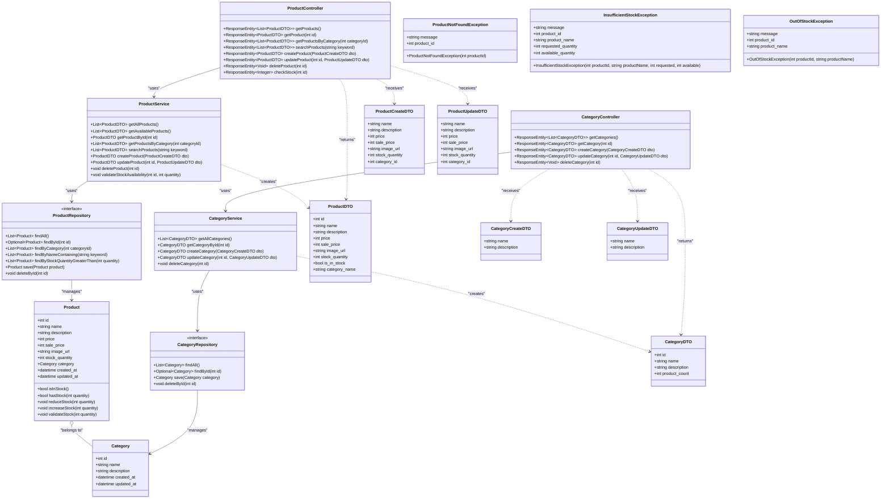

## 商品機能

### 商品機能のクラス図

```mermaid
classDiagram
    %% 商品機能のクラス群
    
    %% 1. Entityクラス
    class Product {
        +int id
        +string name
        +string description
        +int price
        +int sale_price
        +string image_url
        +int stock_quantity
        +Category category
        +datetime created_at
        +datetime updated_at
        
        +bool isInStock()
        +bool hasStock(int quantity)
        +void reduceStock(int quantity)
        +void increaseStock(int quantity)
        +void validateStock(int quantity)
    }
    
    class Category {
        +int id
        +string name
        +string description
        +datetime created_at
        +datetime updated_at
    }
    
    %% 2. Repositoryインタフェース
    class ProductRepository {
        <<interface>>
        +List~Product~ findAll()
        +Optional~Product~ findById(int id)
        +List~Product~ findByCategory(int categoryId)
        +List~Product~ findByNameContaining(string keyword)
        +List~Product~ findByStockQuantityGreaterThan(int quantity)
        +Product save(Product product)
        +void deleteById(int id)
    }
    
    class CategoryRepository {
        <<interface>>
        +List~Category~ findAll()
        +Optional~Category~ findById(int id)
        +Category save(Category category)
        +void deleteById(int id)
    }
    
    %% 3. Serviceクラス
    class ProductService {
        +List~ProductDTO~ getAllProducts()
        +List~ProductDTO~ getAvailableProducts()
        +ProductDTO getProductById(int id)
        +List~ProductDTO~ getProductsByCategory(int categoryId)
        +List~ProductDTO~ searchProducts(string keyword)
        +ProductDTO createProduct(ProductCreateDTO dto)
        +ProductDTO updateProduct(int id, ProductUpdateDTO dto)
        +void deleteProduct(int id)
        +void validateStockAvailability(int id, int quantity)
    }
    
    class CategoryService {
        +List~CategoryDTO~ getAllCategories()
        +CategoryDTO getCategoryById(int id)
        +CategoryDTO createCategory(CategoryCreateDTO dto)
        +CategoryDTO updateCategory(int id, CategoryUpdateDTO dto)
        +void deleteCategory(int id)
    }
    
    %% 4. Controllerクラス
    class ProductController {
        +ResponseEntity~List~ProductDTO~~ getProducts()
        +ResponseEntity~ProductDTO~ getProduct(int id)
        +ResponseEntity~List~ProductDTO~~ getProductsByCategory(int categoryId)
        +ResponseEntity~List~ProductDTO~~ searchProducts(string keyword)
        +ResponseEntity~ProductDTO~ createProduct(ProductCreateDTO dto)
        +ResponseEntity~ProductDTO~ updateProduct(int id, ProductUpdateDTO dto)
        +ResponseEntity~Void~ deleteProduct(int id)
        +ResponseEntity~Integer~ checkStock(int id)
    }
    
    class CategoryController {
        +ResponseEntity~List~CategoryDTO~~ getCategories()
        +ResponseEntity~CategoryDTO~ getCategory(int id)
        +ResponseEntity~CategoryDTO~ createCategory(CategoryCreateDTO dto)
        +ResponseEntity~CategoryDTO~ updateCategory(int id, CategoryUpdateDTO dto)
        +ResponseEntity~Void~ deleteCategory(int id)
    }
    
    %% 5. DTOクラス
    class ProductDTO {
        +int id
        +string name
        +string description
        +int price
        +int sale_price
        +string image_url
        +int stock_quantity
        +bool is_in_stock
        +string category_name
    }
    
    class ProductCreateDTO {
        +string name
        +string description
        +int price
        +int sale_price
        +string image_url
        +int stock_quantity
        +int category_id
    }
    
    class ProductUpdateDTO {
        +string name
        +string description
        +int price
        +int sale_price
        +string image_url
        +int stock_quantity
        +int category_id
    }
    
    class CategoryDTO {
        +int id
        +string name
        +string description
        +int product_count
    }
    
    class CategoryCreateDTO {
        +string name
        +string description
    }
    
    class CategoryUpdateDTO {
        +string name
        +string description
    }
    
    %% 例外クラス
    class ProductNotFoundException {
        +string message
        +int product_id
        +ProductNotFoundException(int productId)
    }
    
    class InsufficientStockException {
        +string message
        +int product_id
        +string product_name
        +int requested_quantity
        +int available_quantity
        +InsufficientStockException(int productId, string productName, int requested, int available)
    }
    
    class OutOfStockException {
        +string message
        +int product_id
        +string product_name
        +OutOfStockException(int productId, string productName)
    }
    
    %% 関係
    Product o-- Category : "belongs to"
    ProductRepository --> Product : "manages"
    CategoryRepository --> Category : "manages"
    ProductService --> ProductRepository : "uses"
    CategoryService --> CategoryRepository : "uses"
    ProductController --> ProductService : "uses"
    CategoryController --> CategoryService : "uses"
    ProductService ..> ProductDTO : "creates"
    CategoryService ..> CategoryDTO : "creates"
    ProductController ..> ProductCreateDTO : "receives"
    ProductController ..> ProductUpdateDTO : "receives"
    CategoryController ..> CategoryCreateDTO : "receives"
    CategoryController ..> CategoryUpdateDTO : "receives"
    ProductController ..> ProductDTO : "returns"
    CategoryController ..> CategoryDTO : "returns"
```