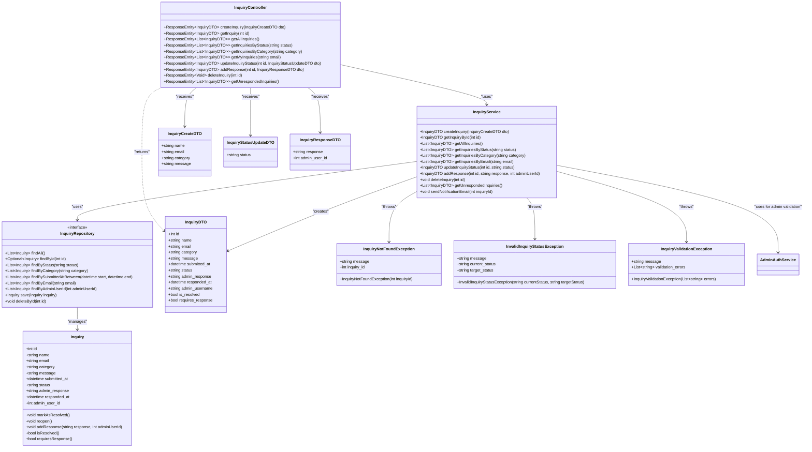

## 問い合わせ機能

### 問い合わせ機能のクラス図

```mermaid
classDiagram
    %% 問い合わせ機能のクラス群
    
    %% 1. Entityクラス
    class Inquiry {
        +int id
        +string name
        +string email
        +string category
        +string message
        +datetime submitted_at
        +string status
        +string admin_response
        +datetime responded_at
        +int admin_user_id
        
        +void markAsResolved()
        +void reopen()
        +void addResponse(string response, int adminUserId)
        +bool isResolved()
        +bool requiresResponse()
    }
    
    %% 2. Repositoryインタフェース
    class InquiryRepository {
        <<interface>>
        +List~Inquiry~ findAll()
        +Optional~Inquiry~ findById(int id)
        +List~Inquiry~ findByStatus(string status)
        +List~Inquiry~ findByCategory(string category)
        +List~Inquiry~ findBySubmittedAtBetween(datetime start, datetime end)
        +List~Inquiry~ findByEmail(string email)
        +List~Inquiry~ findByAdminUserId(int adminUserId)
        +Inquiry save(Inquiry inquiry)
        +void deleteById(int id)
    }
    
    %% 3. Serviceクラス
    class InquiryService {
        +InquiryDTO createInquiry(InquiryCreateDTO dto)
        +InquiryDTO getInquiryById(int id)
        +List~InquiryDTO~ getAllInquiries()
        +List~InquiryDTO~ getInquiriesByStatus(string status)
        +List~InquiryDTO~ getInquiriesByCategory(string category)
        +List~InquiryDTO~ getInquiriesByEmail(string email)
        +InquiryDTO updateInquiryStatus(int id, string status)
        +InquiryDTO addResponse(int id, string response, int adminUserId)
        +void deleteInquiry(int id)
        +List~InquiryDTO~ getUnrespondedInquiries()
        +void sendNotificationEmail(int inquiryId)
    }
    
    %% 4. Controllerクラス
    class InquiryController {
        +ResponseEntity~InquiryDTO~ createInquiry(InquiryCreateDTO dto)
        +ResponseEntity~InquiryDTO~ getInquiry(int id)
        +ResponseEntity~List~InquiryDTO~~ getAllInquiries()
        +ResponseEntity~List~InquiryDTO~~ getInquiriesByStatus(string status)
        +ResponseEntity~List~InquiryDTO~~ getInquiriesByCategory(string category)
        +ResponseEntity~List~InquiryDTO~~ getMyInquiries(string email)
        +ResponseEntity~InquiryDTO~ updateInquiryStatus(int id, InquiryStatusUpdateDTO dto)
        +ResponseEntity~InquiryDTO~ addResponse(int id, InquiryResponseDTO dto)
        +ResponseEntity~Void~ deleteInquiry(int id)
        +ResponseEntity~List~InquiryDTO~~ getUnrespondedInquiries()
    }
    
    %% 5. DTOクラス
    class InquiryDTO {
        +int id
        +string name
        +string email
        +string category
        +string message
        +datetime submitted_at
        +string status
        +string admin_response
        +datetime responded_at
        +string admin_username
        +bool is_resolved
        +bool requires_response
    }
    
    class InquiryCreateDTO {
        +string name
        +string email
        +string category
        +string message
    }
    
    class InquiryStatusUpdateDTO {
        +string status
    }
    
    class InquiryResponseDTO {
        +string response
        +int admin_user_id
    }
    
    %% 例外クラス
    class InquiryNotFoundException {
        +string message
        +int inquiry_id
        +InquiryNotFoundException(int inquiryId)
    }
    
    class InvalidInquiryStatusException {
        +string message
        +string current_status
        +string target_status
        +InvalidInquiryStatusException(string currentStatus, string targetStatus)
    }
    
    class InquiryValidationException {
        +string message
        +List~string~ validation_errors
        +InquiryValidationException(List~string~ errors)
    }
    
    %% 関係
    InquiryRepository --> Inquiry : "manages"
    InquiryService --> InquiryRepository : "uses"
    InquiryController --> InquiryService : "uses"
    InquiryService --> InquiryDTO : "creates"
    InquiryController --> InquiryCreateDTO : "receives"
    InquiryController --> InquiryStatusUpdateDTO : "receives"
    InquiryController --> InquiryResponseDTO : "receives"
    InquiryController ..> InquiryDTO : "returns"
    
    %% 例外関係
    InquiryService --> InquiryNotFoundException : "throws"
    InquiryService --> InvalidInquiryStatusException : "throws"
    InquiryService --> InquiryValidationException : "throws"
    
    %% 外部依存
    InquiryService --> AdminAuthService : "uses for admin validation"
```