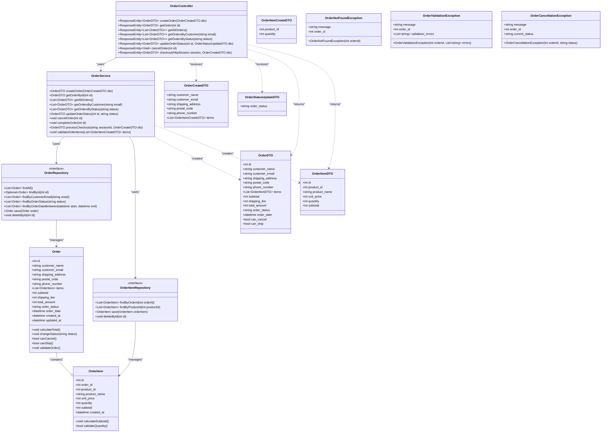

## 注文・購入機能

### 注文・購入機能のクラス図

```mermaid
classDiagram
    %% 注文・購入機能のクラス群
    
    %% 1. Entityクラス
    class Order {
        +int id
        +string customer_name
        +string customer_email
        +string shipping_address
        +string postal_code
        +string phone_number
        +List~OrderItem~ items
        +int subtotal
        +int shipping_fee
        +int total_amount
        +string order_status
        +datetime order_date
        +datetime created_at
        +datetime updated_at
        
        +void calculateTotal()
        +void changeStatus(string status)
        +bool canCancel()
        +bool canShip()
        +void validateOrder()
    }
    
    class OrderItem {
        +int id
        +int order_id
        +int product_id
        +string product_name
        +int unit_price
        +int quantity
        +int subtotal
        +datetime created_at
        
        +void calculateSubtotal()
        +bool validateQuantity()
    }
    
    %% 2. Repositoryインタフェース
    class OrderRepository {
        <<interface>>
        +List~Order~ findAll()
        +Optional~Order~ findById(int id)
        +List~Order~ findByCustomerEmail(string email)
        +List~Order~ findByOrderStatus(string status)
        +List~Order~ findByOrderDateBetween(datetime start, datetime end)
        +Order save(Order order)
        +void deleteById(int id)
    }
    
    class OrderItemRepository {
        <<interface>>
        +List~OrderItem~ findByOrderId(int orderId)
        +List~OrderItem~ findByProductId(int productId)
        +OrderItem save(OrderItem orderItem)
        +void deleteById(int id)
    }
    
    %% 3. Serviceクラス
    class OrderService {
        +OrderDTO createOrder(OrderCreateDTO dto)
        +OrderDTO getOrderById(int id)
        +List~OrderDTO~ getAllOrders()
        +List~OrderDTO~ getOrdersByCustomer(string email)
        +List~OrderDTO~ getOrdersByStatus(string status)
        +OrderDTO updateOrderStatus(int id, string status)
        +void cancelOrder(int id)
        +void completeOrder(int id)
        +OrderDTO processCheckout(string sessionId, OrderCreateDTO dto)
        +void validateOrderItems(List~OrderItemCreateDTO~ items)
    }
    
    %% 4. Controllerクラス
    class OrderController {
        +ResponseEntity~OrderDTO~ createOrder(OrderCreateDTO dto)
        +ResponseEntity~OrderDTO~ getOrder(int id)
        +ResponseEntity~List~OrderDTO~~ getAllOrders()
        +ResponseEntity~List~OrderDTO~~ getOrdersByCustomer(string email)
        +ResponseEntity~List~OrderDTO~~ getOrdersByStatus(string status)
        +ResponseEntity~OrderDTO~ updateOrderStatus(int id, OrderStatusUpdateDTO dto)
        +ResponseEntity~Void~ cancelOrder(int id)
        +ResponseEntity~OrderDTO~ checkout(HttpSession session, OrderCreateDTO dto)
    }
    
    %% 5. DTOクラス
    class OrderDTO {
        +int id
        +string customer_name
        +string customer_email
        +string shipping_address
        +string postal_code
        +string phone_number
        +List~OrderItemDTO~ items
        +int subtotal
        +int shipping_fee
        +int total_amount
        +string order_status
        +datetime order_date
        +bool can_cancel
        +bool can_ship
    }
    
    class OrderCreateDTO {
        +string customer_name
        +string customer_email
        +string shipping_address
        +string postal_code
        +string phone_number
        +List~OrderItemCreateDTO~ items
    }
    
    class OrderItemDTO {
        +int id
        +int product_id
        +string product_name
        +int unit_price
        +int quantity
        +int subtotal
    }
    
    class OrderItemCreateDTO {
        +int product_id
        +int quantity
    }
    
    class OrderStatusUpdateDTO {
        +string order_status
    }
    
    %% 例外クラス
    class OrderNotFoundException {
        +string message
        +int order_id
        +OrderNotFoundException(int orderId)
    }
    
    class OrderValidationException {
        +string message
        +int order_id
        +List~string~ validation_errors
        +OrderValidationException(int orderId, List~string~ errors)
    }
    
    class OrderCancellationException {
        +string message
        +int order_id
        +string current_status
        +OrderCancellationException(int orderId, string status)
    }
    
    %% 関係
    Order --o OrderItem : "contains"
    OrderRepository --> Order : "manages"
    OrderItemRepository --> OrderItem : "manages"
    OrderService --> OrderRepository : "uses"
    OrderService --> OrderItemRepository : "uses"
    OrderController --> OrderService : "uses"
    OrderService ..> OrderDTO : "creates"
    OrderService ..> OrderItemDTO : "creates"
    OrderController ..> OrderCreateDTO : "receives"
    OrderController ..> OrderStatusUpdateDTO : "receives"
    OrderController ..> OrderDTO : "returns"
    OrderController ..> OrderItemDTO : "returns"
```