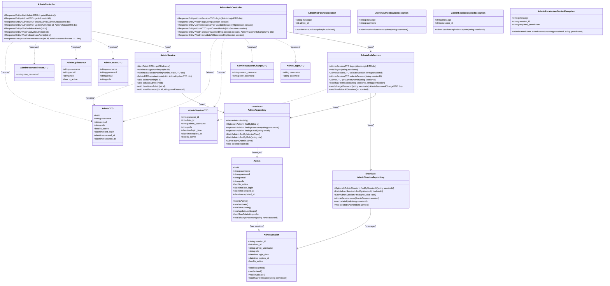

## 管理者認証機能

### 管理者認証機能のクラス図

```mermaid
classDiagram
    %% 管理者認証機能のクラス群
    
    %% 1. Entityクラス
    class Admin {
        +int id
        +string username
        +string password
        +string email
        +string role
        +bool is_active
        +datetime last_login
        +datetime created_at
        +datetime updated_at
        
        +bool isActive()
        +void activate()
        +void deactivate()
        +void updateLastLogin()
        +bool hasRole(string role)
        +void changePassword(string newPassword)
    }
    
    class AdminSession {
        +string session_id
        +int admin_id
        +string admin_username
        +string role
        +datetime login_time
        +datetime expires_at
        +bool is_active
        
        +bool isExpired()
        +void extend()
        +void invalidate()
        +bool hasPermission(string permission)
    }
    
    %% 2. Repositoryインタフェース
    class AdminRepository {
        <<interface>>
        +List~Admin~ findAll()
        +Optional~Admin~ findById(int id)
        +Optional~Admin~ findByUsername(string username)
        +Optional~Admin~ findByEmail(string email)
        +List~Admin~ findByIsActiveTrue()
        +List~Admin~ findByRole(string role)
        +Admin save(Admin admin)
        +void deleteById(int id)
    }
    
    class AdminSessionRepository {
        <<interface>>
        +Optional~AdminSession~ findBySessionId(string sessionId)
        +List~AdminSession~ findByAdminId(int adminId)
        +List~AdminSession~ findByIsActiveTrue()
        +AdminSession save(AdminSession session)
        +void deleteById(string sessionId)
        +void deleteByAdminId(int adminId)
    }
    
    %% 3. Serviceクラス
    class AdminAuthService {
        +AdminSessionDTO login(AdminLoginDTO dto)
        +void logout(string sessionId)
        +AdminSessionDTO validateSession(string sessionId)
        +AdminSessionDTO refreshSession(string sessionId)
        +AdminDTO getCurrentAdmin(string sessionId)
        +bool hasPermission(string sessionId, string permission)
        +void changePassword(string sessionId, AdminPasswordChangeDTO dto)
        +void invalidateAllSessions(int adminId)
    }
    
    class AdminService {
        +List~AdminDTO~ getAllAdmins()
        +AdminDTO getAdminById(int id)
        +AdminDTO createAdmin(AdminCreateDTO dto)
        +AdminDTO updateAdmin(int id, AdminUpdateDTO dto)
        +void deleteAdmin(int id)
        +void activateAdmin(int id)
        +void deactivateAdmin(int id)
        +void resetPassword(int id, string newPassword)
    }
    
    %% 4. Controllerクラス
    class AdminAuthController {
        +ResponseEntity~AdminSessionDTO~ login(AdminLoginDTO dto)
        +ResponseEntity~Void~ logout(HttpSession session)
        +ResponseEntity~AdminSessionDTO~ validateSession(HttpSession session)
        +ResponseEntity~AdminDTO~ getCurrentAdmin(HttpSession session)
        +ResponseEntity~Void~ changePassword(HttpSession session, AdminPasswordChangeDTO dto)
        +ResponseEntity~Void~ invalidateAllSessions(HttpSession session)
    }
    
    class AdminController {
        +ResponseEntity~List~AdminDTO~~ getAllAdmins()
        +ResponseEntity~AdminDTO~ getAdmin(int id)
        +ResponseEntity~AdminDTO~ createAdmin(AdminCreateDTO dto)
        +ResponseEntity~AdminDTO~ updateAdmin(int id, AdminUpdateDTO dto)
        +ResponseEntity~Void~ deleteAdmin(int id)
        +ResponseEntity~Void~ activateAdmin(int id)
        +ResponseEntity~Void~ deactivateAdmin(int id)
        +ResponseEntity~Void~ resetPassword(int id, AdminPasswordResetDTO dto)
    }
    
    %% 5. DTOクラス
    class AdminDTO {
        +int id
        +string username
        +string email
        +string role
        +bool is_active
        +datetime last_login
        +datetime created_at
        +datetime updated_at
    }
    
    class AdminCreateDTO {
        +string username
        +string password
        +string email
        +string role
    }
    
    class AdminUpdateDTO {
        +string username
        +string email
        +string role
        +bool is_active
    }
    
    class AdminLoginDTO {
        +string username
        +string password
    }
    
    class AdminSessionDTO {
        +string session_id
        +int admin_id
        +string admin_username
        +string role
        +datetime login_time
        +datetime expires_at
        +bool is_active
    }
    
    class AdminPasswordChangeDTO {
        +string current_password
        +string new_password
    }
    
    class AdminPasswordResetDTO {
        +string new_password
    }
    
    %% 例外クラス
    class AdminNotFoundException {
        +string message
        +int admin_id
        +AdminNotFoundException(int adminId)
    }
    
    class AdminAuthenticationException {
        +string message
        +string username
        +AdminAuthenticationException(string username)
    }
    
    class AdminSessionExpiredException {
        +string message
        +string session_id
        +AdminSessionExpiredException(string sessionId)
    }
    
    class AdminPermissionDeniedException {
        +string message
        +string session_id
        +string required_permission
        +AdminPermissionDeniedException(string sessionId, string permission)
    }
    
    %% 関係
    Admin --o AdminSession : "has sessions"
    AdminRepository --> Admin : "manages"
    AdminSessionRepository --> AdminSession : "manages"
    AdminAuthService --> AdminRepository : "uses"
    AdminAuthService --> AdminSessionRepository : "uses"
    AdminService --> AdminRepository : "uses"
    AdminAuthController --> AdminAuthService : "uses"
    AdminController --> AdminService : "uses"
    AdminAuthService ..> AdminSessionDTO : "creates"
    AdminService ..> AdminDTO : "creates"
    AdminAuthController ..> AdminLoginDTO : "receives"
    AdminAuthController ..> AdminPasswordChangeDTO : "receives"
    AdminController ..> AdminCreateDTO : "receives"
    AdminController ..> AdminUpdateDTO : "receives"
    AdminController ..> AdminPasswordResetDTO : "receives"
    AdminAuthController ..> AdminSessionDTO : "returns"
    AdminAuthController ..> AdminDTO : "returns"
    AdminController ..> AdminDTO : "returns"
```