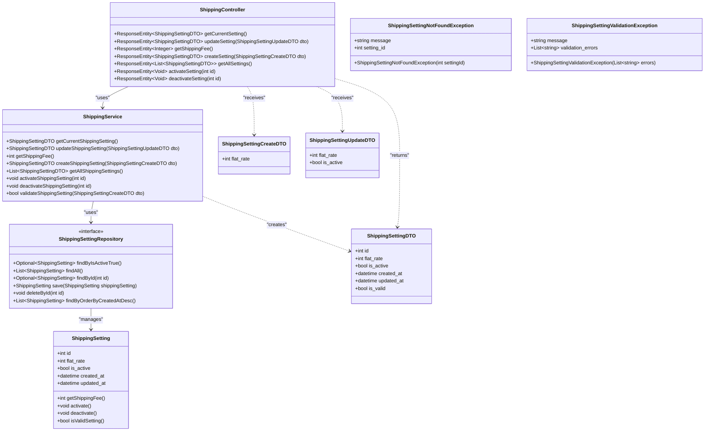

## 配送設定機能

### 配送設定機能のクラス図

```mermaid
classDiagram
    %% 配送設定機能のクラス群
    
    %% 1. Entityクラス
    class ShippingSetting {
        +int id
        +int flat_rate
        +bool is_active
        +datetime created_at
        +datetime updated_at
        
        +int getShippingFee()
        +void activate()
        +void deactivate()
        +bool isValidSetting()
    }
    
    %% 2. Repositoryインタフェース
    class ShippingSettingRepository {
        <<interface>>
        +Optional~ShippingSetting~ findByIsActiveTrue()
        +List~ShippingSetting~ findAll()
        +Optional~ShippingSetting~ findById(int id)
        +ShippingSetting save(ShippingSetting shippingSetting)
        +void deleteById(int id)
        +List~ShippingSetting~ findByOrderByCreatedAtDesc()
    }
    
    %% 3. Serviceクラス
    class ShippingService {
        +ShippingSettingDTO getCurrentShippingSetting()
        +ShippingSettingDTO updateShippingSetting(ShippingSettingUpdateDTO dto)
        +int getShippingFee()
        +ShippingSettingDTO createShippingSetting(ShippingSettingCreateDTO dto)
        +List~ShippingSettingDTO~ getAllShippingSettings()
        +void activateShippingSetting(int id)
        +void deactivateShippingSetting(int id)
        +bool validateShippingSetting(ShippingSettingCreateDTO dto)
    }
    
    %% 4. Controllerクラス
    class ShippingController {
        +ResponseEntity~ShippingSettingDTO~ getCurrentSetting()
        +ResponseEntity~ShippingSettingDTO~ updateSetting(ShippingSettingUpdateDTO dto)
        +ResponseEntity~Integer~ getShippingFee()
        +ResponseEntity~ShippingSettingDTO~ createSetting(ShippingSettingCreateDTO dto)
        +ResponseEntity~List~ShippingSettingDTO~~ getAllSettings()
        +ResponseEntity~Void~ activateSetting(int id)
        +ResponseEntity~Void~ deactivateSetting(int id)
    }
    
    %% 5. DTOクラス
    class ShippingSettingDTO {
        +int id
        +int flat_rate
        +bool is_active
        +datetime created_at
        +datetime updated_at
        +bool is_valid
    }
    
    class ShippingSettingCreateDTO {
        +int flat_rate
    }
    
    class ShippingSettingUpdateDTO {
        +int flat_rate
        +bool is_active
    }
    
    %% 例外クラス
    class ShippingSettingNotFoundException {
        +string message
        +int setting_id
        +ShippingSettingNotFoundException(int settingId)
    }
    
    class ShippingSettingValidationException {
        +string message
        +List~string~ validation_errors
        +ShippingSettingValidationException(List~string~ errors)
    }
    
    %% 関係
    ShippingSettingRepository --> ShippingSetting : "manages"
    ShippingService --> ShippingSettingRepository : "uses"
    ShippingController --> ShippingService : "uses"
    ShippingService ..> ShippingSettingDTO : "creates"
    ShippingController ..> ShippingSettingCreateDTO : "receives"
    ShippingController ..> ShippingSettingUpdateDTO : "receives"
    ShippingController ..> ShippingSettingDTO : "returns"
```