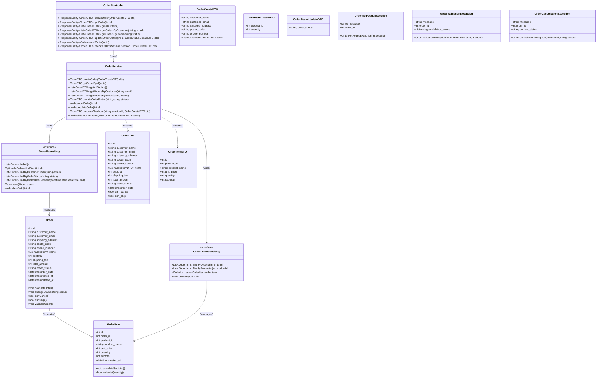

# 詳細設計書
 **改訂履歴**
 | ドキュメントバージョン | 1.0                                   |
 | :------------------- | :------------------------------------ |
 | 作成日               | 2025年7月7日                          |
 | 作成チーム           | teamF                           |
 | 更新履歴             | 2025/07/07: Ver.1.0 初版作成 (teamF) |

 **役割**
 | 役割                         | 氏名               |
 |----------------------------|------------------|
 | プロジェクトリーダー／<br/>シーケンス図設計担当 | 村田 翔悟            |
 | クラス図設計担当                   | 西嶋 優輝            |
 | 画面詳細・UI担当                  | 吉田 日向子<br/>伴場 大晟 |
 | DB物理設計・API詳細担当             | 島田 大輔            |
 | インフラ・非機能詳細担当               | 八重樫 葵            |

# 1. はじめに
## 1.1 本書の目的
 本書は、「シンプル雑貨オンライン」新規構築プロジェクトにおける詳細設計の内容を定義するものです。基本設計書 Ver.1.0 で定義された内容に基づき、実装担当者がプログラミング作業を迷いなく進められるように、システムの内部構造、処理フロー、インターフェース、データベース構造、画面項目などを具体的に記述します。

## 1.2 対象読者
本書は、以下の担当者を対象としています。

 - 本システムのバックエンド開発担当者
 - 本システムのフロントエンド開発担当者
 - 本システムのテスト担当者
 - プロジェクト管理者

## 1.3 前提条件
 本書は、以下の基本設計書の内容を前提としています。

 - シンプル雑貨オンライン 基本設計書 Ver.1.0（teamF）

## 1.4 参考文献
 シンプル雑貨オンライン 基本設計書 Ver.1.0 （teamF）：
 https://vscode.dev/github/Aoi-Yaegashi/teamF/blob/teamF-Murata/%E5%9F%BA%E6%9C%AC%E8%A8%AD%E8%A8%88

## 2. システム概要

 システムの目的、対象ユーザー、全体構成、外部インターフェースについては、基本設計書 Ver.1.0 の「2. システム概要」に記載の通りです。

 **システム構成図（再掲）**
 ```mermaid
 graph TD

 A --> C
 B --> D
 C --> E
 D --> E
 E --> F
 F --> G
 F --> M
 M --> I
 M --> H
 H --> M
 G --> I
 I --> J
 I --> O
 O --> K
 J --> K
 K --> L
 L --> K
 K --> N
 

 subgraph ユーザ環境
   A[顧客]
   B[貴社スタッフ]
 end

 subgraph Chrome/Safari/Edge対応
   C[webブラウザ]
   D[管理画面webブラウザ]
 end

 subgraph ECサイト
   E[Amazon CloudFront
   （オプション）]
   F[Application Load Balancer（オプション）]
   G[顧客側フロントエンド]
   H[Amazon Cognito
   （オプション）]
   I[API Gateway（オプション）]
   J[顧客側バックエンド
   １．商品管理
   ２．カート管理
   ３．注文処理]
   K[データベース]
   L[Amazon S3]
   M[管理者側フロントエンド]
   O[管理者側バックエンド
   １．商品登録・編集
   ２．CSVインポート/エクスポート
   ３．画像アップロード]
 end

 subgraph 外部サービス
 N[メールサービス
 （オプション）]
 end
 ```

# 3. 機能設計（基本設計書の「3. 機能設計」に対応）
 ## 3.1 機能一覧
本システムが提供する機能は以下の通りである。

  ### 3.1.1 商品閲覧・購入機能（購入者向け）
   #### 3.1.1.1 トップページ表示機能
   ##### 3.1.1.1.1 機能概要
  - トップページ表示機能は、ユーザーがサイトにアクセスした際に最初に表示されるページを構成する。
  - これらの情報はデータベースから取得し、ユーザーに分かりやすくレイアウトして表示する。
   ##### 3.1.1.1.1 データ仕様
   - products
   ##### 3.1.1.1.1 処理
   - カテゴリ一覧、新着商品（任意）、バナー（任意）を所定のレイアウトで表示。
   - 画像やリンクも正しく表示されるようにする。

   #### 3.1.1.2 商品一覧・カテゴリ別の商品閲覧機能
   ##### 3.1.1.2.1 機能概要
   - ユーザーが商品カテゴリを選択し、該当カテゴリの商品を一覧表示できる。
   - 商品画像・商品名・価格などの主要情報を一覧で表示する。
   ##### 3.1.1.2.2 データ仕様
   - 商品テーブル：商品ID、商品名、価格、画像URL、カテゴリID、在庫数など
   - カテゴリテーブル：カテゴリID、カテゴリ名
   ##### 3.1.1.2.3 処理
   - 商品一覧取得処理（カテゴリID、検索キーワード、並び順、ページ番号をパラメータとして受け取り、該当商品のリストを返却する）を実行する。
   - カテゴリ選択時に再検索を実行する。

   #### 3.1.1.3 商品詳細ページの表示機能
   ##### 3.1.1.3.1 機能概要
   - 商品一覧や検索結果から商品を選択した際、該当商品の詳細情報（写真、価格、説明、素材等）を画面に表示する。
   ##### 3.1.1.3.2 データ仕様
   - 商品テーブル：商品ID、商品名、価格、説明、素材、画像URL、在庫数
   ##### 3.1.1.3.3 処理
   - 商品IDをキーに、データベースから該当商品の詳細情報を取得する。
   - 商品が非公開・在庫切れの場合の表示制御を実施する。
   - 存在しない商品IDの場合は、エラーメッセージを表示する。
   - 非公開商品や販売終了商品の場合は、エラーメッセージを表示する。
   - 在庫切れ時は「在庫なし」を表示する。

   #### 3.1.1.4 商品のカート追加／削除／数量変更機能
   ##### 3.1.1.4.1 機能概要
   - ユーザーが商品詳細画面や一覧画面から商品をカートに追加できる。
   - カート画面で商品の数量変更や削除ができる。
   - カート内容はセッションで保持される。
   ##### 3.1.1.4.2 データ仕様
   - カート（cart）：ユーザID、作成日時
   - カートアイテム（cart_item）：カートID、商品ID、数量
   - 商品情報：商品ID、商品名、価格、画像URL
   ##### 3.1.1.4.3 処理
   - 商品ID・数量・ユーザIDを受け取り、既存カートがあれば数量を加算、なければ新規追加する。
   - カート画面で数量入力欄を編集し「更新」ボタンで反映する。
   - カート画面の「削除」ボタンで該当商品をカートから除外する。
   - 在庫不足時はエラーメッセージを表示する。
   
   #### 3.1.1.5 カート内商品の一覧、数量、小計、合計金額の表示機能
   ##### 3.1.1.5.1 機能概要
   - ユーザーのカートに入っている全商品の情報（商品名、画像、単価、数量、小計）を一覧表示する。
   - カート全体の合計金額を表示する。
   - 数量変更や商品削除操作時に即時反映される。
   ##### 3.1.1.5.2 データ仕様
   - カート（cart）：ユーザID、作成日時
   - カートアイテム（cart_item）：カートID、商品ID、数量
   - 商品情報：商品ID、商品名、価格、画像URL
   ##### 3.1.1.5.3 処理
   - ユーザIDまたはセッションIDを元にカート情報を取得する。
   - カートアイテムごとに商品情報を参照し、一覧データを生成する。
   - 「各カートアイテムの小計＝単価×数量」
   - 「合計金額＝全カートアイテムの小計合計」
   - 商品情報が取得できない場合は、エラーメッセージを表示する。
   
   #### 3.1.1.6 注文確定処理機能
   ##### 3.1.1.6.1 機能概要
   - カート内商品の内容をもとに、ユーザーが注文を確定する処理を行う。
   - 在庫数のチェック・確保、注文データの登録、注文完了画面の表示、確認メールの送信までを一連で実施する。
   - もし、在庫数が0の場合は、エラー表示をする。
   ##### 3.1.1.6.2 データ仕様
   - 注文テーブル（orders）：注文ID、ユーザID、注文日時、合計金額、配送先情報、ステータス
   - 注文明細テーブル（order_items）：注文ID、商品ID、数量、単価
   - 商品テーブル（products）：商品ID、在庫数
   ##### 3.1.1.6.3 処理
   - カート内容を取得する（ユーザIDまたはセッションIDでカート情報を取得）。
   - 在庫の確保・減算を実施する。
   - 注文データの登録を行う。
   - カート内容をクリアする。
   - 注文完了メールを送信する。
   
   #### 3.1.1.7 注文完了後の確認メール自動送信機能
   ##### 3.1.1.7.1 機能概要
   - ーザーが注文確定操作を完了した時点で、注文内容を記載した確認メールを自動で送信する。
   ##### 3.1.1.7.2 データ仕様
   - 送信先メールアドレス（注文時に入力されたもの）
   - 注文情報（注文番号、商品名、数量、合計金額、配送先など）
   - メールテンプレート（件名・本文・差し込み項目）
   ##### 3.1.1.7.3 処理
   - 注文確定処理完了後、注文データをもとにメール本文を生成する。
   - 送信結果（成功／失敗）をログに記録する。

  ### 3.1.2 商品検索機能（購入者向け）
   
   #### 3.1.2.1 単語検索機能（オプション）
   ##### 3.1.2.1.1 機能概要
   - ユーザーが検索窓に商品名や説明などのキーワードを入力し、該当する商品を一覧で表示する。
   - 検索結果は部分一致や表記揺れにも対応し、利便性を高める。
   ##### 3.1.2.1.2 データ仕様
   - 検索対象フィールド：商品名、商品説明、商品タグ、カテゴリ名など
   - 商品テーブル：商品ID、商品名、説明、タグ、カテゴリID
   ##### 3.1.2.1.3 処理
   - 検索フォームから送信されたキーワードを受け取り、指定フィールドで部分一致検索を実施する。
   - 表記揺れや類義語に対応する（必要に応じて）。

  #### 3.1.3 配送料金設定・計算機能（管理者向け）
  
   ##### 3.1.3.1 送料設定機能
   ##### 3.1.3.1.1 機能概要
   - 管理者が管理画面から送料ルールを登録・編集できる。
   - ユーザーの注文時に、設定されたルールに従って自動的に送料を計算・適用する。
   ##### 3.1.3.1.2 データ仕様
   - 送料設定テーブル：送料タイプ、金額、地域、重量、注文金額閾値、配送方法ID、適用期間など
   - 配送方法テーブル：配送方法名、説明、関連送料設定ID
   ##### 3.1.3.1.3 処理
   - 管理者が送料ルールを登録・編集・削除できる。
   - 注文時に、カート内容・配送先情報・注文金額・重量などをもとに適用ルールを判定し、送料を自動計算する。
  
   #### 3.1.3.2 配送方法の表示・選択機能
   ##### 3.1.3.2.1 機能概要
   - 管理者が管理画面から配送方法（例：宅配便、メール便、店舗受取など）を登録・編集・削除できる。
   ##### 3.1.3.2.2 データ仕様
   - 配送方法テーブル：配送方法ID、名称、説明、送料設定ID、利用条件、表示順、利用可否フラグ、目安日数など
   ##### 3.1.3.2.3 処理
   - 管理者が配送方法の登録・編集・削除を行う。

  #### 3.1.4 商品管理機能（管理者向け）
  
   #### 3.1.4.1 商品登録・編集機能（商品名・価格・説明・画像など）
   ##### 3.1.4.1.1 機能概要
   - 管理者が管理画面から新規商品を登録し、既存商品の情報を編集できる。
   ##### 3.1.4.1.2 データ仕様
   - 商品テーブル：商品ID、商品名、価格、説明、画像URL、在庫数、カテゴリIDなど
   - 画像ファイル：JPEG/PNG対応、推奨サイズ・容量制限
   ##### 3.1.4.1.3 処理
   - 新規登録：入力フォームから商品情報を受け取り、バリデーション後にDBへ登録する。
   - 編集：既存商品の情報を取得し、編集内容をバリデーション後にDBへ反映する。
   - 公開/非公開切り替え：商品ごとに表示可否を設定できる。
   - 画像アップロード：ファイル形式・サイズチェック、サーバ保存、画像URL生成
   
   #### 3.1.4.2 商品削除機能
   ##### 3.1.4.2.1 機能概要
   - 管理者が管理画面から商品を削除できる。
   ##### 3.1.4.2.2 データ仕様
   - 商品テーブル：商品ID
   ##### 3.1.4.2.3 処理
   - 商品IDを指定して削除処理を実行する。
   
   #### 3.1.4.3 商品の在庫管理機能（在庫数の更新）
   ##### 3.1.4.3.1 機能概要
   - 管理者が管理画面から各商品の在庫数を登録・編集できる。
   ##### 3.1.4.3.2 データ仕様
   - 商品テーブル：商品ID、在庫数、最終更新日時、最終更新者ID
   - 在庫履歴テーブル：商品ID、変更前在庫数、変更後在庫数、変更理由、変更日時、担当者ID
   ##### 3.1.4.3.3 処理
   - 管理者が在庫数の手動更新を行う。
   - 注文確定時に在庫数を自動で減算する。
   - 入荷・出荷登録から在庫数の増減を実施する（オプション）。
   
   #### 3.1.4.4 商品のカテゴリ設定・変更機能
   ##### 3.1.4.4.1 機能概要
   - 管理者が管理画面から商品にカテゴリを設定・変更できる。
   - 商品は1つ以上のカテゴリに所属できる。
   - カテゴリの新規作成・編集・削除は管理画面から行う。
   ##### 3.1.4.4.2 データ仕様
   - 商品テーブル：商品ID、カテゴリID（単一の場合）またはカテゴリIDリスト（複数対応の場合）
   - カテゴリテーブル：カテゴリID、カテゴリ名、親カテゴリID（階層構造対応の場合）、表示順、説明
   ##### 3.1.4.4.3 処理
   - 商品登録・編集時にカテゴリ選択内容をDBに保存する。
   - カテゴリの追加・編集を行う。
   
   #### 3.1.4.5 セール価格設定機能（期間限定価格）
   ##### 3.1.4.5.1 機能概要
   - 管理者が管理画面から商品ごとにセール価格や割引率、セール期間を設定できる。
   - 設定した期間中、ユーザーには割引後価格と割引前価格（通常価格）が表示される。
   - セール期間外は自動的に通常価格に戻る。
   ##### 3.1.4.5.2 データ仕様
   - 商品テーブル：商品ID、通常価格、セール価格、割引率、セール開始日、セール終了日
   - 割引前価格（通常価格）と割引後価格（セール価格）の両方を保持
   - 割引率は自動計算または手動入力
   ##### 3.1.4.5.3 処理
   - セール期間中のみセール価格・割引率をフロントに表示する。
   - セール期間外は自動的に通常価格表示へ切り替える。
   - セール価格未設定時は通常価格を適用する。
   
   #### 3.1.4.6 商品情報の一括登録・編集機能
   ##### 3.1.4.6.1 機能概要
   - 管理者がCSVファイル等を使い、複数の商品情報を一度に登録・編集できる。
   ##### 3.1.4.6.2 データ仕様
   - 商品テーブル：商品ID、商品名、価格、説明、画像URL、在庫数、カテゴリIDなど
   ##### 3.1.4.6.3 処理
   - CSVファイルをアップロードし、サーバー側でパース・バリデーション
   - 正常データはDBに一括登録・更新
   
   #### 3.1.4.7 商品情報の一括取得機能
   ##### 3.1.4.7.1 機能概要
   - 管理者や外部システムが、指定条件に合致する複数の商品情報を一括で取得できる。
   ##### 3.1.4.7.2 データ仕様
   - 商品テーブル：商品ID、商品名、価格、説明、画像URL、在庫数、カテゴリIDなど
   ##### 3.1.4.7.3 処理
   - 指定された条件で商品データを検索・抽出する。
   - データを選択したフォーマット（CSV/JSON/XML）でエクスポートする。

  ### 3.1.5 注文管理機能（管理者向け）
   
   #### 3.1.5.1 注文一覧表示機能
   ##### 3.1.5.1.1 機能概要
   - 管理者が注文情報を一元管理し、注文状況の確認・修正・キャンセル・エクスポートなどを行う。
   - 注文の受付から出荷・配送・完了・キャンセルまでのステータスを管理する。
   ##### 3.1.5.1.2 データ仕様
   - 注文テーブル：注文ID、顧客ID、注文日時、合計金額、ステータス、支払い方法、配送方法、配送先情報、注文メモ
   - 注文明細テーブル：注文ID、商品ID、数量、単価、合計金額
   - ステータス履歴テーブル：注文ID、変更前ステータス、変更後ステータス、変更日時、担当者ID
   ##### 3.1.5.1.3 処理
   - 注文情報の取得・一覧化・詳細表示
   
   #### 3.1.5.2 注文内容詳細の確認機能
   ##### 3.1.5.2.1 機能概要
   - 管理者や購入者が、注文ごとに商品の明細・金額・注文者情報・配送先・決済方法・注文ステータスなどの詳細を確認できる。
   ##### 3.1.5.2.2 データ仕様
   - 注文テーブル：注文ID、注文日時、顧客ID、合計金額、ステータス、決済方法、配送方法、配送先情報、備考
   - 注文明細テーブル：注文ID、商品ID、商品名、数量、単価、小計
   - 顧客テーブル：顧客ID、氏名、連絡先
   ##### 3.1.5.2.3 処理
   - 指定注文IDで注文情報・明細・顧客情報・配送情報を取得し、画面に表示する。
   - 管理者は顧客検索から注文履歴を一覧・詳細確認できる。
   
   #### 3.1.5.3 発送ステータスの更新機能
   ##### 3.1.5.3.1 機能概要
   - 管理者が注文ごとに発送ステータス（例：未発送→発送済み）を更新できる。
   - 送り状番号・発送日・到着予定日などの配送情報も同時に登録・編集できる。
   ##### 3.1.5.3.2 データ仕様
   - 注文テーブル：注文ID、発送ステータス、送り状番号、発送日、到着予定日、配送会社、最終更新日時、最終更新者ID
   ##### 3.1.5.3.3 処理
   - 管理者が発送ステータスを「発送済み」に変更する。
   - 送り状番号・発送日・到着予定日を入力・保存する。
   
   #### 3.1.5.4 注文データのCSVエクスポート機能
   ##### 3.1.5.4.1 機能概要
   - 管理者が注文情報（注文番号、顧客情報、商品明細、金額、ステータス、配送先など）をCSV形式で一括ダウンロードできる。
   ##### 3.1.5.4.2 データ仕様
   - 注文テーブル：注文ID、注文日、顧客ID、合計金額、ステータス、決済方法、配送先情報など
   - 注文明細テーブル：注文ID、商品ID、商品名、数量、単価、小計
   - 顧客テーブル：顧客ID、氏名、住所、電話番号、メールアドレス
   ##### 3.1.5.4.3 処理
   - 指定された条件で注文データを検索・抽出する。
   - 選択したテンプレートに従い、必要な項目のみをCSV形式で出力する。

  ### 3.1.6 サイト運営機能（管理者向け）
   
   #### 3.1.6.1 管理画面ログイン機能
   ##### 3.1.6.1.1 機能概要
   - 管理者がID・パスワードを入力し、認証に成功した場合のみ管理画面へアクセスできる。
   ##### 3.1.6.1.2 データ仕様
   - 管理者テーブル：管理者ID、ログインID、ハッシュ化パスワード、アカウント状態（有効/無効）、最終ログイン日時、ログイン失敗回数など
   - ログイン履歴テーブル：入力ログインID、ログイン結果、ログイン時間、IPアドレス、ユーザーエージェント
   ##### 3.1.6.1.3 処理
   - 入力ID・パスワードを受け取り、DBのハッシュ化パスワードと照合する。
   - 認証成功時、セッション開始・管理画面TOPへ遷移する。
   - 認証失敗時、エラーメッセージ表示・失敗回数を記録する。
   - 一定回数以上の失敗でアカウントロックを実行する。
   
   #### 3.1.6.2 サイト基本情報登録・編集機能（会社概要、特商法表記、プライバシーポリシーなど）
   ##### 3.1.6.2.1 機能概要
   - 管理者が管理画面からサイトの基本情報を登録・編集できる。
   - 変更内容は即時または「保存して公開」操作でWebサイト全体に反映される。
   ##### 3.1.6.2.2 データ仕様
   - サイト設定テーブル：サイト名、最終更新日時、更新者IDなど
   ##### 3.1.6.2.3 処理
   - 入力値をバリデーションし、問題なければデータベースに保存する。
   - 「保存して公開」操作で全ページに反映する。
   - 画像アップロード時はファイル形式・サイズをチェックし、サーバーに保存する。
   - 変更履歴の記録（いつ・誰が・どの項目を変更したか）を行う。
   
   #### 3.1.6.3 購入者からの問い合わせ受付機能（お問い合わせ受付フォーム）
   ##### 3.1.6.3.1 機能概要
   - 購入者がWebサイト上のフォームから問い合わせ内容を送信できる。
   - 入力内容は管理者に通知され、管理画面やメールで確認・管理できる。
   ##### 3.1.6.3.2 データ仕様
   - 問い合わせテーブル：問い合わせID、氏名、メールアドレス、電話番号、問い合わせ種別、内容、受付日時、対応状況など
   ##### 3.1.6.3.3 処理
   - 入力値のバリデーション（必須項目、メール形式、文字数制限など）を実施する（オプション）。
   - 送信時、問い合わせ内容をDBに保存し、管理者へメールで通知する。
   - 自動返信メール（受付完了通知）を購入者に送信する（オプション）。
   - 管理画面で問い合わせ内容の一覧・詳細・対応状況を管理する。

## 3.2. 機能詳細
各主要機能について、機能詳細をシーケンス図にて図示する。

  ### 3.2.1 商品閲覧・購入機能（購入者向け）

   #### 3.2.1.1 トップページ表示機能（MUST）
   <div class="mermaid">
   sequenceDiagram
    participant User as ユーザー
    participant FE as フロントエンド
    participant TC as ProductController
    participant TS as ProductService
    participant CatRepo as CategoryRepository
    participant ProdRepo as ProductRepository
    participant BanRepo as BannerRepository

    User->>FE: トップページアクセス
    FE->>TC: GET /api/top-page

    %% カテゴリ一覧取得
    TC->>TS: getTopPageData()
    TS->>CatRepo: getCategories()
    CatRepo-->>TS: カテゴリ一覧

    %% 新着商品取得（任意）
    TS->>ProdRepo: getNewProducts()
    ProdRepo-->>TS: 新着商品一覧

    %% バナー取得（任意）
    TS->>BanRepo: getActiveBanners()
    BanRepo-->>TS: バナー一覧

    %% サービスからコントローラへ
    TS-->>TC: カテゴリ一覧、新着商品一覧、バナー一覧

    %% コントローラからフロントエンドへ
    TC-->>FE: レスポンス（カテゴリ、新着商品、バナー）

    FE->>User: トップページ表示（レイアウト・画像・リンク等）
</div>

   #### 3.2.1.2 商品一覧・カテゴリ別の商品閲覧機能(MUST) 
   <div class="mermaid">
   sequenceDiagram
    participant User as ユーザー
    participant Browser as フロントエンド
    participant Controller as ProductController
    participant Service as ProductService
    participant ProductRepo as ProductRepository
    participant CategoryRepo as ProductCategoryRepository
    participant DB as データベース

    User->>Browser: 商品一覧ページ or カテゴリ選択
    Browser->>Controller: GET /api/products
    Controller->>Service: getProductsByCategory(category_id, page)
    Service->>CategoryRepo: findById(category_id)
    CategoryRepo->>DB: カテゴリ情報取得
    DB-->>CategoryRepo: カテゴリ情報返却
    CategoryRepo-->>Service: ProductCategoryエンティティ返却
    Service->>ProductRepo: findByCategory(category_id, page)
    ProductRepo->>DB: 商品一覧データ検索（カテゴリID＋ページング）
    DB-->>ProductRepo: 商品一覧データ返却
    ProductRepo-->>Service: Productエンティティリスト返却
    Service-->>Service: Productエンティティから商品一覧DTOへ変換
    Service-->>Controller: 商品一覧DTOリスト返却
    Controller-->>Browser: 商品一覧JSON返却
    Browser-->>User: 商品リストを表示
</div>

   #### 3.2.1.3 商品詳細ページの表示機能
   <div class="mermaid">
sequenceDiagram
    participant User as ユーザー
    participant Browser as フロントエンド
    participant Controller as ProductController
    participant Service as ProductService
    participant Repo as ProductRepository
    participant DB as データベース

    User->>Browser: 商品詳細ページを開く（商品ID指定）
    Browser->>Controller: GET /api/products/{product_id}
    Controller->>Service: getProductDetail{product_id}
    Service->>Repo: findById{product_id}
    Repo->>DB: 商品データ検索{product_id}
    DB-->>Repo: 商品データ返却
    Repo-->>Service: Productエンティティ返却
    Service-->>Controller: 商品詳細DTO返却
    Controller-->>Browser: 商品詳細JSON返却
    Browser-->>User: 商品詳細を表示
    alt 商品が存在する場合
        Service->>Service: ProductエンティティからProductDetail DTOへ変換
        Service-->>Controller: ProductDetail
        Controller-->>Browser: 商品詳細データ (JSON)
        Browser-->>User: 商品詳細を表示
    else 商品が存在しない場合
        Service-->>Controller: (エラー情報)
        Controller-->>Browser: 404 Not Found レスポンス
        Browser-->>User: 商品が見つからない旨の表示
    end
</div>

   #### 3.2.1.4 商品のカート追加／削除／数量変更機能（MUST）
   **商品のカート追加**
   <div class="mermaid">
   sequenceDiagram
    participant User as ユーザー
    participant Browser as フロントエンド
    participant CartController as CartController
    participant CartService as CartService
    participant CartRepo as CartRepository
    participant ProductRepo as ProductRepository
    participant DB as データベース

    User->>Browser: 商品詳細ページで「カートに追加」ボタン押下
    Browser->>CartController: POST /api/cart { product_id, quantity }
    CartController->>CartService: addProductToCart{ product_id, quantity }
    CartService->>ProductRepo: findById{product_id}
    ProductRepo->>DB: 商品データ取得
    DB-->>ProductRepo: 商品データ返却
    ProductRepo-->>CartService: Productエンティティ返却
    CartService->>CartRepo: findByUserId{ user_id }
    CartRepo->>DB: カートデータ取得
    DB-->>CartRepo: カートデータ返却
    CartRepo-->>CartService: Cartエンティティ返却
    CartService->>CartRepo: addOrUpdateCartItem(cart, product, quantity)
    CartRepo->>DB: カートデータ更新
    DB-->>CartRepo: 更新結果返却
    CartRepo-->>CartService: 更新済カートエンティティ返却
    CartService-->>CartController: カートDTO返却
    CartController-->>Browser: カート情報JSON返却
    Browser-->>User: カートページに反映して表示
</div>

**カート数量変更**
**1. 追加**
<div class="mermaid">
sequenceDiagram
    participant User as ユーザー
    participant Browser as フロントエンド
    participant CartController as CartController
    participant CartService as CartService
    participant CartRepo as CartRepository
    participant ProductRepo as ProductRepository
    participant DB as データベース

    User->>Browser: 商品詳細ページで「カートに追加」ボタン押下
    Browser->>CartController: GET /api/cart {product_id, quantity}
    CartController->>CartService: addProductToCart(user_id, product_id, quantity)
    CartService->>ProductRepo: findById{ product_id }
    ProductRepo->>DB: 商品データ取得
    DB-->>ProductRepo: 商品データ返却
    ProductRepo-->>CartService: Productエンティティ返却
    CartService->>CartRepo: findByUserId{ user_id }
    CartRepo->>DB: カートデータ取得
    DB-->>CartRepo: カートデータ返却
    CartRepo-->>CartService: Cartエンティティ返却
    alt カートに商品が既に存在する場合
        CartService->>Cart: getCartItem{ product_id }
        Cart-->>CartService: CartItemエンティティ返却
        CartService->>Cart: updateQuantity{ product_id, quantity }
    else カートに商品が存在しない場合
        CartService->>Cart: addNewItem{ product, quantity}
    end
    CartService->>CartRepo: save(cart)
    CartRepo->>DB: カートデータ更新
    DB-->>CartRepo: 更新結果返却
    CartRepo-->>CartService: 更新済カートエンティティ返却
    CartService-->>CartController: カートDTO返却
    CartController-->>Browser: カート情報JSON返却
    Browser-->>User: カートページに反映して表示
</div>

**2. 削除** (上記PUTと同様の流れ/DELETE /api/cartで実行)

   #### 3.2.1.5 カート内商品の一覧、数量、小計、合計金額の表示機能（MUST）
<div class="mermaid">
sequenceDiagram
    participant User as ユーザー
    participant Browser as フロントエンド
    participant CartController as CartController
    participant CartService as CartService
    participant CartRepo as CartRepository
    participant ProductRepo as ProductRepository
    participant DB as データベース

    User->>Browser: カートページを開く
    Browser->>CartController: GET /api/cart
    CartController->>CartService: getCart(user_id)
    CartService->>CartRepo: findByUserId{ user_id }
    CartRepo->>DB: カートデータ取得
    DB-->>CartRepo: カートデータ返却
    CartRepo-->>CartService: Cartエンティティ返却
    loop カート内全商品
        CartService->>ProductRepo: findById(product_id)
        ProductRepo->>DB: 商品データ取得
        DB-->>ProductRepo: 商品データ返却
        ProductRepo-->>CartService: Productエンティティ返却
        CartService->>CartItem: 小計計算（quantity×price）
    end
    CartService->>Cart: 合計金額計算（全小計合計）
    CartService-->>CartController: カートDTO（商品一数量数量、小計、合計金額）返却
    CartController-->>Browser: カート情報JSON返却
    Browser-->>User: カート画面表示（商品一覧・数量・小計・合計金額）
</div>

   #### 3.2.1.6 注文確定処理機能（MUST）
   <div class="mermaid">
sequenceDiagram
    participant User as ユーザー
    participant FE as フロントエンド
    participant OC as OrderController
    participant CS as CartService
    participant IS as InventoryService
    participant PR as ProductRepository
    participant OS as OrderService
    participant OR as OrderRepository
    participant OIR as OrderItemRepository
    participant MS as MailService

    User->>FE: 注文確定ボタン押下
    FE->>OC: POST /api/orders
    OC->>CS: getCartItems{ user_id }
    CS-->>OC: cartItems{ product_id, quantity }

    OC->>IS: reserveStock{ cartItems }
    IS->>PR: checkAndReserve{ product_id, quantity } [各商品ごと]
    alt 在庫不足の商品あり
        PR-->>IS: Error: OutOfStock
        IS-->>OC: Error: OutOfStock
        OC-->>FE: 在庫不足エラー（商品名含む）
        FE-->>User: エラー表示
    else 全商品在庫OK
        PR-->>IS: OK
        IS-->>OC: reservedStockInfo
        OC->>OS: createOrder({ customer_info, shipping_address, payment_method, cart_items })
        OS->>OR: insertOrder(user_id, 日時, 合計金額, 配送先, ステータス)
        OR-->>OS: order_id
        OS->>OIR: insertOrderItems(order_id, cartItems)
        OIR-->>OS: OK
        OS-->>OC: order_id

        OC->>CS: clearCart{ user_id }
        CS-->>OC: OK

        OC->>MS: sendOrderConfirmation(userEmail, order_id)
        alt メール送信失敗
            MS-->>OC: Error: MailSendFailure
            OC-->>FE: 注文完了（メール送信失敗メッセージ付き）
            FE-->>User: 注文完了画面（メール送信失敗警告）
        else メール送信成功
            MS-->>OC: OK
            OC-->>FE: 注文完了レスポンス（注文番号など）
            FE-->>User: 注文完了画面
        end
    end
</div>

   #### 3.2.1.7 注文完了後の確認メール自動送信機能(Should)
   <div class="mermaid">
   sequenceDiagram
    participant User as ユーザー
    participant Browser as フロントエンド
    participant OrderController as OrderController
    participant OrderService as OrderService
    participant OrderRepo as OrderRepository
    participant CartRepo as CartRepository
    participant ProductRepo as ProductRepository
    participant MailService as MailService
    participant DB as データベース
    participant MailServer as メールサーバ

    User->>Browser: 注文確定ボタン押下
    Browser->>OrderController: POST /api/orders { order_id }
    OrderController->>OrderService: createOrder{ user_id, order_id }
    OrderService->>CartRepo: findByUserId{ user_id }
    CartRepo->>DB: カートデータ取得
    DB-->>CartRepo: カートデータ返却
    CartRepo-->>OrderService: Cartエンティティ返却
    loop カート内全商品
        OrderService->>ProductRepo: findById{ product_id }
        ProductRepo->>DB: 商品データ取得
        DB-->>ProductRepo: 商品データ返却
        ProductRepo-->>OrderService: Productエンティティ返却
    end
    OrderService->>OrderRepo: save(Order)
    OrderRepo->>DB: 注文データ保存
    DB-->>OrderRepo: 保存結果返却
    OrderRepo-->>OrderService: Orderエンティティ返却
    OrderService->>MailService: sendOrderConfirmationMail(ユーザー, 注文内容)
    MailService->>MailServer: メール送信
    MailServer-->>MailService: 送信結果返却
    MailService-->>OrderService: 送信結果返却
    OrderService-->>OrderController: 注文完了レスポンス返却
    OrderController-->>Browser: 注文完了レスポンス返却
    Browser-->>User: 注文完了画面表示
</div>

  #### 3.2.2 商品検索機能（購入者向け）

   ##### 3.2.2.1 単語検索機能
   <div class="mermaid">
   sequenceDiagram
    participant User as ユーザー
    participant Browser as フロントエンド
    participant SearchController as ProductSearchController
    participant SearchService as ProductSearchService
    participant ProductRepo as ProductRepository
    participant DB as データベース

    User->>Browser: 検索ワード入力し検索ボタン押下
    Browser->>SearchController: GET /api/products/search?keyword=XXX
    SearchController->>SearchService: searchProducts(keyword)
    SearchService->>ProductRepo: searchByKeyword(keyword)
    ProductRepo->>DB: 商品名・説明文 LIKE検索（%keyword%）
    DB-->>ProductRepo: 検索結果データ返却
    ProductRepo-->>SearchService: Productエンティティリスト返却
    SearchService-->>SearchController: 商品DTOリスト返却
    SearchController-->>Browser: 検索結果JSON返却
    Browser-->>User: 検索結果画面表示
</div>

  ### 3.2.3 配送料金設定・計算機能（管理者向け）

   #### 3.2.3.1 送料設定機能
**1. 送料設定機能**
<div class="mermaid">
sequenceDiagram
    participant AdminUser as 管理者
    participant Browser as 管理画面
    participant ShippingFeeController as ShippingFeeController
    participant ShippingFeeService as ShippingFeeService
    participant ShippingFeeRepo as ShippingFeeRepository
    participant DB as データベース

    AdminUser->>Browser: 送料設定画面を開く
    Browser->>ShippingFeeController: GET /api/admin/shipping-fee
    ShippingFeeController->>ShippingFeeService: getShippingFeeSettings()
    ShippingFeeService->>ShippingFeeRepo: findAll()
    ShippingFeeRepo->>DB: 送料設定データ取得
    DB-->>ShippingFeeRepo: 送料設定データ返却
    ShippingFeeRepo-->>ShippingFeeService: 送料設定リスト返却
    ShippingFeeService-->>ShippingFeeController: 送料設定DTO返却
    ShippingFeeController-->>Browser: 送料設定データJSON返却
    AdminUser->>Browser: 送料条件を入力し保存
    Browser->>ShippingFeeController: POST /api/admin/shipping-fee {送料条件}
    ShippingFeeController->>ShippingFeeService: saveShippingFee(送料条件)
    ShippingFeeService->>ShippingFeeRepo: saveOrUpdate(送料条件)
    ShippingFeeRepo->>DB: 送料設定データ保存
    DB-->>ShippingFeeRepo: 保存結果返却
    ShippingFeeRepo-->>ShippingFeeService: 保存済み送料エンティティ返却
    ShippingFeeService-->>ShippingFeeController: 保存結果返却
    ShippingFeeController-->>Browser: 保存結果JSON返却
</div>

**2. 送料計算機能**
<div class="mermaid">
sequenceDiagram
    participant User as 購入者
    participant Browser as フロントエンド
    participant OrderController as OrderController
    participant OrderService as OrderService
    participant ShippingFeeService as ShippingFeeService
    participant ShippingFeeRepo as ShippingFeeRepository
    participant DB as データベース

    User->>Browser: 注文確認画面を開く
    Browser->>OrderController: GET /api/orders/preview?address=XX&cart=YY
    OrderController->>OrderService: previewOrder(ユーザーID, 配送先, カート内容)
    OrderService->>ShippingFeeService: calculateShippingFee(配送先, カート内容)
    ShippingFeeService->>ShippingFeeRepo: findApplicableFee(配送先, カート金額)
    ShippingFeeRepo->>DB: 送料設定データ取得
    DB-->>ShippingFeeRepo: 送料設定データ返却
    ShippingFeeRepo-->>ShippingFeeService: 適用送料返却
    ShippingFeeService-->>OrderService: 送料金額返却
    OrderService-->>OrderController: プレビュー情報（送料含む）返却
    OrderController-->>Browser: プレビュー情報JSON返却
    Browser-->>User: 注文確認画面に送料を表示
</div>

   #### 3.2.3.2 配送方法の表示・選択機能（Cloud）
   <div class="mermaid">
sequenceDiagram
    participant AdminUser as 管理者
    participant AdminBrowser as 管理画面
    participant DeliveryMethodController as DeliveryMethodController
    participant DeliveryMethodService as DeliveryMethodService
    participant DeliveryMethodRepo as DeliveryMethodRepository
    participant DB as データベース

    AdminUser->>AdminBrowser: 配送方法設定画面を開く
    AdminBrowser->>DeliveryMethodController: GET /api/admin/delivery-methods
    DeliveryMethodController->>DeliveryMethodService: getDeliveryMethods()
    DeliveryMethodService->>DeliveryMethodRepo: findAll()
    DeliveryMethodRepo->>DB: 配送方法データ取得
    DB-->>DeliveryMethodRepo: 配送方法データ返却
    DeliveryMethodRepo-->>DeliveryMethodService: 配送方法リスト返却
    DeliveryMethodService-->>DeliveryMethodController: 配送方法DTO返却
    DeliveryMethodController-->>AdminBrowser: 配送方法データJSON返却
    AdminUser->>AdminBrowser: 配送方法を入力し保存
    AdminBrowser->>DeliveryMethodController: POST /api/admin/delivery-methods {配送方法情報}
    DeliveryMethodController->>DeliveryMethodService: saveDeliveryMethod(配送方法情報)
    DeliveryMethodService->>DeliveryMethodRepo: saveOrUpdate(配送方法情報)
    DeliveryMethodRepo->>DB: 配送方法データ保存
    DB-->>DeliveryMethodRepo: 保存結果返却
    DeliveryMethodRepo-->>DeliveryMethodService: 保存済み配送方法エンティティ返却
    DeliveryMethodService-->>DeliveryMethodController: 保存結果返却
    DeliveryMethodController-->>AdminBrowser: 保存結果JSON返却
</div>


  ### 3.2.4 商品管理機能（管理者向け）

   #### 3.2.4.1 商品登録・編集機能（商品名・価格・説明・画像など）
**1. 商品登録機能**
   <div class="mermaid">
   sequenceDiagram
    participant AdminUser as 管理者
    participant AdminBrowser as 管理画面
    participant ProductController as ProductController
    participant ProductService as ProductService
    participant ImageStorageService as ImageStorageService
    participant ProductRepo as ProductRepository
    participant DB as データベース
    participant Storage as 画像ストレージ

    AdminUser->>AdminBrowser: 商品登録画面を開く
    AdminBrowser->>ProductController: POST /api/admin/products {商品名, 価格, 説明, 画像ファイル}
    ProductController->>ProductService: createProduct(商品情報, 画像ファイル)
    ProductService->>ImageStorageService: uploadImage(画像ファイル)
    ImageStorageService->>Storage: 画像ファイル保存
    Storage-->>ImageStorageService: 画像URL返却
    ImageStorageService-->>ProductService: 画像URL返却
    ProductService->>ProductRepo: save(Productエンティティ(画像URL含む))
    ProductRepo->>DB: 商品データ保存
    DB-->>ProductRepo: 保存結果返却
    ProductRepo-->>ProductService: 保存済みエンティティ返却
    ProductService-->>ProductController: 商品DTO返却
    ProductController-->>AdminBrowser: 登録結果JSON返却
</div>

**2. 商品編集機能**
   <div class="mermaid">
   sequenceDiagram
    participant AdminUser as 管理者
    participant AdminBrowser as 管理画面
    participant ProductController as ProductController
    participant ProductService as ProductService
    participant ImageStorageService as ImageStorageService
    participant ProductRepo as ProductRepository
    participant DB as データベース
    participant Storage as 画像ストレージ

    AdminUser->>AdminBrowser: 商品編集画面を開く
    AdminBrowser->>ProductController: PUT /api/admin/products/{商品ID} {商品名, 価格, 説明, 画像ファイル（任意）}
    ProductController->>ProductService: updateProduct(商品ID, 商品情報, 画像ファイル)
    ProductService->>ProductRepo: findById(商品ID)
    ProductRepo->>DB: 商品データ取得
    DB-->>ProductRepo: 商品データ返却
    ProductRepo-->>ProductService: Productエンティティ返却
    alt 画像ファイルが新規の場合
        ProductService->>ImageStorageService: uploadImage(新画像ファイル)
        ImageStorageService->>Storage: 画像ファイル保存
        Storage-->>ImageStorageService: 新画像URL返却
        ImageStorageService-->>ProductService: 新画像URL返却
        ProductService->>ImageStorageService: deleteImage(旧画像URL)
        ImageStorageService->>Storage: 旧画像削除
        Storage-->>ImageStorageService: 削除完了
    end
    ProductService->>ProductRepo: save(更新済Productエンティティ)
    ProductRepo->>DB: 商品データ更新
    DB-->>ProductRepo: 更新結果返却
    ProductRepo-->>ProductService: 更新済みエンティティ返却
    ProductService-->>ProductController: 商品DTO返却
    ProductController-->>AdminBrowser: 編集結果JSON返却
</div>

   #### 3.2.4.2 商品削除機能
   <div class="mermaid">
   sequenceDiagram
    participant AdminUser as 管理者
    participant AdminBrowser as 管理画面
    participant ProductController as ProductController
    participant ProductService as ProductService
    participant ProductRepo as ProductRepository
    participant ImageStorageService as ImageStorageService
    participant DB as データベース
    participant Storage as 画像ストレージ

    AdminUser->>AdminBrowser: 商品一覧画面で削除ボタン押下
    AdminBrowser->>ProductController: DELETE /api/admin/products/{商品ID}
    ProductController->>ProductService: deleteProduct(商品ID)
    ProductService->>ProductRepo: findById(商品ID)
    ProductRepo->>DB: 商品データ取得
    DB-->>ProductRepo: 商品データ返却
    ProductRepo-->>ProductService: Productエンティティ返却
    alt 画像ファイルが存在する場合
        ProductService->>ImageStorageService: deleteImage(画像URL)
        ImageStorageService->>Storage: 画像ファイル削除
        Storage-->>ImageStorageService: 削除完了
    end
    alt 論理削除の場合
        ProductService->>ProductRepo: markAsDeleted(商品ID)
        ProductRepo->>DB: is_deletedフラグ更新
        DB-->>ProductRepo: 更新結果返却
    else 物理削除の場合
        ProductService->>ProductRepo: delete(商品ID)
        ProductRepo->>DB: 商品データ削除
        DB-->>ProductRepo: 削除結果返却
    end
    ProductRepo-->>ProductService: 削除完了返却
    ProductService-->>ProductController: 削除完了レスポンス
    ProductController-->>AdminBrowser: 削除結果JSON返却
</div>

   #### 3.2.4.3 商品の在庫管理機能（在庫数の更新）
   <div class="mermaid">
   sequenceDiagram
    participant AdminUser as 管理者
    participant AdminBrowser as 管理画面
    participant InventoryController as InventoryController
    participant InventoryService as InventoryService
    participant ProductRepo as ProductRepository
    participant InventoryRepo as InventoryRepository
    participant DB as データベース

    AdminUser->>AdminBrowser: 商品一覧画面で在庫編集ボタン押下
    AdminBrowser->>InventoryController: PUT /api/admin/products/{商品ID}/inventory {新在庫数}
    InventoryController->>InventoryService: updateInventory(商品ID, 新在庫数)
    InventoryService->>ProductRepo: findById(商品ID)
    ProductRepo->>DB: 商品データ取得
    DB-->>ProductRepo: 商品データ返却
    ProductRepo-->>InventoryService: Productエンティティ返却
    InventoryService->>InventoryRepo: findByProductId(商品ID)
    InventoryRepo->>DB: 在庫データ取得
    DB-->>InventoryRepo: 在庫データ返却
    InventoryRepo-->>InventoryService: Inventoryエンティティ返却
    InventoryService->>InventoryRepo: updateInventory(Inventory, 新在庫数)
    InventoryRepo->>DB: 在庫数更新
    DB-->>InventoryRepo: 更新結果返却
    InventoryRepo-->>InventoryService: 更新済みInventory返却
    InventoryService-->>InventoryController: 更新結果返却
    InventoryController-->>AdminBrowser: 更新結果JSON返却
</div>

   #### 3.2.4.4 商品のカテゴリ設定・変更機能
   <div class="mermaid">
   sequenceDiagram
    participant AdminUser as 管理者
    participant AdminBrowser as 管理画面
    participant ProductController as ProductController
    participant ProductService as ProductService
    participant ProductRepo as ProductRepository
    participant CategoryRepo as CategoryRepository
    participant DB as データベース

    AdminUser->>AdminBrowser: 商品編集画面でカテゴリを選択
    AdminBrowser->>ProductController: PUT /api/admin/products/{商品ID}/category {カテゴリID}
    ProductController->>ProductService: updateProductCategory(商品ID, カテゴリID)
    ProductService->>ProductRepo: findById(商品ID)
    ProductRepo->>DB: 商品データ取得
    DB-->>ProductRepo: 商品データ返却
    ProductRepo-->>ProductService: Productエンティティ返却
    ProductService->>CategoryRepo: findById(カテゴリID)
    CategoryRepo->>DB: カテゴリデータ取得
    DB-->>CategoryRepo: カテゴリデータ返却
    CategoryRepo-->>ProductService: Categoryエンティティ返却
    ProductService->>ProductRepo: updateCategory(Product, Category)
    ProductRepo->>DB: 商品データ更新（カテゴリID変更）
    DB-->>ProductRepo: 更新結果返却
    ProductRepo-->>ProductService: 更新済みProduct返却
    ProductService-->>ProductController: 更新結果返却
    ProductController-->>AdminBrowser: 更新結果JSON返却
</div>

   #### 3.2.4.5 セール価格設定機能（期間限定価格）
   **1. セール価格設定機能**
   <div class="mermaid">
   sequenceDiagram
    participant AdminUser as 管理者
    participant AdminBrowser as 管理画面
    participant ProductController as ProductController
    participant ProductService as ProductService
    participant ProductRepo as ProductRepository
    participant DB as データベース

    AdminUser->>AdminBrowser: 商品編集画面でセール価格・期間を入力
    AdminBrowser->>ProductController: PUT /api/admin/products/{商品ID}/sale {セール価格, 開始日, 終了日}
    ProductController->>ProductService: setSalePrice(商品ID, セール価格, 開始日, 終了日)
    ProductService->>ProductRepo: findById(商品ID)
    ProductRepo->>DB: 商品データ取得
    DB-->>ProductRepo: 商品データ返却
    ProductRepo-->>ProductService: Productエンティティ返却
    ProductService->>ProductRepo: updateSaleInfo(Product, セール価格, 開始日, 終了日)
    ProductRepo->>DB: 商品データ更新（セール情報）
    DB-->>ProductRepo: 更新結果返却
    ProductRepo-->>ProductService: 更新済みProduct返却
    ProductService-->>ProductController: 更新結果返却
    ProductController-->>AdminBrowser: 更新結果JSON返却
</div>

**2. セール価格表示機能**
<div class="mermaid">
sequenceDiagram
    participant User as ユーザー
    participant Browser as フロントエンド
    participant ProductController as ProductController
    participant ProductService as ProductService
    participant ProductRepo as ProductRepository
    participant DB as データベース

    User->>Browser: 商品詳細ページを開く
    Browser->>ProductController: GET /api/products/{商品ID}
    ProductController->>ProductService: getProductDetail(商品ID)
    ProductService->>ProductRepo: findById(商品ID)
    ProductRepo->>DB: 商品データ取得
    DB-->>ProductRepo: 商品データ返却
    ProductRepo-->>ProductService: Productエンティティ返却
    ProductService->>Product: isSaleNow()（現在時刻がセール期間内か判定）
    alt セール期間中
        ProductService->>Product: セール価格を取得
    else 通常期間
        ProductService->>Product: 通常価格を取得
    end
    ProductService-->>ProductController: 商品DTO（表示価格含む）返却
    ProductController-->>Browser: 商品情報JSON返却
    Browser-->>User: 商品詳細画面に価格を表示
</div>

   #### 3.2.4.6 商品情報の一括登録・編集機能
   <div class="mermaid">
   sequenceDiagram
    participant AdminUser as 管理者
    participant AdminBrowser as 管理画面
    participant ProductBulkController as ProductBulkController
    participant ProductBulkService as ProductBulkService
    participant CSVParser as CSVParser
    participant ProductRepo as ProductRepository
    participant CategoryRepo as CategoryRepository
    participant InventoryRepo as InventoryRepository
    participant DB as データベース

    AdminUser->>AdminBrowser: 一括登録・編集画面でCSVファイル選択
    AdminBrowser->>ProductBulkController: POST /api/admin/products/bulk-upload {CSVファイル}
    ProductBulkController->>ProductBulkService: bulkRegisterOrUpdate(CSVファイル)
    ProductBulkService->>CSVParser: parse(CSVファイル)
    CSVParser-->>ProductBulkService: 商品データリスト返却

    loop CSV内全商品データ
        ProductBulkService->>ProductRepo: findByIdOrCode(商品IDまたは商品コード)
        ProductRepo->>DB: 商品データ取得
        DB-->>ProductRepo: 商品データ返却
        ProductRepo-->>ProductBulkService: Productエンティティ返却 or null

        ProductBulkService->>CategoryRepo: findByNameOrId(カテゴリ名またはID)
        CategoryRepo->>DB: カテゴリデータ取得
        DB-->>CategoryRepo: カテゴリデータ返却
        CategoryRepo-->>ProductBulkService: Categoryエンティティ返却

        alt 新規登録
            ProductBulkService->>ProductRepo: save(新規Productエンティティ)
            ProductRepo->>DB: 商品データ新規保存
            DB-->>ProductRepo: 保存結果返却
        else 既存編集
            ProductBulkService->>ProductRepo: update(既存Productエンティティ)
            ProductRepo->>DB: 商品データ更新
            DB-->>ProductRepo: 更新結果返却
        end

        ProductBulkService->>InventoryRepo: saveOrUpdate(在庫データ)
        InventoryRepo->>DB: 在庫データ保存・更新
        DB-->>InventoryRepo: 結果返却
    end

    ProductBulkService-->>ProductBulkController: 結果リスト返却（成功・失敗件数、エラー内容等）
    ProductBulkController-->>AdminBrowser: 結果JSON返却
</div>

   #### 3.2.4.7 商品情報の一括取得機能
   <div class="mermaid">
   sequenceDiagram
    participant AdminUser as 管理者
    participant AdminBrowser as 管理画面
    participant ProductBulkController as ProductBulkController
    participant ProductBulkService as ProductBulkService
    participant ProductRepo as ProductRepository
    participant CategoryRepo as CategoryRepository
    participant InventoryRepo as InventoryRepository
    participant CSVExporter as CSVExporter
    participant DB as データベース

    AdminUser->>AdminBrowser: 一括エクスポート画面で「ダウンロード」押下
    AdminBrowser->>ProductBulkController: GET /api/admin/products/bulk-export?filter=XX
    ProductBulkController->>ProductBulkService: exportProducts(filter)
    ProductBulkService->>ProductRepo: findAllOrFiltered(filter)
    ProductRepo->>DB: 商品データ取得
    DB-->>ProductRepo: 商品データリスト返却
    ProductRepo-->>ProductBulkService: 商品エンティティリスト返却

    loop 商品ごと
        ProductBulkService->>CategoryRepo: findById(カテゴリID)
        CategoryRepo->>DB: カテゴリデータ取得
        DB-->>CategoryRepo: カテゴリデータ返却
        CategoryRepo-->>ProductBulkService: Categoryエンティティ返却

        ProductBulkService->>InventoryRepo: findByProductId(商品ID)
        InventoryRepo->>DB: 在庫データ取得
        DB-->>InventoryRepo: 在庫データ返却
        InventoryRepo-->>ProductBulkService: Inventoryエンティティ返却
    end

    ProductBulkService->>CSVExporter: exportToCSV(商品・カテゴリ・在庫リスト)
    CSVExporter-->>ProductBulkService: CSVファイル生成
    ProductBulkService-->>ProductBulkController: CSVファイル返却
    ProductBulkController-->>AdminBrowser: CSVファイルダウンロードレスポンス
</div>


  ### 3.2.5 注文管理機能（管理者向け）

   #### 3.2.5.1 注文一覧表示機能
   <div class="mermaid">
   sequenceDiagram
    participant AdminUser as 管理者
    participant Browser as 管理画面
    participant OrderController as OrderController
    participant OrderService as OrderService
    participant OrderRepo as OrderRepository
    participant UserRepo as UserRepository
    participant DB as データベース

    AdminUser->>Browser: 注文一覧画面を開く
    Browser->>OrderController: GET /api/admin/orders?filter=XX&page=1
    OrderController->>OrderService: getOrderList(filter, page)
    OrderService->>OrderRepo: findAllOrFiltered(filter, page)
    OrderRepo->>DB: 注文データ取得（検索条件・ページング適用）
    DB-->>OrderRepo: 注文データリスト返却
    OrderRepo-->>OrderService: 注文エンティティリスト返却

    loop 注文ごと
        OrderService->>UserRepo: findById(注文.ユーザーID)
        UserRepo->>DB: ユーザーデータ取得
        DB-->>UserRepo: ユーザーデータ返却
        UserRepo-->>OrderService: ユーザーエンティティ返却
    end

    OrderService-->>OrderController: 注文DTOリスト返却
    OrderController-->>Browser: 注文一覧JSON返却
    Browser-->>AdminUser: 注文一覧画面表示
</div>

   #### 3.2.5.2 注文内容詳細の確認機能
   <div class="mermaid">
sequenceDiagram
    participant AdminUser as 管理者
    participant AdminBrowser as 管理画面
    participant OrderController as OrderController
    participant OrderService as OrderService
    participant OrderRepo as OrderRepository
    participant OrderItemRepo as OrderItemRepository
    participant UserRepo as UserRepository
    participant ProductRepo as ProductRepository
    participant DB as データベース

    AdminUser->>AdminBrowser: 注文一覧画面で注文を選択
    AdminBrowser->>OrderController: GET /api/admin/orders/{注文ID}
    OrderController->>OrderService: getOrderDetail(注文ID)
    OrderService->>OrderRepo: findById(注文ID)
    OrderRepo->>DB: 注文データ取得
    DB-->>OrderRepo: 注文データ返却
    OrderRepo-->>OrderService: Orderエンティティ返却

    OrderService->>OrderItemRepo: findByOrderId(注文ID)
    OrderItemRepo->>DB: 注文商品データ取得
    DB-->>OrderItemRepo: 注文商品リスト返却
    OrderItemRepo-->>OrderService: OrderItemエンティティリスト返却

    OrderService->>UserRepo: findById(Order.ユーザーID)
    UserRepo->>DB: ユーザーデータ取得
    DB-->>UserRepo: ユーザーデータ返却
    UserRepo-->>OrderService: Userエンティティ返却

    loop 注文商品ごと
        OrderService->>ProductRepo: findById(OrderItem.商品ID)
        ProductRepo->>DB: 商品データ取得
        DB-->>ProductRepo: 商品データ返却
        ProductRepo-->>OrderService: Productエンティティ返却
    end

    OrderService-->>OrderController: 注文詳細DTO返却
    OrderController-->>AdminBrowser: 注文詳細JSON返却
    AdminBrowser-->>AdminUser: 注文詳細画面表示
</div>

   #### 3.2.5.3 発送ステータスの更新機能
   <div class="mermaid">
   sequenceDiagram
    participant AdminUser as 管理者
    participant AdminBrowser as 管理画面
    participant OrderController as OrderController
    participant OrderService as OrderService
    participant OrderRepo as OrderRepository
    participant StatusHistoryRepo as OrderStatusHistoryRepository
    participant DB as データベース

    AdminUser->>AdminBrowser: 注文詳細画面でステータス変更
    AdminBrowser->>OrderController: PUT /api/admin/orders/{注文ID}/status {新ステータス}
    OrderController->>OrderService: updateShippingStatus(注文ID, 新ステータス, 操作ユーザー)
    OrderService->>OrderRepo: findById(注文ID)
    OrderRepo->>DB: 注文データ取得
    DB-->>OrderRepo: 注文データ返却
    OrderRepo-->>OrderService: Orderエンティティ返却
    OrderService->>Order: setShippingStatus(新ステータス)
    OrderService->>OrderRepo: save(Order)
    OrderRepo->>DB: 注文データ更新（ステータス変更）
    DB-->>OrderRepo: 更新結果返却
    OrderRepo-->>OrderService: 更新済みOrder返却
    alt 履歴記録が必要な場合
        OrderService->>StatusHistoryRepo: save(注文ID, 新ステータス, 操作ユーザー, 日時)
        StatusHistoryRepo->>DB: ステータス履歴保存
        DB-->>StatusHistoryRepo: 保存結果返却
        StatusHistoryRepo-->>OrderService: 保存済み履歴返却
    end
    OrderService-->>OrderController: 更新結果返却
    OrderController-->>AdminBrowser: 更新結果JSON返却
    AdminBrowser-->>AdminUser: 画面に反映・通知
</div>

   #### 3.2.5.4 注文データのCSVエクスポート機能
   <div class="mermaid">
   sequenceDiagram
    participant AdminUser as 管理者
    participant AdminBrowser as 管理画面
    participant OrderExportController as OrderExportController
    participant OrderExportService as OrderExportService
    participant OrderRepo as OrderRepository
    participant OrderItemRepo as OrderItemRepository
    participant UserRepo as UserRepository
    participant CSVExporter as CSVExporter
    participant DB as データベース

    AdminUser->>AdminBrowser: エクスポート画面で条件指定・ダウンロード押下
    AdminBrowser->>OrderExportController: GET /api/admin/orders/export?filter=XX
    OrderExportController->>OrderExportService: exportOrdersToCSV(filter)
    OrderExportService->>OrderRepo: findAllOrFiltered(filter)
    OrderRepo->>DB: 注文データ取得
    DB-->>OrderRepo: 注文データリスト返却
    OrderRepo-->>OrderExportService: 注文エンティティリスト返却

    loop 注文ごと
        OrderExportService->>OrderItemRepo: findByOrderId(注文ID)
        OrderItemRepo->>DB: 注文商品データ取得
        DB-->>OrderItemRepo: 注文商品リスト返却
        OrderItemRepo-->>OrderExportService: OrderItemエンティティリスト返却

        OrderExportService->>UserRepo: findById(注文.ユーザーID)
        UserRepo->>DB: ユーザーデータ取得
        DB-->>UserRepo: ユーザーデータ返却
        UserRepo-->>OrderExportService: Userエンティティ返却
    end

    OrderExportService->>CSVExporter: exportToCSV(注文・商品・ユーザー情報)
    CSVExporter-->>OrderExportService: CSVファイル生成
    OrderExportService-->>OrderExportController: CSVファイル返却
    OrderExportController-->>AdminBrowser: CSVファイルダウンロードレスポンス
</div>


  ### 3.2.6 サイト運営機能（管理者向け）

   #### 3.2.6.1 管理画面ログイン機能
   <div class="mermaid">
   sequenceDiagram
    participant AdminUser as 管理者
    participant AdminBrowser as 管理画面
    participant AdminAuthController as AdminAuthController
    participant AdminAuthService as AdminAuthService
    participant AdminUserRepo as AdminUserRepository
    participant PasswordHasher as PasswordHasher
    participant TokenProvider as TokenProvider
    participant DB as データベース

    AdminUser->>AdminBrowser: ログイン画面でID・パスワード入力
    AdminBrowser->>AdminAuthController: POST /api/admin/login {ID, パスワード}
    AdminAuthController->>AdminAuthService: authenticate(ID, パスワード)
    AdminAuthService->>AdminUserRepo: findByIdOrEmail(ID)
    AdminUserRepo->>DB: 管理者データ取得
    DB-->>AdminUserRepo: 管理者データ返却
    AdminUserRepo-->>AdminAuthService: AdminUserエンティティ返却
    AdminAuthService->>PasswordHasher: verify(入力パスワード, DBハッシュ)
    PasswordHasher-->>AdminAuthService: 検証結果
    alt 認証成功
        AdminAuthService->>TokenProvider: generateToken(AdminUser)
        TokenProvider-->>AdminAuthService: JWTトークン返却
        AdminAuthService-->>AdminAuthController: トークン・管理者情報返却
        AdminAuthController-->>AdminBrowser: ログイン成功レスポンス（トークン含む）
        AdminBrowser-->>AdminUser: 管理画面トップへ遷移
    else 認証失敗
        AdminAuthService-->>AdminAuthController: エラー返却
        AdminAuthController-->>AdminBrowser: ログイン失敗レスポンス
        AdminBrowser-->>AdminUser: エラー表示
    end
</div>

   #### 3.2.6.2 サイト基本情報登録・編集機能（会社概要、特商法表記、プライバシーポリシーなど）
   **1. サイト基本情報の登録・編集機能**
   <div class="mermaid">
   sequenceDiagram
    participant AdminUser as 管理者
    participant AdminBrowser as 管理画面
    participant SiteInfoController as SiteInfoController
    participant SiteInfoService as SiteInfoService
    participant SiteInfoRepo as SiteInfoRepository
    participant DB as データベース

    AdminUser->>AdminBrowser: サイト基本情報編集画面を開く
    AdminBrowser->>SiteInfoController: GET /api/admin/site-info
    SiteInfoController->>SiteInfoService: getSiteInfo()
    SiteInfoService->>SiteInfoRepo: findAll()
    SiteInfoRepo->>DB: サイト情報データ取得
    DB-->>SiteInfoRepo: サイト情報データ返却
    SiteInfoRepo-->>SiteInfoService: SiteInfoエンティティ返却
    SiteInfoService-->>SiteInfoController: サイト情報DTO返却
    SiteInfoController-->>AdminBrowser: サイト情報JSON返却

    AdminUser->>AdminBrowser: 情報を入力・編集し保存
    AdminBrowser->>SiteInfoController: POST /api/admin/site-info {会社概要, 特商法, プライバシーポリシー等}
    SiteInfoController->>SiteInfoService: saveOrUpdateSiteInfo(入力内容)
    SiteInfoService->>SiteInfoRepo: saveOrUpdate(入力内容)
    SiteInfoRepo->>DB: サイト情報データ保存・更新
    DB-->>SiteInfoRepo: 保存結果返却
    SiteInfoRepo-->>SiteInfoService: 更新済みSiteInfoエンティティ返却
    SiteInfoService-->>SiteInfoController: 更新結果返却
    SiteInfoController-->>AdminBrowser: 保存結果JSON返却
</div>

   **2. サイト基本情報の公開・表示機能**
   <div class="mermaid">
   sequenceDiagram
    participant User as 一般ユーザー
    participant Browser as 公開サイト
    participant SiteInfoController as SiteInfoController
    participant SiteInfoService as SiteInfoService
    participant SiteInfoRepo as SiteInfoRepository
    participant DB as データベース

    User->>Browser: サイトの会社概要ページ等を開く
    Browser->>SiteInfoController: GET /api/site-info
    SiteInfoController->>SiteInfoService: getSiteInfo()
    SiteInfoService->>SiteInfoRepo: findAll()
    SiteInfoRepo->>DB: サイト情報データ取得
    DB-->>SiteInfoRepo: サイト情報データ返却
    SiteInfoRepo-->>SiteInfoService: SiteInfoエンティティ返却
    SiteInfoService-->>SiteInfoController: サイト情報DTO返却
    SiteInfoController-->>Browser: サイト情報JSON返却
    Browser-->>User: サイト基本情報ページを表示
</div>

   #### 3.2.6.3 購入者からの問い合わせ受付機能（お問い合わせ受付フォーム）
   <div class="mermaid">
   sequenceDiagram
    participant User as 購入者
    participant Browser as フロントエンド
    participant InquiryController as InquiryController
    participant InquiryService as InquiryService
    participant InquiryRepo as InquiryRepository
    participant MailService as MailService
    participant DB as データベース
    participant MailServer as メールサーバ

    User->>Browser: お問い合わせフォーム入力・送信
    Browser->>InquiryController: POST /api/inquiry {氏名, メール, 件名, 内容}
    InquiryController->>InquiryService: receiveInquiry(フォーム内容)
    InquiryService->>InquiryRepo: save(問い合わせエンティティ)
    InquiryRepo->>DB: 問い合わせデータ保存
    DB-->>InquiryRepo: 保存結果返却
    InquiryRepo-->>InquiryService: 保存済みエンティティ返却
    InquiryService->>MailService: sendInquiryNotification(管理者宛, 問い合わせ内容)
    MailService->>MailServer: メール送信
    MailServer-->>MailService: 送信結果返却
    alt 自動返信あり
        InquiryService->>MailService: sendAutoReply(購入者宛, 受付完了メッセージ)
        MailService->>MailServer: メール送信
        MailServer-->>MailService: 送信結果返却
    end
    InquiryService-->>InquiryController: 受付完了返却
    InquiryController-->>Browser: 受付完了JSON返却
    Browser-->>User: 受付完了画面・メッセージ表示
</div>

**補足:**
 - バリデーション（必須項目、メール形式など）はInquiryServiceで実装。
 - スパム防止のためreCAPTCHAや簡易認証もInquiryControllerで導入可能。
 - 問い合わせ内容は管理画面から一覧・詳細表示・対応状況管理も可能（別途設計）。
 - メール送信は同期・非同期どちらでも可。大量の場合はジョブキューを利用。
 - 管理者宛メール・自動返信メールのテンプレートはMailServiceで管理。
 - 問い合わせ受付完了後、ユーザーに「受付完了画面」や「サンクスメール」を表示・送信。

# 4. クラス設計
## 4.1 クラス図
### 4.1.1 商品機能

#### 4.1.1.1 商品機能のクラス図

```mermaid
classDiagram
    %% 商品機能のクラス群
    
    %% 1. Entityクラス
    class Product {
        +int id
        +string name
        +string description
        +int price
        +int sale_price
        +string image_url
        +int stock_quantity
        +int category_id
        +datetime created_at
        +datetime updated_at
        
        +bool isInStock()
        +bool hasStock(int quantity)
        +void reduceStock(int quantity)
        +void increaseStock(int quantity)
        +void validateStock(int quantity)
    }
    
    class Category {
        +int id
        +string name
        +string description
        +datetime created_at
        +datetime updated_at
    }
    
    %% 2. Repositoryインタフェース
    class ProductRepository {
        <<interface>>
        +List~Product~ findAll()
        +Optional~Product~ findById(int id)
        +List~Product~ findByCategory(int categoryId)
        +List~Product~ findByNameContaining(string keyword)
        +List~Product~ findByStockQuantityGreaterThan(int quantity)
        +Product save(Product product)
        +void deleteById(int id)
    }
    
    class CategoryRepository {
        <<interface>>
        +List~Category~ findAll()
        +Optional~Category~ findById(int id)
        +Category save(Category category)
        +void deleteById(int id)
    }
    
    %% 3. Serviceクラス
    class ProductService {
        +List~ProductDTO~ getAllProducts()
        +List~ProductDTO~ getAvailableProducts()
        +ProductDTO getProductById(int id)
        +List~ProductDTO~ getProductsByCategory(int categoryId)
        +List~ProductDTO~ searchProducts(string keyword)
        +ProductDTO createProduct(ProductCreateDTO dto)
        +ProductDTO updateProduct(int id, ProductUpdateDTO dto)
        +void deleteProduct(int id)
        +void validateStockAvailability(int id, int quantity)
    }
    
    class CategoryService {
        +List~CategoryDTO~ getAllCategories()
        +CategoryDTO getCategoryById(int id)
        +CategoryDTO createCategory(CategoryCreateDTO dto)
        +CategoryDTO updateCategory(int id, CategoryUpdateDTO dto)
        +void deleteCategory(int id)
    }
    
    %% 4. Controllerクラス
    class ProductController {
        +ResponseEntity~List~ProductDTO~~ getProducts()
        +ResponseEntity~ProductDTO~ getProduct(int id)
        +ResponseEntity~List~ProductDTO~~ getProductsByCategory(int categoryId)
        +ResponseEntity~List~ProductDTO~~ searchProducts(string keyword)
        +ResponseEntity~ProductDTO~ createProduct(ProductCreateDTO dto)
        +ResponseEntity~ProductDTO~ updateProduct(int id, ProductUpdateDTO dto)
        +ResponseEntity~Void~ deleteProduct(int id)
        +ResponseEntity~Integer~ checkStock(int id)
    }
    
    class CategoryController {
        +ResponseEntity~List~CategoryDTO~~ getCategories()
        +ResponseEntity~CategoryDTO~ getCategory(int id)
        +ResponseEntity~CategoryDTO~ createCategory(CategoryCreateDTO dto)
        +ResponseEntity~CategoryDTO~ updateCategory(int id, CategoryUpdateDTO dto)
        +ResponseEntity~Void~ deleteCategory(int id)
    }
    
    %% 5. DTOクラス
    class ProductDTO {
        +int id
        +string name
        +string description
        +int price
        +int sale_price
        +string image_url
        +int stock_quantity
        +bool is_in_stock
        +string category_name
    }
    
    class ProductCreateDTO {
        +string name
        +string description
        +int price
        +int sale_price
        +string image_url
        +int stock_quantity
        +int category_id
    }
    
    class ProductUpdateDTO {
        +string name
        +string description
        +int price
        +int sale_price
        +string image_url
        +int stock_quantity
        +int category_id
    }
    
    class CategoryDTO {
        +int id
        +string name
        +string description
        +int product_count
    }
    
    class CategoryCreateDTO {
        +string name
        +string description
    }
    
    class CategoryUpdateDTO {
        +string name
        +string description
    }
    
    %% 例外クラス
    class ProductNotFoundException {
        +string message
        +int product_id
        +ProductNotFoundException(int productId)
    }
    
    class InsufficientStockException {
        +string message
        +int product_id
        +string product_name
        +int requested_quantity
        +int available_quantity
        +InsufficientStockException(int productId, string productName, int requested, int available)
    }
    
    class OutOfStockException {
        +string message
        +int product_id
        +string product_name
        +OutOfStockException(int productId, string productName)
    }
    
    %% 関係
    Product o-- Category : "belongs to"
    ProductRepository --> Product : "manages"
    CategoryRepository --> Category : "manages"
    ProductService --> ProductRepository : "uses"
    ProductService --> CategoryRepository : "uses"
    CategoryService --> CategoryRepository : "uses"
    ProductController --> ProductService : "uses"
    CategoryController --> CategoryService : "uses"
    ProductService ..> ProductDTO : "creates"
    CategoryService ..> CategoryDTO : "creates"
```



### 4.1.2 カート機能

#### 4.1.2.1 カート機能のクラス図


### 4.1.3 注文・購入機能

#### 4.1.3.1 注文・購入機能のクラス図



## 4.1.4 配送設定機能

### 4.1.4.1 配送設定機能のクラス図


## 4.1.5 管理者認証機能

### 4.1.5.1 管理者認証機能のクラス図

```mermaid
classDiagram
    %% 管理者認証機能のクラス群
    
    %% 1. Entityクラス
    class Admin {
        +int id
        +string username
        +string password
        +string email
        +string role
        +bool is_active
        +datetime last_login
        +datetime created_at
        +datetime updated_at
        
        +bool isActive()
        +void activate()
        +void deactivate()
        +void updateLastLogin()
        +bool hasRole(string role)
        +void changePassword(string newPassword)
    }
    
    class AdminSession {
        +string session_id
        +int admin_id
        +string admin_username
        +string role
        +datetime login_time
        +datetime expires_at
        +bool is_active
        
        +bool isExpired()
        +void extend()
        +void invalidate()
        +bool hasPermission(string permission)
    }
    
    %% 2. Repositoryインタフェース
    class AdminRepository {
        <<interface>>
        +List~Admin~ findAll()
        +Optional~Admin~ findById(int id)
        +Optional~Admin~ findByUsername(string username)
        +Optional~Admin~ findByEmail(string email)
        +List~Admin~ findByIsActiveTrue()
        +List~Admin~ findByRole(string role)
        +Admin save(Admin admin)
        +void deleteById(int id)
    }
    
    class AdminSessionRepository {
        <<interface>>
        +Optional~AdminSession~ findBySessionId(string sessionId)
        +List~AdminSession~ findByAdminId(int adminId)
        +List~AdminSession~ findByIsActiveTrue()
        +AdminSession save(AdminSession session)
        +void deleteById(string sessionId)
        +void deleteByAdminId(int adminId)
    }
    
    %% 3. Serviceクラス
    class AdminAuthService {
        +AdminSessionDTO login(AdminLoginDTO dto)
        +void logout(string sessionId)
        +AdminSessionDTO validateSession(string sessionId)
        +AdminSessionDTO refreshSession(string sessionId)
        +AdminDTO getCurrentAdmin(string sessionId)
        +bool hasPermission(string sessionId, string permission)
        +void changePassword(string sessionId, AdminPasswordChangeDTO dto)
        +void invalidateAllSessions(int adminId)
    }
    
    class AdminService {
        +List~AdminDTO~ getAllAdmins()
        +AdminDTO getAdminById(int id)
        +AdminDTO createAdmin(AdminCreateDTO dto)
        +AdminDTO updateAdmin(int id, AdminUpdateDTO dto)
        +void deleteAdmin(int id)
        +void activateAdmin(int id)
        +void deactivateAdmin(int id)
        +void resetPassword(int id, string newPassword)
    }
    
    %% 4. Controllerクラス
    class AdminAuthController {
        +ResponseEntity~AdminSessionDTO~ login(AdminLoginDTO dto)
        +ResponseEntity~Void~ logout(HttpSession session)
        +ResponseEntity~AdminSessionDTO~ validateSession(HttpSession session)
        +ResponseEntity~AdminDTO~ getCurrentAdmin(HttpSession session)
        +ResponseEntity~Void~ changePassword(HttpSession session, AdminPasswordChangeDTO dto)
        +ResponseEntity~Void~ invalidateAllSessions(HttpSession session)
    }
    
    class AdminController {
        +ResponseEntity~List~AdminDTO~~ getAllAdmins()
        +ResponseEntity~AdminDTO~ getAdmin(int id)
        +ResponseEntity~AdminDTO~ createAdmin(AdminCreateDTO dto)
        +ResponseEntity~AdminDTO~ updateAdmin(int id, AdminUpdateDTO dto)
        +ResponseEntity~Void~ deleteAdmin(int id)
        +ResponseEntity~Void~ activateAdmin(int id)
        +ResponseEntity~Void~ deactivateAdmin(int id)
        +ResponseEntity~Void~ resetPassword(int id, AdminPasswordResetDTO dto)
    }
    
    %% 5. DTOクラス
    class AdminDTO {
        +int id
        +string username
        +string email
        +string role
        +bool is_active
        +datetime last_login
        +datetime created_at
        +datetime updated_at
    }
    
    class AdminCreateDTO {
        +string username
        +string password
        +string email
        +string role
    }
    
    class AdminUpdateDTO {
        +string username
        +string email
        +string role
        +bool is_active
    }
    
    class AdminLoginDTO {
        +string username
        +string password
    }
    
    class AdminSessionDTO {
        +string session_id
        +int admin_id
        +string admin_username
        +string role
        +datetime login_time
        +datetime expires_at
        +bool is_active
    }
    
    class AdminPasswordChangeDTO {
        +string current_password
        +string new_password
    }
    
    class AdminPasswordResetDTO {
        +string new_password
    }
    
    %% 例外クラス
    class AdminNotFoundException {
        +string message
        +int admin_id
        +AdminNotFoundException(int adminId)
    }
    
    class AdminAuthenticationException {
        +string message
        +string username
        +AdminAuthenticationException(string username)
    }
    
    class AdminSessionExpiredException {
        +string message
        +string session_id
        +AdminSessionExpiredException(string sessionId)
    }
    
    class AdminPermissionDeniedException {
        +string message
        +string session_id
        +string required_permission
        +AdminPermissionDeniedException(string sessionId, string permission)
    }
    
    %% 関係
    Admin --o AdminSession : "has sessions"
    AdminRepository --> Admin : "manages"
    AdminSessionRepository --> AdminSession : "manages"
    AdminAuthService --> AdminRepository : "uses"
    AdminAuthService --> AdminSessionRepository : "uses"
    AdminService --> AdminRepository : "uses"
    AdminAuthController --> AdminAuthService : "uses"
    AdminController --> AdminService : "uses"
    AdminAuthService ..> AdminSessionDTO : "creates"
    AdminService ..> AdminDTO : "creates"
```



## 4.1.6 全体構成の概要

### 4.1.6.1 各機能の構成要素

1. **商品機能**
   - Entity: Product, Category
   - Repository: ProductRepository, CategoryRepository
   - Service: ProductService, CategoryService
   - Controller: ProductController, CategoryController
   - DTO: ProductDTO系, CategoryDTO系

2. **カート機能**
   - Session管理: CartSession, CartItemSession
   - Repository: なし（セッション管理のため）
   - Service: CartService
   - Controller: CartController
   - DTO: CartDTO系

3. **注文・購入機能**
   - Entity: Order, OrderItem
   - Repository: OrderRepository, OrderItemRepository
   - Service: OrderService
   - Controller: OrderController
   - DTO: OrderDTO系

4. **配送設定機能**
   - Entity: ShippingSetting
   - Repository: ShippingSettingRepository
   - Service: ShippingService
   - Controller: ShippingController
   - DTO: ShippingSettingDTO系

5. **管理者認証機能**
   - Entity: Admin, AdminSession
   - Repository: AdminRepository, AdminSessionRepository
   - Service: AdminAuthService, AdminService
   - Controller: AdminAuthController, AdminController
   - DTO: AdminDTO系

### 4.1.7 設計の特徴

- **カート機能**: セッション管理により永続化不要
- **DTO関係**: ServiceクラスがDTOを作成する関係を明示
- **例外処理**: 各機能に適切な例外クラスを配置
- **責任分離**: 各レイヤーが明確な責任を持つ設計

## 4.2 主要クラス説明
## 4.3 DTO定義

# 5. インターフェース仕様
# 5.1 API一覧
**API間データ連携仕様**

| No. | 画面イベント                          | 画面ID | API名                         | メソッド | 送信データ（リクエスト）                                                                                         | 受信データ（レスポンス）                                                                         | 次の処理                             |
|-----|----------------------------------------|--------|---------------------------------|----------|-------------------------------------------------------------------------------------------------------------------|---------------------------------------------------------------------------------------------------|--------------------------------------|
| 1   | トップページ表示                       | F01    | GET /api/top-page             | GET      | なし                                                                                                              | カテゴリ一覧・新着商品（任意）・バナー（任意）                                                                                     | 商品カテゴリ一覧・新着商品（任意）・バナー（任意）を画面に表示               |
| 2   | 商品一覧ページ表示                     | F02    | GET /api/products               | GET      | category_id                                                                                                       | 商品一覧                                                                                         | 商品リストを表示                     |
| 3   | 商品詳細ページ表示                     | F03    | GET /api/products/{product_id}  | GET      | product_id                                                                                                        | 商品詳細情報                                                                                     | 商品詳細を表示                       |
| 4   | カートに商品追加                       | F03    | POST /api/cart/add              | POST     | { product_id, quantity }                                                                                          | { success: true, cart_items }                                                                    | カートページに反映して表示                   |
| 5   | カートページ表示                       | F04    | POST /api/cart                  | GET      | session_id or user_id                                                                                       | 現在のカート情報                                                                                 | カート一覧を表示                     |
| 6   | カート商品数量変更                     | F04    | GET /api/cart           | POST     | { cart_item_id, quantity }                                                                                        | { success: true, updated_cart }                                                                  | 画面更新                             |
| 7   | カート商品削除                         | F04    | DELETE /api/cart           | POST     | { cart_item_id }                                                                                                  | { success: true, updated_cart }                                                                  | 画面更新                             |
| 8   | 購入手続きページ表示                   | F05    | POST /api/cart/checkout         | POST     | session_id or user_id                                                                                       | 購入予定カート情報                                                                               | 購入フォームを表示                     |
| 9  | 注文確認画面表示                       | F06    | POST /api/orders/preview        | POST     | { shipping_address, payment_method, cart_items }                                                                  | 計算結果（合計金額等）                                                               | 確認画面を表示                         |
| 10  | 注文確定                               | F06    | POST /api/orders                | POST     | { customer_info, shipping_address, payment_method, cart_items }                                                   | { order_id, order_number, payment_status }                                                       | 購入完了ページへ遷移                     |
| 11  | 注文完了ページ表示                     | F07    | GET /api/orders/{order_id}      | GET      | order_id                                                                                                          | 注文情報                                                                                         | 注文完了画面を表示                     |
| 12  | お問い合わせ送信                       | F12    | POST /api/contacts              | POST     | { name, email, message }                                                                                          | { success: true }                                                                                | 送信完了メッセージを表示               |
| 13  | 管理者ログイン                         | A01    | POST /api/admin/login           | POST     | { username, password }                                                                                           | { token, role }                                                                                  | 管理ダッシュボードへ遷移                   |
| 14  | ダッシュボード表示                     | A02    | GET /api/admin/dashboard        | GET      | Authorization Header                                                                                            | 各種サマリー情報                                                                                 | ダッシュボードを表示                   |
| 15  | 商品一覧取得                           | A03    | GET /api/admin/products         | GET      | { search_keyword, category_id, page }                                                                            | 商品一覧データ                                                                                   | 一覧表示                             |
| 16  | 商品登録                               | A04    | POST /api/admin/products        | POST     | { name, description, price, category_id, image_url, stock_quantity }                                              | { success: true, product_id }                                                                    | 画面一覧ページへ遷移                     |
| 17  | 商品編集                               | A04    | PUT /api/admin/products/{id}    | PUT      | { name, description, price, category_id, image_url, stock_quantity }                                              | { success: true }                                                                                | 更新後リストへ戻る                   |
| 18  | カテゴリ一覧取得                       | A05    | GET /api/admin/categories       | GET      | なし                                                                                                              | カテゴリ一覧                                                                                     | 表示                                 |
| 19  | カテゴリ登録・編集                     | A05    | POST /api/admin/categories      | POST     | { name, description }                                                                                            | { success: true, category_id }                                                                   | 更新後リストへ戻る                   |
| 20  | 注文一覧取得                           | A06    | GET /api/admin/orders           | GET      | { search_keyword, status, page }                                                                                 | 注文一覧データ                                                                                   | 一覧表示                             |
| 21  | 注文詳細取得                           | A06    | GET /api/admin/orders/{id}      | GET      | order_id                                                                                                          | 注文詳細                                                                                         | 詳細表示                             |
| 22  | 注文ステータス更新                     | A06    | PUT /api/admin/orders/{id}      | PUT      | { status, payment_status }                                                                                       | { success: true }                                                                                | 更新結果を反映して表示                           |
| 23  | 在庫一覧取得                           | A07    | GET /api/admin/inventory        | GET      | なし                                                                                                              | 商品ごとの在庫一覧                                                                               | 表示                                 |
| 24  | 在庫一括更新                           | A07    | POST /api/admin/inventory/update| POST     | [{ product_id, stock_quantity }]                                                                                  | { success: true }                                                                                | 更新反映                             |
| 25  | CSVデータダウンロード                   | A08    | GET /api/admin/export/orders    | GET      | { date_range, status }                                                                                           | CSVファイルURL                                                                                   | ダウンロード                         |
| 26  | CSVデータアップロード                   | A08    | POST /api/admin/import/products | POST     | CSVファイル                                                                                                       | { success: true }                                                                                | 結果確認                             |
| 27  | お問い合わせ一覧取得                   | A09    | GET /api/admin/contacts         | GET      | { page, status }                                                                                                 | お問い合わせ一覧                                                                               | 表示                                 |
| 28  | お問い合わせ詳細取得                   | A09    | GET /api/admin/contacts/{id}    | GET      | contact_id                                                                                                        | 問い合わせ詳細                                                                                   | 表示                                 |
| 29  | 管理者一覧取得                         | A10    | GET /api/admin/users            | GET      | なし                                                                                                              | 管理者ユーザー一覧                                                                               | 表示                                 |
| 30  | 管理者登録・編集                       | A10    | POST /api/admin/users           | POST     | { username, password, role }                                                                                     | { success: true, admin_user_id }                                                                 | 更新後表示                           |
| 31  | エラーログ一覧取得                     | A11    | GET /api/admin/error-logs       | GET      | { date_range, level }                                                                                            | エラーログ一覧                                                                                   | 表示                                 |

# 5.2 API詳細（＆インデックス一覧）
### 1. トップページ表示（カテゴリ一覧取得）

#### `GET/api/categories`

・レスポンス（200 OK）スキーマ

```json
{
  "$schema": "http://json-schema.org/draft-07/schema#",
  "title": "CategoryListResponse",
  "type": "object",
  "properties": {
    "categories": {
      "type": "array",
      "items": {
        "type": "object",
        "properties": {
          "category_id": { "type": "integer" },
          "name":        { "type": "string" }
        },
        "required": ["category_id","name"]
      }
    }
  },
  "required": ["categories"]
}
```

---

### 2. トップページ表示（ピックアップ商品取得）

#### `GET/api/products/pickup`
・レスポンス（200 OK）スキーマ

```json
{
  "$schema": "http://json-schema.org/draft-07/schema#",
  "title": "ProductPickupListResponse",
  "type": "object",
  "properties": {
    "pickup_products": {
      "type": "array",
      "items": {
        "type": "object",
        "properties": {
          "product_id": { "type": "integer" },
          "name":       { "type": "string" },
          "price":      { "type": "number" },
          "image_url":  { "type": "string", "format": "uri" }
        },
        "required": ["product_id","name","price","image_url"]
      }
    }
  },
  "required": ["pickup_products"]
}
```

---

### 3. 商品一覧ページ表示（商品一覧取得）

#### `GET/api/products`

・リクエスト（クエリパラメータ）

```
?category_id={integer}
```

・レスポンス（200 OK）スキーマ

```json
{
  "$schema": "http://json-schema.org/draft-07/schema#",
  "title": "ProductListResponse",
  "type": "object",
  "properties": {
    "products": {
      "type": "array",
      "items": {
        "type": "object",
        "properties": {
          "product_id": { "type": "integer" },
          "name":       { "type": "string" },
          "price":      { "type": "number" },
          "stock":      { "type": "integer" },
          "image_url":  { "type": "string", "format": "uri" }
        },
        "required": ["product_id","name","price","stock","image_url"]
      }
    }
  },
  "required": ["products"]
}
```

---

### 4. 商品詳細ページ表示（商品詳細取得）

#### `GET/api/products/{product_id}`

・レスポンス（200 OK）スキーマ

```json
{
  "$schema": "http://json-schema.org/draft-07/schema#",
  "title": "ProductDetailResponse",
  "type": "object",
  "properties": {
    "product": {
      "type": "object",
      "properties": {
        "product_id":    { "type": "integer" },
        "name":          { "type": "string" },
        "description":   { "type": "string" },
        "price":         { "type": "number" },
        "stock":         { "type": "integer" },
        "image_url":     { "type": "string", "format": "uri" },
        "specifications": {
          "type": "object",
          "properties": {
            "material":   { "type": "string" },
            "dimensions": { "type": "string" }
          }
        }
      },
      "required": ["product_id","name","description","price","stock","image_url"]
    }
  },
  "required": ["product"]
}
```

---

### 5. カートに商品追加

#### `POST /api/cart/add`

・リクエストボディスキーマ

```json
{
  "$schema": "http://json-schema.org/draft-07/schema#",
  "title": "CartAddRequest",
  "type": "object",
  "properties": {
    "product_id": { "type": "integer" },
    "quantity":   { "type": "integer", "minimum": 1 }
  },
  "required": ["product_id","quantity"]
}
```

・レスポンス（201 Created）スキーマ

```json
{
  "$schema": "http://json-schema.org/draft-07/schema#",
  "title": "CartAddResponse",
  "type": "object",
  "properties": {
    "cart_items": {
      "type": "array",
      "items": {
        "type": "object",
        "properties": {
          "cart_item_id": { "type": "integer" },
          "product_id":   { "type": "integer" },
          "quantity":     { "type": "integer" },
          "name":         { "type": "string" },
          "price":        { "type": "number" }
        },
        "required": ["cart_item_id","product_id","quantity","name","price"]
      }
    }
  },
  "required": ["cart_items"]
}
```

---

### 6. カートページ表示

#### `GET /api/cart`

・リクエスト（クエリパラメータ）

```none
# セッションID or user_id をヘッダー or クッキーで管理
# ペイロードなし
```

・レスポンス（200 OK）スキーマ

```json
{
  "$schema": "http://json-schema.org/draft-07/schema#",
  "title": "CartGetResponse",
  "type": "object",
  "properties": {
    "cart_id":    { "type": "integer" },
    "cart_items": {
      "type": "array",
      "items": {
        "type": "object",
        "properties": {
          "cart_item_id": { "type": "integer" },
          "product_id":   { "type": "integer" },
          "quantity":     { "type": "integer" },
          "name":         { "type": "string" },
          "price":        { "type": "number" }
        },
        "required": ["cart_item_id","product_id","quantity","name","price"]
      }
    }
  },
  "required": ["cart_id","cart_items"]
}
```

---

### 7. カート商品数量変更

#### `POST /api/cart/update`

・リクエストボディスキーマ

```json
{
  "$schema": "http://json-schema.org/draft-07/schema#",
  "title": "CartUpdateRequest",
  "type": "object",
  "properties": {
    "cart_item_id": { "type": "integer" },
    "quantity":     { "type": "integer", "minimum": 1 }
  },
  "required": ["cart_item_id","quantity"]
}
```

・レスポンス（200 OK）スキーマ

```json
{
  "$schema": "http://json-schema.org/draft-07/schema#",
  "title": "CartUpdateResponse",
  "type": "object",
  "properties": {
    "updated_cart": { "$ref": "#/definitions/CartGetResponse" }
  },
  "required": ["updated_cart"]
}
```

---

### 8. カート商品削除

#### `POST /api/cart/remove`

・リクエストボディスキーマ

```json
{
  "$schema": "http://json-schema.org/draft-07/schema#",
  "title": "CartRemoveRequest",
  "type": "object",
  "properties": {
    "cart_item_id": { "type": "integer" }
  },
  "required": ["cart_item_id"]
}
```

・レスポンス（200 OK）スキーマ

```json
{
  "$schema": "http://json-schema.org/draft-07/schema#",
  "title": "CartRemoveResponse",
  "type": "object",
  "properties": {
    "updated_cart": { "$ref": "#/definitions/CartGetResponse" }
  },
  "required": ["updated_cart"]
}
```

---

### 9. 購入手続きページ表示

#### `POST /api/cart/checkout`

・リクエスト（クエリパラメータ）

```none
# セッションID or user_id をヘッダー or クッキーで管理
# ペイロードなし
```

・レスポンス（200 OK）スキーマ

```json
{
  "$schema": "http://json-schema.org/draft-07/schema#",
  "title": "CartCheckoutResponse",
  "type": "object",
  "properties": {
    "cart_id": { "type": "integer" },
    "items":   {
      "type": "array",
      "items": { "$ref": "#/definitions/CartItem" }
    },
    "totals": {
      "type": "object",
      "properties": {
        "subtotal": { "type": "number" },
        "tax":      { "type": "number" },
        "shipping": { "type": "number" }
      },
      "required": ["subtotal","tax","shipping"]
    }
  },
  "required": ["cart_id","items","totals"]
}
```

---

### 10. 注文確認画面表示

#### `POST /api/orders/preview`

・リクエストボディスキーマ

```json
{
  "$schema":"http://json-schema.org/draft-07/schema#",
  "title":"OrderPreviewRequest",
  "type":"object",
  "properties":{
    "shipping_address":{ "$ref":"#/definitions/Address" },
    "payment_method":   { "type":"string" },
    "cart_items":       { "type":"array", "items":{ "$ref":"#/definitions/CartItemMinimal" } }
  },
  "required":["shipping_address","payment_method","cart_items"]
}
```

・レスポンス（200 OK）スキーマ

```json
{
  "$schema":"http://json-schema.org/draft-07/schema#",
  "title":"OrderPreviewResponse",
  "type":"object",
  "properties":{
    "preview":{
      "type":"object",
      "properties":{
        "subtotal":    { "type":"number" },
        "tax":         { "type":"number" },
        "shipping":    { "type":"number" },
        "discounts":   { "type":"number" },
        "totalAmount": { "type":"number" }
      },
      "required":["subtotal","tax","shipping","totalAmount"]
    }
  },
  "required":["preview"]
}
```

---

### 11. 注文確定

#### `POST /api/orders`

・リクエストボディスキーマ

```json
{
  "$schema":"http://json-schema.org/draft-07/schema#",
  "title":"OrderCreateRequest",
  "type":"object",
  "properties":{
    "customer_info":    { "$ref":"#/definitions/CustomerInfo" },
    "shipping_address": { "$ref":"#/definitions/Address" },
    "payment_method":   { "type":"string" },
    "cart_items":       { "type":"array", "items":{ "$ref":"#/definitions/CartItemMinimal" } }
  },
  "required":["customer_info","shipping_address","payment_method","cart_items"]
}
```

・レスポンス（201 Created）スキーマ

```json
{
  "$schema":"http://json-schema.org/draft-07/schema#",
  "title":"OrderCreateResponse",
  "type":"object",
  "properties":{
    "order_id":      { "type":"integer" },
    "order_number":  { "type":"string" },
    "payment_status":{ "type":"string" }
  },
  "required":["order_id","order_number","payment_status"]
}
```

---

### 12. 注文完了ページ表示

#### `GET /api/orders/{order_id}`

・リクエスト（クエリパラメータ）

```
# パスパラメータ
order_id={integer}
```

・レスポンス（200 OK）スキーマ

```json
{
  "$schema":"http://json-schema.org/draft-07/schema#",
  "title":"OrderDetailResponse",
  "type":"object",
  "properties":{
    "order":{ "$ref":"#/definitions/OrderDetail" }
  },
  "required":["order"]
}
```

---

### 13. お問い合わせ送信

#### `POST /api/contacts`

・リクエストボディスキーマ

```json
{
  "$schema":"http://json-schema.org/draft-07/schema#",
  "title":"ContactCreateRequest",
  "type":"object",
  "properties":{
    "name":   { "type":"string" },
    "email":  { "type":"string","format":"email" },
    "message":{ "type":"string" }
  },
  "required":["name","email","message"]
}
```

・レスポンス（201 Created）スキーマ

```json
{
  "$schema":"http://json-schema.org/draft-07/schema#",
  "title":"ContactCreateResponse",
  "type":"object",
  "properties":{
    "contact_id":{ "type":"integer" }
  },
  "required":["contact_id"]
}
```

---

### 14. 管理者ログイン

#### `POST /api/admin/login`

・リクエストボディスキーマ

```json
{
  "$schema":"http://json-schema.org/draft-07/schema#",
  "title":"AdminLoginRequest",
  "type":"object",
  "properties":{
    "username":{ "type":"string" },
    "password":{ "type":"string" }
  },
  "required":["username","password"]
}
```

・レスポンス（200 OK）スキーマ

```json
{
  "$schema":"http://json-schema.org/draft-07/schema#",
  "title":"AdminLoginResponse",
  "type":"object",
  "properties":{
    "token":{ "type":"string" },
    "role": { "type":"string" }
  },
  "required":["token","role"]
}
```

---

### 15. ダッシュボード表示

#### `GET /api/admin/dashboard`

・リクエスト（クエリパラメータ）

```none
# Authorization: Bearer <token>
```

・レスポンス（200 OK）スキーマ

```json
{
  "$schema":"http://json-schema.org/draft-07/schema#",
  "title":"AdminDashboardResponse",
  "type":"object",
  "properties":{
    "stats":{
      "type":"object",
      "properties":{
        "total_users": { "type":"integer" },
        "total_orders":{ "type":"integer" },
        "total_revenue":{ "type":"number" },
        "today_orders":{ "type":"integer" }
      },
      "required":["total_users","total_orders","total_revenue"]
    }
  },
  "required":["stats"]
}
```

---

### 16. 商品一覧取得（管理画面）

#### `GET /api/admin/products`

・リクエスト（クエリパラメータ）

```
?search_keyword={string}&category_id={integer}&page={integer}&limit={integer}
```

・レスポンス（200 OK）スキーマ

```json
{
  "$schema":"http://json-schema.org/draft-07/schema#",
  "title":"AdminProductListResponse",
  "type":"object",
  "properties":{
    "products":{
      "type":"array",
      "items":{ "$ref":"#/definitions/ProductSummary" }
    },
    "pagination":{ "$ref":"#/definitions/Pagination" }
  },
  "required":["products","pagination"]
}
```

---

### 17. 商品登録

#### `POST /api/admin/products`

・リクエストボディスキーマ

```json
{
  "$schema":"http://json-schema.org/draft-07/schema#",
  "title":"AdminProductCreateRequest",
  "type":"object",
  "properties":{
    "name":          { "type":"string" },
    "description":   { "type":"string" },
    "price":         { "type":"number" },
    "category_id":   { "type":"integer" },
    "image_url":     { "type":"string","format":"uri" },
    "stock_quantity":{ "type":"integer" }
  },
  "required":["name","description","price","category_id","image_url","stock_quantity"]
}
```

・レスポンス（201 Created）スキーマ

```json
{
  "$schema":"http://json-schema.org/draft-07/schema#",
  "title":"AdminProductCreateResponse",
  "type":"object",
  "properties":{
    "product_id":{ "type":"integer" }
  },
  "required":["product_id"]
}
```

---

### 18. 商品編集

#### `PUT /api/admin/products/{id}`

・リクエストボディスキーマ

```json
# AdminProductCreateRequest と同一
```

・レスポンス（204 No Content）

```none
# ボディなし
```

---

### 19. カテゴリ一覧取得（管理画面）

#### `GET /api/admin/categories`

・リクエスト（クエリパラメータ）

```
?page={integer}&limit={integer}
```

・レスポンス（200 OK）スキーマ

```json
# CategoryListResponse + Pagination を組み合わせ
```

---

### 20. カテゴリ登録・編集

#### `POST /api/admin/categories`

・リクエストボディスキーマ

```json
{
  "$schema":"http://json-schema.org/draft-07/schema#",
  "title":"AdminCategoryCreateRequest",
  "type":"object",
  "properties":{
    "name":       { "type":"string" },
    "description":{ "type":"string" }
  },
  "required":["name","description"]
}
```

・レスポンス（201 Created）スキーマ

```json
{
  "$schema":"http://json-schema.org/draft-07/schema#",
  "title":"AdminCategoryCreateResponse",
  "type":"object",
  "properties":{
    "category_id":{ "type":"integer" }
  },
  "required":["category_id"]
}
```

---

### 21. 注文一覧取得（管理画面）

#### `GET /api/admin/orders`

・リクエスト（クエリパラメータ）

```
?search_keyword={string}&status={string}&page={integer}&limit={integer}
```

・レスポンス（200 OK）スキーマ

```json
# AdminProductListResponse の products→orders、ProductSummary→OrderSummary に置換
```

---

### 22. 注文詳細取得（管理画面）

#### `GET /api/admin/orders/{id}`

・リクエスト（クエリパラメータ）

```
# Path: id={integer}
```

・レスポンス（200 OK）スキーマ

```json
# OrderDetailResponse と同一
```

---

### 23. 注文ステータス更新

#### `PUT /api/admin/orders/{id}`

・リクエストボディスキーマ

```json
{
  "$schema":"http://json-schema.org/draft-07/schema#",
  "title":"AdminOrderUpdateRequest",
  "type":"object",
  "properties":{
    "status":         { "type":"string" },
    "payment_status": { "type":"string" }
  },
  "required":["status","payment_status"]
}
```

・レスポンス（204 No Content）

```none
# ボディなし
```

---

### 24. 在庫一覧取得（管理画面）

#### `GET /api/admin/inventory`

・リクエスト（クエリパラメータ）

```
?page={integer}&limit={integer}
```

・レスポンス（200 OK）スキーマ

```json
# AdminProductListResponse の products→inventoryItems に置換
```

---

### 25. 在庫一括更新

#### `POST /api/admin/inventory/update`

・リクエストボディスキーマ

```json
{
  "$schema":"http://json-schema.org/draft-07/schema#",
  "title":"AdminInventoryUpdateRequest",
  "type":"object",
  "properties":{
    "items":{
      "type":"array",
      "items":{
        "type":"object",
        "properties":{
          "product_id":     { "type":"integer" },
          "stock_quantity": { "type":"integer" }
        },
        "required":["product_id","stock_quantity"]
      }
    }
  },
  "required":["items"]
}
```

・レスポンス（200 OK）スキーマ

```json
{
  "$schema":"http://json-schema.org/draft-07/schema#",
  "title":"AdminInventoryUpdateResponse",
  "type":"object",
  "properties":{
    "success":{ "type":"boolean" }
  },
  "required":["success"]
}
```

---

### 26. CSVデータダウンロード

#### `GET /api/admin/export/orders`

・リクエスト（クエリパラメータ）

```
?date_range={string}&status={string}
```

・レスポンス（200 OK）スキーマ

```json
{
  "$schema":"http://json-schema.org/draft-07/schema#",
  "title":"AdminOrderExportResponse",
  "type":"object",
  "properties":{
    "fileUrl":{ "type":"string","format":"uri" }
  },
  "required":["fileUrl"]
}
```

---

### 27. CSVデータアップロード

#### `POST /api/admin/import/products`

・リクエスト（multipart/form-data）

```
file: CSV ファイル
```

・レスポンス（200 OK）スキーマ

```json
{
  "$schema":"http://json-schema.org/draft-07/schema#",
  "title":"AdminProductImportResponse",
  "type":"object",
  "properties":{
    "importedCount":{ "type":"integer" },
    "errors":{ "type":"array","items":{ "type":"string" } }
  },
  "required":["importedCount"]
}
```

---

### 28. お問い合わせ一覧取得（管理画面）

#### `GET /api/admin/contacts`

・リクエスト（クエリパラメータ）

```
?page={integer}&status={string}
```

・レスポンス（200 OK）スキーマ

```json
# AdminProductListResponse の products→contacts, ProductSummary→ContactSummary に置換
```

---

### 29. お問い合わせ詳細取得（管理画面）

#### `GET /api/admin/contacts/{id}`

・リクエスト（クエリパラメータ）

```
# Path: id={integer}
```

・レスポンス（200 OK）スキーマ

```json
# OrderDetailResponse の order→contact に置換
```

---

### 30. 管理者一覧取得

#### `GET /api/admin/users`

・リクエスト（クエリパラメータ）

```
?page={integer}&limit={integer}
```

・レスポンス（200 OK）スキーマ

```json
# AdminProductListResponse の products→users, ProductSummary→AdminUser に置換
```

---

### 31. 管理者登録・編集

#### `POST/api/admin/users`

・リクエストボディスキーマ

```json
{
  "$schema": "http://json-schema.org/draft-07/schema#",
  "title": "AdminUserCreateRequest",
  "type": "object",
  "properties": {
    "username": { "type": "string" },
    "password": { "type": "string" },
    "role":     { "type": "string" }
  },
  "required": ["username","password","role"]
}
```

・レスポンス（201 Created）スキーマ

```json
{
  "$schema": "http://json-schema.org/draft-07/schema#",
  "title": "AdminUserCreateResponse",
  "type": "object",
  "properties": {
    "admin_user_id": { "type": "integer" }
  },
  "required": ["admin_user_id"]
}
```


### 32. エラーログ一覧取得

#### `GET/api/admin/error-logs`

・リクエスト（クエリパラメータ）

```
?page={integer}&limit={integer}&level={string}&date_range={string}
```

・レスポンス（200 OK）スキーマ

```json
{
  "$schema": "http://json-schema.org/draft-07/schema#",
  "title": "AdminErrorLogListResponse",
  "type": "object",
  "properties": {
    "items": {
      "type": "array",
      "items": {
        /* ErrorLog オブジェクト定義 */
      }
    },
    "pagination": {
      "type": "object",
      "properties": {
        "page":       { "type": "integer" },
        "limit":      { "type": "integer" },
        "totalCount": { "type": "integer" },
        "totalPages": { "type": "integer" }
      },
      "required": ["page","limit","totalCount","totalPages"]
    }
  },
  "required": ["items","pagination"]
}
```

# 6. DB定義
## 6.1 テーブル定義書
### PRODUCTSテーブル

| カラム論理名     | カラム物理名      | データ型   | サイズ  | NULL | PK | FK | UQ | CHK                   | Index | デフォルト値   | 備考                                  |
|------------------|-------------------|------------|---------|------|----|----|----|------------------------|--------|----------------|---------------------------------------|
| 商品ID           | product_id        | INT        |         | NN   | ●  |    |    |                        | ○      | (自動採番)     | 主キー                                |
| 商品名           | name              | VARCHAR    | 100     | NN   |    |    |    |                        | ○      |                |                                        |
| 商品説明         | description       | VARCHAR      |         | Y    |    |    |    |                        |        |                |                                        |
| 素材・仕様       | material          | VARCHAR    | 100     | Y    |    |    |    |                        |        |                | 任意入力                              |
| カテゴリID       | category_id       | INT        |         | NN   |    | ●  |    |                        | ○      |                | `categories(category_id)` を参照     |
| 価格             | price             | DECIMAL    | 10,2    | NN   |    |    |    | `price > 0`            |        |                |                                        |
| セール価格       | sale_price        | DECIMAL    | 10,2    | Y    |    |    |      |  `sale_price > 0 AND sale_price < price`                      |        |                | セール未設定時はNULL                |
| セール開始日時   | sale_start_date   | TIMESTAMP  |         | Y    |    |    |    |                        |        |                |                                        |
| セール終了日時   | sale_end_date     | TIMESTAMP  |         | Y    |    |    |    |  `sale_end_date >= sale_start_date`                      |        |                |                                        |
| 在庫数           | stock_quantity    | INT        |         | NN   |    |    |    | `stock_quantity >= 0`  | ○      | 0              |                                        |
| 画像URL          | image_url         | VARCHAR    | 255     | Y    |    |    |    |                        |        |                | 画像ファイルのパスまたはURL           |

### CATEGORIESテーブル
| カラム論理名   | カラム物理名   | データ型  | サイズ | NULL | PK | FK | UQ | CHK | Index | デフォルト値 | 備考           |
|----------------|----------------|-----------|--------|------|----|----|----|------|--------|--------------|----------------|
| カテゴリID     | category_id    | INT       |        | NN   | ●  |    |    |      | ○      | (自動採番)   | 主キー         |
| カテゴリ名     | name           | VARCHAR   | 100    | NN   |    |    | ●  |      | ○      |              |  |
| カテゴリ説明   | description    | VARCHAR      |        | Y    |    |    |    |      |        |              | 任意入力       |


### CUSTOMERSテーブル

| カラム論理名         | カラム物理名      | データ型  | サイズ | NULL | PK | FK | UQ | CHK | Index | デフォルト値       | 備考                           |
|----------------------|-------------------|-----------|--------|------|----|----|----|------|--------|--------------------|--------------------------------|
| 顧客ID               | customer_id       | INT       |        | NN   | ●  |    |    |      | ○      | (自動採番)         | 主キー                         |
| 氏名                 | name              | VARCHAR   | 100    | NN   |    |    |    |      |        |                    |                                |
| メールアドレス       | email             | VARCHAR   | 255    | NN   |    |    | ●  |      | ○      |                    |                 |
| 電話番号             | phone_number      | VARCHAR   | 20     | Y    |    |    |    |      |        |                    |                                |
| 郵便番号             | postal_code       | VARCHAR   | 10     | Y    |    |    |    |      |        |                    |                                |
| 住所                 | address           | VARCHAR      |        | Y    |    |    |    |      |        |                    |                                |
| パスワードハッシュ   | password_hash     | VARCHAR   | 255    | NN   |    |    |    |      |        |                    | ハッシュ化して保存            |
| 登録日時             | created_at        | TIMESTAMP |        | NN   |    |    |    |      |        | (現在時刻)  |                                |


### ORDERSテーブル

| カラム論理名       | カラム物理名     | データ型   | サイズ | NULL | PK | FK | UQ | CHK | Index | デフォルト値      | 備考                                    |
|--------------------|------------------|------------|--------|------|----|----|----|------|--------|-------------------|-----------------------------------------|
| 注文ID             | order_id         | INT        |        | NN   | ●  |    |    |      | ○      | (自動採番)        | 主キー                                  |
| 顧客ID             | customer_id      | INT        |        | NN   |    | ●  |    |      |        |                   | `customers(customer_id)` を参照         |
| 注文番号           | order_number     | VARCHAR    | 100    | NN   |    |    | ●  |      | ○      |                   | 表示用・一意制約あり                    |
| 注文日時           | order_date       | TIMESTAMP  |        | NN   |    |    |    |      |        | (現在時刻) |                                        |
| 注文ステータス     | status           | VARCHAR    | 50     | NN   |    |    |    |      |        |                   | 例：`処理中`／`支払待ち`／`発送待ち`／`発送済`                 |
| 合計金額           | total_amount     | DECIMAL    | 10,2   | NN   |    |    |    | `total_amount >=  0` |        |                   |                                        |
| 支払い方法         | payment_method   | VARCHAR    | 50     | NN   |    |    |    |      |        |                   | 例：`銀行振込`／`代引き`                 |
| 支払いステータス   | payment_status   | VARCHAR    | 50     | NN   |    |    |    |      |        |                   | 例：`済`／`未`                             |
| 支払い日時         | payment_date     | TIMESTAMP  |        | Y    |    |    |    |      |        |                   |                                        |


### ORDER_ITEMSテーブル
| カラム論理名   | カラム物理名    | データ型 | サイズ | NULL | PK | FK | UQ | CHK             | Index | デフォルト値 | 備考                                     |
|----------------|-----------------|----------|--------|------|----|----|----|------------------|--------|--------------|------------------------------------------|
| 注文商品ID     | order_item_id   | INT      |        | NN   | ●  |    |    |                  | ○      | (自動採番)   | 主キー                                   |
| 注文ID         | order_id        | INT      |        | NN   |    | ●  |    |                  |        |              | `orders(order_id)` を参照               |
| 商品ID         | product_id      | INT      |        | NN   |    | ●  |    |                  |        |              | `products(product_id)` を参照           |
| 数量           | quantity        | INT      |        | NN   |    |    |    | `quantity >= 1`    |        |              |                                        |
| 単価           | unit_price      | DECIMAL  | 10,2   | NN   |    |    |    | `unit_price >= 0`             |        |              | 購入時点の価格                          |


### CONTACTSテーブル

| カラム論理名       | カラム物理名     | データ型  | サイズ | NULL | PK | FK | UQ | CHK | Index | デフォルト値      | 備考                                |
|--------------------|------------------|-----------|--------|------|----|----|----|------|--------|-------------------|-------------------------------------|
| 問い合わせID       | contact_id       | INT       |        | NN   | ●  |    |    |      | ○      | (自動採番)        | 主キー                              |
| 名前               | name             | VARCHAR   | 100    | NN   |    |    |    |      |        |                   | 入力された名前                      |
| メールアドレス     | email            | VARCHAR   | 255    | NN   |    |    |    |      |        |                   | 入力されたアドレス                  |
| お問い合わせ内容   | message          | VARCHAR      |        | NN   |    |    |    |      |        |                   | 1,000文字以内   |
| 送信日時           | created_at       | TIMESTAMP |        | NN   |    |    |    |      |        | (現在時刻) |                                    |


### ADMIN_USERSテーブル

| カラム論理名       | カラム物理名     | データ型 | サイズ | NULL | PK | FK | UQ | CHK | Index | デフォルト値 | 備考                             |
|--------------------|------------------|----------|--------|------|----|----|----|------|--------|--------------|----------------------------------|
| 管理者ID           | admin_user_id    | INT      |        | NN   | ●  |    |    |      | ○      | (自動採番)   | 主キー                           |
| ユーザー名         | username         | VARCHAR  | 100    | NN   |    |    | ●  |      | ○      |              |            |
| パスワードハッシュ | password_hash    | VARCHAR  | 255    | NN   |    |    |    |      |        |              |              |
| 権限               | role             | VARCHAR  | 50     | NN   |    |    |    |      |        |              | 例：`master`, `editor`       |

## 6.2 ER図
 **再掲**


---

# 7. 画面項目定義
## 7.1 画面一覧
#### 7.1.1 フロントエンド画面（購入希望ユーザー向け）
 - F01	トップページ
   - 商品カテゴリ一覧、ピックアップ商品、バナー等を表示
 - F02	商品一覧ページ
   - 商品カテゴリごとの商品一覧（サムネイル・価格など）
 - F03	商品詳細ページ
   - 商品写真・説明・価格・素材・カート追加ボタン等を表示
 - F04	カートページ
   - カートに入れた商品の一覧、数量変更・削除・合計金額表示
 - F05	購入手続きページ
   - 配送先住所・支払方法の入力フォーム（登録不要で注文可）
 - F06 注文確認画面
   - 購入商品・入力情報を再表示
 - F07	購入完了ページ
   - 注文番号・完了メッセージ・メール送信完了の案内など
 - F08	利用規約・特商法ページ
   - 会社情報、返品条件など法定表示
 - F09	プライバシーポリシー
   - 個人情報の取り扱いに関する説明ページ
 - F10	エラーページ
   - 404 Not Foundなどエラー表示画面
 - F11 ヘルプページ
   - サイトの操作説明を表示する画面
 - F12 お問い合わせページ
   - ユーザーからの問い合わせ（カテゴリ、本文など）

#### 7.1.2 管理画面（運営管理者向け）
 - A01 管理者ログインページ
    - ID・パスワードによる管理画面ログイン
 - A02 管理者ダッシュボード
   - 新着注文数・在庫警告・最近の操作履歴などのサマリー表示
 - A03 商品一覧・検索ページ
   - 商品の一覧表示、検索・並び替え機能付き
 - A04 商品登録／編集ページ
   - 商品情報の新規登録・既存商品の編集
 - A05 商品カテゴリ管理ページ
   - カテゴリの追加・編集・削除
 - A06 注文管理ページ
   - 注文の一覧・検索・詳細確認・発送状況の更新
 - A07 在庫管理ページ
   - 各商品在庫数の確認と一括更新
 - A08 CSVインポート／エクスポートページ
   - 商品一括登録・注文データのダウンロード
 - A09 お問い合わせ管理ページ
   - ユーザーからのお問い合わせ一覧・詳細・対応状況確認
 - A10 管理者設定ページ
   - 管理者アカウントの追加・権限設定など
 - A11 エラーログ／障害通知履歴ページ
   - サーバエラー発生履歴や自動通知の履歴表示

## 7.2 ユーザーUI定義
### F01 トップページ
| UI要素           | 種別           | 備考                        |
|------------------|----------------|-----------------------------|
| 商品カテゴリ一覧 | リスト         | アイコン＋テキストリンク     |
| ピックアップ商品 | 商品カード     | 画像・商品名・価格※任意（キャンペーンなどで使用）        |
| バナー           | 画像リンク     | キャンペーンなどを表示       |
| ヘッダー         | 共通UI         | 全ページ共通                |

### F02 商品一覧ページ
| UI要素           | 種別               | 備考                            |
|------------------|--------------------|-----------------------------------|
| 商品リスト       | 商品カード一覧     | 商品画像・商品名・価格           |
| 並び替え         | プルダウン         | 価格順・新着順など               |
| 検索バー         | テキスト入力＋ボタン | 商品名キーワード検索             |
| ページネーション | ナビゲーション     | 次へ・前へ・ページ番号※任意           |

### F03 商品詳細ページ
| UI要素             | 種別             | 備考                           |
|--------------------|------------------|----------------------------------|
| 商品画像           | スライダー       | 複数画像対応                    |
| 商品名             | テキスト表示     | 商品タイトル                    |
| 価格               | テキスト表示     | 税込価格                        |
| 商品説明           | テキスト＋HTML   | 改行・装飾対応                  |
| 素材・仕様         | テキスト表示     | 任意表示                        |
| 在庫ラベル         | ラベル表示       | 「在庫あり」「SOLD OUT」など   |
| 数量選択           | 数値入力 or セレクト | 最小1〜最大設定可能           |
| カート追加ボタン   | ボタン           | カートに追加                    |
| 購入手続きボタン   | ボタン           | 直接購入フローへ                |

### F04 カートページ
| UI要素            | 種別           | 備考                           |
|-------------------|----------------|----------------------------------|
| カート商品リスト  | 商品カード     | 画像・名前・価格                |
| 数量変更UI        | 数値入力 or セレクト | 商品ごとに数量変更            |
| 削除ボタン        | ボタン         | 商品ごとに削除                  |
| 小計金額（商品ごと） | テキスト表示 | 商品A×2個＝〇〇円 ※任意 |
| 合計金額（全体）     | テキスト表示 | カート内すべての商品合計 ※任意 |
| 購入手続きボタン  | ボタン         | F05へ遷移                       |

### F05 購入手続きページ
| UI要素            | 種別               | 備考                          |
|-------------------|--------------------|-------------------------------|
| 名前入力           | テキストボックス   | 必須                          |
| メールアドレス入力 | テキストボックス   | 必須                          |
| 電話番号入力       | テキストボックス   | 必須                          |
| 郵便番号           | テキストボックス   | 自動住所補完                   |
| 住所入力           | テキストボックス   | 必須                          |
| 支払方法選択       | ラジオボタン or セレクト | 必須                     |
| 配送時間選択       | セレクトボックス   | 任意                          |
| 備考欄             | テキストエリア     | 任意                          |
| 注文確認ボタン     | ボタン             | F06へ遷移                     |

### F06 注文確認ページ
| UI要素            | 種別         | 備考                      |
|-------------------|--------------|---------------------------|
| 購入商品一覧       | 商品カード   | 商品名・価格・数量・小計        |
| 入力情報確認       | テキスト表示 | 住所・支払方法・備考      |
| 合計金額           | テキスト表示 | 商品小計＋送料＋税金＝最終合計                  |
| 注文確定ボタン     | ボタン       | F07へ遷移                 |

### F07 購入完了ページ
| UI要素            | 種別         | 備考                      |
|-------------------|--------------|---------------------------|
| 完了メッセージ     | テキスト     | 購入ありがとうございました等 |
| 注文番号           | テキスト     | 発行された注文番号        |
| トップページボタン | ボタン       | F01に戻る                 |

### F12 お問い合わせページ
| UI要素            | 種別           | 備考                          |
|-------------------|----------------|-------------------------------|
| 問い合わせカテゴリ | プルダウン     | 必須                          |
| 名前入力           | テキストボックス | 必須                         |
| メールアドレス     | テキストボックス | 必須                         |
| 電話番号           | テキストボックス | 任意                         |
| 問い合わせ内容     | テキストエリア   | 必須                         |
| プライバシー同意   | チェックボックス | 必須                         |
| 送信ボタン         | ボタン         | 入力バリデーション後に送信    |

## 7.3 共通UI
| UI要素       | 種別       | 備考                          |
|--------------|------------|-------------------------------|
| ロゴ         | 画像リンク | トップページ遷移              |
| カートアイコン | アイコン   | カートページ遷移              |
| ナビメニュー | テキストリンク | 利用規約・プライバシー等  |
| ヘルプ       | テキストリンク | ヘルプページ遷移            |
| お問い合わせ | テキストリンク | お問い合わせページ遷移     |

## 7.4 入力チェック
### 共通ルール（全画面共通）
| 項目        | バリデーション内容                    | エラーメッセージ例                          |
|------------|--------------------------------------|--------------------------------------------|
| 必須入力    | 入力必須                              | 「この項目は必須です」                     |
| 最大文字数  | 指定文字数を超えないこと              | 「〇〇文字以内で入力してください」         |
| 数値のみ    | 半角数字のみ                          | 「数字のみを入力してください」             |
| メール形式  | メールアドレス形式                   | 「有効なメールアドレスを入力してください」 |
| パスワード  | 最低8文字、英数字混在                | 「8文字以上の英数字を入力してください」    |
| ファイル形式 | 指定拡張子のみ                        | 「〇〇形式のファイルを選択してください」    |

---

### A01 管理者ログインページ
| 項目           | バリデーション内容         | エラーメッセージ                              |
|---------------|--------------------------|----------------------------------------------|
| ログインID    | 必須                      | 「ログインIDを入力してください」            |
| パスワード    | 必須・8文字以上           | 「パスワードを8文字以上で入力してください」 |

---

### A04 商品登録／編集ページ
| 項目          | バリデーション内容             | エラーメッセージ                              |
|--------------|--------------------------------|----------------------------------------------|
| 商品名        | 必須・最大100文字              | 「商品名を入力してください（100文字以内）」 |
| 商品画像      | 画像ファイル形式（jpg/png/gif） | 「画像ファイル（jpg/png/gif）を選択してください」 |
| 商品説明      | 最大1000文字                   | 「商品説明は1000文字以内で入力してください」 |
| 価格          | 必須・数値・0以上              | 「価格は0以上の数値を入力してください」     |
| カテゴリ選択  | 必須                          | 「カテゴリを選択してください」               |
| 在庫数        | 必須・数値・0以上              | 「在庫数は0以上の数値を入力してください」   |

---

### A05 商品カテゴリ管理ページ
| 項目       | バリデーション内容       | エラーメッセージ                        |
|-----------|------------------------|----------------------------------------|
| カテゴリ名 | 必須・最大50文字         | 「カテゴリ名を入力してください（50文字以内）」 |

---

### A06 注文管理ページ
| 項目        | バリデーション内容             | エラーメッセージ                          |
|------------|--------------------------------|------------------------------------------|
| 検索ワード  | 最大100文字                   | 「検索ワードは100文字以内で入力してください」 |
| ステータス  | 選択必須                      | 「ステータスを選択してください」         |

---

### A07 在庫管理ページ
| 項目       | バリデーション内容 | エラーメッセージ                          |
|-----------|------------------|------------------------------------------|
| 在庫数     | 数値・0以上       | 「在庫数は0以上の数値を入力してください」 |

---

### A08 CSVインポート／エクスポートページ
| 項目         | バリデーション内容                        | エラーメッセージ                              |
|-------------|------------------------------------------|----------------------------------------------|
| CSVファイル | ファイル必須・CSV形式（.csv拡張子）       | 「CSVファイルを選択してください」            |

---

### A09 お問い合わせ管理ページ
| 項目       | バリデーション内容       | エラーメッセージ                          |
|-----------|------------------------|------------------------------------------|
| 検索ワード | 最大100文字             | 「検索ワードは100文字以内で入力してください」 |
| 対応状況   | 選択必須               | 「対応状況を選択してください」           |

---

### A10 管理者設定ページ
| 項目             | バリデーション内容                   | エラーメッセージ                              |
|------------------|--------------------------------------|----------------------------------------------|
| 氏名             | 必須・最大50文字                    | 「氏名を入力してください（50文字以内）」     |
| メールアドレス   | 必須・メール形式                    | 「有効なメールアドレスを入力してください」   |
| パスワード       | 必須・8文字以上・英数字混在          | 「パスワードは8文字以上の英数字を入力してください」 |
| 権限             | 選択必須                             | 「権限を選択してください」                   |

---

### A11 エラーログ／障害通知履歴ページ
| 項目       | バリデーション内容       | エラーメッセージ                          |
|-----------|------------------------|------------------------------------------|
| フィルター | 選択必須               | 「種別を選択してください」               |

---

### ✅ フロントエンド画面側：入力チェック仕様 & エラーメッセージ一覧

| 項目ID | 項目名 | バリデーションルール | エラーメッセージ例 |
|--------|--------|---------------------|---------------------|
| F01 | 氏名（姓・名） | 必須、各50文字以内 | 「姓を入力してください」「名を入力してください」「各50文字以内で入力してください」 |
| F02 | フリガナ | 任意、全角カタカナのみ、最大50文字 | 「全角カタカナで入力してください」「50文字以内で入力してください」 |
| F03 | メールアドレス | 必須、正しいメール形式、最大100文字 | 「メールアドレスを入力してください」「メールアドレスの形式が正しくありません」「100文字以内で入力してください」 |
| F04 | 電話番号 | 必須、半角数字、10〜11桁 | 「電話番号を入力してください」「半角数字10〜11桁で入力してください」 |
| F05 | 郵便番号 | 必須、半角数字7桁、ハイフン不要 | 「郵便番号を入力してください」「郵便番号は半角数字7桁で入力してください」 |
| F06 | 都道府県 | 必須 | 「都道府県を選択してください」 |
| F07 | 市区町村・番地 | 必須、最大100文字 | 「市区町村・番地を入力してください」「100文字以内で入力してください」 |
| F08 | 建物名・部屋番号 | 任意、最大100文字 | 「100文字以内で入力してください」 |
| F09 | 支払方法選択 | 必須 | 「支払方法を選択してください」 |
| F10 | 利用規約同意 | 必須、チェックボックスON | 「利用規約に同意してください」 |

## 7.4 管理者UI定義
### A01 管理者ログインページ
| UI要素           | 種別           | 備考                         |
|------------------|----------------|------------------------------|
| ログインID入力   | テキストボックス | 必須                          |
| パスワード入力   | パスワードボックス | 必須                        |
| ログインボタン   | ボタン         | ダッシュボード(A02)へ遷移     |
| パスワードリセット | テキストリンク | 任意                          |

---

### A02 管理者ダッシュボード
| UI要素               | 種別         | 備考                             |
|----------------------|--------------|----------------------------------|
| 新着注文数           | カウント表示 | 数字バッジ                       |
| 在庫警告数           | カウント表示 | 数字バッジ                       |
| 最近の操作履歴       | 一覧表示     | 最新5件程度                      |
| 商品一覧リンク       | テキストリンク | A03へ遷移                       |
| 注文管理リンク       | テキストリンク | A06へ遷移                       |
| お問い合わせ管理リンク | テキストリンク | A09へ遷移                    |
| 管理者設定リンク     | テキストリンク | A10へ遷移                       |
| エラーログリンク     | テキストリンク | A11へ遷移                       |

---

### A03 商品一覧・検索ページ
| UI要素          | 種別           | 備考                            |
|-----------------|----------------|----------------------------------|
| 商品検索フォーム | テキスト入力＋検索ボタン | 商品名・SKUなどで検索        |
| 並び替え        | プルダウン     | 価格順・更新日順など            |
| 商品リスト      | テーブル       | 画像・商品名・価格・在庫・公開状態 |
| 編集ボタン      | ボタン         | A04へ遷移（商品編集）            |
| カテゴリ管理ボタン | ボタン        | A05へ遷移                       |
| CSV出力ボタン   | ボタン         | A08へ遷移（CSV操作）            |

---

### A04 商品登録／編集ページ
| UI要素           | 種別           | 備考                            |
|------------------|----------------|----------------------------------|
| 商品名入力       | テキストボックス | 必須                            |
| 商品画像アップロード | 画像選択    | メイン・サブ複数可               |
| 商品説明入力     | テキストエリア | HTML対応                        |
| 価格入力         | 数値入力       | 必須                            |
| カテゴリ選択     | プルダウン     | 必須                            |
| 在庫数入力       | 数値入力       | 必須                            |
| 公開ステータス   | ラジオボタン or セレクト | 公開・非公開                  |
| 保存ボタン       | ボタン         | 商品情報を保存                   |
| 在庫管理ボタン   | ボタン         | A07へ遷移                        |
| CSV出力ボタン    | ボタン         | A08へ遷移                        |

---

### A05 商品カテゴリ管理ページ
| UI要素         | 種別           | 備考                          |
|----------------|----------------|-------------------------------|
| カテゴリ一覧   | テーブル表示   | カテゴリ名・公開状態           |
| 新規カテゴリ追加ボタン | ボタン    | モーダル or 別ページ          |
| 編集ボタン     | ボタン         | 編集フォーム表示               |
| 削除ボタン     | ボタン         | 確認ダイアログ後に削除         |

---

### A06 注文管理ページ
| UI要素          | 種別           | 備考                            |
|-----------------|----------------|----------------------------------|
| 注文検索フォーム | テキスト入力＋検索ボタン | 注文番号・氏名・メールなどで検索 |
| 注文リスト      | テーブル       | 注文番号・日付・顧客名・金額・ステータス |
| 詳細ボタン      | ボタン         | 注文詳細表示                    |
| ステータス更新  | プルダウン or ボタン | 発送済・キャンセル等           |
| CSV出力ボタン   | ボタン         | A08へ遷移                        |

---

### A07 在庫管理ページ
| UI要素          | 種別           | 備考                           |
|-----------------|----------------|---------------------------------|
| 商品検索フォーム | テキスト入力＋検索ボタン | 商品名・SKU検索               |
| 商品リスト      | テーブル       | 商品名・在庫数                  |
| 在庫数入力欄    | 数値入力       | 直接編集可能                   |
| 一括更新ボタン  | ボタン         | 入力内容で在庫一括更新         |

---

### A08 CSVインポート／エクスポートページ
| UI要素         | 種別           | 備考                          |
|----------------|----------------|-------------------------------|
| CSVファイル選択 | ファイルアップロード | 商品 or 注文のCSV            |
| インポートボタン | ボタン         | ファイルアップロード実行       |
| エクスポートボタン | ボタン       | CSVファイル出力               |
| 処理結果表示   | テキスト表示   | 成功・エラー内容表示           |

---

### A09 お問い合わせ管理ページ
| UI要素         | 種別           | 備考                          |
|----------------|----------------|-------------------------------|
| 問い合わせ検索 | テキスト入力＋検索ボタン | 氏名・メール・内容            |
| 問い合わせリスト | テーブル      | 日付・氏名・件名・対応状況     |
| 詳細ボタン     | ボタン         | 問い合わせ詳細表示             |
| 対応状況更新   | プルダウン or チェック | 未対応・対応済               |

---

### A10 管理者設定ページ
| UI要素           | 種別           | 備考                          |
|------------------|----------------|-------------------------------|
| 管理者一覧       | テーブル       | 氏名・メール・権限表示        |
| 新規アカウント作成ボタン | ボタン   | アカウント作成フォーム表示     |
| 編集ボタン       | ボタン         | 編集フォーム表示              |
| 削除ボタン       | ボタン         | 削除確認後に実行              |

---

### A11 エラーログ／障害通知履歴ページ
| UI要素           | 種別           | 備考                          |
|------------------|----------------|-------------------------------|
| エラーログリスト | テーブル       | 日付・エラー内容・詳細リンク    |
| フィルター       | プルダウン     | 種別（エラー/警告/通知）       |
| 詳細ボタン       | ボタン         | ログ詳細確認                   |


# 8. 非機能要件詳細

## 8.1 性能

### 8.1.1 商品一覧・詳細ページの表示速度
- **要件（再掲）**  
  商品一覧・詳細ページの表示速度は1.5秒以内（4G相当の回線速度）とする。

- **実現方法**  
  - HTML/CSS/JavaScript/画像の合計サイズを最適化し通信遅延を考慮した設計。  
  - 画像は1枚あたり300KB以下に自動圧縮し、WebP形式を優先利用。  
  - 画像はアップロード時にサーバーサイドで自動圧縮・リサイズ処理を行う。

### 8.1.2 カート操作・ボタン等の応答時間
- **要件（再掲）**  
  カート操作やボタン押下時の応答時間は1秒以内とする。

- **実現方法**  
  - 非同期通信（Ajax等）を活用し、画面の部分更新により高速レスポンスを実現。  
  - サーバーAPIのレスポンスタイム最適化。  
  - 遅延時はローディングインジケーター表示でUX低下を防止。

### 8.1.3 同時アクセス体制
- **要件（再掲）** 
  50ユーザーの同時アクセス時でも主要機能が遅延しない構成。

- **実現方法**  
  - サーバースペックを十分確保し、必要に応じオートスケール対応。  
  - CDN・DBキャッシュ等の活用で負荷軽減。  
  - 負荷テスト実施とボトルネックの継続的改善。

---

## 8.2 セキュリティ

### 8.2.1 通信の暗号化（SSL/TLS）
- **要件（再掲）**  
  全通信でTLS1.2以上を使用。

- **実現方法 
  - HTTPS化およびHTTP→HTTPSリダイレクト設定。  
  - 証明書は信頼済みCAから取得管理。  
  - TLS1.0/1.1やSSLは無効化。

### 8.2.2 管理画面ログイン認証
- **要件（再掲）**  
  ID＋パスワード認証、パスワードは8文字以上で記号含む複雑性必須。

- **実現方法**  
  - バリデーションで複雑性を保証。  
  - パスワードはbcryptでハッシュ化保存。  
  - パスワードリセットはメール認証で本人確認。

### 8.2.3 脆弱性対策
- **要件（再掲）**  
  XSS、SQLインジェクション等を防止。

- **実現方法**  
  - 入力値サニタイズ・エスケープを徹底。  
  - DBアクセスはプリペアドステートメント必須。  
  - 出力時はHTMLエスケープ。  
  - CSRFトークンによるリクエスト検証。

### 8.2.4 データ出力の安全性
- **要件（再掲）**  
  顧客・注文データはパスワード付きCSV形式で出力可能。

- **実現方法**  
  - CSVはパスワード付きZIPで出力。  
  - パスワードは管理者指定または自動生成し別途通知。  
  - ダウンロードは管理者のみ許可。

### 8.2.5 バックアップとデータ損失対策
- **要件（再掲）** 
  誤操作などに備え定期バックアップ実施。

- **実現方法**  
  - DBの定期自動バックアップ設定。  
  - バックアップデータは暗号化し外部・クラウド保管。  
  - 復元手順マニュアル化と定期テスト実施。  
  - 重要操作は確認ダイアログや二重認証を導入。

---

## 8.3 可用性

### 8.3.1 月間稼働率
- **要件（再掲）**  
  月間稼働率99.5%以上（メンテ除く）。

- **実現方法**  
  - 冗長化、フェイルオーバー構成を検討。  
  - メンテナンス時間を事前告知。

### 8.3.2 データバックアップ
- **要件（再掲）**  
  毎日1回バックアップ、30日保存。

- **実現方法**  
  - 夜間自動バックアップ。  
  - 暗号化し安全ストレージ保管。  
  - 失敗時は管理者通知。

### 8.3.3 障害発生時の自動通知
- **要件（再掲）** 
  5分以内に障害通知。

- **実現方法**  
  - Zabbix等で監視、障害検知即アラート送信。  
  - 通知内容に発生時刻・障害内容等を含む。

### 8.3.4 復旧目標時間（MTTR）
- **要件（再掲）**  
  障害から2時間以内に復旧。

- **実現方法**  
  - 監視ツールによる即時検知と標準復旧フロー。  
  - 復旧手順の定期見直しと訓練。

### 8.3.5 障害対応フロー
- **要件（再掲）** 
  障害対応手順をマニュアル化。

- **実現方法**  
  - 初動対応～事後報告まで詳細手順作成。  
  - 定期的に最新情報へ更新。

---

## 8.4 その他

### 8.4.1 保守・運用性

#### 8.4.1.1 商品登録作業の効率化
- **要件（再掲）**  
  1件登録3分以内。

- **実現方法**  
  - 必須項目だけ初期表示。  
  - 画像ドラッグ＆ドロップ、複数同時選択対応。  
  - 入力補助・バリデーション実装。  
  - ステップ最小化、プレビュー機能。

#### 8.4.1.2 情報アクセスの迅速化
- **要件（再掲）**
  商品・注文は3クリック以内でアクセス可能。

- **実現方法**  
  - ダッシュボード・メニューにショートカット配置。  
  - 検索・フィルタ強化。  
  - パンくずリスト・戻るボタン設置。

#### 8.4.1.3 管理者向けマニュアルの提供
- **要件（再掲）** 
  PDF10ページ以内の操作マニュアル納品。

- **実現方法**  
  - 主要機能の操作手順網羅。  
  - 図解・画面キャプチャ多用。  
  - 目次・索引付き。

#### 8.4.1.4 管理画面推奨動作環境
- **要件（再掲）** 
  Google Chrome・Microsoft Edge最新版。

- **実現方法**  
  - 動作検証徹底。  
  - 推奨外利用時は警告表示。  
  - バージョンアップ対応を運用計画に組込。

### 8.4.2 拡張性

#### 8.4.2.1 外部API・プラグイン連携
- **要件（再掲）** 
  SNSや分析ツールと連携可能。

- **実現方法**  
  - RESTful API採用。  
  - プラグイン方式設計。  
  - API仕様書（OpenAPI）整備。

#### 8.4.2.2 マルチデバイス対応
- **（再掲）**
  375px以上の幅で表示崩れなし。

- **実現方法**  
  - レスポンシブWebデザイン採用。  
  - 最新安定版ブラウザで検証。  
  - 柔軟なレイアウト設計。

#### 8.4.2.3 将来的な機能追加への備え
- **要件（再掲）**
  海外展開・定期購入対応可能。

- **実現方法**  
  - 拡張性重視の設計（多言語・多通貨対応含む）。  
  - マイクロサービス・クラウド活用検討。  
  - 設定値・文言外部化。

---

## 8.5 開発環境・実行環境詳細

### 8.5.1 開発環境
- OS: Windows 11 
- IDE: Visual Studio Code 最新版  
- バージョン管理: Git (GitHub利用)  
- 言語・フレームワーク:  
  - フロントエンド: JavaScript  
  - バックエンド: SpringBoot 3.4.X  
- DB: H2  
- コンテナ: Docker 20.x

### 8.5.2 実行環境（本番・ステージング）
- OS: Amazon Linux 2  
- Webサーバー: Nginx 1.22.x  
- アプリケーションサーバー: Java 11 (OpenJDK) / Node.js 18.x  
- DB: Amazon RDS PostgreSQL 14.x  
- キャッシュ: Redis 6.x  
- CDN: AWS CloudFront  
- ログ収集: AWS CloudWatch Logs  

---

## 8.6 セキュリティ設定詳細（Spring Security例）

- 認証方式: JWTトークン認証  
- パスワードハッシュ化: bcrypt採用  
- CSRF対策: Spring SecurityのCSRFトークン利用  
- ログイン失敗制限: 5回失敗で15分ロックをDBで管理  
- 権限管理: Roleベースのアクセス制御（ADMIN/USER等）

---

## 8.7 ログフォーマット例

```json
{
  "timestamp": "2025-07-04T12:34:56Z",
  "level": "INFO",
  "service": "order-service",
  "event": "OrderCreated",
  "userId": "user123",
  "orderId": "order789",
  "message": "注文が正常に作成されました"
}
```
---

## 8.8 監視項目一覧

| 項目             | 監視内容                   | 閾値        | 通知方法  |
|------------------|----------------------------|-------------|-----------|
| サイト応答時間   | HTTPレスポンス時間         | 1.5秒以上   | メール    |
| CPU使用率        | CPU使用率                 | 80%以上     | メール    |
| メモリ使用率     | メモリ使用率              | 80%以上     | メール    |
| ディスク使用率   | ディスク使用率            | 80%以上     | メール    |
| バックアップ成否 | バックアップ処理成功/失敗 | 失敗時      | メール    |
| 外部API応答      | 外部連携サービス正常応答  | エラー発生時| メール    |

---

## 8.9 バックアップ・リストア手順概要

### 8.9.1 バックアップ

```bash
# RDSのスナップショット自動取得（AWS CLI例）
aws rds create-db-snapshot --db-instance-identifier mydbinstance --db-snapshot-identifier mydb-snapshot-$(date +%Y%m%d)

# バックアップデータは暗号化し30日間保存
# 監視ツールでバックアップ処理失敗時に管理者へ通知

```
---
### 8.9.2 リストア
```bash
# 最新正常スナップショットからの復元（AWS CLI例）
aws rds restore-db-instance-from-db-snapshot --db-instance-identifier mydbinstance-restore --db-snapshot-identifier mydb-snapshot-YYYYMMDD

# ステージング環境で定期テスト実施
# 障害発生時は2時間以内の復旧を目標
```