# 詳細設計書
 **改訂履歴**
 | ドキュメントバージョン | 1.0                                   |
 | :------------------- | :------------------------------------ |
 | 作成日               | 2025年7月7日                          |
 | 作成チーム           | teamF                           |
 | 更新履歴             | 2025/07/07: Ver.1.0 初版作成 (teamF) |

 **役割**
 | 役割                         | 氏名               |
 |----------------------------|------------------|
 | プロジェクトリーダー／<br/>シーケンス図設計担当 | 村田 翔悟            |
 | クラス図設計担当                   | 西嶋 優輝            |
 | 画面詳細・UI担当                  | 吉田 日向子<br/>伴場 大晟 |
 | DB物理設計・API詳細担当             | 島田 大輔            |
 | インフラ・非機能詳細担当               | 八重樫 葵            |

# 1. はじめに
## 1.1 本書の目的
 本書は、「シンプル雑貨オンライン」新規構築プロジェクトにおける詳細設計の内容を定義するものです。基本設計書 Ver.1.0 で定義された内容に基づき、実装担当者がプログラミング作業を迷いなく進められるように、システムの内部構造、処理フロー、インターフェース、データベース構造、画面項目などを具体的に記述します。

## 1.2 対象読者
本書は、以下の担当者を対象としています。

 - 本システムのバックエンド開発担当者
 - 本システムのフロントエンド開発担当者
 - 本システムのテスト担当者
 - プロジェクト管理者

## 1.3 前提条件
 本書は、以下の基本設計書の内容を前提としています。

 - シンプル雑貨オンライン 基本設計書 Ver.1.0（teamF）

## 1.4 参考文献
 シンプル雑貨オンライン 基本設計書 Ver.1.0 （teamF）：
 https://vscode.dev/github/Aoi-Yaegashi/teamF/blob/teamF-Murata/%E5%9F%BA%E6%9C%AC%E8%A8%AD%E8%A8%88

## 2. システム概要

 システムの目的、対象ユーザー、全体構成、外部インターフェースについては、基本設計書 Ver.1.0 の「2. システム概要」に記載の通りです。

 **システム構成図（再掲）**
 ```mermaid
 graph TD

 A --> C
 B --> D
 C --> E
 D --> E
 E --> F
 F --> G
 F --> M
 M --> I
 M --> H
 H --> M
 G --> I
 I --> J
 I --> O
 O --> K
 J --> K
 K --> L
 L --> K
 K --> N
 

 subgraph ユーザ環境
   A[顧客]
   B[貴社スタッフ]
 end

 subgraph Chrome/Safari/Edge対応
   C[webブラウザ]
   D[管理画面webブラウザ]
 end

 subgraph ECサイト
   E[Amazon CloudFront
   （オプション）]
   F[Application Load Balancer（オプション）]
   G[顧客側フロントエンド]
   H[Amazon Cognito
   （オプション）]
   I[API Gateway（オプション）]
   J[顧客側バックエンド
   １．商品管理
   ２．カート管理
   ３．注文処理]
   K[データベース]
   L[Amazon S3]
   M[管理者側フロントエンド]
   O[管理者側バックエンド
   １．商品登録・編集
   ２．CSVインポート/エクスポート
   ３．画像アップロード]
 end

 subgraph 外部サービス
 N[メールサービス
 （オプション）]
 end
 ```


# 3. 機能設計（基本設計書の「3. 機能設計」に対応）
 ## 3.1 機能一覧
本システムが提供する機能は以下の通りである。

  ### 3.1.1 商品閲覧・購入機能（購入者向け）
   #### 3.1.1.1 トップページ表示機能（F01）
   ##### 3.1.1.1.1 機能概要
  - トップページ表示機能は、ユーザーがサイトにアクセスした際に最初に表示されるページを構成する。
  - これらの情報はデータベースから取得し、ユーザーに分かりやすくレイアウトして表示する。
   ##### 3.1.1.1.1 データ仕様
   - products
   ##### 3.1.1.1.1 処理
   - 新着商品（任意）、バナー（任意）を所定のレイアウトで表示。
   - 画像やリンクも正しく表示されるようにする。

   #### 3.1.1.2 商品一覧表示機能（F02）
   ##### 3.1.1.2.1 機能概要
   - 商品画像・商品名・価格などの主要情報を一覧で表示する。
   ##### 3.1.1.2.2 データ仕様
   - 商品テーブル：商品ID、商品名、価格、画像URL、在庫数など
   ##### 3.1.1.2.3 処理
   - 商品一覧取得処理（検索キーワードをパラメータとして受け取り、該当商品のリストを返却する）を実行する。

   #### 3.1.1.3 商品詳細ページの表示機能（F03）
   ##### 3.1.1.3.1 機能概要
   - 商品一覧や検索結果から商品を選択した際、該当商品の詳細情報（写真、価格、説明、素材等）を画面に表示する。
   ##### 3.1.1.3.2 データ仕様
   - 商品テーブル：商品ID、商品名、価格、説明、素材、画像URL、在庫数
   ##### 3.1.1.3.3 処理
   - 商品IDをキーに、データベースから該当商品の詳細情報を取得する。
   - 商品が非公開・在庫切れの場合の表示制御を実施する（任意）。
   - 存在しない商品IDの場合は、エラーメッセージを表示する。
   - 非公開商品や販売終了商品の場合は、エラーメッセージを表示する。
   - 在庫切れ時は「在庫なし」を表示する。

   #### 3.1.1.4 商品のカート追加機能（F03）
   ##### 3.1.1.4.1 機能概要
   - ユーザーが商品詳細画面や一覧画面から商品をカートに追加できる。
   - カート内容はセッションで保持される。
   ##### 3.1.1.4.2 データ仕様
   - カート（cart）：ユーザID、作成日時
   - カートアイテム（cart_item）：カートID、商品ID、数量
   - 商品情報：商品ID、商品名、価格、画像URL
   ##### 3.1.1.4.3 処理
   - 商品ID・数量・ユーザIDを受け取り、既存カートがあれば数量を加算、なければ新規追加する。
   - 在庫不足時はエラーメッセージを表示する。
   
   #### 3.1.1.5 カートページ表示機能／数量変更・削除機能（F04）
   ##### 3.1.1.5.1 機能概要
   - ユーザーのカートに入っている全商品の情報（商品名、画像、単価、数量、小計）を一覧表示する。
   - カート画面で商品の数量変更や削除ができる。
   - カート全体の合計金額を表示する。
   - 数量変更や商品削除操作時に即時反映される。
   ##### 3.1.1.5.2 データ仕様
   - カート（cart）：作成日時
   - カートアイテム（cart_item）：カートID、商品ID、数量
   - 商品情報：商品ID、商品名、価格、画像URL
   ##### 3.1.1.5.3 処理
   - セッションIDを元にカート情報を取得する。
   - カート画面で数量入力欄を編集し「更新」ボタンで反映する。
   - カート画面の「削除」ボタンで該当商品をカートから除外する。
   - カートアイテムごとに商品情報を参照し、一覧データを生成する。
   - 「各カートアイテムの小計＝単価×数量」
   - 「合計金額＝全カートアイテムの小計合計」
   - 商品情報が取得できない場合は、エラーメッセージを表示する。
   
   #### 3.1.1.6 注文確定処理機能（F05:購入手続き表示／F06:注文確認画面表示＆注文確定）
   ##### 3.1.1.6.1 機能概要
   - カート内商品の内容をもとに、ユーザーが注文を確定する処理を行う。
   - 在庫数のチェック・確保、注文データの登録、注文完了画面の表示、確認メールの送信までを一連で実施する。
   - もし、在庫数が0の場合は、エラー表示をする。
   ##### 3.1.1.6.2 データ仕様
   - 注文テーブル（orders）：注文ID、ユーザID、注文日時、合計金額、配送先情報、ステータス
   - 注文明細テーブル（order_items）：注文ID、商品ID、数量、単価
   - 商品テーブル（products）：商品ID、在庫数
   ##### 3.1.1.6.3 処理
   - カート内容を取得する（ユーザIDまたはセッションIDでカート情報を取得）。
   - 在庫の確保・減算を実施する。
   - 注文データの登録を行う。
   - カート内容をクリアする。
   - 注文完了メールを送信する。
   
   #### 3.1.1.7 注文完了後の確認メール自動送信機能（F07:注文完了ページ表示）
   ##### 3.1.1.7.1 機能概要
   - 注文情報について記載した注文完了ページを表示する。
   - ユーザーが注文確定操作を完了した時点で、注文内容を記載した確認メールを自動で送信する。
   ##### 3.1.1.7.2 データ仕様
   - 送信先メールアドレス（注文時に入力されたもの）
   - 注文情報（注文番号、商品名、数量、合計金額、配送先など）
   - メールテンプレート（件名・本文・差し込み項目）
   ##### 3.1.1.7.3 処理
   - 注文確定処理完了後、注文データをもとにメール本文を生成する。
   - 送信結果（成功／失敗）をログに記録する。

  ### 3.1.2 商品検索機能（購入者向け）
   
   #### 3.1.2.1 単語検索機能（任意）
   ##### 3.1.2.1.1 機能概要
   - ユーザーが検索窓に商品名や説明などのキーワードを入力し、該当する商品を一覧で表示する。
   - 検索結果は部分一致や表記揺れにも対応し、利便性を高める。
   ##### 3.1.2.1.2 データ仕様
   - 検索対象フィールド：商品名、商品説明、商品タグなど
   - 商品テーブル：商品ID、商品名、説明、タグ
   ##### 3.1.2.1.3 処理
   - 検索フォームから送信されたキーワードを受け取り、指定フィールドで部分一致検索を実施する。
   - 表記揺れや類義語に対応する（必要に応じて）。

  ### 3.1.3 サイト運営機能（管理者向け）
   
   #### 3.1.3.1 管理画面ログイン機能（A01:管理者ログイン機能／A02:ダッシュボード表示機能）
   ##### 3.1.3.1.1 機能概要
   - 管理者がID・パスワードを入力し、認証に成功した場合のみ管理画面へアクセスできる。
   ##### 3.1.3.1.2 データ仕様
   - 管理者テーブル：管理者ID、ログインID、ハッシュ化パスワード、アカウント状態（有効/無効）、最終ログイン日時など
   - ログイン履歴テーブル：入力ログインID、ログイン結果、ログイン時間、IPアドレス、ユーザーエージェント
   ##### 3.1.3.1.3 処理
   - 入力ID・パスワードを受け取り、DBのハッシュ化パスワードと照合する。
   - 認証成功時、セッション開始・管理画面TOPへ遷移する。
   - 認証失敗時、エラーメッセージを表示する。
   
   #### 3.1.3.2 サイト基本情報登録・編集機能（会社概要、特商法表記、プライバシーポリシーなど）（任意）
   ##### 3.1.3.2.1 機能概要
   - 管理者が管理画面からサイトの基本情報を登録・編集できる。
   - 変更内容は即時または「保存して公開」操作でWebサイト全体に反映される。
   ##### 3.1.3.2.2 データ仕様
   - サイト設定テーブル：サイト名、最終更新日時、更新者IDなど
   ##### 3.1.3.2.3 処理
   - 入力値をバリデーションし、問題なければデータベースに保存する。
   - 「保存して公開」操作で全ページに反映する。
   - 画像アップロード時はファイル形式・サイズをチェックし、サーバーに保存する。
   - 変更履歴の記録（いつ・誰が・どの項目を変更したか）を行う。
   
   #### 3.1.3.3 購入者からの問い合わせ受付機能（F12:顧客側メール送信機能／A09:管理者側お問い合わせ一覧・詳細取得機能
   ##### 3.1.3.3.1 機能概要
   - 購入者がWebサイト上のフォームから問い合わせ内容を送信できる。
   - 入力内容は管理者に通知され、管理画面やメールで確認・管理できる。
   ##### 3.1.3.3.2 データ仕様
   - 問い合わせテーブル：問い合わせID、氏名、メールアドレス、電話番号、問い合わせ種別、内容、受付日時、対応状況など
   ##### 3.1.3.3.3 処理
   - 入力値のバリデーション（必須項目、メール形式、文字数制限など）を実施する（任意）。
   - 送信時、問い合わせ内容をDBに保存し、管理者へメールで通知する。
   - 自動返信メール（受付完了通知）を購入者に送信する（任意）。
   - 管理画面で問い合わせ内容の一覧・詳細・対応状況を管理する。

  #### 3.1.4 配送料金設定・計算機能（管理者向け）
  
   ##### 3.1.4.1 送料設定機能
   ##### 3.1.4.1.1 機能概要
   - 管理者が管理画面から送料ルールを登録・編集できる。
   - ユーザーの注文時に、設定されたルールに従って自動的に送料を計算・適用する。
   ##### 3.1.4.1.2 データ仕様
   - 送料設定テーブル：送料タイプ、金額、地域、重量、注文金額閾値、配送方法ID、適用期間など
   - 配送方法テーブル：配送方法名、説明、関連送料設定ID
   ##### 3.1.4.1.3 処理
   - 管理者が送料ルールを登録・編集・削除できる。
   - 注文時に、カート内容・配送先情報・注文金額・重量などをもとに適用ルールを判定し、送料を自動計算する。
  
   #### 3.1.4.2 配送方法の表示・選択機能（任意）
   ##### 3.1.4.2.1 機能概要
   - 管理者が管理画面から配送方法（例：宅配便、メール便、店舗受取など）を登録・編集・削除できる。
   ##### 3.1.4.2.2 データ仕様
   - 配送方法テーブル：配送方法ID、名称、説明、送料設定ID、利用条件、表示順、利用可否フラグ、目安日数など
   ##### 3.1.4.2.3 処理
   - 管理者が配送方法の登録・編集・削除を行う。

  #### 3.1.5 商品管理機能（管理者向け）
  
     #### 3.1.5.1 商品情報の一括登録・編集機能（A04）
   ##### 3.1.5.1.1 機能概要
   - 管理者がCSVファイル等を使い、複数の商品情報を一度に登録・編集できる。
   ##### 3.1.5.1.2 データ仕様
   - 商品テーブル：商品ID、商品名、価格、説明、画像URL、在庫数など
   ##### 3.1.5.1.3 処理
   - CSVファイルをアップロードし、サーバー側でパース・バリデーション
   - 正常データはDBに一括登録・更新

   #### 3.1.5.2 商品登録・編集機能（A04）
   ##### 3.1.5.2.1 機能概要
   - 管理者が管理画面から新規商品を登録し、既存商品の情報を編集できる。
   ##### 3.1.5.2.2 データ仕様
   - 商品テーブル：商品ID、商品名、価格、説明、画像URL、在庫数など
   - 画像ファイル：JPEG/PNG対応、推奨サイズ・容量制限
   ##### 3.1.5.2.3 処理
   - 新規登録：入力フォームから商品情報を受け取り、バリデーション後にDBへ登録する。
   - 編集：既存商品の情報を取得し、編集内容をバリデーション後にDBへ反映する。
   - 公開/非公開切り替え：商品ごとに表示可否を設定できる。
   - 画像アップロード：ファイル形式・サイズチェック、サーバ保存、画像URL生成
   
   #### 3.1.5.3 商品削除機能（A04）
   ##### 3.1.5.3.1 機能概要
   - 管理者が管理画面から商品を削除できる。
   ##### 3.1.5.3.2 データ仕様
   - 商品テーブル：商品ID
   ##### 3.1.5.3.3 処理
   - 商品IDを指定して削除処理を実行する。
   
   #### 3.1.5.4 セール価格設定機能（任意）
   ##### 3.1.5.4.1 機能概要
   - 管理者が管理画面から商品ごとにセール価格や割引率、セール期間を設定できる。
   - 設定した期間中、ユーザーには割引後価格と割引前価格（通常価格）が表示される。
   - セール期間外は自動的に通常価格に戻る。
   ##### 3.1.5.4.2 データ仕様
   - 商品テーブル：商品ID、通常価格、セール価格、割引率、セール開始日、セール終了日
   - 割引前価格（通常価格）と割引後価格（セール価格）の両方を保持
   - 割引率は自動計算または手動入力
   ##### 3.1.5.4.3 処理
   - セール期間中のみセール価格・割引率をフロントに表示する。
   - セール期間外は自動的に通常価格表示へ切り替える。
   - セール価格未設定時は通常価格を適用する。

   #### 3.1.5.5 商品情報の一括取得機能（A04）
   ##### 3.1.5.5.1 機能概要
   - 管理者や外部システムが、指定条件に合致する複数の商品情報を一括で取得できる。
   ##### 3.1.5.5.2 データ仕様
   - 商品テーブル：商品ID、商品名、価格、説明、画像URL、在庫数など
   ##### 3.1.5.5.3 処理
   - 指定された条件で商品データを検索・抽出する。
   - データを選択したフォーマット（CSV/JSON/XML）でエクスポートする。

   #### 3.1.5.6 商品の在庫管理機能（A07:在庫一覧取得機能＆在庫一括更新）
   ##### 3.1.5.6.1 機能概要
   - 管理者が管理画面から各商品の在庫数を登録・編集できる。
   ##### 3.1.5.6.2 データ仕様
   - 商品テーブル：商品ID、在庫数、最終更新日時、最終更新者ID
   - 在庫履歴テーブル：商品ID、変更前在庫数、変更後在庫数、変更理由、変更日時、担当者ID
   ##### 3.1.5.6.3 処理
   - 管理者が在庫数の手動更新を行う。
   - 注文確定時に在庫数を自動で減算する。
   - 入荷・出荷登録から在庫数の増減を実施する（任意）。

  ### 3.1.6 注文管理機能（管理者向け）
   
   #### 3.1.6.1 注文一覧表示機能（A06）
   ##### 3.1.6.1.1 機能概要
   - 管理者が注文情報を一元管理し、注文状況の確認・修正・キャンセル・エクスポートなどを行う。
   - 注文の受付から出荷・配送・完了・キャンセルまでのステータスを管理する。
   ##### 3.1.6.1.2 データ仕様
   - 注文テーブル：注文ID、顧客ID、注文日時、合計金額、ステータス、支払い方法、配送方法、配送先情報、注文メモ
   - 注文明細テーブル：注文ID、商品ID、数量、単価、合計金額
   - ステータス履歴テーブル：注文ID、変更前ステータス、変更後ステータス、変更日時、担当者ID
   ##### 3.1.6.1.3 処理
   - 注文情報の取得・一覧化・詳細表示
   
   #### 3.1.6.2 注文内容詳細の確認機能（A06）
   ##### 3.1.6.2.1 機能概要
   - 管理者や購入者が、注文ごとに商品の明細・金額・注文者情報・配送先・決済方法・注文ステータスなどの詳細を確認できる。
   ##### 3.1.6.2.2 データ仕様
   - 注文テーブル：注文ID、注文日時、顧客ID、合計金額、ステータス、決済方法、配送方法、配送先情報、備考
   - 注文明細テーブル：注文ID、商品ID、商品名、数量、単価、小計
   - 顧客テーブル：顧客ID、氏名、連絡先
   ##### 3.1.6.2.3 処理
   - 指定注文IDで注文情報・明細・顧客情報・配送情報を取得し、画面に表示する。
   - 管理者は顧客検索から注文履歴を一覧・詳細確認できる。
   
   #### 3.1.6.3 発送ステータスの更新機能（A06）
   ##### 3.1.6.3.1 機能概要
   - 管理者が注文ごとに発送ステータス（例：未発送→発送済み）を更新できる。
   - 送り状番号・発送日・到着予定日などの配送情報も同時に登録・編集できる。
   ##### 3.1.6.3.2 データ仕様
   - 注文テーブル：注文ID、発送ステータス、送り状番号、発送日、到着予定日、配送会社、最終更新日時、最終更新者ID
   ##### 3.1.6.3.3 処理
   - 管理者が発送ステータスを「発送済み」に変更する。
   - 送り状番号・発送日・到着予定日を入力・保存する。
   
   #### 3.1.6.4 注文データのCSVエクスポート機能（A08:CSVデータダウンロード機能＆アップロード機能）
   ##### 3.1.6.4.1 機能概要
   - 管理者が注文情報（注文番号、顧客情報、商品明細、金額、ステータス、配送先など）をCSV形式で一括ダウンロードできる。
   ##### 3.1.6.4.2 データ仕様
   - 注文テーブル：注文ID、注文日、顧客ID、合計金額、ステータス、決済方法、配送先情報など
   - 注文明細テーブル：注文ID、商品ID、商品名、数量、単価、小計
   - 顧客テーブル：顧客ID、氏名、住所、電話番号、メールアドレス
   ##### 3.1.6.4.3 処理
   - 指定された条件で注文データを検索・抽出する。
   - 選択したテンプレートに従い、必要な項目のみをCSV形式で出力する。

## 3.2. 機能詳細
各主要機能について、機能詳細をシーケンス図にて図示する。

  ### 3.2.1 商品閲覧・購入機能（購入者向け）
  （html、CSSにて完結）

   #### 3.2.1.2 商品一覧表示機能（F02）
   <div class="mermaid">
   sequenceDiagram
    participant User as ユーザー
    participant FE as フロントエンド
    participant PLC as ProductListController
    participant PLS as ProductListService
    participant ProdRepo as ProductRepository

    %% ユーザーが商品一覧ページにアクセス（検索）
    User->>FE: 商品一覧ページ表示（検索）

    %% フロントエンドがAPI呼び出し
    FE->>PLC: GET /api/products

    %% コントローラがサービスに処理を依頼
    PLC->>PLS: getAllProducts()

    %% サービスが商品一覧を取得
    PLS->>ProdRepo: findAll()
    ProdRepo-->>PLS: 商品一覧データ

    %% サービスがデータを整形してコントローラに返却
    PLS-->>PLC: 商品一覧データ（商品ID、商品名、価格、画像URL、在庫数など）

    %% コントローラがフロントエンドにレスポンス
    PLC-->>FE: 商品一覧レスポンス

    %% フロントエンドが画面に反映
    FE->>User: 商品リストを表示（画像・商品名・価格など）
</div>

   #### 3.2.1.3 商品詳細ページの表示機能（F03）
   <div class="mermaid">
sequenceDiagram
    participant User as ユーザー
    participant FE as フロントエンド
    participant PDC as ProductController
    participant PDS as ProductService
    participant ProdRepo as ProductRepository

    %% ユーザーが商品詳細ページを表示
    User->>FE: 商品詳細ページ表示（商品選択）

    %% フロントエンドがAPI呼び出し
    FE->>PDC: GET /api/products/{product_id}

    %% コントローラがサービスに処理を依頼
    PDC->>PDS: getProductById(id)

    %% サービスが商品リポジトリに問い合わせ
    PDS->>ProdRepo: findById(id)
    ProdRepo-->>PDS: 商品データ or null

    %% サービスで商品状態を判定
    alt 商品データあり
        alt 公開中かつ販売中
            alt 在庫あり
                PDS-->>PDS: 商品データを商品詳細データに変換
                PDS-->>PDC: 商品詳細データ（在庫あり）
                PDC-->>FE: 商品詳細レスポンス
                FE->>User: 商品詳細表示（写真・価格・説明・素材・在庫数など）
            else 在庫なし
                PDS-->>PDC: 商品詳細データ（在庫なし）
                PDC-->>FE: 商品詳細レスポンス（在庫なし表示）
                FE->>User: 商品詳細表示（在庫なし）
            end
        else 非公開または販売終了
            PDS-->>PDC: エラー（非公開/販売終了）
            PDC-->>FE: エラーレスポンス（非公開/販売終了）
            FE->>User: エラーメッセージ表示（非公開/販売終了）
        end
    else 商品データなし
        PDS-->>PDC: エラー（商品なし）
        PDC-->>FE: エラーレスポンス（商品なし）
        FE->>User: エラーメッセージ表示（商品が存在しません）
    end
</div>

   #### 3.2.1.4 商品のカート追加機能（F03）
   <div class="mermaid">
   sequenceDiagram
    participant User as ユーザー
    participant FE as フロントエンド
    participant CartC as CartController
    participant CartS as CartService
    participant CartRepo as HttpSession
    participant ProdRepo as ProductRepository

    %% 1. ユーザーが「カートに追加」ボタンを押す
    User->>FE: カートに追加ボタン押下

    %% 2. フロントエンドがAPI呼び出し
    FE->>CartC: POST /api/cart/add { product_id, quantity }

    %% 3. コントローラがサービスに処理を依頼
    CartC->>CartS: addToCart(session, product_id, quantity)

    %% 4. サービスが商品情報を取得（在庫チェックのため）
    CartS->>ProdRepo: findById(id)
    ProdRepo-->>CartS: 商品情報（在庫数含む）

    %% 5. サービスが在庫チェック
    alt 在庫不足
        CartS-->>CartC: エラー（在庫不足）
        CartC-->>FE: エラーレスポンス（在庫不足）
        FE->>User: エラーメッセージ表示（在庫不足）
    else 在庫あり
        %% 6. サービスがCartセッションで既存カートの有無を確認
        CartS->>CartRepo: addItem(product_id, quantity)
        
        CartRepo-->>CartS: 商品追加完了

        %% 7. サービスがコントローラに返却
        CartS-->>CartC: { success: true, cart_items }

        %% 8. コントローラがフロントエンドにレスポンス
        CartC-->>FE: { success: true, cart_items }

        %% 9. フロントエンドがカートページに反映
        FE->>User: カート内容を画面に表示
    end
</div>

   #### 3.2.1.5 カート内商品の一覧、数量、小計、合計金額の表示機能（F04）
   **１．カートページ表示機能（F04）**
<div class="mermaid">
sequenceDiagram
    participant User as ユーザー
    participant FE as フロントエンド
    participant CartC as CartController
    participant CartS as CartService
    participant CartRepo as HttpSession

    %% ユーザーがカートページを表示
    User->>FE: カートページ表示

    %% フロントエンドがAPI呼び出し
    FE->>CartC: GET /api/cart

    %% コントローラがサービスに処理を依頼
    CartC->>CartS: getCart(session_id or user_id)

    %% サービスが各カートアイテムの商品情報を取得
    CartS->>CartRepo: getAttribute("cart")
    CartRepo-->>CartS: カート情報
    CartS->>CartS: CartSessionからCartDTOに変換

    %% サービスが小計・合計金額を計算し、一覧データを生成
    CartS-->>CartC: カートデータ（小計金額・数量・合計金額）

    %% コントローラがフロントエンドに返却
    CartC-->>FE: カート内容レスポンス

    %% フロントエンドが画面に反映
    FE->>User: カート一覧を表示
</div>

**２．カート商品追加機能（F04）**
<div class="mermaid">
sequenceDiagram
    participant User as ユーザー
    participant FE as フロントエンド
    participant CartC as CartController
    participant CartS as CartService
    participant CartRepo as HttpSession
    participant ProdRepo as ProductRepository

    %% 1. ユーザーがカート画面で数量入力欄を編集し「更新」ボタンを押す
    User->>FE: 数量変更（追加）操作
    %% 2. フロントエンドがAPI呼び出し
    FE->>CartC: POST /api/cart/add { product_id, quantity }

    %% 3. コントローラがサービスに処理を依頼
    CartC->>CartS: addToCart(session, product_id, quantity)

    %% 4. サービスが商品情報を取得（在庫チェックのため）
    CartS->>ProdRepo: findById(id)
    ProdRepo-->>CartS: 商品情報

    %% 5. サービスが在庫チェック
    alt 在庫不足
        CartS-->>CartC: エラー（在庫不足）
        CartC-->>FE: エラーレスポンス（在庫不足）
        FE->>User: エラーメッセージ表示（在庫不足）
    else 在庫あり
        %% 6. サービスがCartセッションで既存カートの有無を確認
        CartS->>CartRepo: addItem(product_id, quantity)
        
        CartRepo-->>CartS: 商品追加完了

        %% 7. サービスがコントローラに返却
        CartS-->>CartC: { success: true, cart_items }

        %% 8. コントローラがフロントエンドにレスポンス
        CartC-->>FE: { success: true, cart_items }

        %% 9. フロントエンドがAPI呼び出し
        FE->>CartC: PUT /api/cart/update

        %% 10. コントローラがサービスに処理を依頼
        CartC->>CartS: updateCartItem(session, productId, quantity)

        %% 11. 商品の数量を更新
        CartS->>CartRepo: updateQuantity(product_id, quantity)

        %% 12. サービスがコントローラに返却
        CartS-->>CartC: { success: true, updated_cart }

        %% 13. コントローラがフロントエンドにレスポンス
        CartC-->>FE: { success: true, updated_cart }

        %% 14. フロントエンドが画面に反映
        FE->>User: カート内容を画面に表示
    end
</div>

**３．カート商品削除機能（F04）**
上記について、PUT /api/cart/{cart_item_id}で実行。

   #### 3.2.1.6 注文確定処理機能

**１．注文手続きページ表示機能（F05）**
<div class="mermaid">
sequenceDiagram
    participant User as ユーザー
    participant FE as フロントエンド
    participant CartC as CartController
    participant CartS as CartService
    participant CartRepo as HttpSession

    %% ユーザーが「購入手続き」ページを表示
    User->>FE: 購入手続きページ表示

    %% フロントエンドがAPI呼び出し
    FE->>CartC: POST /api/cart/checkout { session_id or user_id }

    %% コントローラがサービスに処理を依頼
    CartC->>CartS: getCart(session)

    %% サービスがカート情報を取得
    CartS->>CartRepo: getAttribute("cart")
    CartRepo-->>CartS: カート情報

    CartS-->>CartC: 購入予定カート情報（商品名・画像・単価・数量・小計・合計金額）

    %% コントローラがフロントエンドに返却
    CartC-->>FE: 購入予定カート情報

    %% フロントエンドが購入フォームを表示
    FE->>User: 購入フォームを表示
</div>

**２．注文確定機能（F06）**
<div class="mermaid">
sequenceDiagram
    participant User as ユーザー
    participant FE as フロントエンド
    participant OrderC as OrderController
    participant OrderS as OrderService
    participant CartS as CartService
    participant CartRepo as HttpSession
    participant OrderRepo as OrderRepository
    participant ProductRepo as ProductRepository

    %% 1. ユーザーが注文確認画面を表示
    User->>FE: 注文確認画面表示

    %% 2. フロントエンドがAPI呼び出し
    FE->>OrderC: POST /api/orders/preview

    %% 3. カート情報を取得
    OrderC->>OrderS: createOrder(OrderCreatedDTO)
    OrderS->>CartS: getCart(session)
    CartS->>CartRepo: getAttribute("cart")
    CartRepo-->>CartS:カート情報
    CartS-->>OrderS: 購入予定カート情報

    %% 4. 在庫減少
    OrderS->>ProductRepo: decreaseStock(product_id, quantity)
    ProductRepo-->>OrderS: 在庫減少完了

    %% 5. 注文作成処理
    OrderS->>OrderRepo: Order save (Order order)
    OrderRepo-->>OrderS:注文作成完了

    %% 6. 注文情報を取得
    OrderS->>OrderRepo: findById(id)
    OrderRepo-->>OrderS:注文情報

    %% 7. カートをクリア
    OrderS->>CartS: clearCart()
    CartS->>OrderS: カートをクリア完了

    OrderS-->>OrderC:注文情報
    OrderC-->FE: 注文情報
    FE-->User: 確認画面を表示
</div>

   #### 3.2.1.7 注文完了後の確認メール自動送信機能
**１．メール送信機能（任意）**
   <div class="mermaid">
   sequenceDiagram
    participant User as ユーザー
    participant Browser as フロントエンド
    participant OrderController as OrderController
    participant OrderService as OrderService
    participant OrderRepo as OrderRepository
    participant CartRepo as CartSession
    participant ProductRepo as ProductRepository
    participant MailService as MailService
    participant DB as データベース
    participant MailServer as メールサーバ

    User->>Browser: 注文確定ボタン押下
    Browser->>OrderController: POST /api/orders { order_id }
    OrderController->>OrderService: createOrder{ user_id, order_id }
    OrderService->>CartRepo: findByUserId{ user_id }
    CartRepo->>DB: カートデータ取得
    DB-->>CartRepo: カートデータ返却
    CartRepo-->>OrderService: Cartエンティティ返却
    loop カート内全商品
        OrderService->>ProductRepo: findById{ product_id }
        ProductRepo->>DB: 商品データ取得
        DB-->>ProductRepo: 商品データ返却
        ProductRepo-->>OrderService: Productエンティティ返却
    end
    OrderService->>OrderRepo: save(Order)
    OrderRepo->>DB: 注文データ保存
    DB-->>OrderRepo: 保存結果返却
    OrderRepo-->>OrderService: Orderエンティティ返却
    OrderService->>MailService: sendOrderConfirmationMail(ユーザー, 注文内容)
    MailService->>MailServer: メール送信
    MailServer-->>MailService: 送信結果返却
    MailService-->>OrderService: 送信結果返却
    OrderService-->>OrderController: 注文完了レスポンス返却
    OrderController-->>Browser: 注文完了レスポンス返却
    Browser-->>User: 注文完了画面表示
</div>

**２．注文完了ページ表示機能（F07）**
<div class="mermaid">
sequenceDiagram
    participant User as ユーザー
    participant FE as フロントエンド
    participant OrderC as OrderController
    participant OrderS as OrderService
    participant OrderRepo as OrderRepository
    participant OrderItemRepo as OrderItemRepository

    %% 1. ユーザーが注文完了ページを表示
    User->>FE: 注文完了ページ表示（order_id指定）

    %% 2. フロントエンドがAPI呼び出し
    FE->>OrderC: GET /api/orders/{order_id}

    %% 3. コントローラがサービスに処理を依頼
    OrderC->>OrderS: getOrderDetail(order_id)

    %% 4. サービスが注文情報を取得
    OrderS->>OrderRepo: findOrderById(order_id)
    OrderRepo-->>OrderS: 注文情報（ユーザー・合計金額・配送先・ステータス等）

    %% 5. サービスが注文明細を取得
    OrderS->>OrderItemRepo: findOrderItemsByOrderId(order_id)
    OrderItemRepo-->>OrderS: 注文明細一覧（商品名・数量・単価等）

    %% 6. サービスが注文情報＋明細をまとめて返却
    OrderS-->>OrderC: 注文情報（明細含む）

    %% 7. コントローラがフロントエンドに返却
    OrderC-->>FE: 注文情報

    %% 8. フロントエンドが注文完了画面を表示
    FE->>User: 注文完了画面を表示
</div>

  #### 3.2.2 商品検索機能（購入者向け）

   ##### 3.2.2.1 単語検索機能（任意）
   <div class="mermaid">
   sequenceDiagram
    participant User as ユーザー
    participant Browser as フロントエンド
    participant SearchController as ProductSearchController
    participant SearchService as ProductSearchService
    participant ProductRepo as ProductRepository
    participant DB as データベース

    User->>Browser: 検索ワード入力し検索ボタン押下
    Browser->>SearchController: GET /api/products/search?keyword=XXX
    SearchController->>SearchService: searchProducts(keyword)
    SearchService->>ProductRepo: searchByKeyword(keyword)
    ProductRepo->>DB: 商品名・説明文 LIKE検索（%keyword%）
    DB-->>ProductRepo: 検索結果データ返却
    ProductRepo-->>SearchService: Productエンティティリスト返却
    SearchService-->>SearchController: 商品DTOリスト返却
    SearchController-->>Browser: 検索結果JSON返却
    Browser-->>User: 検索結果画面表示
</div>

  ### 3.2.3 サイト運営機能（管理者向け）

   #### 3.2.3.1 管理画面ログイン機能
   **１．管理者ログイン機能（A01）**
   <div class="mermaid">
   sequenceDiagram
    participant Admin as 管理者
    participant FE as フロントエンド
    participant AdminC as AdminAuthController
    participant AdminS as AdminAuthService
    participant AdminRepo as AdminRepository
    participant LogRepo as LoginHistoryRepository

    %% 1. 管理者がログイン画面でID・パスワードを入力し送信
    Admin->>FE: ログイン情報入力・送信

    %% 2. フロントエンドがAPI呼び出し
    FE->>AdminC: POST /api/admin/login { username, password }

    %% 3. コントローラがサービスに処理を依頼
    AdminC->>AdminS: authenticate(username, password)

    %% 4. サービスが管理者情報を取得
    AdminS->>AdminRepo: findByUsername(username)
    AdminRepo-->>AdminS: 管理者情報（ハッシュ化パスワード、アカウント状態等）

    %% 5. サービスがパスワード照合・アカウント状態チェック
    alt 認証成功
        %% 6. サービスが最終ログイン日時更新
        AdminS->>AdminRepo: updateLastLogin(admin_id)
        AdminRepo-->>AdminS: 更新完了

        %% 7. サービスがログイン履歴を記録
        AdminS->>LogRepo: insertLoginHistory(username, success, ip, user_agent)
        LogRepo-->>AdminS: 記録完了

        %% 8. サービスがトークン・権限情報を生成
        AdminS-->>AdminC: { token, role }

        %% 9. コントローラがフロントエンドに返却
        AdminC-->>FE: { token, role }

        %% 10. フロントエンドが管理ダッシュボードへ遷移
        FE->>Admin: 管理ダッシュボード表示
    else 認証失敗
        %% 6. サービスがログイン履歴を記録
        AdminS->>LogRepo: insertLoginHistory(username, failure, ip, user_agent)
        LogRepo-->>AdminS: 記録完了

        %% 7. サービスがエラー返却
        AdminS-->>AdminC: エラー（認証失敗）

        %% 8. コントローラがフロントエンドに返却
        AdminC-->>FE: エラーレスポンス

        %% 9. フロントエンドがエラーメッセージ表示
        FE->>Admin: エラーメッセージ表示
    end
</div>

**２．ダッシュボード表示機能（A02）**
<div class="mermaid">
sequenceDiagram
    participant Admin as 管理者
    participant FE as フロントエンド
    participant DashC as DashboardController
    participant DashS as DashboardService
    participant OrderRepo as OrderRepository
    participant UserRepo as UserRepository
    participant ProductRepo as ProductRepository

    %% 1. 管理者がダッシュボード画面を表示
    Admin->>FE: ダッシュボード表示

    %% 2. フロントエンドがAPI呼び出し（Authorization Header付き）
    FE->>DashC: GET /api/admin/dashboard (Authorization)

    %% 3. コントローラがサービスに処理を依頼
    DashC->>DashS: getDashboardSummary()

    %% 4. サービスが各種サマリー情報を取得
    DashS->>OrderRepo: getOrderSummary()
    OrderRepo-->>DashS: 注文サマリー情報

    DashS->>UserRepo: getUserSummary()
    UserRepo-->>DashS: ユーザーサマリー情報

    DashS->>ProductRepo: getProductSummary()
    ProductRepo-->>DashS: 商品サマリー情報

    %% 5. サービスがサマリー情報をまとめて返却
    DashS-->>DashC: 各種サマリー情報

    %% 6. コントローラがフロントエンドに返却
    DashC-->>FE: 各種サマリー情報

    %% 7. フロントエンドがダッシュボード画面に反映
    FE->>Admin: ダッシュボード表示
</div>

   #### 3.2.3.2 サイト基本情報登録・編集機能（会社概要、特商法表記、プライバシーポリシーなど）
   **1. サイト基本情報の登録・編集機能（任意）**
   <div class="mermaid">
   sequenceDiagram
    participant AdminUser as 管理者
    participant AdminBrowser as 管理画面
    participant SiteInfoController as SiteInfoController
    participant SiteInfoService as SiteInfoService
    participant SiteInfoRepo as SiteInfoRepository
    participant DB as データベース

    AdminUser->>AdminBrowser: サイト基本情報編集画面を開く
    AdminBrowser->>SiteInfoController: GET /api/admin/site-info
    SiteInfoController->>SiteInfoService: getSiteInfo()
    SiteInfoService->>SiteInfoRepo: findAll()
    SiteInfoRepo->>DB: サイト情報データ取得
    DB-->>SiteInfoRepo: サイト情報データ返却
    SiteInfoRepo-->>SiteInfoService: SiteInfoエンティティ返却
    SiteInfoService-->>SiteInfoController: サイト情報DTO返却
    SiteInfoController-->>AdminBrowser: サイト情報JSON返却

    AdminUser->>AdminBrowser: 情報を入力・編集し保存
    AdminBrowser->>SiteInfoController: POST /api/admin/site-info {会社概要, 特商法, プライバシーポリシー等}
    SiteInfoController->>SiteInfoService: saveOrUpdateSiteInfo(入力内容)
    SiteInfoService->>SiteInfoRepo: saveOrUpdate(入力内容)
    SiteInfoRepo->>DB: サイト情報データ保存・更新
    DB-->>SiteInfoRepo: 保存結果返却
    SiteInfoRepo-->>SiteInfoService: 更新済みSiteInfoエンティティ返却
    SiteInfoService-->>SiteInfoController: 更新結果返却
    SiteInfoController-->>AdminBrowser: 保存結果JSON返却
</div>

   **2. サイト基本情報の公開・表示機能（任意）**
   <div class="mermaid">
   sequenceDiagram
    participant User as 一般ユーザー
    participant Browser as 公開サイト
    participant SiteInfoController as SiteInfoController
    participant SiteInfoService as SiteInfoService
    participant SiteInfoRepo as SiteInfoRepository
    participant DB as データベース

    User->>Browser: サイトの会社概要ページ等を開く
    Browser->>SiteInfoController: GET /api/site-info
    SiteInfoController->>SiteInfoService: getSiteInfo()
    SiteInfoService->>SiteInfoRepo: findAll()
    SiteInfoRepo->>DB: サイト情報データ取得
    DB-->>SiteInfoRepo: サイト情報データ返却
    SiteInfoRepo-->>SiteInfoService: SiteInfoエンティティ返却
    SiteInfoService-->>SiteInfoController: サイト情報DTO返却
    SiteInfoController-->>Browser: サイト情報JSON返却
    Browser-->>User: サイト基本情報ページを表示
</div>

   #### 3.2.3.3 購入者からの問い合わせ受付機能（お問い合わせ受付フォーム）
   **１．顧客側メール送信機能（F12）**
   <div class="mermaid">
   sequenceDiagram
    participant User as ユーザー
    participant FE as フロントエンド
    participant InquiryC as InquiryController
    participant InquiryS as InquiryService
    participant InquiryRepo as InquiryRepository
    participant MailS as MailService

    %% 1. ユーザーが問い合わせフォームに入力し送信
    User->>FE: お問い合わせ送信

    %% 2. フロントエンドがAPI呼び出し
    FE->>InquiryC: POST /api/inquiry { name, email, message }

    %% 3. コントローラがサービスに処理を依頼
    InquiryC->>InquiryS: sendInquiry(name, email, message)

    %% 4. サービスが問い合わせ内容をDBに保存
    InquiryS->>InquiryRepo: saveInquiry(name, email, message)
    InquiryRepo-->>InquiryS: 保存結果

    %% 5. サービスが確認メールを送信
    InquiryS->>MailS: sendInquiryMail(name, email, message)
    MailS-->>InquiryS: メール送信結果

    %% 6. サービスがコントローラに完了を返却
    InquiryS-->>InquiryC: { success: true }

    %% 7. コントローラがフロントエンドにレスポンス
    InquiryC-->>FE: { success: true }

    %% 8. フロントエンドが送信完了メッセージを表示
    FE->>User: 送信完了メッセージ表示
</div>

**２．管理者側お問い合わせ一覧取得機能（A09）**
   <div class="mermaid">
sequenceDiagram
    participant Admin as 管理者
    participant FE as フロントエンド
    participant InquiryC as InquiryController
    participant InquiryS as InquiryService
    participant InquiryRepo as InquiryRepository

    %% 1. 管理者がお問い合わせ一覧画面を表示
    Admin->>FE: お問い合わせ一覧取得（ページ・ステータス指定）

    %% 2. フロントエンドがAPI呼び出し
    FE->>InquiryC: GET /api/admin/inquiry { page, status }

    %% 3. コントローラがサービスに処理を依頼
    InquiryC->>InquiryS: getInquiryList(page, status)

    %% 4. サービスがリポジトリに問い合わせ一覧を取得
    InquiryS->>InquiryRepo: findInquirys(page, status)
    InquiryRepo-->>InquiryS: お問い合わせ一覧

    %% 5. サービスがコントローラに返却
    InquiryS-->>InquiryC: お問い合わせ一覧

    %% 6. コントローラがフロントエンドに返却
    InquiryC-->>FE: お問い合わせ一覧

    %% 7. フロントエンドが画面に一覧を表示
    FE->>Admin: 一覧表示
</div>

**３．管理者側お問い合わせ詳細取得機能（A09）**
<div class="mermaid">
sequenceDiagram
    participant Admin as 管理者
    participant FE as フロントエンド
    participant InquiryC as InquiryController
    participant InquiryS as InquiryService
    participant InquiryRepo as InquiryRepository

    %% 1. 管理者が問い合わせ詳細画面を表示
    Admin->>FE: 問い合わせ詳細取得（inquiry_id指定）

    %% 2. フロントエンドがAPI呼び出し
    FE->>InquiryC: GET /api/admin/inquiries/{inquiry_id}

    %% 3. コントローラがサービスに処理を依頼
    InquiryC->>InquiryS: getInquiryDetail(inquiry_id)

    %% 4. サービスがリポジトリに問い合わせ詳細を取得
    InquiryS->>InquiryRepo: findInquiryById(inquiry_id)
    InquiryRepo-->>InquiryS: 問い合わせ詳細（氏名、メール、電話、種別、内容、受付日時、対応状況等）

    %% 5. サービスがコントローラに返却
    InquiryS-->>InquiryC: 問い合わせ詳細

    %% 6. コントローラがフロントエンドに返却
    InquiryC-->>FE: 問い合わせ詳細

    %% 7. フロントエンドが画面に詳細を表示
    FE->>Admin: 問い合わせ詳細表示
</div>

  ### 3.2.4 配送料金設定・計算機能（管理者向け）

   #### 3.2.4.1 送料設定機能
**1. 送料設定機能**
<div class="mermaid">
sequenceDiagram
    participant AdminUser as 管理者
    participant Browser as 管理画面
    participant ShippingFeeController as ShippingFeeController
    participant ShippingFeeService as ShippingFeeService
    participant ShippingFeeRepo as ShippingFeeRepository
    participant DB as データベース

    AdminUser->>Browser: 送料設定画面を開く
    Browser->>ShippingFeeController: GET /api/admin/shipping-fee
    ShippingFeeController->>ShippingFeeService: getShippingFeeSettings()
    ShippingFeeService->>ShippingFeeRepo: findAll()
    ShippingFeeRepo->>DB: 送料設定データ取得
    DB-->>ShippingFeeRepo: 送料設定データ返却
    ShippingFeeRepo-->>ShippingFeeService: 送料設定リスト返却
    ShippingFeeService-->>ShippingFeeController: 送料設定DTO返却
    ShippingFeeController-->>Browser: 送料設定データJSON返却
    AdminUser->>Browser: 送料条件を入力し保存
    Browser->>ShippingFeeController: POST /api/admin/shipping-fee {送料条件}
    ShippingFeeController->>ShippingFeeService: saveShippingFee(送料条件)
    ShippingFeeService->>ShippingFeeRepo: saveOrUpdate(送料条件)
    ShippingFeeRepo->>DB: 送料設定データ保存
    DB-->>ShippingFeeRepo: 保存結果返却
    ShippingFeeRepo-->>ShippingFeeService: 保存済み送料エンティティ返却
    ShippingFeeService-->>ShippingFeeController: 保存結果返却
    ShippingFeeController-->>Browser: 保存結果JSON返却
</div>

**2. 送料計算機能**
<div class="mermaid">
sequenceDiagram
    participant User as 購入者
    participant Browser as フロントエンド
    participant OrderController as OrderController
    participant OrderService as OrderService
    participant ShippingFeeService as ShippingFeeService
    participant ShippingFeeRepo as ShippingFeeRepository
    participant DB as データベース

    User->>Browser: 注文確認画面を開く
    Browser->>OrderController: GET /api/orders/preview?address=XX&cart=YY
    OrderController->>OrderService: previewOrder(ユーザーID, 配送先, カート内容)
    OrderService->>ShippingFeeService: calculateShippingFee(配送先, カート内容)
    ShippingFeeService->>ShippingFeeRepo: findApplicableFee(配送先, カート金額)
    ShippingFeeRepo->>DB: 送料設定データ取得
    DB-->>ShippingFeeRepo: 送料設定データ返却
    ShippingFeeRepo-->>ShippingFeeService: 適用送料返却
    ShippingFeeService-->>OrderService: 送料金額返却
    OrderService-->>OrderController: プレビュー情報（送料含む）返却
    OrderController-->>Browser: プレビュー情報JSON返却
    Browser-->>User: 注文確認画面に送料を表示
</div>

   #### 3.2.4.2 配送方法の表示・選択機能（任意）
   <div class="mermaid">
sequenceDiagram
    participant AdminUser as 管理者
    participant AdminBrowser as 管理画面
    participant DeliveryMethodController as DeliveryMethodController
    participant DeliveryMethodService as DeliveryMethodService
    participant DeliveryMethodRepo as DeliveryMethodRepository
    participant DB as データベース

    AdminUser->>AdminBrowser: 配送方法設定画面を開く
    AdminBrowser->>DeliveryMethodController: GET /api/admin/delivery-methods
    DeliveryMethodController->>DeliveryMethodService: getDeliveryMethods()
    DeliveryMethodService->>DeliveryMethodRepo: findAll()
    DeliveryMethodRepo->>DB: 配送方法データ取得
    DB-->>DeliveryMethodRepo: 配送方法データ返却
    DeliveryMethodRepo-->>DeliveryMethodService: 配送方法リスト返却
    DeliveryMethodService-->>DeliveryMethodController: 配送方法DTO返却
    DeliveryMethodController-->>AdminBrowser: 配送方法データJSON返却
    AdminUser->>AdminBrowser: 配送方法を入力し保存
    AdminBrowser->>DeliveryMethodController: POST /api/admin/delivery-methods {配送方法情報}
    DeliveryMethodController->>DeliveryMethodService: saveDeliveryMethod(配送方法情報)
    DeliveryMethodService->>DeliveryMethodRepo: saveOrUpdate(配送方法情報)
    DeliveryMethodRepo->>DB: 配送方法データ保存
    DB-->>DeliveryMethodRepo: 保存結果返却
    DeliveryMethodRepo-->>DeliveryMethodService: 保存済み配送方法エンティティ返却
    DeliveryMethodService-->>DeliveryMethodController: 保存結果返却
    DeliveryMethodController-->>AdminBrowser: 保存結果JSON返却
</div>


  ### 3.2.5 商品管理機能（管理者向け）

   #### 3.2.5.1 商品情報の一括取得機能（A03）
<div class="mermaid">
sequenceDiagram
    participant Admin as 管理者
    participant FE as フロントエンド
    participant ProdC as ProductController
    participant ProdS as ProductService
    participant ProdRepo as ProductRepository

    %% 1. 管理者が商品一覧画面を表示
    Admin->>FE: 商品一覧取得（検索条件・ページ指定）

    %% 2. フロントエンドがAPI呼び出し
    FE->>ProdC: GET /api/admin/products { search_keyword, page }

    %% 3. コントローラがサービスに処理を依頼
    ProdC->>ProdS: getProductList(search_keyword, page)

    %% 4. サービスがリポジトリに商品一覧を取得
    ProdS->>ProdRepo: findProducts(search_keyword, page)
    ProdRepo-->>ProdS: 商品一覧データ

    %% 5. サービスがコントローラに返却
    ProdS-->>ProdC: 商品一覧データ

    %% 6. コントローラがフロントエンドに返却
    ProdC-->>FE: 商品一覧データ

    %% 7. フロントエンドが画面に一覧を表示
    FE->>Admin: 商品一覧表示
</div>

   #### 3.2.5.2 商品登録・編集機能（A04）
**1. 商品登録機能（A04）**
   <div class="mermaid">
   sequenceDiagram
    participant Admin as 管理者
    participant FE as フロントエンド
    participant ProdC as ProductController
    participant ProdS as ProductService
    participant ImgS as ImageService
    participant ProdRepo as ProductRepository

    %% 1. 管理者が商品登録画面で情報入力・画像選択
    Admin->>FE: 商品情報入力・画像ファイル選択

    %% 2. フロントエンドが画像ファイルをAPI経由でアップロード
    FE->>ImgS: POST /api/admin/images { image_file }
    ImgS-->>FE: { image_url }

    %% 3. フロントエンドが商品情報＋画像URLでAPI呼び出し
    FE->>ProdC: POST /api/admin/products { name, description, price, image_url, stock_quantity }

    %% 4. コントローラがサービスに処理を依頼
    ProdC->>ProdS: registerProduct(name, description, price, image_url, stock_quantity)

    %% 5. サービスがバリデーション実施（必須・形式・数値・画像URL等）
    %% （バリデーションエラー時は早期リターン）

    %% 6. サービスが商品データをリポジトリ経由でDB登録
    ProdS->>ProdRepo: insertProduct(name, description, price, image_url, stock_quantity)
    ProdRepo-->>ProdS: product_id

    %% 7. サービスがコントローラに返却
    ProdS-->>ProdC: { success: true, product_id }

    %% 8. コントローラがフロントエンドに返却
    ProdC-->>FE: { success: true, product_id }

    %% 9. フロントエンドが商品一覧ページへ遷移
    FE->>Admin: 商品一覧ページへ遷移・表示
</div>

**2. 商品編集機能（A04）**
   <div class="mermaid">
   sequenceDiagram
    participant Admin as 管理者
    participant FE as フロントエンド
    participant ProdC as ProductController
    participant ProdS as ProductService
    participant ImgS as ImageService
    participant ProdRepo as ProductRepository

    %% 1. 管理者が商品編集画面で情報編集・画像選択
    Admin->>FE: 商品情報編集・画像ファイル選択

    %% 2. フロントエンドが画像ファイルをAPI経由でアップロード（新規画像の場合）
    FE->>ImgS: POST /api/admin/images { image_file }
    ImgS-->>FE: { image_url }

    %% 3. フロントエンドが商品編集APIを呼び出し
    FE->>ProdC: PUT /api/admin/products/{id} { name, description, price, image_url, stock_quantity }

    %% 4. コントローラがサービスに処理を依頼
    ProdC->>ProdS: updateProduct(id, name, description, price, image_url, stock_quantity)

    %% 5. サービスがバリデーション実施（必須・形式・数値・画像URL等）
    %% （バリデーションエラー時は早期リターン）

    %% 6. サービスが商品データをリポジトリ経由でDB更新
    ProdS->>ProdRepo: updateProduct(id, name, description, price, image_url, stock_quantity)
    ProdRepo-->>ProdS: 更新結果

    %% 7. サービスがコントローラに返却
    ProdS-->>ProdC: { success: true }

    %% 8. コントローラがフロントエンドに返却
    ProdC-->>FE: { success: true }

    %% 9. フロントエンドが商品一覧ページへ遷移
    FE->>Admin: 商品一覧ページへ遷移・表示
</div>

   #### 3.2.5.3 商品削除機能（A04）
   <div class="mermaid">
   sequenceDiagram
    participant AdminUser as 管理者
    participant AdminBrowser as 管理画面
    participant ProductController as ProductController
    participant ProductService as ProductService
    participant ProductRepo as ProductRepository
    participant ImageStorageService as ImageStorageService
    participant DB as データベース
    participant Storage as 画像ストレージ

    AdminUser->>AdminBrowser: 商品一覧画面で削除ボタン押下
    AdminBrowser->>ProductController: DELETE /api/admin/products/{商品ID}
    ProductController->>ProductService: deleteProduct(商品ID)
    ProductService->>ProductRepo: findById(商品ID)
    ProductRepo->>DB: 商品データ取得
    DB-->>ProductRepo: 商品データ返却
    ProductRepo-->>ProductService: Productエンティティ返却
    alt 画像ファイルが存在する場合
        ProductService->>ImageStorageService: deleteImage(画像URL)
        ImageStorageService->>Storage: 画像ファイル削除
        Storage-->>ImageStorageService: 削除完了
    end
    alt 論理削除の場合
        ProductService->>ProductRepo: markAsDeleted(商品ID)
        ProductRepo->>DB: is_deletedフラグ更新
        DB-->>ProductRepo: 更新結果返却
    else 物理削除の場合
        ProductService->>ProductRepo: delete(商品ID)
        ProductRepo->>DB: 商品データ削除
        DB-->>ProductRepo: 削除結果返却
    end
    ProductRepo-->>ProductService: 削除完了返却
    ProductService-->>ProductController: 削除完了レスポンス
    ProductController-->>AdminBrowser: 削除結果JSON返却
</div>

   #### 3.2.5.4 セール価格設定機能（任意）
   **1. セール価格設定機能（任意）**
   <div class="mermaid">
   sequenceDiagram
    participant AdminUser as 管理者
    participant AdminBrowser as 管理画面
    participant ProductController as ProductController
    participant ProductService as ProductService
    participant ProductRepo as ProductRepository
    participant DB as データベース

    AdminUser->>AdminBrowser: 商品編集画面でセール価格・期間を入力
    AdminBrowser->>ProductController: PUT /api/admin/products/{商品ID}/sale {セール価格, 開始日, 終了日}
    ProductController->>ProductService: setSalePrice(商品ID, セール価格, 開始日, 終了日)
    ProductService->>ProductRepo: findById(商品ID)
    ProductRepo->>DB: 商品データ取得
    DB-->>ProductRepo: 商品データ返却
    ProductRepo-->>ProductService: Productエンティティ返却
    ProductService->>ProductRepo: updateSaleInfo(Product, セール価格, 開始日, 終了日)
    ProductRepo->>DB: 商品データ更新（セール情報）
    DB-->>ProductRepo: 更新結果返却
    ProductRepo-->>ProductService: 更新済みProduct返却
    ProductService-->>ProductController: 更新結果返却
    ProductController-->>AdminBrowser: 更新結果JSON返却
</div>

**2. セール価格表示機能（任意）**
<div class="mermaid">
sequenceDiagram
    participant User as ユーザー
    participant Browser as フロントエンド
    participant ProductController as ProductController
    participant ProductService as ProductService
    participant ProductRepo as ProductRepository
    participant DB as データベース

    User->>Browser: 商品詳細ページを開く
    Browser->>ProductController: GET /api/products/{商品ID}
    ProductController->>ProductService: getProductDetail(商品ID)
    ProductService->>ProductRepo: findById(商品ID)
    ProductRepo->>DB: 商品データ取得
    DB-->>ProductRepo: 商品データ返却
    ProductRepo-->>ProductService: Productエンティティ返却
    ProductService->>Product: isSaleNow()（現在時刻がセール期間内か判定）
    alt セール期間中
        ProductService->>Product: セール価格を取得
    else 通常期間
        ProductService->>Product: 通常価格を取得
    end
    ProductService-->>ProductController: 商品DTO（表示価格含む）返却
    ProductController-->>Browser: 商品情報JSON返却
    Browser-->>User: 商品詳細画面に価格を表示
</div>

   #### 3.2.5.5 商品情報の一括登録・編集機能（A04）
   **１．商品情報の一括登録機能（A04）**
   <div class="mermaid">
   sequenceDiagram
    participant Admin as 管理者
    participant FE as フロントエンド
    participant ProdC as ProductController
    participant ProdS as ProductService
    participant ProdRepo as ProductRepository
    participant CsvS as CsvService

    %% 1. 管理者が商品登録画面でCSVファイルをアップロード
    Admin->>FE: 商品登録情報入力またはCSVアップロード

    %% 2. フロントエンドがAPI呼び出し
    FE->>ProdC: POST /api/admin/products { name, description, price, image_url, stock_quantity } または CSVファイル

    %% 3. コントローラがサービスに処理を依頼
    alt CSVファイルの場合
        ProdC->>CsvS: parseAndValidate(csvファイル)
        CsvS-->>ProdC: 商品データリスト（バリデーション済み）
        ProdC->>ProdS: registerProducts(商品データリスト)
    else 単品登録の場合
        ProdC->>ProdS: registerProduct(name, description, price, image_url, stock_quantity)
    end

    %% 4. サービスがリポジトリに商品登録
    alt 複数商品登録
        ProdS->>ProdRepo: bulkInsertOrUpdate(商品データリスト)
        ProdRepo-->>ProdS: 登録結果（product_idリスト）
    else 単品登録
        ProdS->>ProdRepo: insertProduct(商品データ)
        ProdRepo-->>ProdS: product_id
    end

    %% 5. サービスがコントローラに返却
    ProdS-->>ProdC: { success: true, product_id or product_id_list }

    %% 6. コントローラがフロントエンドに返却
    ProdC-->>FE: { success: true, product_id or product_id_list }

    %% 7. フロントエンドが一覧ページへ遷移
    FE->>Admin: 商品一覧ページへ遷移・表示
</div>

   **２．商品情報の一括編集機能（A04）**
   <div class="mermaid">
   sequenceDiagram
    participant Admin as 管理者
    participant FE as フロントエンド
    participant ProdC as ProductController
    participant ProdS as ProductService
    participant ProdRepo as ProductRepository

    %% 1. 管理者が商品編集画面で情報を編集し保存
    Admin->>FE: 商品編集内容入力・保存

    %% 2. フロントエンドがAPI呼び出し
    FE->>ProdC: PUT /api/admin/products/{id} { name, description, price, image_url, stock_quantity }

    %% 3. コントローラがサービスに処理を依頼
    ProdC->>ProdS: updateProduct(id, name, description, price, image_url, stock_quantity)

    %% 4. サービスがバリデーション・編集ロジックを実行
    ProdS->>ProdRepo: updateProduct(id, name, description, price, image_url, stock_quantity)
    ProdRepo-->>ProdS: 更新結果

    %% 5. サービスがコントローラに返却
    ProdS-->>ProdC: { success: true }

    %% 6. コントローラがフロントエンドに返却
    ProdC-->>FE: { success: true }

    %% 7. フロントエンドが商品一覧ページへ遷移
    FE->>Admin: 商品一覧ページへ遷移・表示
</div>

   #### 3.2.5.6 商品の在庫管理機能（A07）
   **１．在庫一覧取得機能（A07）**
   <div class="mermaid">
    sequenceDiagram
    participant Admin as 管理者
    participant FE as フロントエンド
    participant InvC as InventoryController
    participant InvS as InventoryService
    participant ProdRepo as ProductRepository
    participant InvHistRepo as InventoryHistoryRepository

    %% 1. 管理者が在庫一覧画面を表示
    Admin->>FE: 在庫一覧取得

    %% 2. フロントエンドがAPI呼び出し
    FE->>InvC: GET /api/admin/inventory

    %% 3. コントローラがサービスに処理を依頼
    InvC->>InvS: getInventoryList()

    %% 4. サービスが商品リポジトリから在庫一覧を取得
    InvS->>ProdRepo: findAllProductsWithInventory()
    ProdRepo-->>InvS: 商品ごとの在庫一覧（商品ID、在庫数、最終更新日時、最終更新者ID等）

    %% 5. サービスがコントローラに返却
    InvS-->>InvC: 商品ごとの在庫一覧

    %% 6. コントローラがフロントエンドに返却
    InvC-->>FE: 商品ごとの在庫一覧

    %% 7. フロントエンドが画面に一覧を表示
    FE->>Admin: 在庫一覧表示
</div>

   **２．在庫一括更新機能（A07）**
   <div class="mermaid">
   sequenceDiagram
    participant Admin as 管理者
    participant FE as フロントエンド
    participant InvC as InventoryController
    participant InvS as InventoryService
    participant ProdRepo as ProductRepository
    participant InvHistRepo as InventoryHistoryRepository

    %% 1. 管理者が在庫一括更新画面で在庫数を編集・保存
    Admin->>FE: 在庫一括編集・保存

    %% 2. フロントエンドがAPI呼び出し
    FE->>InvC: POST /api/admin/inventory/update [{ product_id, stock_quantity, reason, admin_id }]

    %% 3. コントローラがサービスに処理を依頼
    InvC->>InvS: bulkUpdateInventory(product_updates_list)

    %% 4. サービスが各商品ごとに在庫数を更新
    loop 商品ごと
        InvS->>ProdRepo: updateStock(product_id, stock_quantity, admin_id)
        ProdRepo-->>InvS: 更新前在庫数・更新結果

        %% 5. サービスが在庫履歴を記録
        InvS->>InvHistRepo: insertInventoryHistory(product_id, before_stock, stock_quantity, reason, admin_id)
        InvHistRepo-->>InvS: 記録完了
    end

    %% 6. サービスがコントローラに返却
    InvS-->>InvC: { success: true }

    %% 7. コントローラがフロントエンドに返却
    InvC-->>FE: { success: true }

    %% 8. フロントエンドが画面に更新反映
    FE->>Admin: 在庫一覧画面に更新反映
</div>

  ### 3.2.6 注文管理機能（管理者向け）

   #### 3.2.6.1 注文一覧表示機能（A06）
   <div class="mermaid">
   sequenceDiagram
    participant Admin as 管理者
    participant FE as フロントエンド
    participant OrderC as OrderController
    participant OrderS as OrderService
    participant OrderRepo as OrderRepository
    participant OrderItemRepo as OrderItemRepository
    participant StatusRepo as StatusHistoryRepository

    %% 1. 管理者が注文一覧画面を表示
    Admin->>FE: 注文一覧取得（検索条件・ページ指定）

    %% 2. フロントエンドがAPI呼び出し
    FE->>OrderC: GET /api/admin/orders { search_keyword, status, page }

    %% 3. コントローラがサービスに処理を依頼
    OrderC->>OrderS: getOrderList(search_keyword, status, page)

    %% 4. サービスがリポジトリに注文一覧を取得
    OrderS->>OrderRepo: findOrders(search_keyword, status, page)
    OrderRepo-->>OrderS: 注文一覧データ（注文ID、顧客ID、日時、合計金額、ステータス等）

    %% 5. サービスが注文ごとの注文明細・ステータス履歴を必要に応じて取得
    %% （一覧画面でサマリーのみの場合は省略可、詳細取得時は下記を参照）
    %% OrderS->>OrderItemRepo: findOrderItemsByOrderIds(order_id_list)
    %% OrderItemRepo-->>OrderS: 注文明細一覧
    %% OrderS->>StatusRepo: findStatusHistoriesByOrderIds(order_id_list)
    %% StatusRepo-->>OrderS: ステータス履歴一覧

    %% 6. サービスがコントローラに返却
    OrderS-->>OrderC: 注文一覧データ

    %% 7. コントローラがフロントエンドに返却
    OrderC-->>FE: 注文一覧データ

    %% 8. フロントエンドが画面に一覧を表示
    FE->>Admin: 注文一覧表示
</div>

   #### 3.2.6.2 注文内容詳細の確認機能（A06）
   <div class="mermaid">
sequenceDiagram
    participant Admin as 管理者
    participant FE as フロントエンド
    participant OrderC as OrderController
    participant OrderS as OrderService
    participant OrderRepo as OrderRepository
    participant OrderItemRepo as OrderItemRepository
    participant CustomerRepo as CustomerRepository

    %% 1. 管理者が注文詳細画面を表示
    Admin->>FE: 注文詳細取得（order_id指定）

    %% 2. フロントエンドがAPI呼び出し
    FE->>OrderC: GET /api/admin/orders/{order_id}

    %% 3. コントローラがサービスに処理を依頼
    OrderC->>OrderS: getOrderDetail(order_id)

    %% 4. サービスが注文情報を取得
    OrderS->>OrderRepo: findOrderById(order_id)
    OrderRepo-->>OrderS: 注文情報（注文日時、顧客ID、合計金額、ステータス等）

    %% 5. サービスが注文明細を取得
    OrderS->>OrderItemRepo: findOrderItemsByOrderId(order_id)
    OrderItemRepo-->>OrderS: 注文明細一覧（商品ID、商品名、数量、単価、小計）

    %% 6. サービスが顧客情報を取得
    OrderS->>CustomerRepo: findCustomerById(顧客ID)
    CustomerRepo-->>OrderS: 顧客情報（氏名、連絡先等）

    %% 7. サービスが注文詳細データをまとめて返却
    OrderS-->>OrderC: 注文詳細データ（注文情報、明細、顧客情報）

    %% 8. コントローラがフロントエンドに返却
    OrderC-->>FE: 注文詳細データ

    %% 9. フロントエンドが画面に詳細を表示
    FE->>Admin: 注文詳細表示
</div>

   #### 3.2.6.3 発送ステータスの更新機能（A06）
   <div class="mermaid">
   sequenceDiagram
    participant Admin as 管理者
    participant FE as フロントエンド
    participant OrderC as OrderController
    participant OrderS as OrderService
    participant OrderRepo as OrderRepository
    participant StatusRepo as StatusHistoryRepository

    %% 1. 管理者が注文ステータス編集画面で情報を入力・保存
    Admin->>FE: ステータス・配送情報入力・保存

    %% 2. フロントエンドがAPI呼び出し
    FE->>OrderC: PUT /api/admin/orders/{id} { status, payment_status, tracking_number, shipped_date, arrival_date, delivery_company }

    %% 3. コントローラがサービスに処理を依頼
    OrderC->>OrderS: updateOrderStatus(id, status, payment_status, tracking_number, shipped_date, arrival_date, delivery_company, admin_id)

    %% 4. サービスがバリデーション・更新ロジックを実行
    OrderS->>OrderRepo: updateOrderStatusAndDeliveryInfo(id, status, payment_status, tracking_number, shipped_date, arrival_date, delivery_company, admin_id)
    OrderRepo-->>OrderS: 更新結果

    %% 5. サービスがステータス履歴を記録
    OrderS->>StatusRepo: insertStatusHistory(id, old_status, new_status, admin_id)
    StatusRepo-->>OrderS: 記録完了

    %% 6. サービスがコントローラに返却
    OrderS-->>OrderC: { success: true }

    %% 7. コントローラがフロントエンドに返却
    OrderC-->>FE: { success: true }

    %% 8. フロントエンドが画面に更新結果を反映
    FE->>Admin: 更新結果を反映して表示
</div>

   #### 3.2.6.4 注文データのCSVエクスポート機能（A08）
   **１．CSVデータダウンロード機能（A08）**
   <div class="mermaid">
   sequenceDiagram
    participant Admin as 管理者
    participant FE as フロントエンド
    participant ExportC as ExportController
    participant ExportS as ExportService
    participant OrderRepo as OrderRepository
    participant OrderItemRepo as OrderItemRepository
    participant CustomerRepo as CustomerRepository
    participant CsvS as CsvService
    participant FileS as FileService

    %% 1. 管理者がCSVダウンロード画面で条件を指定
    Admin->>FE: CSVダウンロード条件入力（date_range, status）

    %% 2. フロントエンドがAPI呼び出し
    FE->>ExportC: GET /api/admin/export/orders { date_range, status }

    %% 3. コントローラがサービスに処理を依頼
    ExportC->>ExportS: exportOrderCsv(date_range, status)

    %% 4. サービスが注文データを検索・抽出
    ExportS->>OrderRepo: findOrders(date_range, status)
    OrderRepo-->>ExportS: 注文一覧

    %% 5. サービスが注文明細データを取得
    ExportS->>OrderItemRepo: findOrderItemsByOrderIds(order_id_list)
    OrderItemRepo-->>ExportS: 注文明細一覧

    %% 6. サービスが顧客データを取得
    ExportS->>CustomerRepo: findCustomersByIds(customer_id_list)
    CustomerRepo-->>ExportS: 顧客情報一覧

    %% 7. サービスがCSVデータを生成
    ExportS->>CsvS: generateOrderCsv(注文一覧, 注文明細一覧, 顧客情報一覧, テンプレート)
    CsvS-->>ExportS: CSVファイルデータ

    %% 8. サービスがファイルサーバにCSVを保存しURL生成
    ExportS->>FileS: saveCsvFile(csv_data)
    FileS-->>ExportS: csv_file_url

    %% 9. サービスがコントローラに返却
    ExportS-->>ExportC: { csv_file_url }

    %% 10. コントローラがフロントエンドに返却
    ExportC-->>FE: { csv_file_url }

    %% 11. フロントエンドがダウンロード処理を実行
    FE->>Admin: CSVファイルダウンロード
</div>

   **２．CSVデータアップロード機能（A08）**
   <div class="mermaid">
   sequenceDiagram
    participant Admin as 管理者
    participant FE as フロントエンド
    participant ImportC as ImportController
    participant ImportS as ImportService
    participant CsvS as CsvService
    participant ProdRepo as ProductRepository

    %% 1. 管理者がCSVアップロード画面でファイルを選択・送信
    Admin->>FE: CSVファイル選択・アップロード

    %% 2. フロントエンドがAPI呼び出し
    FE->>ImportC: POST /api/admin/import/products { CSVファイル }

    %% 3. コントローラがサービスに処理を依頼
    ImportC->>ImportS: importProductCsv(csv_file)

    %% 4. サービスがCSVファイルをパース・バリデーション
    ImportS->>CsvS: parseAndValidate(csv_file)
    CsvS-->>ImportS: 商品データリスト（バリデーション済み or エラー情報）

    %% 5. サービスが商品データをDB登録（バルクインサート・更新）
    ImportS->>ProdRepo: bulkInsertOrUpdateProducts(商品データリスト)
    ProdRepo-->>ImportS: 登録・更新結果

    %% 6. サービスがコントローラに返却
    ImportS-->>ImportC: { success: true }

    %% 7. コントローラがフロントエンドに返却
    ImportC-->>FE: { success: true }

    %% 8. フロントエンドがアップロード結果を画面に表示
    FE->>Admin: 結果確認表示
</div>

# 4. クラス図

## 4.1 商品機能

### 商品機能のクラス図

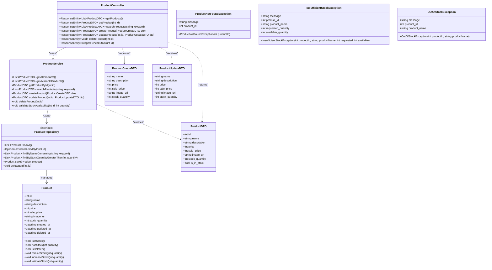
```mermaid
classDiagram
    %% 商品機能のクラス群（カテゴリー機能削除版）
    
    %% 1. Entityクラス
    class Product {
        +int id
        +string name
        +string description
        +int price
        +int sale_price
        +string image_url
        +int stock_quantity
        +datetime created_at
        +datetime updated_at
        +datetime deleted_at
        
        +bool isInStock()
        +bool hasStock(int quantity)
        +bool isDeleted()
        +void reduceStock(int quantity)
        +void increaseStock(int quantity)
        +void validateStock(int quantity)
    }
    
    %% 2. Repositoryインタフェース
    class ProductRepository {
        <<interface>>
        +List~Product~ findAll()
        +Optional~Product~ findById(int id)
        +List~Product~ findByNameContaining(string keyword)
        +List~Product~ findByStockQuantityGreaterThan(int quantity)
        +Product save(Product product)
        +void deleteById(int id)
    }
    
    %% 3. Serviceクラス
    class ProductService {
        +List~ProductDTO~ getAllProducts()
        +List~ProductDTO~ getAvailableProducts()
        +ProductDTO getProductById(int id)
        +List~ProductDTO~ searchProducts(string keyword)
        +ProductDTO createProduct(ProductCreateDTO dto)
        +ProductDTO updateProduct(int id, ProductUpdateDTO dto)
        +void deleteProduct(int id)
        +void validateStockAvailability(int id, int quantity)
    }
    
    %% 4. Controllerクラス
    class ProductController {
        +ResponseEntity~List~ProductDTO~~ getProducts()
        +ResponseEntity~ProductDTO~ getProduct(int id)
        +ResponseEntity~List~ProductDTO~~ searchProducts(string keyword)
        +ResponseEntity~ProductDTO~ createProduct(ProductCreateDTO dto)
        +ResponseEntity~ProductDTO~ updateProduct(int id, ProductUpdateDTO dto)
        +ResponseEntity~Void~ deleteProduct(int id)
        +ResponseEntity~Integer~ checkStock(int id)
    }
    
    %% 5. DTOクラス
    class ProductDTO {
        +int id
        +string name
        +string description
        +int price
        +int sale_price
        +string image_url
        +int stock_quantity
        +bool is_in_stock
    }
    
    class ProductCreateDTO {
        +string name
        +string description
        +int price
        +int sale_price
        +string image_url
        +int stock_quantity
    }
    
    class ProductUpdateDTO {
        +string name
        +string description
        +int price
        +int sale_price
        +string image_url
        +int stock_quantity
    }
    
    %% 例外クラス
    class ProductNotFoundException {
        +string message
        +int product_id
        +ProductNotFoundException(int productId)
    }
    
    class InsufficientStockException {
        +string message
        +int product_id
        +string product_name
        +int requested_quantity
        +int available_quantity
        +InsufficientStockException(int productId, string productName, int requested, int available)
    }
    
    class OutOfStockException {
        +string message
        +int product_id
        +string product_name
        +OutOfStockException(int productId, string productName)
    }
    
    %% 関係
    ProductRepository --> Product : "manages"
    ProductService --> ProductRepository : "uses"
    ProductController --> ProductService : "uses"
    ProductService ..> ProductDTO : "creates"
    ProductController ..> ProductCreateDTO : "receives"
    ProductController ..> ProductUpdateDTO : "receives"
    ProductController ..> ProductDTO : "returns"
```

## 4.2 カート機能

### カート機能のクラス図

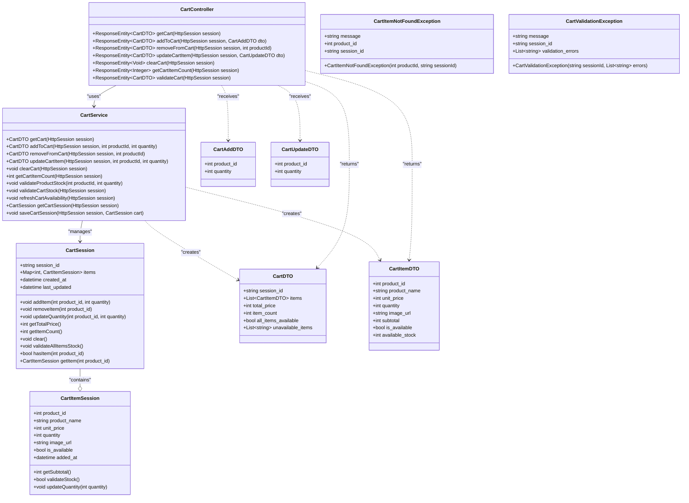
```mermaid
classDiagram
    %% カート機能のクラス群
    %% セッション管理のためRepositoryは不要
    
    %% 1. セッション管理クラス（Entity代替）
    class CartSession {
        +string session_id
        +Map~int, CartItemSession~ items
        +datetime created_at
        +datetime last_updated
        
        +void addItem(int product_id, int quantity)
        +void removeItem(int product_id)
        +void updateQuantity(int product_id, int quantity)
        +int getTotalPrice()
        +int getItemCount()
        +void clear()
        +void validateAllItemsStock()
        +bool hasItem(int product_id)
        +CartItemSession getItem(int product_id)
    }
    
    class CartItemSession {
        +int product_id
        +string product_name
        +int unit_price
        +int quantity
        +string image_url
        +bool is_available
        +datetime added_at
        
        +int getSubtotal()
        +bool validateStock()
        +void updateQuantity(int quantity)
    }
    
    %% 2. Repositoryインタフェース（セッション管理のため不要）
    %% カート情報はHttpSessionで管理するためRepositoryは不要
    
    %% 3. Serviceクラス
    class CartService {
        +CartDTO getCart(HttpSession session)
        +CartDTO addToCart(HttpSession session, int productId, int quantity)
        +CartDTO removeFromCart(HttpSession session, int productId)
        +CartDTO updateCartItem(HttpSession session, int productId, int quantity)
        +void clearCart(HttpSession session)
        +int getCartItemCount(HttpSession session)
        +void validateProductStock(int productId, int quantity)
        +void validateCartStock(HttpSession session)
        +void refreshCartAvailability(HttpSession session)
        +CartSession getCartSession(HttpSession session)
        +void saveCartSession(HttpSession session, CartSession cart)
    }
    
    %% 4. Controllerクラス
    class CartController {
        +ResponseEntity~CartDTO~ getCart(HttpSession session)
        +ResponseEntity~CartDTO~ addToCart(HttpSession session, CartAddDTO dto)
        +ResponseEntity~CartDTO~ removeFromCart(HttpSession session, int productId)
        +ResponseEntity~CartDTO~ updateCartItem(HttpSession session, CartUpdateDTO dto)
        +ResponseEntity~Void~ clearCart(HttpSession session)
        +ResponseEntity~Integer~ getCartItemCount(HttpSession session)
        +ResponseEntity~CartDTO~ validateCart(HttpSession session)
    }
    
    %% 5. DTOクラス
    class CartDTO {
        +string session_id
        +List~CartItemDTO~ items
        +int total_price
        +int item_count
        +bool all_items_available
        +List~string~ unavailable_items
    }
    
    class CartItemDTO {
        +int product_id
        +string product_name
        +int unit_price
        +int quantity
        +string image_url
        +int subtotal
        +bool is_available
        +int available_stock
    }
    
    class CartAddDTO {
        +int product_id
        +int quantity
    }
    
    class CartUpdateDTO {
        +int product_id
        +int quantity
    }
    
    %% 例外クラス
    class CartItemNotFoundException {
        +string message
        +int product_id
        +string session_id
        +CartItemNotFoundException(int productId, string sessionId)
    }
    
    class CartValidationException {
        +string message
        +string session_id
        +List~string~ validation_errors
        +CartValidationException(string sessionId, List~string~ errors)
    }
    
    %% 関係
    CartSession --o CartItemSession : "contains"
    CartService --> CartSession : "manages"
    CartController --> CartService : "uses"
    CartService ..> CartDTO : "creates"
    CartService ..> CartItemDTO : "creates"
    CartController ..> CartAddDTO : "receives"
    CartController ..> CartUpdateDTO : "receives"
    CartController ..> CartDTO : "returns"
    CartController ..> CartItemDTO : "returns"
```

## 4.3 注文・購入機能

### 注文・購入機能のクラス図（配送機能削除版）

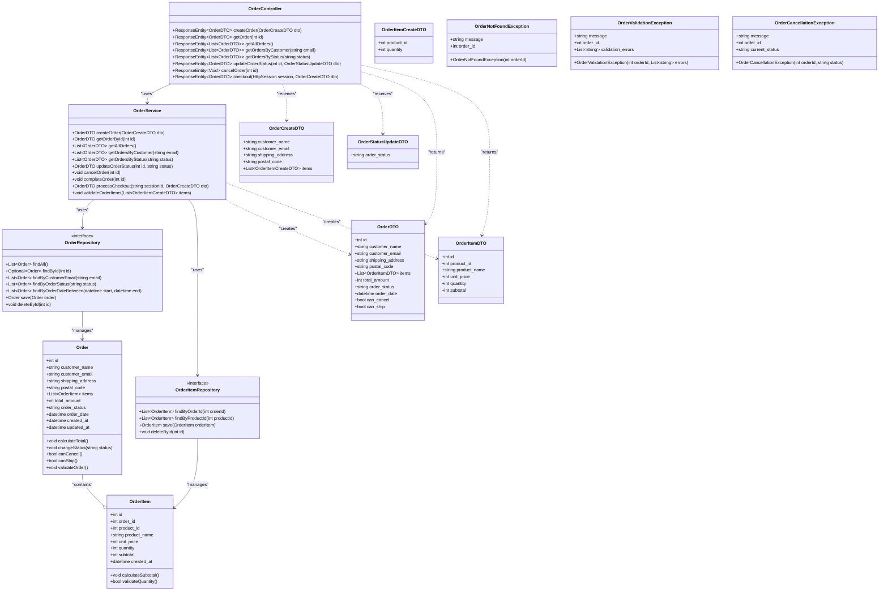
```mermaid
classDiagram
    %% 注文・購入機能のクラス群（配送機能削除版）
    
    %% 1. Entityクラス
    class Order {
        +int id
        +string customer_name
        +string customer_email
        +string shipping_address
        +string postal_code
        +List~OrderItem~ items
        +int total_amount
        +string order_status
        +datetime order_date
        +datetime created_at
        +datetime updated_at
        
        +void calculateTotal()
        +void changeStatus(string status)
        +bool canCancel()
        +bool canShip()
        +void validateOrder()
    }
    
    class OrderItem {
        +int id
        +int order_id
        +int product_id
        +string product_name
        +int unit_price
        +int quantity
        +int subtotal
        +datetime created_at
        
        +void calculateSubtotal()
        +bool validateQuantity()
    }
    
    %% 2. Repositoryインタフェース
    class OrderRepository {
        <<interface>>
        +List~Order~ findAll()
        +Optional~Order~ findById(int id)
        +List~Order~ findByCustomerEmail(string email)
        +List~Order~ findByOrderStatus(string status)
        +List~Order~ findByOrderDateBetween(datetime start, datetime end)
        +Order save(Order order)
        +void deleteById(int id)
    }
    
    class OrderItemRepository {
        <<interface>>
        +List~OrderItem~ findByOrderId(int orderId)
        +List~OrderItem~ findByProductId(int productId)
        +OrderItem save(OrderItem orderItem)
        +void deleteById(int id)
    }
    
    %% 3. Serviceクラス
    class OrderService {
        +OrderDTO createOrder(OrderCreateDTO dto)
        +OrderDTO getOrderById(int id)
        +List~OrderDTO~ getAllOrders()
        +List~OrderDTO~ getOrdersByCustomer(string email)
        +List~OrderDTO~ getOrdersByStatus(string status)
        +OrderDTO updateOrderStatus(int id, string status)
        +void cancelOrder(int id)
        +void completeOrder(int id)
        +OrderDTO processCheckout(string sessionId, OrderCreateDTO dto)
        +void validateOrderItems(List~OrderItemCreateDTO~ items)
    }
    
    %% 4. Controllerクラス
    class OrderController {
        +ResponseEntity~OrderDTO~ createOrder(OrderCreateDTO dto)
        +ResponseEntity~OrderDTO~ getOrder(int id)
        +ResponseEntity~List~OrderDTO~~ getAllOrders()
        +ResponseEntity~List~OrderDTO~~ getOrdersByCustomer(string email)
        +ResponseEntity~List~OrderDTO~~ getOrdersByStatus(string status)
        +ResponseEntity~OrderDTO~ updateOrderStatus(int id, OrderStatusUpdateDTO dto)
        +ResponseEntity~Void~ cancelOrder(int id)
        +ResponseEntity~OrderDTO~ checkout(HttpSession session, OrderCreateDTO dto)
    }
    
    %% 5. DTOクラス
    class OrderDTO {
        +int id
        +string customer_name
        +string customer_email
        +string shipping_address
        +string postal_code
        +List~OrderItemDTO~ items
        +int total_amount
        +string order_status
        +datetime order_date
        +bool can_cancel
        +bool can_ship
    }
    
    class OrderCreateDTO {
        +string customer_name
        +string customer_email
        +string shipping_address
        +string postal_code
        +List~OrderItemCreateDTO~ items
    }
    
    class OrderItemDTO {
        +int id
        +int product_id
        +string product_name
        +int unit_price
        +int quantity
        +int subtotal
    }
    
    class OrderItemCreateDTO {
        +int product_id
        +int quantity
    }
    
    class OrderStatusUpdateDTO {
        +string order_status
    }
    
    %% 例外クラス
    class OrderNotFoundException {
        +string message
        +int order_id
        +OrderNotFoundException(int orderId)
    }
    
    class OrderValidationException {
        +string message
        +int order_id
        +List~string~ validation_errors
        +OrderValidationException(int orderId, List~string~ errors)
    }
    
    class OrderCancellationException {
        +string message
        +int order_id
        +string current_status
        +OrderCancellationException(int orderId, string status)
    }
    
    %% 関係
    Order --o OrderItem : "contains"
    OrderRepository --> Order : "manages"
    OrderItemRepository --> OrderItem : "manages"
    OrderService --> OrderRepository : "uses"
    OrderService --> OrderItemRepository : "uses"
    OrderController --> OrderService : "uses"
    OrderService ..> OrderDTO : "creates"
    OrderService ..> OrderItemDTO : "creates"
    OrderController ..> OrderCreateDTO : "receives"
    OrderController ..> OrderStatusUpdateDTO : "receives"
    OrderController ..> OrderDTO : "returns"
    OrderController ..> OrderItemDTO : "returns"
```

## 4.4 管理者認証機能

### 管理者認証機能のクラス図


```mermaid
classDiagram
    %% 管理者認証機能のクラス群
    
    %% 1. Entityクラス
    class Admin {
        +int id
        +string username
        +string password
        +string email
        +string role
        +bool is_active
        +datetime last_login
        +datetime created_at
        +datetime updated_at
        
        +bool isActive()
        +void activate()
        +void deactivate()
        +void updateLastLogin()
        +bool hasRole(string role)
        +void changePassword(string newPassword)
    }
    
    class AdminSession {
        +string session_id
        +int admin_id
        +string admin_username
        +string role
        +datetime login_time
        +datetime expires_at
        +bool is_active
        
        +bool isExpired()
        +void extend()
        +void invalidate()
        +bool hasPermission(string permission)
    }
    
    %% 2. Repositoryインタフェース
    class AdminRepository {
        <<interface>>
        +List~Admin~ findAll()
        +Optional~Admin~ findById(int id)
        +Optional~Admin~ findByUsername(string username)
        +Optional~Admin~ findByEmail(string email)
        +List~Admin~ findByIsActiveTrue()
        +List~Admin~ findByRole(string role)
        +Admin save(Admin admin)
        +void deleteById(int id)
    }
    
    class AdminSessionRepository {
        <<interface>>
        +Optional~AdminSession~ findBySessionId(string sessionId)
        +List~AdminSession~ findByAdminId(int adminId)
        +List~AdminSession~ findByIsActiveTrue()
        +AdminSession save(AdminSession session)
        +void deleteById(string sessionId)
        +void deleteByAdminId(int adminId)
    }
    
    %% 3. Serviceクラス
    class AdminAuthService {
        +AdminSessionDTO login(AdminLoginDTO dto)
        +void logout(string sessionId)
        +AdminSessionDTO validateSession(string sessionId)
        +AdminSessionDTO refreshSession(string sessionId)
        +AdminDTO getCurrentAdmin(string sessionId)
        +bool hasPermission(string sessionId, string permission)
        +void changePassword(string sessionId, AdminPasswordChangeDTO dto)
        +void invalidateAllSessions(int adminId)
    }
    
    class AdminService {
        +List~AdminDTO~ getAllAdmins()
        +AdminDTO getAdminById(int id)
        +AdminDTO createAdmin(AdminCreateDTO dto)
        +AdminDTO updateAdmin(int id, AdminUpdateDTO dto)
        +void deleteAdmin(int id)
        +void activateAdmin(int id)
        +void deactivateAdmin(int id)
        +void resetPassword(int id, string newPassword)
    }
    
    %% 4. Controllerクラス
    class AdminAuthController {
        +ResponseEntity~AdminSessionDTO~ login(AdminLoginDTO dto)
        +ResponseEntity~Void~ logout(HttpSession session)
        +ResponseEntity~AdminSessionDTO~ validateSession(HttpSession session)
        +ResponseEntity~AdminDTO~ getCurrentAdmin(HttpSession session)
        +ResponseEntity~Void~ changePassword(HttpSession session, AdminPasswordChangeDTO dto)
        +ResponseEntity~Void~ invalidateAllSessions(HttpSession session)
    }
    
    class AdminController {
        +ResponseEntity~List~AdminDTO~~ getAllAdmins()
        +ResponseEntity~AdminDTO~ getAdmin(int id)
        +ResponseEntity~AdminDTO~ createAdmin(AdminCreateDTO dto)
        +ResponseEntity~AdminDTO~ updateAdmin(int id, AdminUpdateDTO dto)
        +ResponseEntity~Void~ deleteAdmin(int id)
        +ResponseEntity~Void~ activateAdmin(int id)
        +ResponseEntity~Void~ deactivateAdmin(int id)
        +ResponseEntity~Void~ resetPassword(int id, AdminPasswordResetDTO dto)
    }
    
    %% 5. DTOクラス
    class AdminDTO {
        +int id
        +string username
        +string email
        +string role
        +bool is_active
        +datetime last_login
        +datetime created_at
        +datetime updated_at
    }
    
    class AdminCreateDTO {
        +string username
        +string password
        +string email
        +string role
    }
    
    class AdminUpdateDTO {
        +string username
        +string email
        +string role
        +bool is_active
    }
    
    class AdminLoginDTO {
        +string username
        +string password
    }
    
    class AdminSessionDTO {
        +string session_id
        +int admin_id
        +string admin_username
        +string role
        +datetime login_time
        +datetime expires_at
        +bool is_active
    }
    
    class AdminPasswordChangeDTO {
        +string current_password
        +string new_password
    }
    
    class AdminPasswordResetDTO {
        +string new_password
    }
    
    %% 例外クラス
    class AdminNotFoundException {
        +string message
        +int admin_id
        +AdminNotFoundException(int adminId)
    }
    
    class AdminAuthenticationException {
        +string message
        +string username
        +AdminAuthenticationException(string username)
    }
    
    class AdminSessionExpiredException {
        +string message
        +string session_id
        +AdminSessionExpiredException(string sessionId)
    }
    
    class AdminPermissionDeniedException {
        +string message
        +string session_id
        +string required_permission
        +AdminPermissionDeniedException(string sessionId, string permission)
    }
    
    %% 関係
    Admin --o AdminSession : "has sessions"
    AdminRepository --> Admin : "manages"
    AdminSessionRepository --> AdminSession : "manages"
    AdminAuthService --> AdminRepository : "uses"
    AdminAuthService --> AdminSessionRepository : "uses"
    AdminService --> AdminRepository : "uses"
    AdminAuthController --> AdminAuthService : "uses"
    AdminController --> AdminService : "uses"
    AdminAuthService ..> AdminSessionDTO : "creates"
    AdminService ..> AdminDTO : "creates"
    AdminAuthController ..> AdminLoginDTO : "receives"
    AdminAuthController ..> AdminPasswordChangeDTO : "receives"
    AdminController ..> AdminCreateDTO : "receives"
    AdminController ..> AdminUpdateDTO : "receives"
    AdminController ..> AdminPasswordResetDTO : "receives"
    AdminAuthController ..> AdminSessionDTO : "returns"
    AdminAuthController ..> AdminDTO : "returns"
    AdminController ..> AdminDTO : "returns"
```

## 4.5 問い合わせ機能

### 問い合わせ機能のクラス図

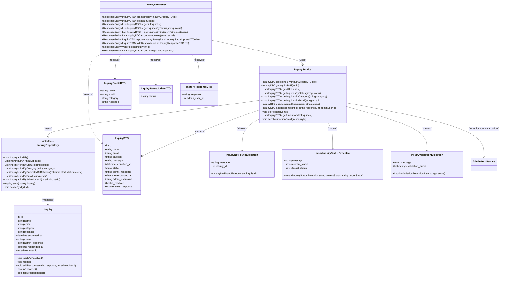
```mermaid
classDiagram
    %% 問い合わせ機能のクラス群
    
    %% 1. Entityクラス
    class Inquiry {
        +int id
        +string name
        +string email
        +string category
        +string message
        +datetime submitted_at
        +string status
        +string admin_response
        +datetime responded_at
        +int admin_user_id
        
        +void markAsResolved()
        +void reopen()
        +void addResponse(string response, int adminUserId)
        +bool isResolved()
        +bool requiresResponse()
    }
    
    %% 2. Repositoryインタフェース
    class InquiryRepository {
        <<interface>>
        +List~Inquiry~ findAll()
        +Optional~Inquiry~ findById(int id)
        +List~Inquiry~ findByStatus(string status)
        +List~Inquiry~ findByCategory(string category)
        +List~Inquiry~ findBySubmittedAtBetween(datetime start, datetime end)
        +List~Inquiry~ findByEmail(string email)
        +List~Inquiry~ findByAdminUserId(int adminUserId)
        +Inquiry save(Inquiry inquiry)
        +void deleteById(int id)
    }
    
    %% 3. Serviceクラス
    class InquiryService {
        +InquiryDTO createInquiry(InquiryCreateDTO dto)
        +InquiryDTO getInquiryById(int id)
        +List~InquiryDTO~ getAllInquiries()
        +List~InquiryDTO~ getInquiriesByStatus(string status)
        +List~InquiryDTO~ getInquiriesByCategory(string category)
        +List~InquiryDTO~ getInquiriesByEmail(string email)
        +InquiryDTO updateInquiryStatus(int id, string status)
        +InquiryDTO addResponse(int id, string response, int adminUserId)
        +void deleteInquiry(int id)
        +List~InquiryDTO~ getUnrespondedInquiries()
        +void sendNotificationEmail(int inquiryId)
    }
    
    %% 4. Controllerクラス
    class InquiryController {
        +ResponseEntity~InquiryDTO~ createInquiry(InquiryCreateDTO dto)
        +ResponseEntity~InquiryDTO~ getInquiry(int id)
        +ResponseEntity~List~InquiryDTO~~ getAllInquiries()
        +ResponseEntity~List~InquiryDTO~~ getInquiriesByStatus(string status)
        +ResponseEntity~List~InquiryDTO~~ getInquiriesByCategory(string category)
        +ResponseEntity~List~InquiryDTO~~ getMyInquiries(string email)
        +ResponseEntity~InquiryDTO~ updateInquiryStatus(int id, InquiryStatusUpdateDTO dto)
        +ResponseEntity~InquiryDTO~ addResponse(int id, InquiryResponseDTO dto)
        +ResponseEntity~Void~ deleteInquiry(int id)
        +ResponseEntity~List~InquiryDTO~~ getUnrespondedInquiries()
    }
    
    %% 5. DTOクラス
    class InquiryDTO {
        +int id
        +string name
        +string email
        +string category
        +string message
        +datetime submitted_at
        +string status
        +string admin_response
        +datetime responded_at
        +string admin_username
        +bool is_resolved
        +bool requires_response
    }
    
    class InquiryCreateDTO {
        +string name
        +string email
        +string category
        +string message
    }
    
    class InquiryStatusUpdateDTO {
        +string status
    }
    
    class InquiryResponseDTO {
        +string response
        +int admin_user_id
    }
    
    %% 例外クラス
    class InquiryNotFoundException {
        +string message
        +int inquiry_id
        +InquiryNotFoundException(int inquiryId)
    }
    
    class InvalidInquiryStatusException {
        +string message
        +string current_status
        +string target_status
        +InvalidInquiryStatusException(string currentStatus, string targetStatus)
    }
    
    class InquiryValidationException {
        +string message
        +List~string~ validation_errors
        +InquiryValidationException(List~string~ errors)
    }
    
    %% 関係
    InquiryRepository --> Inquiry : "manages"
    InquiryService --> InquiryRepository : "uses"
    InquiryController --> InquiryService : "uses"
    InquiryService --> InquiryDTO : "creates"
    InquiryController --> InquiryCreateDTO : "receives"
    InquiryController --> InquiryStatusUpdateDTO : "receives"
    InquiryController --> InquiryResponseDTO : "receives"
    InquiryController ..> InquiryDTO : "returns"
    
    %% 例外関係
    InquiryService --> InquiryNotFoundException : "throws"
    InquiryService --> InvalidInquiryStatusException : "throws"
    InquiryService --> InquiryValidationException : "throws"
    
    %% 外部依存
    InquiryService --> AdminAuthService : "uses for admin validation"
```
# 4.6 ECサイト主要パッケージ構成

## 全体パッケージ構成

```
com.example.ecommerce
├── EcommerceApplication.java              # Spring Boot メインクラス
├── config/                                # 設定クラス
│   ├── SecurityConfig.java
│   ├── SessionConfig.java
│   └── WebConfig.java
├── product/                               # 商品機能
│   ├── entity/
│   │   └── Product.java
│   ├── repository/
│   │   └── ProductRepository.java
│   ├── service/
│   │   └── ProductService.java
│   ├── controller/
│   │   └── ProductController.java
│   ├── dto/
│   │   ├── ProductDTO.java
│   │   ├── ProductCreateDTO.java
│   │   └── ProductUpdateDTO.java
│   └── exception/
│       ├── ProductNotFoundException.java
│       ├── InsufficientStockException.java
│       └── OutOfStockException.java
├── cart/                                  # カート機能
│   ├── session/
│   │   ├── CartSession.java
│   │   └── CartItemSession.java
│   ├── service/
│   │   └── CartService.java
│   ├── controller/
│   │   └── CartController.java
│   ├── dto/
│   │   ├── CartDTO.java
│   │   ├── CartItemDTO.java
│   │   ├── CartAddDTO.java
│   │   └── CartUpdateDTO.java
│   └── exception/
│       ├── CartItemNotFoundException.java
│       └── CartValidationException.java
├── order/                                 # 注文・購入機能
│   ├── entity/
│   │   ├── Order.java
│   │   └── OrderItem.java
│   ├── repository/
│   │   ├── OrderRepository.java
│   │   └── OrderItemRepository.java
│   ├── service/
│   │   └── OrderService.java
│   ├── controller/
│   │   └── OrderController.java
│   ├── dto/
│   │   ├── OrderDTO.java
│   │   ├── OrderCreateDTO.java
│   │   ├── OrderItemDTO.java
│   │   ├── OrderItemCreateDTO.java
│   │   └── OrderStatusUpdateDTO.java
│   └── exception/
│       ├── OrderNotFoundException.java
│       ├── OrderValidationException.java
│       └── OrderCancellationException.java
├── admin/                                 # 管理者機能
│   ├── entity/
│   │   ├── Admin.java
│   │   └── AdminSession.java
│   ├── repository/
│   │   ├── AdminRepository.java
│   │   └── AdminSessionRepository.java
│   ├── service/
│   │   ├── AdminService.java
│   │   └── AdminAuthService.java
│   ├── controller/
│   │   ├── AdminController.java
│   │   └── AdminAuthController.java
│   ├── dto/
│   │   ├── AdminDTO.java
│   │   ├── AdminCreateDTO.java
│   │   ├── AdminUpdateDTO.java
│   │   ├── AdminLoginDTO.java
│   │   ├── AdminSessionDTO.java
│   │   ├── AdminPasswordChangeDTO.java
│   │   └── AdminPasswordResetDTO.java
│   └── exception/
│       ├── AdminNotFoundException.java
│       ├── AdminAuthenticationException.java
│       ├── AdminSessionExpiredException.java
│       └── AdminPermissionDeniedException.java
├── inquiry/                               # 問い合わせ機能
│   ├── entity/
│   │   └── Inquiry.java
│   ├── repository/
│   │   └── InquiryRepository.java
│   ├── service/
│   │   └── InquiryService.java
│   ├── controller/
│   │   └── InquiryController.java
│   ├── dto/
│   │   ├── InquiryDTO.java
│   │   ├── InquiryCreateDTO.java
│   │   ├── InquiryStatusUpdateDTO.java
│   │   └── InquiryResponseDTO.java
│   └── exception/
│       ├── InquiryNotFoundException.java
│       ├── InvalidInquiryStatusException.java
│       └── InquiryValidationException.java
├── common/                                # 共通機能
│   ├── exception/
│   │   ├── GlobalExceptionHandler.java
│   │   └── BaseException.java
│   ├── util/
│   │   ├── SecurityUtils.java
│   │   ├── DateUtils.java
│   │   └── ValidationUtils.java
│   ├── response/
│   │   ├── ApiResponse.java
│   │   └── ErrorResponse.java
│   └── constants/
│       ├── ErrorConstants.java
│       └── ApplicationConstants.java
└── resources/
    ├── application.yml
    ├── application-dev.yml
    ├── application-prod.yml
    └── static/
        ├── css/
        ├── js/
        └── images/
```

# 4.7 クラス図の属性と振る舞い説明

## 4.7.1 商品機能

### Productクラス
**属性**
- `id`: 商品の一意識別子
- `name`: 商品名
- `description`: 商品説明
- `price`: 通常価格
- `sale_price`: セール価格
- `image_url`: 商品画像のURL
- `stock_quantity`: 在庫数量
- `created_at`: 作成日時
- `updated_at`: 更新日時
- `deleted_at`: 削除日時

**振る舞い**
- `isInStock()`: 在庫があるかどうかを判定
- `hasStock(quantity)`: 指定数量の在庫があるかを確認
- `isDeleted()`: 削除フラグの有無を判定
- `reduceStock(quantity)`: 在庫を減らす
- `increaseStock(quantity)`: 在庫を増やす
- `validateStock(quantity)`: 在庫の妥当性を検証

### ProductServiceクラス
**主要な振る舞い**
- `getAllProducts()`: 全商品を取得
- `getAvailableProducts()`: 在庫のある商品を取得
- `getProductById(id)`: 商品IDで商品を取得
- `searchProducts(keyword)`: キーワードで商品を検索
- `createProduct(dto)`: 新しい商品を作成
- `updateProduct(id, dto)`: 商品情報を更新
- `deleteProduct(id)`: 商品を論理的に削除
- `validateStockAvailability(id, quantity)`: 在庫の利用可能性を検証

## 4.7.2 カート機能

### CartSessionクラス
**属性**
- `session_id`: セッションID
- `items`: カートアイテムのマップ
- `created_at`: 作成日時
- `last_updated`: 最終更新日時

**振る舞い**
- `addItem(product_id, quantity)`: 商品をカートに追加
- `removeItem(product_id)`: 商品をカートから削除
- `updateQuantity(product_id, quantity)`: 商品の数量を更新
- `getTotalPrice()`: 合計金額を計算
- `getItemCount()`: カート内のアイテム数を取得
- `clear()`: カートを空にする
- `validateAllItemsStock()`: 全アイテムの在庫を検証
- `hasItem(product_id)`: 指定商品がカートにあるかを確認

### CartItemSessionクラス
**属性**
- `product_id`: 商品ID
- `product_name`: 商品名
- `unit_price`: 単価
- `quantity`: 数量
- `image_url`: 商品画像URL
- `is_available`: 利用可能かどうか
- `added_at`: 追加日時

**振る舞い**
- `getSubtotal()`: 小計を計算
- `validateStock()`: 在庫を検証
- `updateQuantity(quantity)`: 数量を更新

### CartServiceクラス
**主要な振る舞い**
- `getCart(session)`: カート情報を取得
- `addToCart(session, productId, quantity)`: カートに商品を追加
- `removeFromCart(session, productId)`: カートから商品を削除
- `updateCartItem(session, productId, quantity)`: カートアイテムを更新
- `clearCart(session)`: カートをクリア
- `getCartItemCount(session)`: カート内のアイテム数を取得
- `validateProductStock(productId, quantity)`: 商品在庫を検証
- `validateCartStock(session)`: カート全体の在庫を検証

## 4.7.3 注文・購入機能

### Orderクラス
**属性**
- `id`: 注文ID
- `customer_name`: 顧客名
- `customer_email`: 顧客メールアドレス
- `shipping_address`: 配送先住所
- `postal_code`: 郵便番号
- `items`: 注文アイテムのリスト
- `total_amount`: 合計金額
- `order_status`: 注文ステータス
- `order_date`: 注文日
- `created_at`: 作成日時
- `updated_at`: 更新日時

**振る舞い**
- `calculateTotal()`: 合計金額を計算
- `changeStatus(status)`: ステータスを変更
- `canCancel()`: キャンセル可能かどうかを判定
- `canShip()`: 発送可能かどうかを判定
- `validateOrder()`: 注文の妥当性を検証

### OrderItemクラス
**属性**
- `id`: 注文アイテムID
- `order_id`: 注文ID
- `product_id`: 商品ID
- `product_name`: 商品名
- `unit_price`: 単価
- `quantity`: 数量
- `subtotal`: 小計
- `created_at`: 作成日時

**振る舞い**
- `calculateSubtotal()`: 小計を計算
- `validateQuantity()`: 数量の妥当性を検証

### OrderServiceクラス
**主要な振る舞い**
- `createOrder(dto)`: 注文を作成
- `getOrderById(id)`: 注文IDで注文を取得
- `getAllOrders()`: 全注文を取得
- `getOrdersByCustomer(email)`: 顧客の注文を取得
- `getOrdersByStatus(status)`: ステータス別の注文を取得
- `updateOrderStatus(id, status)`: 注文ステータスを更新
- `cancelOrder(id)`: 注文をキャンセル
- `completeOrder(id)`: 注文を完了
- `processCheckout(sessionId, dto)`: チェックアウトを処理
- `validateOrderItems(items)`: 注文アイテムを検証

## 4.7.4 管理者認証機能

### Adminクラス
**属性**
- `id`: 管理者ID
- `username`: ユーザー名
- `password`: パスワード
- `email`: メールアドレス
- `role`: 権限
- `is_active`: アクティブ状態
- `last_login`: 最終ログイン日時
- `created_at`: 作成日時
- `updated_at`: 更新日時

**振る舞い**
- `isActive()`: アクティブ状態を確認
- `activate()`: アクティブ化
- `deactivate()`: 非アクティブ化
- `updateLastLogin()`: 最終ログイン日時を更新
- `hasRole(role)`: 指定権限を持つかを確認
- `changePassword(newPassword)`: パスワードを変更

### AdminSessionクラス
**属性**
- `session_id`: セッションID
- `admin_id`: 管理者ID
- `admin_username`: 管理者ユーザー名
- `role`: 権限
- `login_time`: ログイン時刻
- `expires_at`: 有効期限
- `is_active`: アクティブ状態

**振る舞い**
- `isExpired()`: セッションが期限切れかを確認
- `extend()`: セッションを延長
- `invalidate()`: セッションを無効化
- `hasPermission(permission)`: 指定権限を持つかを確認

### AdminAuthServiceクラス
**主要な振る舞い**
- `login(dto)`: ログイン処理
- `logout(sessionId)`: ログアウト処理
- `validateSession(sessionId)`: セッションを検証
- `refreshSession(sessionId)`: セッションを更新
- `getCurrentAdmin(sessionId)`: 現在の管理者を取得
- `hasPermission(sessionId, permission)`: 権限を確認
- `changePassword(sessionId, dto)`: パスワードを変更
- `invalidateAllSessions(adminId)`: 全セッションを無効化

## 4.7.5 問い合わせ機能

### Inquiryクラス
**属性**
- `id`: 問い合わせID
- `name`: 問い合わせ者名
- `email`: メールアドレス
- `category`: カテゴリ
- `message`: 問い合わせ内容
- `submitted_at`: 送信日時
- `status`: ステータス
- `admin_response`: 管理者からの回答
- `responded_at`: 回答日時
- `admin_user_id`: 回答した管理者のID

**振る舞い**
- `markAsResolved()`: 解決済みにマーク
- `reopen()`: 再オープン
- `addResponse(response, adminUserId)`: 回答を追加
- `isResolved()`: 解決済みかを確認
- `requiresResponse()`: 回答が必要かを確認

### InquiryServiceクラス
**主要な振る舞い**
- `createInquiry(dto)`: 問い合わせを作成
- `getInquiryById(id)`: 問い合わせIDで取得
- `getAllInquiries()`: 全問い合わせを取得
- `getInquiriesByStatus(status)`: ステータス別の問い合わせを取得
- `getInquiriesByCategory(category)`: カテゴリ別の問い合わせを取得
- `getInquiriesByEmail(email)`: メールアドレス別の問い合わせを取得
- `updateInquiryStatus(id, status)`: 問い合わせステータスを更新
- `addResponse(id, response, adminUserId)`: 回答を追加
- `deleteInquiry(id)`: 問い合わせを削除
- `getUnrespondedInquiries()`: 未回答の問い合わせを取得
- `sendNotificationEmail(inquiryId)`: 通知メールを送信

## 4.8 共通パターン

### DTOクラス
- データ転送オブジェクト（Data Transfer Object）
- 各機能に対応したCreateDTO、UpdateDTO、ResponseDTOが存在
- UIとビジネスロジック間のデータ転送に使用

### 例外クラス
- 各機能に特化した例外クラス
- `NotFoundException`: リソースが見つからない場合
- `ValidationException`: バリデーションエラー
- `AuthenticationException`: 認証エラー
- `PermissionDeniedException`: 権限エラー

### Repositoryインターフェース
- データアクセス層の抽象化
- 基本的なCRUD操作
- 検索条件に応じたfindメソッド

### Serviceクラス
- ビジネスロジックの実装
- Repositoryを使用してデータアクセス
- DTOとEntityの変換
- バリデーション処理

### Controllerクラス
- HTTPリクエストの処理
- Serviceクラスの呼び出し
- レスポンスの返却
- 例外処理


## 4.9 各パッケージの詳細説明

### 4.9.1 config/ - 設定クラス
Spring Bootの設定クラスを格納
- **SecurityConfig.java**: セキュリティ設定（認証・認可）
- **SessionConfig.java**: セッション管理設定
- **WebConfig.java**: Web関連の設定（CORS、メッセージコンバーター等）

### 4.9.2 product/ - 商品機能
商品管理に関する全ての機能を格納
- **entity/**: 商品エンティティ
- **repository/**: データアクセス層
- **service/**: ビジネスロジック層
- **controller/**: REST API エンドポイント
- **dto/**: データ転送オブジェクト
- **exception/**: 商品機能固有の例外クラス

### 4.9.3 cart/ - カート機能
ショッピングカート機能を格納
- **session/**: セッション管理クラス（Repository不要のため）
- **service/**: カート操作のビジネスロジック
- **controller/**: カート操作のAPI
- **dto/**: カート関連のDTO
- **exception/**: カート機能固有の例外

### 4.9.4 order/ - 注文・購入機能
注文処理に関する機能を格納
- **entity/**: 注文・注文項目エンティティ
- **repository/**: 注文データアクセス
- **service/**: 注文処理ロジック
- **controller/**: 注文関連API
- **dto/**: 注文関連DTO
- **exception/**: 注文機能固有の例外

### 4.9.5 admin/ - 管理者機能
管理者認証・管理機能を格納
- **entity/**: 管理者エンティティ
- **repository/**: 管理者データアクセス
- **service/**: 管理者機能・認証ロジック
- **controller/**: 管理者用API
- **dto/**: 管理者関連DTO
- **exception/**: 管理者機能固有の例外

### 4.9.6 inquiry/ - 問い合わせ機能
問い合わせ処理機能を格納
- **entity/**: 問い合わせエンティティ
- **repository/**: 問い合わせデータアクセス
- **service/**: 問い合わせ処理ロジック
- **controller/**: 問い合わせAPI
- **dto/**: 問い合わせ関連DTO
- **exception/**: 問い合わせ機能固有の例外

### 4.9.7 common/ - 共通機能
全機能で共通して使用する機能を格納
- **exception/**: 全体的な例外ハンドリング
- **util/**: ユーティリティクラス
- **response/**: API レスポンス用の共通クラス
- **constants/**: 定数クラス

## 4.10 パッケージ設計の特徴

### 4.10.1 機能別パッケージ構成
- 各機能（product、cart、order、admin、inquiry）を独立したパッケージとして分離
- 機能間の依存関係を明確化
- 保守性と拡張性の向上

### 4.10.2 レイヤー別サブパッケージ
- 各機能内でMVCアーキテクチャに基づいたレイヤー分割
- entity/repository/service/controller/dto/exception の構成

### 4.10.3 共通機能の分離
- 複数機能で使用する共通機能を common パッケージに集約
- 重複コードの削減と一貫性の保持

### 4.10.4 例外の機能別分離
- 各機能固有の例外クラスを機能パッケージ内に配置
- 共通例外処理は common/exception に配置


# 5. インターフェース仕様
# 5.1 API一覧

**API間データ連携仕様**

| No. | 画面イベント                          | 画面ID | API名                         | メソッド | 送信データ（リクエスト）                                                                                         | 受信データ（レスポンス）                                                                         | 次の処理                             |
|-----|----------------------------------------|--------|---------------------------------|----------|-------------------------------------------------------------------------------------------------------------------|---------------------------------------------------------------------------------------------------|--------------------------------------|
| 1   | トップページ表示                       | F01    | GET /api/top-page             | GET      | なし                                                                                                              | カテゴリ一覧・新着商品（任意）・バナー（任意）                                                                                     | 商品カテゴリ一覧・新着商品（任意）・バナー（任意）を画面に表示               |
| 2   | 商品一覧ページ表示                     | F02    | GET /api/products               | GET      | category_id                                                                                                       | 商品一覧                                                                                         | 商品リストを表示                     |
| 3   | 商品詳細ページ表示                     | F03    | GET /api/products/{product_id}  | GET      | product_id                                                                                                        | 商品詳細情報                                                                                     | 商品詳細を表示                       |
| 4   | カートに商品追加                       | F03    | POST /api/cart/add              | POST     | { product_id, quantity }                                                                                          | { success: true, cart_items }                                                                    | カートページに反映して表示                   |
| 5   | カートページ表示                       | F04    | GET /api/cart                  | GET      | session_id or user_id                                                                                       | 現在のカート情報                                                                                 | カート一覧を表示                     |
| 6   | カート商品数量変更                     | F04    | PUT /api/cart/update           | PUT     | { cart_item_id, quantity }                                                                                        | { success: true, updated_cart }                                                                  | 画面更新                             |
| 7   | カート商品削除                         | F04    | DELETE /api/cart           | DELETE     | { cart_item_id }                                                                                                  | { success: true, updated_cart }                                                                 | 画面更新                             |
| 8   | 購入手続きページ表示                   | F05    | POST /api/cart/checkout         | POST     | session_id or user_id                                                                                       | 購入予定カート情報                                                                               | 購入フォームを表示                     |
| 9  | 注文確認画面表示                       | F06    | POST /api/orders/preview        | POST     | { shipping_address, payment_method, cart_items }                                                                  | 計算結果（合計金額等）                                                               | 確認画面を表示                         |
| 10  | 注文確定                               | F06    | POST /api/orders                | POST     | { customer_info, shipping_address, payment_method, cart_items }                                                   | { order_id, order_number, payment_status }                                                       | 購入完了ページへ遷移                     |
| 11  | 注文完了ページ表示                     | F07    | GET /api/orders/{order_id}      | GET      | order_id                                                                                                          | 注文情報                                                                                         | 注文完了画面を表示                     |
| 12  | お問い合わせ送信                       | F12    | POST /api/inquiries             | POST     | { name, email, message }                                                                                          | { success: true }                                                                                | 送信完了メッセージを表示               |
| 13  | 管理者ログイン                         | A01    | POST /api/admin/login           | POST     | { username, password }                                                                                           | { token, role }                                                                                  | 管理ダッシュボードへ遷移                   |
| 14  | ダッシュボード表示                     | A02    | GET /api/admin/dashboard        | GET      | Authorization Header                                                                                            | 各種サマリー情報                                                                                 | ダッシュボードを表示                   |
| 15  | 商品一覧取得                           | A03    | GET /api/admin/products         | GET      | { search_keyword, category_id, page }                                                                            | 商品一覧データ                                                                                   | 一覧表示                             |
| 16  | 商品登録                               | A04    | POST /api/admin/products        | POST     | { name, description, price, category_id, image_url, stock_quantity }                                              | { success: true, product_id }                                                                    | 画面一覧ページへ遷移                     |
| 17  | 商品編集                               | A04    | PUT /api/admin/products/{product_id}    | PUT      | { name, description, price, category_id, image_url, stock_quantity }                                              | { success: true }                                                                                | 更新後リストへ戻る                   |
| 18  | 注文一覧取得                           | A05    | GET /api/admin/orders           | GET      | { search_keyword, status, page }                                                                                 | 注文一覧データ                                                                                   | 一覧表示                             |
| 19  | 注文詳細取得                           | A05    | GET /api/admin/orders/{order_id}      | GET      | order_id                                                                                                          | 注文詳細                                                                                         | 詳細表示                             |
| 20  | 注文ステータス更新                     | A05    | PUT /api/admin/orders/{order_id}      | PUT      | { status, payment_status }                                                                                       | { success: true }                                                                                | 更新結果を反映して表示                           |
| 21  | 在庫一覧取得                           | A06    | GET /api/admin/inventory        | GET      | なし                                                                                                              | 商品ごとの在庫一覧                                                                               | 表示                                 |
| 22  | 在庫一括更新                           | A06    | POST /api/admin/inventory/update| POST     | [{ product_id, stock_quantity }]                                                                                  | { success: true }                                                                                | 更新反映                             |
| 23  | CSVデータダウンロード                   | A07    | GET /api/admin/export/orders    | GET      | { date_range, status }                                                                                           | CSVファイルURL                                                                                   | ダウンロード                         |
| 24  | CSVデータアップロード                   | A07    | POST /api/admin/import/products | POST     | CSVファイル                                                                                                       | { success: true }                                                                                | 結果確認                             |
| 25  | お問い合わせ一覧取得                   | A08    | GET /api/admin/inquiries         | GET      | { page, status }                                                                                                 | お問い合わせ一覧                                                                               | 表示                                 |
| 26  | お問い合わせ詳細取得                   | A08    | GET /api/admin/inquiries/{inquiry_id}    | GET      | inquiry_id                                                                                                        | 問い合わせ詳細                                                                                   | 表示                                 |
| 27  | 管理者一覧取得                         | A09    | GET /api/admin/users            | GET      | なし                                                                                                              | 管理者ユーザー一覧                                                                               | 表示                                 |
| 28  | 管理者登録・編集                       | A09    | POST /api/admin/users           | POST     | { username, password, role }                                                                                     | { success: true, admin_user_id }                                                                 | 更新後表示                           |
| 29  | エラーログ一覧取得                     | A10    | GET /api/admin/error-logs       | GET      | { date_range, level }                                                                                            | エラーログ一覧                                                                                   | 表示                                 |

# 5.2 API詳細（＆インデックス一覧）

### 5.2.1 トップページ表示

#### `GET /api/top-page`

・レスポンス（200 OK）スキーマ

```json
{
  "$schema": "http://json-schema.org/draft-07/schema#",
  "title": "TopPageResponse",
  "type": "object",
  "properties": {
    "new_arrivals": {
      "type": "array",
      "items": { "$ref": "#/definitions/ProductSummary" }
    },
    "banners": {
      "type": "array",
      "items": {
        "type": "object",
        "properties": {
          "image_url": { "type": "string", "format": "uri" },
          "link":     { "type": "string", "format": "uri" }
        },
        "required": ["image_url"]
      }
    }
  },

  "definitions": {
    "ProductSummary": {
      "type": "object",
      "properties": {
        "product_id": { "type": "integer" },
        "name":       { "type": "string" },
        "price":      { "type": "number" },
        "image_url":  { "type": "string", "format": "uri" }
      },
      "required": ["product_id","name","price","image_url"]
    }
  }
}
```

---

### 5.2.2 商品一覧ページ表示（商品一覧取得）

#### `GET /api/products`

・リクエスト（クエリパラメータ）


・レスポンス（200 OK）スキーマ

```json
{
  "$schema": "http://json-schema.org/draft-07/schema#",
  "title":  "ProductListResponse",
  "type": "object",
  "properties": {
    "products": {
      "type": "array",
      "items": {
        "type": "object",
        "properties": {
          "product_id": { "type": "integer" },
          "name":      { "type": "string" },
          "price":     { "type": "number" },
          "image_url":  { "type": "string", "format": "uri" }
        },
        "required": ["product_id","name","price","image_url"]
      }
    }
  },
  "required": ["products"]
}
```

---

### 5.2.3 商品詳細ページ表示（商品詳細取得）

#### `GET /api/products/{product_id}`

・レスポンス（200 OK）スキーマ

```json
{
  "$schema": "http://json-schema.org/draft-07/schema#",
  "title": "ProductDetailResponse",
  "type": "object",
  "properties": {
    "product": {
      "type": "object",
      "properties": {
        "product_id":     { "type": "integer" },
        "name":          { "type": "string" },
        "description":   { "type": "string" },
        "price":         { "type": "number" },
        "stock":         { "type": "integer" },
        "image_url":      { "type": "string", "format": "uri" },
        "specifications": {
          "type": "object",
          "properties": {
            "material":   { "type": "string" },
            "dimensions": { "type": "string" }
          }
        }
      },
      "required": ["product_id","name","description","price","stock","image_url"]
    }
  },
  "required": ["product"]
}

```

---

### 5.2.4 カートに商品追加

#### `POST /api/cart/add`

・リクエストボディスキーマ

```json
{
  "$schema": "http://json-schema.org/draft-07/schema#",
  "title": "CartAddRequest",
  "type": "object",
  "properties": {
    "product_id": { "type": "integer" },
    "quantity":   { "type": "integer", "minimum": 1 }
  },
  "required": ["product_id","quantity"]
}
```

・レスポンス（201 Created）スキーマ

```json
{
  "$schema": "http://json-schema.org/draft-07/schema#",
  "title": "CartAddResponse",
  "type": "object",
  "properties": {
    "cart_items": {
      "type": "array",
      "items": {
        "type": "object",
        "properties": {
          "cart_item_id": { "type": "integer" },
          "product_id":   { "type": "integer" },
          "quantity":     { "type": "integer" },
          "name":         { "type": "string" },
          "price":        { "type": "number" }
        },
        "required": ["cart_item_id","product_id","quantity","name","price"]
      }
    }
  },
  "required": ["cart_items"]
}
```

---

### 5.2.5 カートページ表示

#### `GET /api/cart`

・リクエスト（クエリパラメータ）

```none
# セッションID は自動的に Cookie 経由で送信
```

・レスポンス（200 OK）スキーマ

```json
{
  "$schema": "http://json-schema.org/draft-07/schema#",
  "title": "CartGetResponse",
  "type": "object",
  "properties": {
    "cart_id":    { "type": "integer" },
    "cart_items": {
      "type": "array",
      "items": {
        "type": "object",
        "properties": {
          "cart_item_id": { "type": "integer" },
          "product_id":   { "type": "integer" },
          "quantity":     { "type": "integer" },
          "name":         { "type": "string" },
          "price":        { "type": "number" },
          "sub_total":    { "type": "number" }
        },
        "required": ["cart_item_id","product_id","quantity","name","price","sub_total"]
      }
    },
    "cart_total":  { "type": "number" }
  },
  "required": ["cart_id","cart_items","cart_total"]
}
```

---

### 5.2.6 カート商品数量変更

#### `PUT /api/cart/update`

・リクエストボディスキーマ

```json
{
  "$schema": "http://json-schema.org/draft-07/schema#",
  "title": "CartUpdateRequest",
  "type": "object",
  "properties": {
    "cart_item_id": { "type": "integer" },
    "quantity":     { "type": "integer", "minimum": 1 }
  },
  "required": ["cart_item_id","quantity"]
}
```

・レスポンス（200 OK）スキーマ

```json
{
  "$schema": "http://json-schema.org/draft-07/schema#",
  "title": "CartUpdateResponse",
  "type": "object",
  "properties": {
    "updated_cart": { "$ref": "#/definitions/CartGetResponse" }
  },
  "required": ["updated_cart"]
}
```

---

### 5.2.7 カート商品削除

#### `DELETE /api/cart`

・リクエストボディスキーマ

```json
{
  "$schema": "http://json-schema.org/draft-07/schema#",
  "title": "CartRemoveRequest",
  "type": "object",
  "properties": {
    "cart_item_id": { "type": "integer" }
  },
  "required": ["cart_item_id"]
}
```

・レスポンス（200 OK）スキーマ

```json
{
  "$schema": "http://json-schema.org/draft-07/schema#",
  "title": "CartRemoveResponse",
  "type": "object",
  "properties": {
    "updated_cart": { "$ref": "#/definitions/CartGetResponse" }
  },
  "required": ["updated_cart"]
}
```

---

### 5.2.8 購入手続きページ表示

#### `POST /api/cart/checkout`

・リクエスト（クエリパラメータ）

```none
# セッションID は自動的に Cookie 経由で送信
```

・レスポンス（200 OK）スキーマ

```json
{
  "$schema": "http://json-schema.org/draft-07/schema#",
  "title": "CartCheckoutResponse",
  "type": "object",
  "properties": {
    "cart_id": { "type": "integer" },
    "items":   {
      "type": "array",
      "items": { "$ref": "#/definitions/CartItem" }
    },
    "totals": {
      "type": "object",
      "properties": {
        "subtotal": { "type": "number" },
        "tax":      { "type": "number" },
        "shipping": { "type": "number" }
      },
      "required": ["subtotal","tax","shipping"]
    }
  },
  "required": ["cart_id","items","totals"]
}
```

---

### 5.2.9 注文確認画面表示

#### `POST /api/orders/preview`

・リクエストボディスキーマ

```json
{
  "$schema":"http://json-schema.org/draft-07/schema#",
  "title":"OrderPreviewRequest",
  "type":"object",
  "properties":{
    "shipping_address":{ "$ref":"#/definitions/Address" },
    "payment_method":   { "type":"string" },
    "cart_items":       { "type":"array", "items":{ "$ref":"#/definitions/CartItemMinimal" } }
  },
  "required":["shipping_address","payment_method","cart_items"]
}
```

・レスポンス（200 OK）スキーマ

```json
{
  "$schema":"http://json-schema.org/draft-07/schema#",
  "title":"OrderPreviewResponse",
  "type":"object",
  "properties":{
    "preview":{
      "type":"object",
      "properties":{
        "subtotal":    { "type":"number" },
        "tax":         { "type":"number" },
        "shipping":    { "type":"number" },
        "discounts":   { "type":"number" },
        "total_amount": { "type":"number" }
      },
      "required":["subtotal","tax","shipping","total_amount"]
    }
  },
  "required":["preview"]
}
```

---

### 5.2.10 注文確定

#### `POST /api/orders`

・リクエストボディスキーマ

```json
{
  "$schema":"http://json-schema.org/draft-07/schema#",
  "title":"OrderCreateRequest",
  "type":"object",
  "properties":{
    "customer_info":    { "$ref":"#/definitions/CustomerInfo" },
    "shipping_address": { "$ref":"#/definitions/Address" },
    "payment_method":   { "type":"string" },
    "cart_items":       { "type":"array", "items":{ "$ref":"#/definitions/CartItemMinimal" } }
  },
  "required":["customer_info","shipping_address","payment_method","cart_items"]
}
```

・レスポンス（201 Created）スキーマ

```json
{
  "$schema":"http://json-schema.org/draft-07/schema#",
  "title":"OrderCreateResponse",
  "type":"object",
  "properties":{
    "order_id":      { "type":"integer" },
    "order_number":  { "type":"string" },
    "payment_status":{ "type":"string" }
  },
  "required":["order_id","order_number","payment_status"]
}
```

---

### 5.2.11 注文完了ページ表示

#### `GET /api/orders/{order_id}`

・リクエスト（クエリパラメータ）

```
# パスパラメータ
order_id={integer}
```

・レスポンス（200 OK）スキーマ

```json
{
  "$schema":"http://json-schema.org/draft-07/schema#",
  "title":"OrderDetailResponse",
  "type":"object",
  "properties":{
    "order":{ "$ref":"#/definitions/OrderDetail" }
  },
  "required":["order"]
}
```

---

### 5.2.12 お問い合わせ送信

#### `POST /api/inquiries`

・リクエストボディスキーマ

```json
{
  "$schema":"http://json-schema.org/draft-07/schema#",
  "title":"InquiryCreateRequest",
  "type":"object",
  "properties":{
    "name":   { "type":"string" },
    "email":  { "type":"string","format":"email" },
    "message":{ "type":"string" }
  },
  "required":["name","email","message"]
}
```

・レスポンス（201 Created）スキーマ

```json
{
  "$schema":"http://json-schema.org/draft-07/schema#",
  "title":"InquiryCreateResponse",
  "type":"object",
  "properties":{
    "inquiry_id":{ "type":"integer" }
  },
  "required":["inquiry_id"]
}
```

---

### 5.2.13 管理者ログイン

#### `POST /api/admin/login`

・リクエストボディスキーマ

```json
{
  "$schema":"http://json-schema.org/draft-07/schema#",
  "title":"AdminLoginRequest",
  "type":"object",
  "properties":{
    "username":{ "type":"string" },
    "password":{ "type":"string" }
  },
  "required":["username","password"]
}
```

・レスポンス（200 OK）スキーマ

```json
{
  "$schema":"http://json-schema.org/draft-07/schema#",
  "title":"AdminLoginResponse",
  "type":"object",
  "properties":{
    "token":{ "type":"string" },
    "role": { "type":"string" }
  },
  "required":["token","role"]
}
```

---

### 5.2.14 ダッシュボード表示

#### `GET /api/admin/dashboard`

・リクエスト（クエリパラメータ）

```none
# Authorization: Bearer <token>
```

・レスポンス（200 OK）スキーマ

```json
{
  "$schema":"http://json-schema.org/draft-07/schema#",
  "title":"AdminDashboardResponse",
  "type":"object",
  "properties":{
    "stats":{
      "type":"object",
      "properties":{
        "total_users": { "type":"integer" },
        "total_orders":{ "type":"integer" },
        "total_revenue":{ "type":"number" },
        "today_orders":{ "type":"integer" }
      },
      "required":["total_users","total_orders","total_revenue"]
    }
  },
  "required":["stats"]
}
```

---

### 5.2.15 商品一覧取得（管理画面）

#### `GET /api/admin/products`

・リクエスト（クエリパラメータ）


・レスポンス（200 OK）スキーマ

```json
{
  "$schema":"http://json-schema.org/draft-07/schema#",
  "title":"AdminProductListResponse",
  "type":"object",
  "properties":{
    "products":{
      "type":"array",
      "items":{ "$ref":"#/definitions/ProductSummary" }
    },
    "pagination":{ "$ref":"#/definitions/Pagination" }
  },
  "required":["products","pagination"]
}
```

---

### 5.2.16 商品登録

#### `POST /api/admin/products`

・リクエストボディスキーマ

```json
{
  "$schema":"http://json-schema.org/draft-07/schema#",
  "title":"AdminProductCreateRequest",
  "type":"object",
  "properties":{
    "name":          { "type":"string" },
    "description":   { "type":"string" },
    "price":         { "type":"number" },
    "image_url":     { "type":"string","format":"uri" },
    "stock_quantity":{ "type":"integer" }
  },
  "required":["name","description","price","image_url","stock_quantity"]
}
```

・レスポンス（201 Created）スキーマ

```json
{
  "$schema":"http://json-schema.org/draft-07/schema#",
  "title":"AdminProductCreateResponse",
  "type":"object",
  "properties":{
    "product_id":{ "type":"integer" }
  },
  "required":["product_id"]
}
```

---

### 5.2.17 商品編集

#### `PUT /api/admin/products/{product_id}`

・リクエストボディスキーマ

```json
# AdminProductCreateRequest と同一
```

・レスポンス（204 No Content）

```none
# ボディなし
```

---


### 5.2.18 注文一覧取得（管理画面）

#### `GET /api/admin/orders`

・リクエスト（クエリパラメータ）

```
?search_keyword={string}&status={string}&page={integer}&limit={integer}
```

・レスポンス（200 OK）スキーマ

```json
# AdminProductListResponse の products→orders、ProductSummary→OrderSummary に置換
```

---

### 5.2.19 注文詳細取得（管理画面）

#### `GET /api/admin/orders/{order_id}`

・リクエスト（クエリパラメータ）

```
# Path: id={integer}
```

・レスポンス（200 OK）スキーマ

```json
# OrderDetailResponse と同一
```

---

### 5.2.20 注文ステータス更新

#### `PUT /api/admin/orders/{order_id}`

・リクエストボディスキーマ

```json
{
  "$schema":"http://json-schema.org/draft-07/schema#",
  "title":"AdminOrderUpdateRequest",
  "type":"object",
  "properties":{
    "status":         { "type":"string" },
    "payment_status": { "type":"string" }
  },
  "required":["status","payment_status"]
}
```

・レスポンス（204 No Content）

```none
# ボディなし
```

---

### 5.2.21 在庫一覧取得（管理画面）

#### `GET /api/admin/inventory`

・リクエスト（クエリパラメータ）

```
?page={integer}&limit={integer}
```

・レスポンス（200 OK）スキーマ

```json
# AdminProductListResponse の products→inventoryItems に置換
```

---

### 5.2.22 在庫一括更新

#### `POST /api/admin/inventory/update`

・リクエストボディスキーマ

```json
{
  "$schema":"http://json-schema.org/draft-07/schema#",
  "title":"AdminInventoryUpdateRequest",
  "type":"object",
  "properties":{
    "items":{
      "type":"array",
      "items":{
        "type":"object",
        "properties":{
          "product_id":     { "type":"integer" },
          "stock_quantity": { "type":"integer" }
        },
        "required":["product_id","stock_quantity"]
      }
    }
  },
  "required":["items"]
}
```

・レスポンス（200 OK）スキーマ

```json
{
  "$schema":"http://json-schema.org/draft-07/schema#",
  "title":"AdminInventoryUpdateResponse",
  "type":"object",
  "properties":{
    "success":{ "type":"boolean" }
  },
  "required":["success"]
}
```

---

### 5.2.23 CSVデータダウンロード

#### `GET /api/admin/export/orders`

・リクエスト（クエリパラメータ）

```
?date_range={string}&status={string}
```

・レスポンス（200 OK）スキーマ

```json
{
  "$schema":"http://json-schema.org/draft-07/schema#",
  "title":"AdminOrderExportResponse",
  "type":"object",
  "properties":{
    "fileUrl":{ "type":"string","format":"uri" }
  },
  "required":["fileUrl"]
}
```

---

### 5.2.24 CSVデータアップロード

#### `POST /api/admin/import/products`

・リクエスト（multipart/form-data）

```
file: CSV ファイル
```

・レスポンス（200 OK）スキーマ

```json
{
  "$schema":"http://json-schema.org/draft-07/schema#",
  "title":"AdminProductImportResponse",
  "type":"object",
  "properties":{
    "importedCount":{ "type":"integer" },
    "errors":{ "type":"array","items":{ "type":"string" } }
  },
  "required":["importedCount"]
}
```

---

### 5.2.25 お問い合わせ一覧取得（管理画面）

#### `GET /api/admin/inquiries`

・リクエスト（クエリパラメータ）

```
?page={integer}&status={string}
```

・レスポンス（200 OK）スキーマ

```json
# AdminProductListResponse の products→inquiries, ProductSummary→InquirySummary に置換
```

---

### 5.2.26 お問い合わせ詳細取得（管理画面）

#### `GET /api/admin/inquiries/{inquiry_id}`

・リクエスト（クエリパラメータ）

```
# Path: id={integer}
```

・レスポンス（200 OK）スキーマ

```json
# OrderDetailResponse の order→inquiry に置換
```

---

### 5.2.27 管理者一覧取得

#### `GET /api/admin/users`

・リクエスト（クエリパラメータ）

```
?page={integer}&limit={integer}
```

・レスポンス（200 OK）スキーマ

```json
# AdminProductListResponse の products→users, ProductSummary→AdminUser に置換
```

---

### 5.2.28 管理者登録・編集

#### `POST /api/admin/users`

・リクエストボディスキーマ

```json
{
  "$schema": "http://json-schema.org/draft-07/schema#",
  "title": "AdminUserCreateRequest",
  "type": "object",
  "properties": {
    "username": { "type": "string" },
    "password": { "type": "string" },
    "role":     { "type": "string" }
  },
  "required": ["username","password","role"]
}
```

・レスポンス（201 Created）スキーマ

```json
{
  "$schema": "http://json-schema.org/draft-07/schema#",
  "title": "AdminUserCreateResponse",
  "type": "object",
  "properties": {
    "admin_user_id": { "type": "integer" }
  },
  "required": ["admin_user_id"]
}
```


### 5.2.29 エラーログ一覧取得

#### `GET /api/admin/error-logs`

・リクエスト（クエリパラメータ）

```
?page={integer}&limit={integer}&level={string}&date_range={string}
```

・レスポンス（200 OK）スキーマ

```json
{
  "$schema": "http://json-schema.org/draft-07/schema#",
  "title": "AdminErrorLogListResponse",
  "type": "object",
  "properties": {
    "items": {
      "type": "array",
      "items": {
        /* ErrorLog オブジェクト定義 */
      }
    },
    "pagination": {
      "type": "object",
      "properties": {
        "page":       { "type": "integer" },
        "limit":      { "type": "integer" },
        "totalCount": { "type": "integer" },
        "totalPages": { "type": "integer" }
      },
      "required": ["page","limit","totalCount","totalPages"]
    }
  },
  "required": ["items","pagination"]
}
```

# 6. DB定義
## 6.1 テーブル定義書
### PRODUCTSテーブル

| カラム論理名     | カラム物理名      | データ型   | サイズ  | NULL | PK | FK | UQ | CHK                   | Index | デフォルト値   | 備考                                  |
|------------------|-------------------|------------|---------|------|----|----|----|------------------------|--------|----------------|---------------------------------------|
| 商品ID           | product_id        | INT        |         | NN   | ●  |    |    |                        | ○      | (自動採番)     | 主キー                                |
| 商品名           | name              | VARCHAR    | 100     | NN   |    |    |    |                        | ○      |                |                                        |
| 商品説明         | description       | VARCHAR      |         | Y    |    |    |    |                        |        |                |                                        |
| 素材・仕様       | material          | VARCHAR    | 100     | Y    |    |    |    |                        |        |                | 任意入力                              |             |      |
| 価格             | price             | DECIMAL    | 10,2    | NN   |    |    |    | `price > 0`            |        |                |                                        |
| セール価格       | sale_price        | DECIMAL    | 10,2    | Y    |    |    |      |  `sale_price > 0 AND sale_price < price`                      |        |                | セール未設定時はNULL                |
| セール開始日時   | sale_start_date   | TIMESTAMP  |         | Y    |    |    |    |                        |        |                |                                        |
| セール終了日時   | sale_end_date     | TIMESTAMP  |         | Y    |    |    |    |  `sale_end_date >= sale_start_date`                      |        |                |                                        |
| 在庫数           | stock_quantity    | INT        |         | NN   |    |    |    | `stock_quantity >= 0`  | ○      | 0              |                                        |
| 画像URL          | image_url         | VARCHAR    | 255     | Y    |    |    |    |                        |        |                | 画像ファイルのパスまたはURL           | 
| 削除フラグ       | is_deleted        | BOOLEAN    |         | NN   |    |    |    |                        | ○      | 0              | 0=有効, 1=削除（論理削除）             |
| 削除日時         | deleted_at        | TIMESTAMP  |         | Y    |    |    |    |                        |        | NULL           | 論理削除された日時                    |

### CUSTOMERSテーブル

| カラム論理名         | カラム物理名      | データ型  | サイズ | NULL | PK | FK | UQ | CHK | Index | デフォルト値       | 備考                           |
|----------------------|-------------------|-----------|--------|------|----|----|----|------|--------|--------------------|--------------------------------|
| 顧客ID               | customer_id       | INT       |        | NN   | ●  |    |    |      | ○      | (自動採番)         | 主キー                         |
| 氏名                 | name              | VARCHAR   | 100    | NN   |    |    |    |      |        |                    |                                |
| メールアドレス       | email             | VARCHAR   | 255    | NN   |    |    | ●  |      | ○      |                    |                 |
| 電話番号             | phone_number      | VARCHAR   | 20     | Y    |    |    |    |      |        |                    |                                |
| 郵便番号             | postal_code       | VARCHAR   | 10     | Y    |    |    |    |      |        |                    |                                |
| 住所                 | address           | VARCHAR      |        | Y    |    |    |    |      |        |                    |                                |
| パスワードハッシュ   | password_hash     | VARCHAR   | 255    | NN   |    |    |    |      |        |                    | ハッシュ化して保存            |
| 登録日時             | created_at        | TIMESTAMP |        | NN   |    |    |    |      |        | (現在時刻)  |                                |


### ORDERSテーブル

| カラム論理名       | カラム物理名     | データ型   | サイズ | NULL | PK | FK | UQ | CHK | Index | デフォルト値      | 備考                                    |
|--------------------|------------------|------------|--------|------|----|----|----|------|--------|-------------------|-----------------------------------------|
| 注文ID             | order_id         | INT        |        | NN   | ●  |    |    |      | ○      | (自動採番)        | 主キー                                  |
| 顧客ID             | customer_id      | INT        |        | NN   |    | ●  |    |      |        |                   | `customers(customer_id)` を参照         |
| 注文番号           | order_number     | VARCHAR    | 100    | NN   |    |    | ●  |      | ○      |                   | 表示用・一意制約あり                    |
| 注文日時           | order_date       | TIMESTAMP  |        | NN   |    |    |    |      |        | (現在時刻) |                                        |
| 注文ステータス     | status           | VARCHAR    | 50     | NN   |    |    |    |      |        |                   | 例：`処理中`／`支払待ち`／`発送待ち`／`発送済`                 |
| 合計金額           | total_amount     | DECIMAL    | 10,2   | NN   |    |    |    | `total_amount >=  0` |        |                   |                                        |
| 支払い方法         | payment_method   | VARCHAR    | 50     | NN   |    |    |    |      |        |                   | 例：`銀行振込`／`代引き`                 |
| 支払いステータス   | payment_status   | VARCHAR    | 50     | NN   |    |    |    |      |        |                   | 例：`済`／`未`                             |
| 支払い日時         | payment_date     | TIMESTAMP  |        | Y    |    |    |    |      |        |                   |                                        |


### ORDER_ITEMSテーブル
| カラム論理名   | カラム物理名    | データ型 | サイズ | NULL | PK | FK | UQ | CHK             | Index | デフォルト値 | 備考                                     |
|----------------|-----------------|----------|--------|------|----|----|----|------------------|--------|--------------|------------------------------------------|
| 注文商品ID     | order_item_id   | INT      |        | NN   | ●  |    |    |                  | ○      | (自動採番)   | 主キー                                   |
| 注文ID         | order_id        | INT      |        | NN   |    | ●  |    |                  |        |              | `orders(order_id)` を参照               |
| 商品ID         | product_id      | INT      |        | NN   |    | ●  |    |                  |        |              | `products(product_id)` を参照           |
| 数量           | quantity        | INT      |        | NN   |    |    |    | `quantity >= 1`    |        |              |                                        |
| 単価           | unit_price      | DECIMAL  | 10,2   | NN   |    |    |    | `unit_price >= 0`             |        |              | 購入時点の価格                          |


### CONTACTSテーブル

| カラム論理名       | カラム物理名     | データ型  | サイズ | NULL | PK | FK | UQ | CHK | Index | デフォルト値      | 備考                                |
|--------------------|------------------|-----------|--------|------|----|----|----|------|--------|-------------------|-------------------------------------|
| 問い合わせID       | contact_id       | INT       |        | NN   | ●  |    |    |      | ○      | (自動採番)        | 主キー                              |
| 名前               | name             | VARCHAR   | 100    | NN   |    |    |    |      |        |                   | 入力された名前                      |
| メールアドレス     | email            | VARCHAR   | 255    | NN   |    |    |    |      |        |                   | 入力されたアドレス                  |
| お問い合わせ内容   | message          | VARCHAR      |        | NN   |    |    |    |      |        |                   | 1,000文字以内   |
| 送信日時           | created_at       | TIMESTAMP |        | NN   |    |    |    |      |        | (現在時刻) |                                    |


### ADMIN_USERSテーブル

| カラム論理名       | カラム物理名     | データ型 | サイズ | NULL | PK | FK | UQ | CHK | Index | デフォルト値 | 備考                             |
|--------------------|------------------|----------|--------|------|----|----|----|------|--------|--------------|----------------------------------|
| 管理者ID           | admin_user_id    | INT      |        | NN   | ●  |    |    |      | ○      | (自動採番)   | 主キー                           |
| ユーザー名         | username         | VARCHAR  | 100    | NN   |    |    | ●  |      | ○      |              |            |
| パスワードハッシュ | password_hash    | VARCHAR  | 255    | NN   |    |    |    |      |        |              |              |
| 権限               | role             | VARCHAR  | 50     | NN   |    |    |    |      |        |              | 例：`master`, `editor`       |

## 6.2 CRUD操作SQL
### PRODUCTSテーブル

#### Create

・商品登録
```sql
INSERT INTO products (
  name, description, material, price, stock_quantity, image_url
) VALUES (
  '花瓶 フラワーベース', 'フラワーベース パステルカラー', NULL, 1, 1980.00, 10, 'https://image.rakuten.co.jp/pease/cabinet/10797533/777-551-22.jpg'
);
```

#### Read

・商品一覧の取得

```sql
SELECT
  product_id,
  name,
  price,
  stock_quantity,
  image_url
FROM
  products
WHERE
  is_deleted = 0
ORDER BY
  name ASC;
```

・商品検索（商品名に「花瓶」を含むもの）
```sql
SELECT *
FROM products
WHERE 
  name LIKE '%花瓶%'
  AND is_deleted = 0;
```

#### Update

・セールの設定変更
```sql
UPDATE products
SET
  stock_quantity = 15,
  sale_price = 1480.00,
  sale_start_date = '2025-08-01 00:00:00',
  sale_end_date = '2025-08-10 23:59:59'
WHERE
  product_id = 1;
```

#### Delete
・`product_id = 1`の商品の削除
```sql
UPDATE products
SET
  is_deleted = 1,
  deleted_at = CURRENT_TIMESTAMP
WHERE product_id = 1;
```

### CUSTOMERSテーブル

#### Create
・顧客登録
```sql
INSERT INTO customers (
  name, email, phone_number, postal_code, address, password_hash, created_at
) VALUES (
  '山田 太郎',
  'taro.yamada@example.com',
  '090-1234-5678',
  '150-0001',
  '東京都渋谷区神宮前1-1-1',
  'abcdefghij',
  CURRENT_TIMESTAMP
);
```

#### Read
・全顧客リストの取得
```sql
SELECT
  customer_id,
  name,
  email,
  phone_number,
  postal_code,
  address,
  created_at
FROM
  customers
ORDER BY
  created_at DESC;
```

#### Update

・パスワードの変更
```sql
UPDATE customers
SET 
  password_hash = 'klmnopqrst'
WHERE 
  customer_id = 1;
```

・住所変更
```sql
UPDATE customers
SET
  postal_code = '160-0022',
  address = '東京都新宿区新宿2-2-2'
WHERE
  customer_id = 1;
```

#### Delete
・`customer_id = 1`の顧客データの削除
```sql
DELETE FROM customers
WHERE customer_id = 1;
```

### ORDERSテーブル

#### Create
・新規注文の登録
```sql
INSERT INTO orders (
  customer_id,
  order_number,
  order_date,
  status,
  total_amount,
  payment_method,
  payment_status,
  payment_date
) VALUES (
  1,
  'ORD-20250704-0001',
  '2025-07-04 10:15:00',
  '支払待ち',
  3960.00,
  'クレジットカード',
  '未',
  NULL
);
```

#### Read
・`customer_id = 1`の注文履歴を取得
```sql
SELECT
  order_id,
  order_number,
  order_date,
  status,
  total_amount,
  payment_status
FROM
  orders
WHERE
  customer_id = 1
ORDER BY
  order_date DESC;
```

#### Update
・注文ステータスの更新
```sql
UPDATE orders
SET
  status = '発送済',
  payment_status = '済',
  payment_date = '2025-07-04 11:45:00'
WHERE
  order_id = 1;
```

#### Delete
```sql
・注文データの削除
DELETE FROM orders
WHERE order_id = 1;
```

### ORDER_ITEMSテーブル

#### Create
・新規注文の登録
```sql
INSERT INTO order_items (
  order_id,
  product_id,
  quantity,
  unit_price
) VALUES
  (1, 1, 2, 1980.00),
  (1, 2, 1, 3000.00);
```

#### Read
・`order_id = 1`の注文明細の取得
```sql
SELECT
  order_items.order_item_id,
  order_items.order_id,
  products.name AS product_name,
  order_items.quantity,
  order_items.unit_price,
  (order_items.quantity * order_items.unit_price) AS subtotal
FROM
  order_items
  INNER JOIN products ON order_items.product_id = products.product_id
WHERE
  order_items.order_id = 1;
```

#### Update
・注文情報の更新（単価と注文数の変更）
```sql
UPDATE order_items
SET
  quantity = 3,
  unit_price = 1800.00
WHERE
  order_item_id = 1;
```

#### Delete
・`order_item_id = 1`の注文明細の削除
```sql
DELETE FROM order_items
WHERE order_item_id = 1;
```

# 7. 画面項目定義
## 7.1 画面一覧
**再掲**
#### 7.1.1 フロントエンド画面（購入希望ユーザー向け）
 - F01	トップページ
   - 商品カテゴリ一覧、ピックアップ商品、バナー等を表示
 - F02	商品一覧ページ
   - 商品カテゴリごとの商品一覧（サムネイル・価格など）
 - F03	商品詳細ページ
   - 商品写真・説明・価格・素材・カート追加ボタン等を表示
 - F04	カートページ
   - カートに入れた商品の一覧、数量変更・削除・合計金額表示
 - F05	購入手続きページ
   - 配送先住所・支払方法の入力フォーム（登録不要で注文可）
 - F06 注文確認画面
   - 購入商品・入力情報を再表示
 - F07	購入完了ページ
   - 注文番号・完了メッセージ・メール送信完了の案内など
 - F08	利用規約・特商法ページ
   - 会社情報、返品条件など法定表示
 - F09	プライバシーポリシー
   - 個人情報の取り扱いに関する説明ページ
 - F10	エラーページ
   - 404 Not Foundなどエラー表示画面
 - F11 ヘルプページ
   - サイトの操作説明を表示する画面
 - F12 お問い合わせページ
   - ユーザーからの問い合わせ（カテゴリ、本文など）

#### 7.1.2 管理画面（運営管理者向け）
 - A01 管理者ログインページ
    - ID・パスワードによる管理画面ログイン
 - A02 管理者ダッシュボード
   - 新着注文数・在庫警告・最近の操作履歴などのサマリー表示
 - A03 商品一覧・検索ページ
   - 商品の一覧表示、検索・並び替え機能付き
 - A04 商品登録／編集ページ
   - 商品情報の新規登録・既存商品の編集
 - A05 商品カテゴリ管理ページ
   - カテゴリの追加・編集・削除
 - A06 注文管理ページ
   - 注文の一覧・検索・詳細確認・発送状況の更新
 - A07 在庫管理ページ
   - 各商品在庫数の確認と一括更新
 - A08 CSVインポート／エクスポートページ
   - 商品一括登録・注文データのダウンロード
 - A09 お問い合わせ管理ページ
   - ユーザーからのお問い合わせ一覧・詳細・対応状況確認
 - A10 管理者設定ページ
   - 管理者アカウントの追加・権限設定など
 - A11 エラーログ／障害通知履歴ページ
   - サーバエラー発生履歴や自動通知の履歴表示

## 7.2 ユーザーUI定義
#### F01 トップページ
| UI要素           | 種別           | 備考                        |
|------------------|----------------|-----------------------------|
| ロゴ 　　　　　　　| 画像リンク　　 | ECサイト名　　　　　　　　　　|
| ピックアップ商品 | 商品カード     | 画像・商品名・価格 ※任意           |
| ヘッダー         | 共通UI         | 全ページ共通                |
| 画面一覧リンク　　| テキストリンク　| F02へ遷移　　　　　　　　　　|


#### F02 商品一覧ページ
| UI要素           | 種別               | 備考                            |
|------------------|--------------------|-----------------------------------|
| 商品リスト       | 商品カード一覧     | 商品画像・商品名・価格           |
| 検索バー         | テキスト入力＋ボタン | 商品名キーワード検索             |
| ページネーション | ナビゲーション     | 次へ・前へ・ページ番号          |

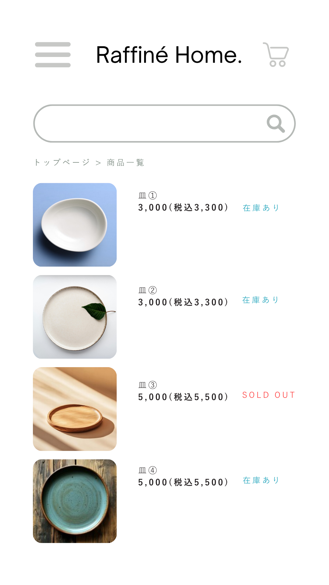　
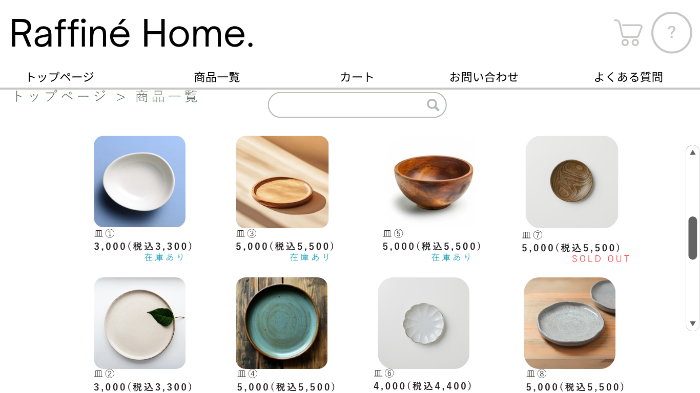　

#### F03 商品詳細ページ
| UI要素             | 種別             | 備考                           |
|--------------------|------------------|----------------------------------|
| 商品画像           | スライダー       | 複数画像対応                    |
| 商品名             | テキスト表示     | 商品タイトル                    |
| 価格               | テキスト表示     | 税込価格                        |
| 商品説明           | テキスト＋HTML   | 改行・装飾対応                  |
| 在庫ラベル         | ラベル表示       | 「在庫あり」「在庫なし」  |
| 数量選択           | 数値入力 or セレクト | 最小1〜最大設定可能           |
| カート追加ボタン   | ボタン           | カートに追加                    |
| 購入手続きボタン   | ボタン           | F05へ遷移                |

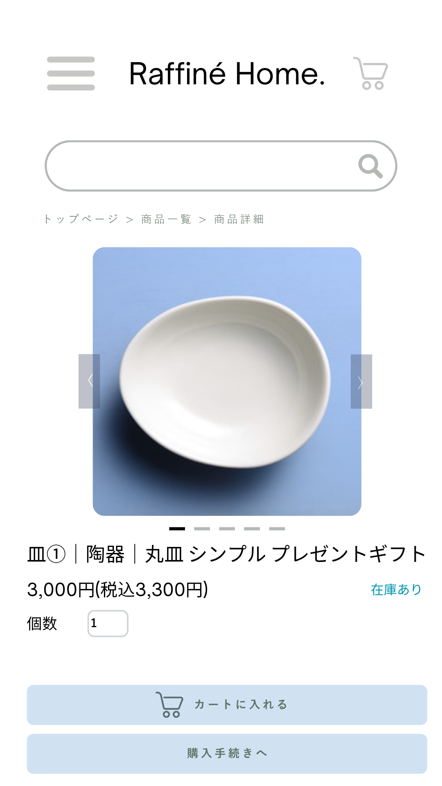　
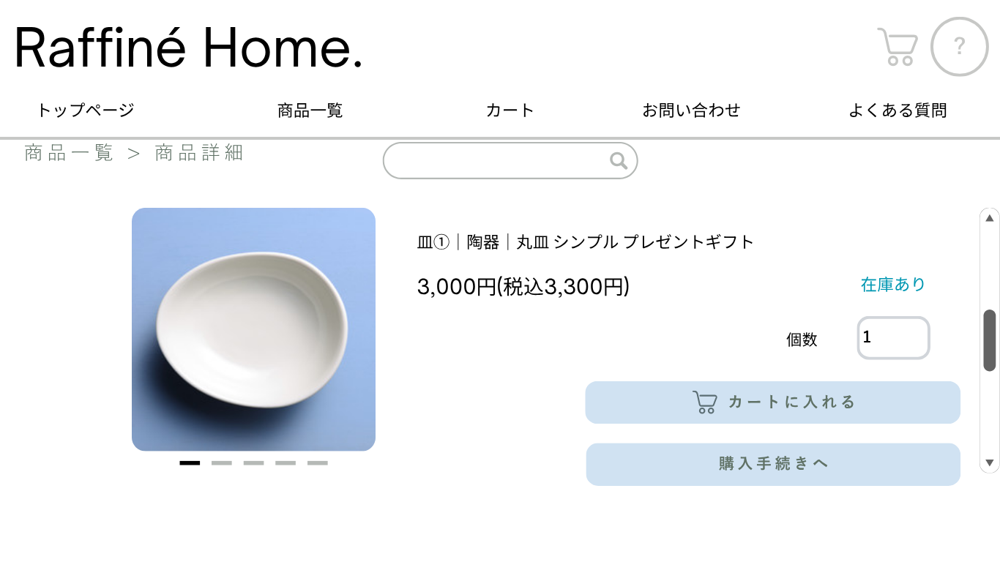　

#### F04 カートページ
| UI要素            | 種別           | 備考                           |
|-------------------|----------------|----------------------------------|
| カート商品リスト  | 商品カード     | 画像・名前・価格                |
| 数量変更UI        | ボタン or セレクト | 商品ごとに数量変更可能            |
| 削除ボタン        | ボタン         | 商品ごとに削除                  |
| 小計金額          | テキスト表示   | 商品小計                        |
| 購入手続きボタン  | ボタン         | F05へ遷移                       |
| 購入手続きフロー | 画像リンク | 現在の購入手続きのフローを表示　　　　　|

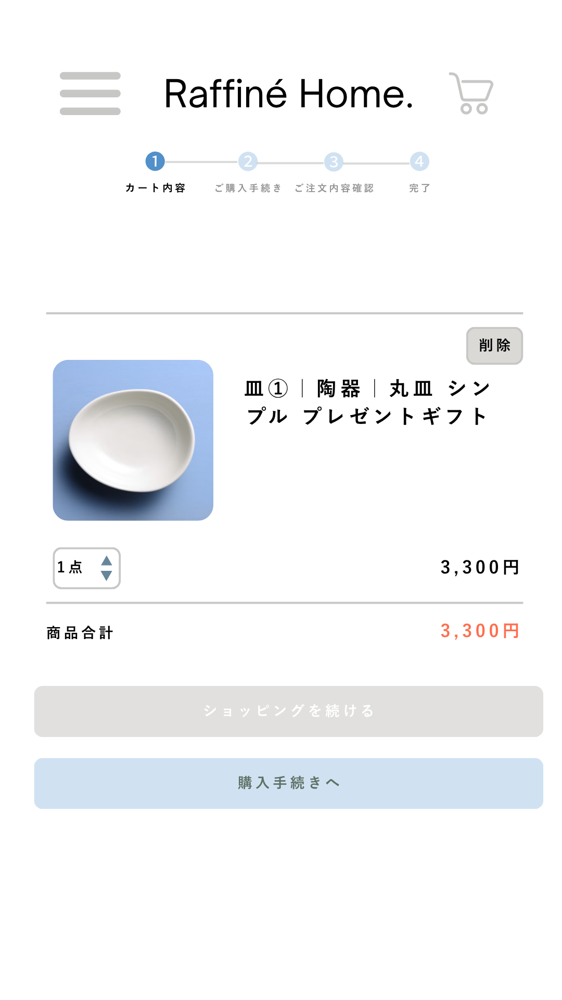　
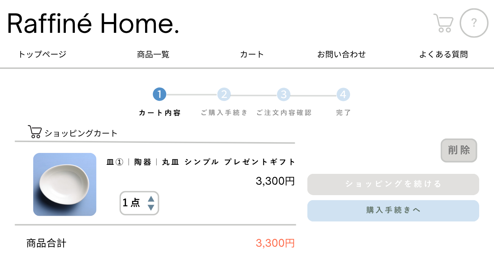　

#### F05 購入手続きページ
| UI要素            | 種別               | 備考                          |
|-------------------|--------------------|-------------------------------|
| 名前入力           | テキストボックス   | 必須                          |
| メールアドレス入力 | テキストボックス   | 必須                          |
| 郵便番号           | テキストボックス   | 自動住所補完                   |
| 住所入力           | テキストボックス   | 必須                          |
| 支払方法選択       | 画像リンク　　　　 | 任意                   |
| 注文確認ボタン     | ボタン             | F06へ遷移                     |
| 購入手続きフロー 　| 画像リンク | 現在の購入手続きのフローを表示　　　　　|

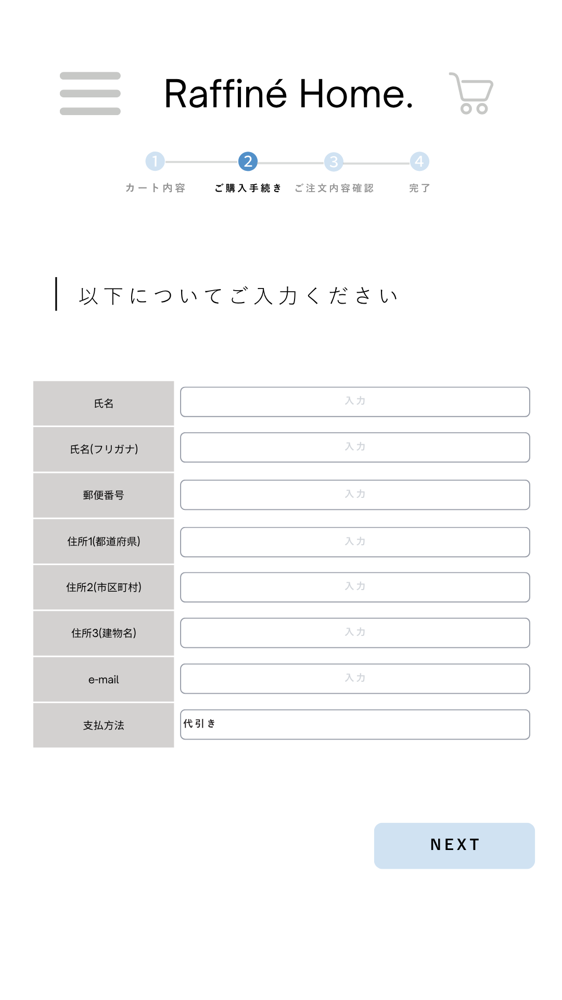　
　

#### F06 注文確認ページ
| UI要素            | 種別         | 備考                      |
|-------------------|--------------|---------------------------|
| 購入商品一覧       | 商品カード   | 商品名・価格・数量        |
| 入力情報確認       | テキスト表示 | 住所・支払方法・備考      |
| 合計金額           | テキスト表示 | 最終合計                  |
| 注文確定ボタン     | ボタン       | F07へ遷移                 |
| 購入手続きフロー　 | 画像リンク 　　| 現在の購入手続きのフローを表示　　　　　|

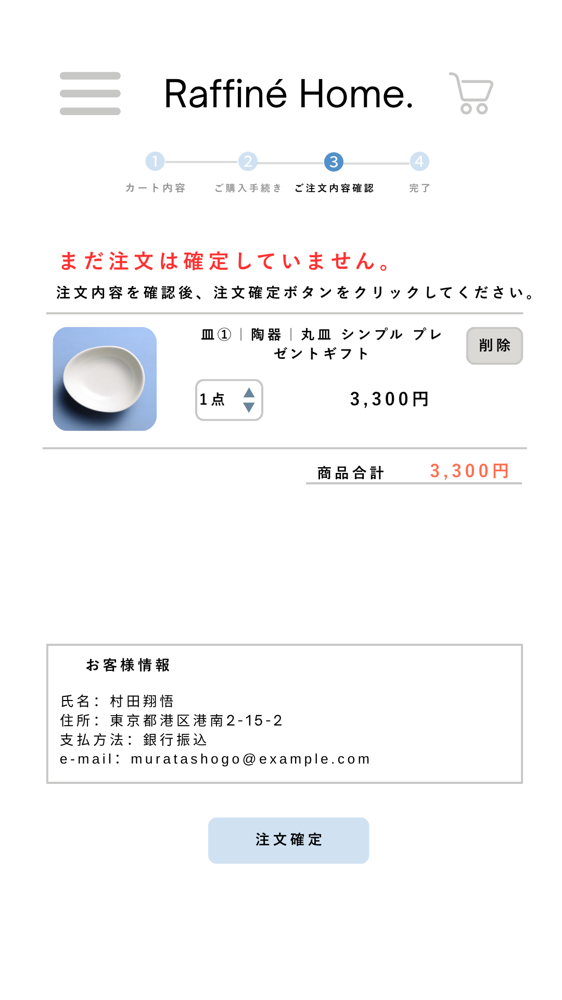　
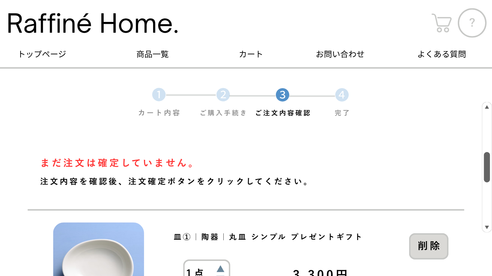　

#### F07 購入完了ページ
| UI要素            | 種別         | 備考                      |
|-------------------|--------------|---------------------------|
| 完了メッセージ     | テキスト     | ご注文ありがとうございました！　下記のメールアドレスに注文確認メールを送信しました |
| 注文番号           | テキスト     | 発行された注文番号        |
| トップページボタン | ボタン       | F01に戻る                 |
| 購入手続きフロー | 画像リンク | 現在の購入手続きのフローを表示　　　　　|

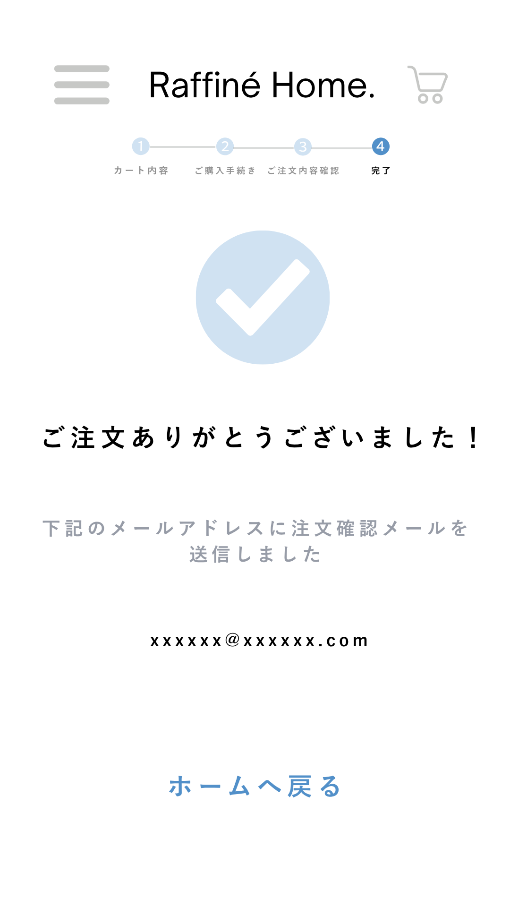　
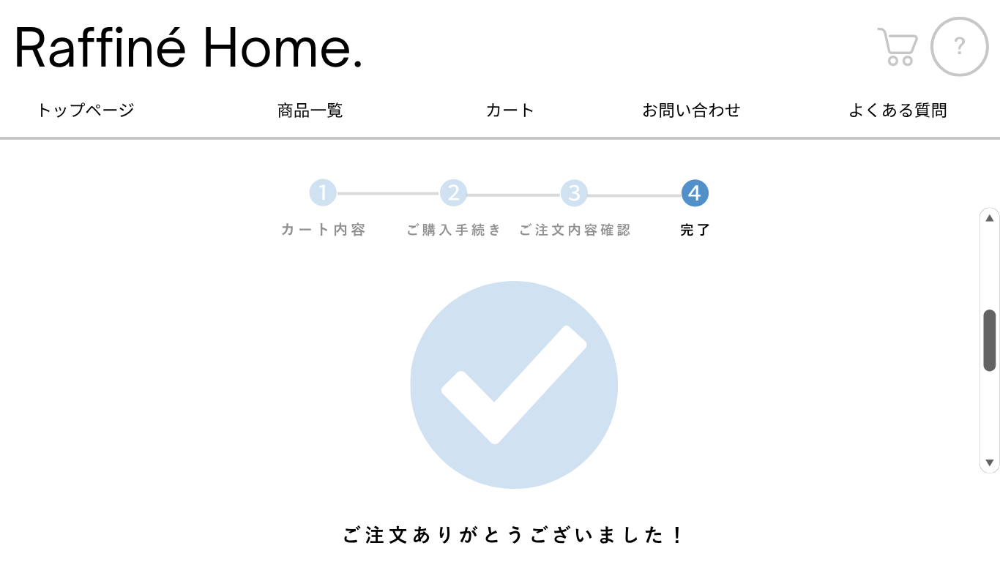　

#### F11 エラーページ
| UI要素            | 種別           | 備考                          |
|-------------------|----------------|-------------------------------|
| トップページ遷移ボタン | ボタン       | F01へ遷移　　　　　　　　　 　　|
| 謝罪メッセージ      | テキスト         | 申し訳ありません　お探しのページが見つかりませんでした           |

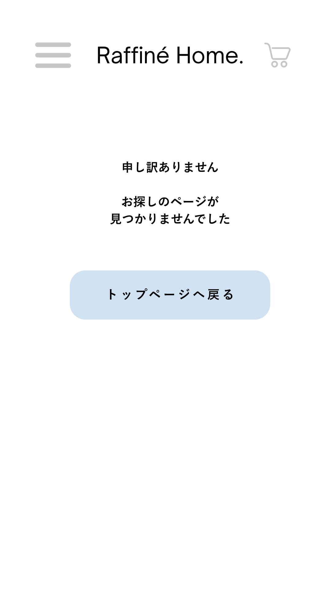　
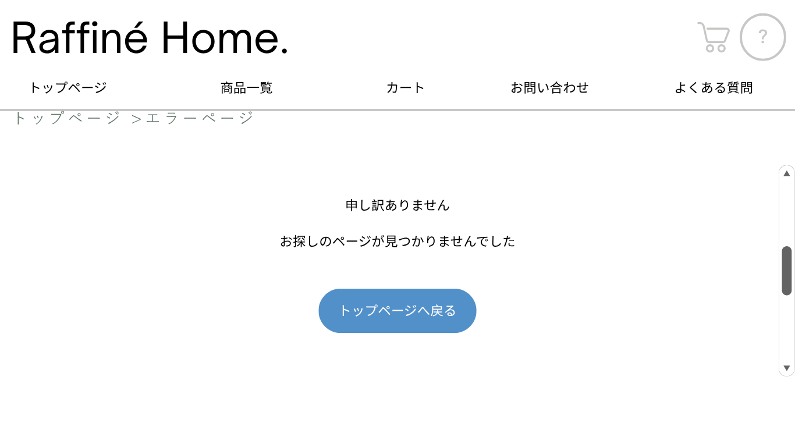　

#### F12 お問い合わせページ
| UI要素            | 種別           | 備考                          |
|-------------------|----------------|-------------------------------|
| 問い合わせカテゴリ | プルダウン     | 必須                          |
| 名前入力           | テキストボックス | 必須                         |
| メールアドレス     | テキストボックス | 必須                         |
| 電話番号           | テキストボックス | 任意                         |
| 問い合わせ内容     | テキストエリア   | 必須                         |
| プライバシー同意   | チェックボックス | 必須                         |
| 送信ボタン         | ボタン         | 入力バリデーション後に送信    |

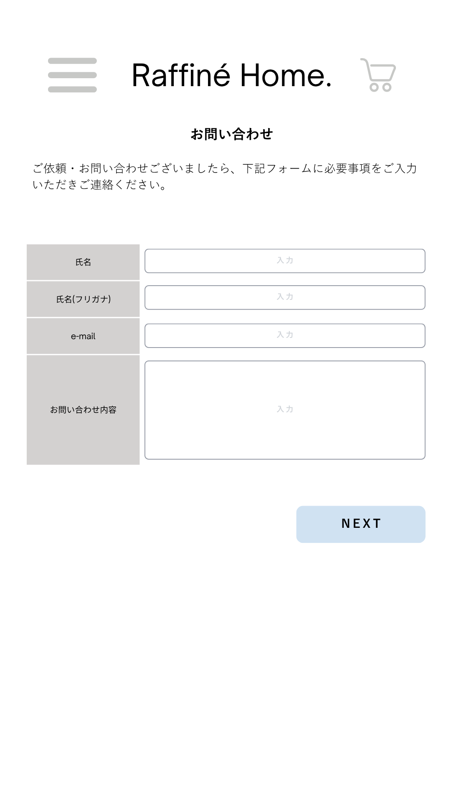　
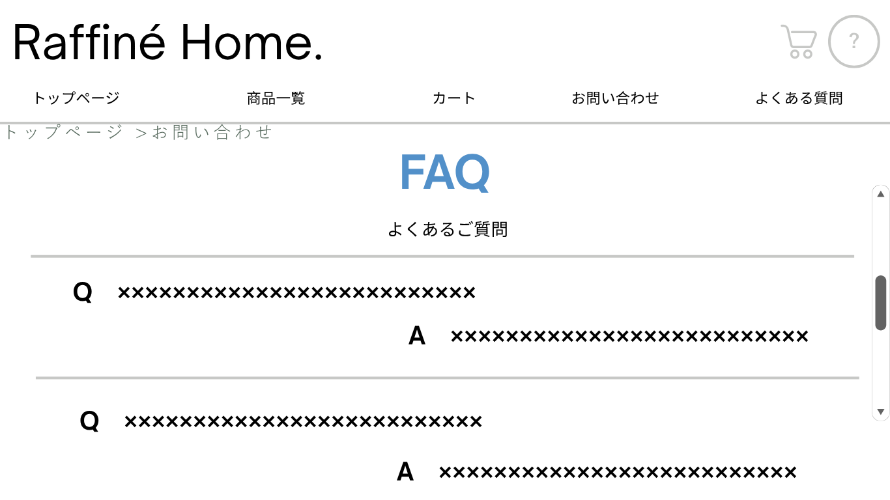　

#### 共通UI
| UI要素       | 種別       | 備考                          |
|--------------|------------|-------------------------------|
| ロゴ         | 画像リンク | トップページ遷移              |
| カートアイコン | アイコン   | カートページ遷移              |
| ナビメニュー | テキストリンク | 利用規約・プライバシー等  |
| ヘルプ       | テキストリンク | ヘルプページ遷移            |
| お問い合わせ | テキストリンク | お問い合わせページ遷移     |
| パンくずリスト | テキストリンク | 画面遷移の流れを表示     |

## 7.3 管理者UI定義
#### A01 管理者ログインページ
| UI要素           | 種別           | 備考                         |
|------------------|----------------|------------------------------|
| ログインID入力   | テキストボックス | 必須                          |
| パスワード入力   | パスワードボックス | 必須                        |
| ログインボタン   | ボタン         | ダッシュボード(A02)へ遷移     |
| パスワードリセット | テキストリンク | 任意                          |

---

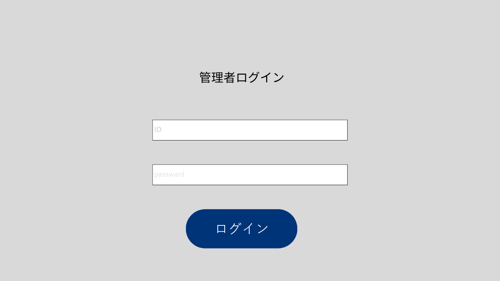　

#### A02 管理者ダッシュボード
| UI要素               | 種別         | 備考                             |
|----------------------|--------------|----------------------------------|
| 商品一覧リンク       | テキストリンク | A03へ遷移                       |
| 注文管理リンク       | テキストリンク | A05へ遷移                       |
| お問い合わせ管理リンク | テキストリンク | A08へ遷移                    |
| 管理者設定リンク     | テキストリンク | A09へ遷移                       |
| エラーログリンク     | テキストリンク | A10へ遷移                       |

---

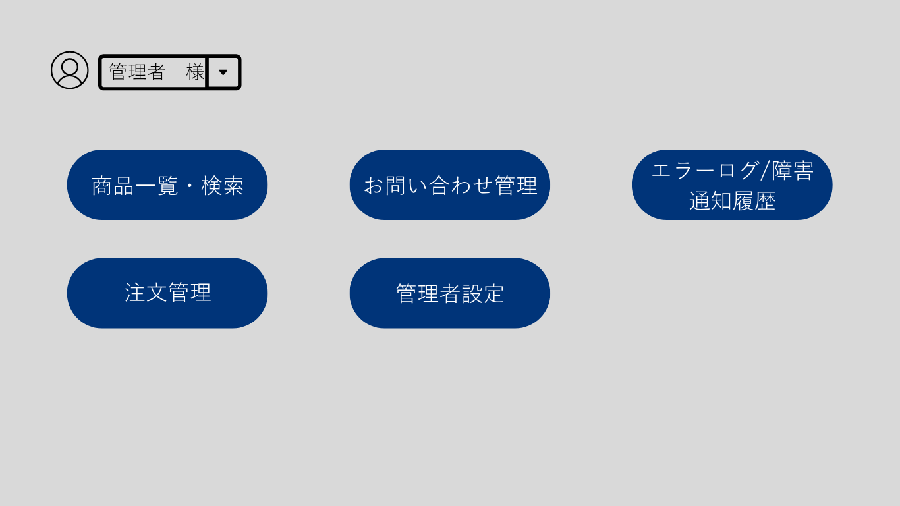

#### A03 商品一覧・検索ページ
| UI要素          | 種別           | 備考                            |
|-----------------|----------------|----------------------------------|
| 商品検索フォーム | テキスト入力＋検索ボタン | 商品名・SKUなどで検索        |
| 商品リスト      | テーブル       | 画像・商品名・価格・在庫・公開状態 |
| 編集ボタン      | ボタン         | A04へ遷移（商品編集）            |
| CSV出力ボタン   | ボタン         | A07へ遷移（CSV操作）            |

---

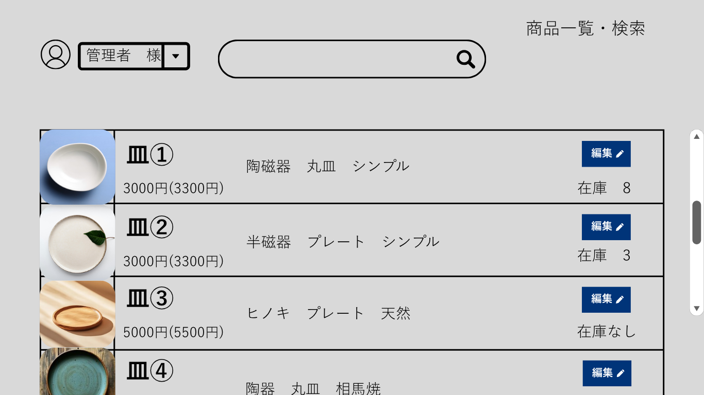

#### A04 商品登録／編集ページ
| UI要素           | 種別           | 備考                            |
|------------------|----------------|----------------------------------|
| 商品ID入力     | テキストボックス  | 必須／システム上の一意な商品識別子（英数字推奨）      |
| 商品名入力       | テキストボックス | 必須                            |
| 商品画像アップロード | 画像選択    | メイン・サブ複数可               |
| 商品説明入力     | テキストエリア | HTML対応                        |
| 価格入力         | 数値入力       | 必須                            |
| 公開ステータス   | ラジオボタン or セレクト | 公開・非公開                  |
| 保存ボタン       | ボタン         | 商品情報を保存                   |
| 在庫管理ボタン   | ボタン         | A06へ遷移                        |
| CSV出力ボタン    | ボタン         | A07へ遷移                        |

---

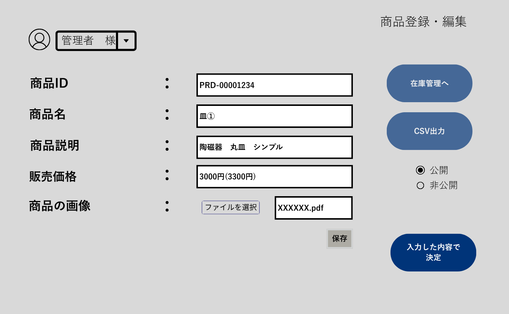

#### A05 注文管理ページ
| UI要素          | 種別           | 備考                            |
|-----------------|----------------|----------------------------------|
| 注文リスト      | テーブル       | 注文番号・日付・顧客名・金額・ステータス |
| 詳細ボタン      | ボタン         | 注文詳細表示                    |
| ステータス更新  | プルダウン or ボタン | 発送済・キャンセル等           |
| CSV出力ボタン   | ボタン         | A07へ遷移                        |

---

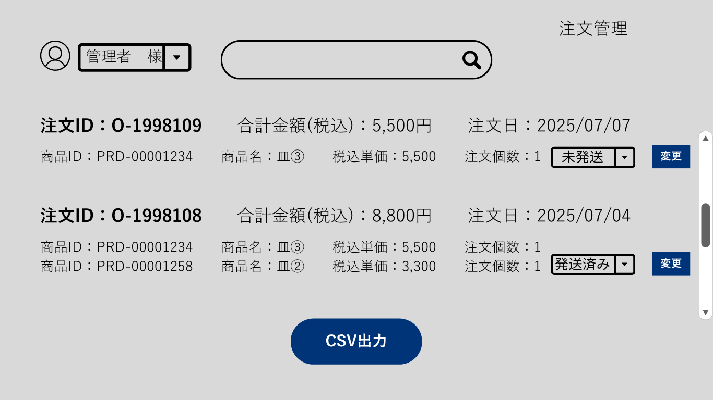

#### A06 在庫管理ページ
| UI要素          | 種別           | 備考                           |
|-----------------|----------------|---------------------------------|
| 商品リスト      | テーブル       | 商品名・在庫数                  |
| 在庫数入力欄    | 数値入力       | 直接編集可能                   |
| 一括更新ボタン  | ボタン         | 入力内容で在庫一括更新         |

---

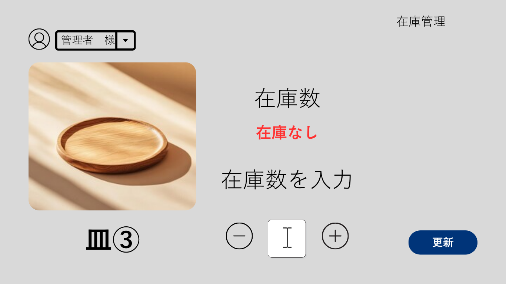

#### A07 CSVインポート／エクスポートページ
| UI要素         | 種別           | 備考                          |
|----------------|----------------|-------------------------------|
| CSVファイル選択 | ファイルアップロード | 商品 or 注文のCSV            |
| インポートボタン | ボタン         | ファイルアップロード実行       |
| エクスポートボタン | ボタン       | CSVファイル出力               |
| 処理結果表示   | テキスト表示   | 成功・エラー内容表示           |
| インポート種別選択 | プルダウン   | 商品 or 注文の選択　　　　　| 

---

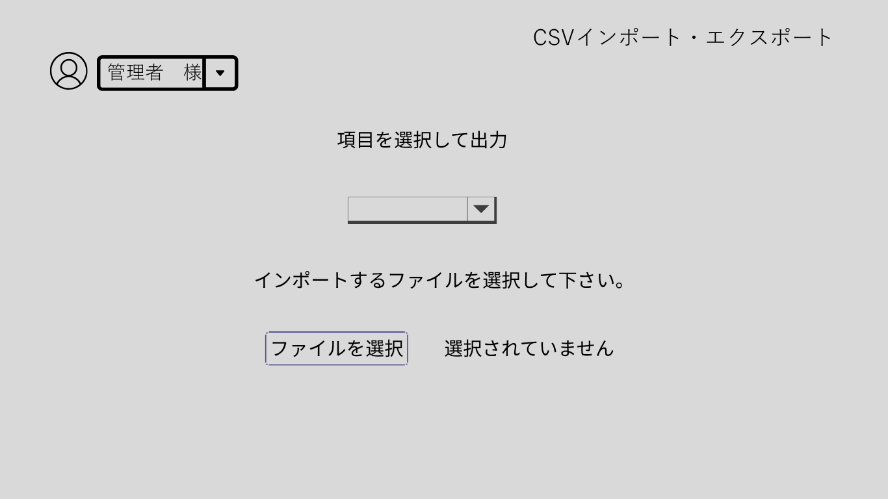

#### A08 お問い合わせ管理ページ
| UI要素         | 種別           | 備考                          |
|----------------|----------------|-------------------------------|
| 問い合わせリスト | テーブル      | 日付・氏名・件名・対応状況     |
| 詳細ボタン     | ボタン         | 問い合わせ詳細表示             |
| 対応状況更新   | プルダウン or チェック | 未対応・対応済               |

---

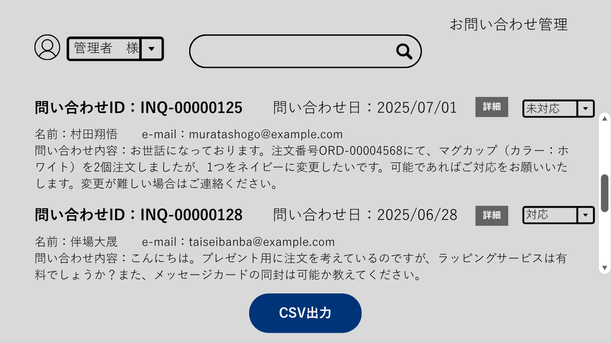

#### A09 管理者設定ページ
| UI要素           | 種別           | 備考                          |
|------------------|----------------|-------------------------------|
| 管理者一覧       | テーブル       | 氏名・メール・権限表示        |
| 新規アカウント作成ボタン | ボタン   | アカウント作成フォーム表示     |              |
| 削除ボタン       | ボタン         | 削除確認後に実行              |
| 権限変更プルダウン  　| プルダウン     | 管理者権限を変更可能

---

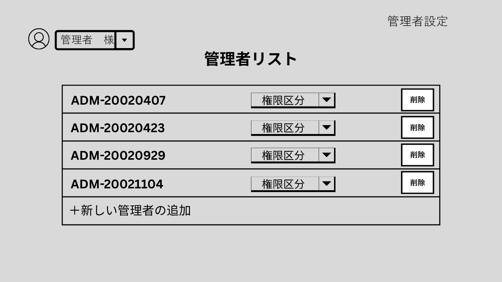

#### A10 エラーログ／障害通知履歴ページ
| UI要素           | 種別           | 備考                          |
|------------------|----------------|-------------------------------|
| エラーログリスト | テーブル       | 日付・エラー内容・詳細リンク    |
| 詳細ボタン       | ボタン         | ログ詳細確認                   |


## 7.4 入力チェック

**入力チェック仕様（バリデーションルール）とエラーメッセージ（管理者画面）**
#### 共通ルール（全画面共通）
| 項目        | バリデーション内容                    | エラーメッセージ例                          |
|------------|--------------------------------------|--------------------------------------------|
| 必須入力    | 入力必須                              | 「この項目は必須です」                     |
| 最大文字数  | 指定文字数を超えないこと              | 「〇〇文字以内で入力してください」         |
| 数値のみ    | 半角数字のみ                          | 「数字のみを入力してください」             |
| メール形式  | メールアドレス形式                   | 「有効なメールアドレスを入力してください」 |
| パスワード  | 最低8文字、英数字混在                | 「8文字以上の英数字を入力してください」    |
| ファイル形式 | 指定拡張子のみ                        | 「〇〇形式のファイルを選択してください」    |

---

#### A01 管理者ログインページ
| 項目           | バリデーション内容         | エラーメッセージ                              |
|---------------|--------------------------|----------------------------------------------|
| ログインID    | 必須                      | 「ログインIDを入力してください」            |
| パスワード    | 必須・8文字以上           | 「パスワードを8文字以上で入力してください」 |

---

#### A04 商品登録／編集ページ
| 項目          | バリデーション内容             | エラーメッセージ                              |
|--------------|--------------------------------|----------------------------------------------|
| 商品名        | 必須・最大100文字              | 「商品名を入力してください（100文字以内）」 |
| 商品画像      | 画像ファイル形式（jpg/png/gif） | 「画像ファイル（jpg/png/gif）を選択してください」 |
| 商品説明      | 最大1000文字                   | 「商品説明は1000文字以内で入力してください」 |
| 価格          | 必須・数値・0以上              | 「価格は0以上の数値を入力してください」     |
| カテゴリ選択  | 必須                          | 「カテゴリを選択してください」               |
| 在庫数        | 必須・数値・0以上              | 「在庫数は0以上の数値を入力してください」   |

---

#### A05 商品カテゴリ管理ページ
| 項目       | バリデーション内容       | エラーメッセージ                        |
|-----------|------------------------|----------------------------------------|
| カテゴリ名 | 必須・最大50文字         | 「カテゴリ名を入力してください（50文字以内）」 |

---

#### A06 注文管理ページ
| 項目        | バリデーション内容             | エラーメッセージ                          |
|------------|--------------------------------|------------------------------------------|
| 検索ワード  | 最大100文字                   | 「検索ワードは100文字以内で入力してください」 |
| ステータス  | 選択必須                      | 「ステータスを選択してください」         |

---

#### A07 在庫管理ページ
| 項目       | バリデーション内容 | エラーメッセージ                          |
|-----------|------------------|------------------------------------------|
| 在庫数     | 数値・0以上       | 「在庫数は0以上の数値を入力してください」 |

---

#### A08 CSVインポート／エクスポートページ
| 項目         | バリデーション内容                        | エラーメッセージ                              |
|-------------|------------------------------------------|----------------------------------------------|
| CSVファイル | ファイル必須・CSV形式（.csv拡張子）       | 「CSVファイルを選択してください」            |

---

#### A09 お問い合わせ管理ページ
| 項目       | バリデーション内容       | エラーメッセージ                          |
|-----------|------------------------|------------------------------------------|
| 検索ワード | 最大100文字             | 「検索ワードは100文字以内で入力してください」 |
| 対応状況   | 選択必須               | 「対応状況を選択してください」           |

---

#### A10 管理者設定ページ
| 項目             | バリデーション内容                   | エラーメッセージ                              |
|------------------|--------------------------------------|----------------------------------------------|
| 氏名             | 必須・最大50文字                    | 「氏名を入力してください（50文字以内）」     |
| メールアドレス   | 必須・メール形式                    | 「有効なメールアドレスを入力してください」   |
| パスワード       | 必須・8文字以上・英数字混在          | 「パスワードは8文字以上の英数字を入力してください」 |
| 権限             | 選択必須                             | 「権限を選択してください」                   |

---

#### A11 エラーログ／障害通知履歴ページ
| 項目       | バリデーション内容       | エラーメッセージ                          |
|-----------|------------------------|------------------------------------------|
| フィルター | 選択必須               | 「種別を選択してください」               |

---

#### ✅ フロントエンド画面側：入力チェック仕様 & エラーメッセージ一覧

| 項目ID | 項目名 | バリデーションルール | エラーメッセージ例 |
|--------|--------|---------------------|---------------------|
| F01 | 氏名（姓・名） | 必須、各50文字以内 | 「姓を入力してください」「名を入力してください」「各50文字以内で入力してください」 |
| F02 | フリガナ | 任意、全角カタカナのみ、最大50文字 | 「全角カタカナで入力してください」「50文字以内で入力してください」 |
| F03 | メールアドレス | 必須、正しいメール形式、最大100文字 | 「メールアドレスを入力してください」「メールアドレスの形式が正しくありません」「100文字以内で入力してください」 |
| F04 | 電話番号 | 必須、半角数字、10〜11桁 | 「電話番号を入力してください」「半角数字10〜11桁で入力してください」 |
| F05 | 郵便番号 | 必須、半角数字7桁、ハイフン不要 | 「郵便番号を入力してください」「郵便番号は半角数字7桁で入力してください」 |
| F06 | 都道府県 | 必須 | 「都道府県を選択してください」 |
| F07 | 市区町村・番地 | 必須、最大100文字 | 「市区町村・番地を入力してください」「100文字以内で入力してください」 |
| F08 | 建物名・部屋番号 | 任意、最大100文字 | 「100文字以内で入力してください」 |
| F09 | 支払方法選択 | 必須 | 「支払方法を選択してください」 |
| F10 | 利用規約同意 | 必須、チェックボックスON | 「利用規約に同意してください」 |

# 8. 非機能要件詳細

## 8.1 性能

### 8.1.1 商品一覧・詳細ページの表示速度
- **要件（再掲）**  
  商品一覧・詳細ページの表示速度は1.5秒以内（4G相当の回線速度）とする。

- **実現方法**  
  - HTML/CSS/JavaScript/画像の合計サイズを最適化し通信遅延を考慮した設計。  
  - 画像は1枚あたり300KB以下に自動圧縮し、WebP形式を優先利用。  
  - 画像はアップロード時にサーバーサイドで自動圧縮・リサイズ処理を行う。

### 8.1.2 カート操作・ボタン等の応答時間
- **要件（再掲）**  
  カート操作やボタン押下時の応答時間は1秒以内とする。

- **実現方法**  
  - 非同期通信（Ajax等）を活用し、画面の部分更新により高速レスポンスを実現。  
  - サーバーAPIのレスポンスタイム最適化。  
  - 遅延時はローディングインジケーター表示でUX低下を防止。

### 8.1.3 同時アクセス体制
- **要件（再掲）** 
  50ユーザーの同時アクセス時でも主要機能が遅延しない構成。

- **実現方法**  
  - サーバースペックを十分確保し、必要に応じオートスケール対応。  
  - CDN・DBキャッシュ等の活用で負荷軽減。  
  - 負荷テスト実施とボトルネックの継続的改善。

---

## 8.2 セキュリティ

### 8.2.1 通信の暗号化（SSL/TLS）
- **要件（再掲）**  
  全通信でTLS1.2以上を使用。

- **実現方法 
  - HTTPS化およびHTTP→HTTPSリダイレクト設定。  
  - 証明書は信頼済みCAから取得管理。  
  - TLS1.0/1.1やSSLは無効化。

### 8.2.2 管理画面ログイン認証
- **要件（再掲）**  
  ID＋パスワード認証、パスワードは8文字以上で記号含む複雑性必須。

- **実現方法**  
  - バリデーションで複雑性を保証。  
  - パスワードはbcryptでハッシュ化保存。  
  - パスワードリセットはメール認証で本人確認。

### 8.2.3 脆弱性対策
- **要件（再掲）**  
  XSS、SQLインジェクション等を防止。

- **実現方法**  
  - 入力値サニタイズ・エスケープを徹底。  
  - DBアクセスはプリペアドステートメント必須。  
  - 出力時はHTMLエスケープ。  
  - CSRFトークンによるリクエスト検証。

### 8.2.4 データ出力の安全性
- **要件（再掲）**  
  顧客・注文データはパスワード付きCSV形式で出力可能。

- **実現方法**  
  - CSVはパスワード付きZIPで出力。  
  - パスワードは管理者指定または自動生成し別途通知。  
  - ダウンロードは管理者のみ許可。

### 8.2.5 バックアップとデータ損失対策
- **要件（再掲）** 
  誤操作などに備え定期バックアップ実施。

- **実現方法**  
  - DBの定期自動バックアップ設定。  
  - バックアップデータは暗号化し外部・クラウド保管。  
  - 復元手順マニュアル化と定期テスト実施。  
  - 重要操作は確認ダイアログや二重認証を導入。

---

## 8.3 可用性

### 8.3.1 月間稼働率
- **要件（再掲）**  
  月間稼働率99.5%以上（メンテ除く）。

- **実現方法**  
  - 冗長化、フェイルオーバー構成を検討。  
  - メンテナンス時間を事前告知。

### 8.3.2 データバックアップ
- **要件（再掲）**  
  毎日1回バックアップ、30日保存。

- **実現方法**  
  - 夜間自動バックアップ。  
  - 暗号化し安全ストレージ保管。  
  - 失敗時は管理者通知。

### 8.3.3 障害発生時の自動通知
- **要件（再掲）** 
  5分以内に障害通知。

- **実現方法**  
  - Zabbix等で監視、障害検知即アラート送信。  
  - 通知内容に発生時刻・障害内容等を含む。

### 8.3.4 復旧目標時間（MTTR）
- **要件（再掲）**  
  障害から2時間以内に復旧。

- **実現方法**  
  - 監視ツールによる即時検知と標準復旧フロー。  
  - 復旧手順の定期見直しと訓練。

### 8.3.5 障害対応フロー
- **要件（再掲）** 
  障害対応手順をマニュアル化。

- **実現方法**  
  - 初動対応～事後報告まで詳細手順作成。  
  - 定期的に最新情報へ更新。

---

## 8.4 その他

### 8.4.1 保守・運用性

#### 8.4.1.1 商品登録作業の効率化
- **要件（再掲）**  
  1件登録3分以内。

- **実現方法**  
  - 必須項目だけ初期表示。  
  - 画像ドラッグ＆ドロップ、複数同時選択対応。  
  - 入力補助・バリデーション実装。  
  - ステップ最小化、プレビュー機能。

#### 8.4.1.2 情報アクセスの迅速化
- **要件（再掲）**
  商品・注文は3クリック以内でアクセス可能。

- **実現方法**  
  - ダッシュボード・メニューにショートカット配置。  
  - 検索・フィルタ強化。  
  - パンくずリスト・戻るボタン設置。

#### 8.4.1.3 管理者向けマニュアルの提供
- **要件（再掲）** 
  PDF10ページ以内の操作マニュアル納品。

- **実現方法**  
  - 主要機能の操作手順網羅。  
  - 図解・画面キャプチャ多用。  
  - 目次・索引付き。

#### 8.4.1.4 管理画面推奨動作環境
- **要件（再掲）** 
  Google Chrome・Microsoft Edge最新版。

- **実現方法**  
  - 動作検証徹底。  
  - 推奨外利用時は警告表示。  
  - バージョンアップ対応を運用計画に組込。

### 8.4.2 拡張性

#### 8.4.2.1 外部API・プラグイン連携
- **要件（再掲）** 
  SNSや分析ツールと連携可能。

- **実現方法**  
  - RESTful API採用。  
  - プラグイン方式設計。  
  - API仕様書（OpenAPI）整備。

#### 8.4.2.2 マルチデバイス対応
- **（再掲）**
  375px以上の幅で表示崩れなし。

- **実現方法**  
  - レスポンシブWebデザイン採用。  
  - 最新安定版ブラウザで検証。  
  - 柔軟なレイアウト設計。

#### 8.4.2.3 将来的な機能追加への備え
- **要件（再掲）**
  海外展開・定期購入対応可能。

- **実現方法**  
  - 拡張性重視の設計（多言語・多通貨対応含む）。  
  - マイクロサービス・クラウド活用検討。  
  - 設定値・文言外部化。

---

## 8.5 開発環境・実行環境詳細

### 8.5.1 開発環境
- OS: Windows 11 
- IDE: Visual Studio Code 最新版  
- バージョン管理: Git (GitHub利用)  
- 言語・フレームワーク:  
  - フロントエンド: JavaScript  
  - バックエンド: SpringBoot 3.4.X  
- DB: H2  
- コンテナ: Docker 20.x

### 8.5.2 実行環境（本番・ステージング）
- OS: Amazon Linux 2  
- Webサーバー: Nginx 1.22.x  
- アプリケーションサーバー: Java 11 (OpenJDK) / Node.js 18.x  
- DB: Amazon RDS PostgreSQL 14.x  
- キャッシュ: Redis 6.x  
- CDN: AWS CloudFront  
- ログ収集: AWS CloudWatch Logs  

---

## 8.6 セキュリティ設定詳細（Spring Security例）

- 認証方式: JWTトークン認証  
- パスワードハッシュ化: bcrypt採用  
- CSRF対策: Spring SecurityのCSRFトークン利用  
- ログイン失敗制限: 5回失敗で15分ロックをDBで管理  
- 権限管理: Roleベースのアクセス制御（ADMIN/USER等）

---

## 8.7 ログフォーマット例

```json
{
  "timestamp": "2025-07-04T12:34:56Z",
  "level": "INFO",
  "service": "order-service",
  "event": "OrderCreated",
  "userId": "user123",
  "orderId": "order789",
  "message": "注文が正常に作成されました"
}
```
---

## 8.8 監視項目一覧

| 項目             | 監視内容                   | 閾値        | 通知方法  |
|------------------|----------------------------|-------------|-----------|
| サイト応答時間   | HTTPレスポンス時間         | 1.5秒以上   | メール    |
| CPU使用率        | CPU使用率                 | 80%以上     | メール    |
| メモリ使用率     | メモリ使用率              | 80%以上     | メール    |
| ディスク使用率   | ディスク使用率            | 80%以上     | メール    |
| バックアップ成否 | バックアップ処理成功/失敗 | 失敗時      | メール    |
| 外部API応答      | 外部連携サービス正常応答  | エラー発生時| メール    |

---

## 8.9 バックアップ・リストア手順概要

### 8.9.1 バックアップ

```bash
# RDSのスナップショット自動取得（AWS CLI例）
aws rds create-db-snapshot --db-instance-identifier mydbinstance --db-snapshot-identifier mydb-snapshot-$(date +%Y%m%d)

# バックアップデータは暗号化し30日間保存
# 監視ツールでバックアップ処理失敗時に管理者へ通知

```
---
### 8.9.2 リストア
```bash
# 最新正常スナップショットからの復元（AWS CLI例）
aws rds restore-db-instance-from-db-snapshot --db-instance-identifier mydbinstance-restore --db-snapshot-identifier mydb-snapshot-YYYYMMDD

# ステージング環境で定期テスト実施
# 障害発生時は2時間以内の復旧を目標
```

## 8.10 基本設計書からの変更箇所
 
**削除箇所**
- 管理者アカウントロック（基本設計書 6.2.3）
- 仕様変更への迅速対応（基本設計書 6.4.2.1）
  
**変更箇所**
- 開発環境(本書 8.5.1)
  
| 項目           | 変更前                                | 変更後             |
|----------------|-----------------------------------------|--------------------|
| OS             | Windows 10 / macOS 最新版               | Windows 11         |
| フロントエンド | React 18.x / Vue 3.x                    | JavaScript         |
| バックエンド   | Spring Boot 2.7.x / Node.js 18.x        | Spring Boot 3.4.x  |
| DB             | PostgreSQL 14.x                         | H2                 |
